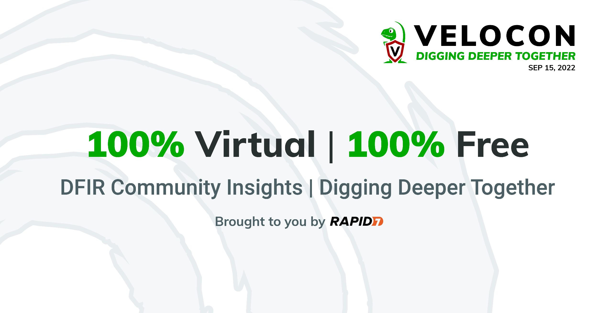

The first annual VeloCon Conference will be held Thursday Sept 15th,
with times oriented to the continental USA timezones. This year the
conference will be online and completely free! Presentations will be
published on our Velociraptor site and as YouTube videos after the
event.

VeloCon is a 1 day event focused on the Velociraptor community. It is
a place to share experiences in using and developing Velociraptor to
address the needs of the wider DFIR community.

The Call for Presentations closes Monday, July 18, 2022 (See details
below).

## Call For Presentations (CFP)

VeloCon invites contributions in the form of a 45 minute
presentation. We require a brief proposal (~500 words; not a
paper). These proposals undergo a review process to select
presentations of maximal interest to VeloCon attendees and to the
wider Velociraptor community, and to filter out sales pitches.

VeloCon focuses on work that pushes the envelope of what is currently
possible using Velociraptor. Potential topics to be addressed by
submissions include, but are not limited to:

* Use cases of Velociraptor in real investigations.
* Novel deployment modes to cater for specific requirements.
* Contributions to Velociraptor to address new capabilities.
* Future ideas and features that Velociraptor might have.
* Integration of Velociraptor with other tools/frameworks.
* Analysis and acquisition on novel Forensic Artifacts.

## Submission Process

Please email your submission to velocon@velocidex.com and include the
following details:

1. You name and email address (If different from the sending email)
2. Affiliation and title to be included on the agenda.
3. A Presentation title.
4. A short abstract (around 500 words) to be included in the agenda.

## Deadline

Submission are due Monday, July 18, 2022 and a decision will be
announced shortly afterwards.
