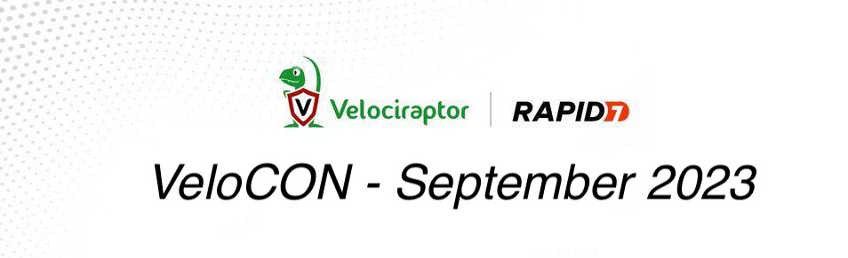

We are thrilled to announce that the 2nd annual VeloCON Conference will
be held this September (date TBD), with times oriented to the continental
USA timezones. Once again, the conference will be online and completely
free! Presentations will be published on our Velociraptor site and as
YouTube videos after the event.

VeloCON is a 1 day event focused on the Velociraptor community. It's
a place to share experiences in using and developing Velociraptor to
address the needs of the wider DFIR community and an opportunity to take
a look ahead at the future of our platform.

Last year's event was a tremendous success, with over 500 unique participants
enjoying our lineup of fascinating discussions, tech talks and the
opportunity to get to know real members of our own community.  You can
re-watch an indexed version of VeloCON 2022 at
https://www.youtube.com/watch?v=ahUMgKZLHLk&list=PLz4xB83Y3VbhJjsvw75wPbNZcbiWA_L03

This year's event calls for even more of the stimulating and informative content
that made last year's VeloCON so much fun.  Don't miss your chance at being a
part of this year's marquee event of the open-source DFIR calendar.

The Call for Presentations closes Monday, July 17, 2023 (See details
below).

## Call For Presentations (CFP)

VeloCON invites contributions in the form of a 30-45 minute
presentation. We require a brief proposal (~500 words; not a
paper). These proposals undergo a review process to select
presentations of maximal interest to VeloCON attendees and the
wider Velociraptor community, and to filter out sales pitches.

VeloCON focuses on work that pushes the envelope of what is currently
possible using Velociraptor. Potential topics to be addressed by
submissions include, but are not limited to:

* Use cases of Velociraptor in real investigations
* Novel deployment modes to cater for specific requirements
* Contributions to Velociraptor to address new capabilities
* Future ideas and features that Velociraptor might have
* Integration of Velociraptor with other tools/frameworks
* Analysis and acquisition on novel Forensic Artifacts

## Submission Process

Please email your submission to velocon@velocidex.com and include the
following details:

1. Your name and email address (If different from the sending email)
2. Company/affiliation and title to be included on the agenda
3. Presentation title
4. A short abstract (around 500 words) to be included in the agenda

## Deadline

Submission are due Monday, July 17, 2023 and a decision will be
announced shortly afterwards.
