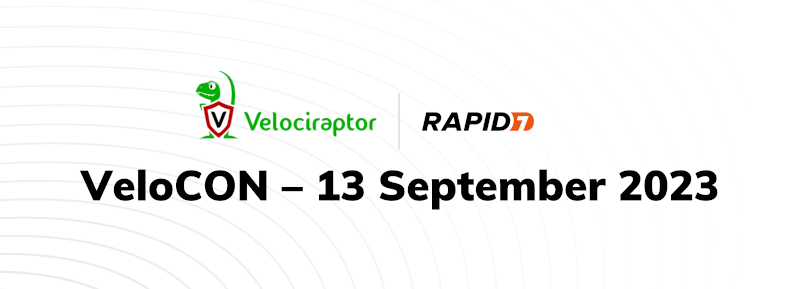

We are thrilled to announce that the 2nd annual VeloCON virtual summit will
be held this September 13th, with times oriented to the continental
USA timezones. Once again, the conference will be online and completely
free! Presentations will be published on our Velociraptor site and as
YouTube videos after the event.

VeloCON is a 1 day event focused on the Velociraptor community. It's
a place to share experiences in using and developing Velociraptor to
address the needs of the wider DFIR community and an opportunity to take
a look ahead at the future of our platform.

Registration for this event is completely free! Registration is now
open for VeloCON 2023 at the link here:
https://rapid7.zoom.us/webinar/register/WN_tLy3AsN7SOOncobuLQWpXQ#/registration.

Last year's event was a tremendous success, with over 500 unique participants
enjoying our lineup of fascinating discussions, tech talks and the
opportunity to get to know real members of our own community.  You can
re-watch an indexed version of VeloCON 2022 at
https://www.youtube.com/watch?v=ahUMgKZLHLk&list=PLz4xB83Y3VbhJjsvw75wPbNZcbiWA_L03

This year's event calls for even more of the stimulating and informative content
that made last year's VeloCON so much fun.  Don't miss your chance at being a
part of this year's marquee event of the open-source DFIR calendar.
