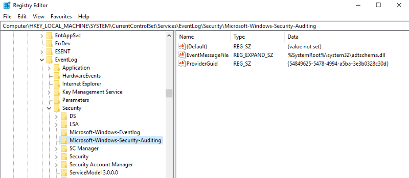

#### By Mike Cohen


One of the most critical sources of data when responding to an incident on windows systems is the event logs. Windows event logs record security significant events.

However, unlike more traditional Unix syslogs, the Windows Event Log system is more complex and there are a number of potential problems that an investigator can run into.

In this post we explore the windows event log system from the point of view of the investigator. We then see how tools such as Velociraptor can be used to work around its limitations.

#### Responding to an incident

Consider an incident occurred on one of your systems. You would like to investigate it and so collect all the event log files from **C:\\Windows\\System32\\WinEVT\\Logs\\\*.evtx**.

The logs are stored in binary format so you will need to post process the files. Luckily there are a number of tools out there that will do that for you. Here is a typical output from the [`dumpevtx`](https://github.com/Velocidex/evtx) tool for a particular event from the Security.evtx log file:

```json
C:> dumpevtx.exe parse c:\Windows\System32\winevt\Logs\Security.evtx
{
  "System": {
   "Provider": {
    "Name": "Microsoft-Windows-Security-Auditing",
    "Guid": "54849625-5478-4994-A5BA-3E3B0328C30D"
   },
   "EventID": {
    "Value": 4672
   },
   "Version": 0,
   "Level": 0,
   "Task": 12548,
   "Opcode": 0,
   "Keywords": 9232379236109516800,
   "TimeCreated": {
    "SystemTime": 1561729832.644008
   },
   "EventRecordID": 35,
   "Correlation": {
    "ActivityID": "6EF16E1E-2DB8-0001-DA6F-F16EB82DD501"
   },
   "Execution": {
    "ProcessID": 612,
    "ThreadID": 656
   },
   "Channel": "Security",
   "Computer": "DESKTOP-6CBJ8MJ",
   "Security": {}
  },
  "EventData": {
   "SubjectUserSid": "S-1-5-90-0-1",
   "SubjectUserName": "DWM-1",
   "SubjectDomainName": "Window Manager",
   "SubjectLogonId": 67602,
   "PrivilegeList": "SeAssignPrimaryTokenPrivilege\r\n\t\t\tSeAuditPrivilege"
  }
 }
```

This event looks interesting but it is not quite clear what it is really talking about. We see some potentially useful items like **SubjectUserSid** and **PrivilegeList** but we are missing some critical context around this message.

Lets look at the same event with the windows Event Viewer GUI:


This is much better! We now know the message indicates the user was assigned some special privileges.

Where does this message come from and why is it not shown by typical EVTX parsers?

It turns out that the message of the event is not actually stored in the EVTX file at all — it is actually stored in a DLL and it is bound to the event in the log via some complicated algorithm.

#### Event Messages

Windows event logs do not store the full event message. Instead an **Event Provider** registers a message DLL that contains the full message. The event itself simply stores the index of the message in the Message Table as the Event ID. Note that event IDs are just a number into an event table and are commonly reused by different providers. It is the unique combination of channel, provider and Event ID that identifies the message (so for example searching for Event Id 1000 yields many different unrelated messages because many providers reuse that event ID).

The figure below illustrates how the Windows Event Viewer is able to print the proper Event Message:


How the Windows Event Viewer displays event log messages

When a user selects an event in the Event Viewer, the application reads the **Provider**, **EventID** and **EventData** fields from the event itself — in the above example, the Provider was **Microsoft-Windows-Security-Auditing**, EventID was **4672** and the EventData has items such as **SubjectUserSid** etc.

Next the event viewer consults the registry at the key **HKEY\_LOCAL\_MACHINE\\SYSTEM\\CurrentControlSet\\Services\\EventLog\\Security\\Microsoft-Windows-Security-Auditing** and reads the value **EventMessageFile**.

That value is the location of a dll which contains the messages for
this provider. On my system, the DLL is located at
`%SystemRoot%\\system32\\adtschema.dll` (Note that many DLLs use
localizations and so the dll could be located in MUI files).



The DLL has a resource section with a MESSAGE\_TABLE type. The event viewer then uses this to extract the message which looks like:

```sh
Special privileges assigned to new logon.%n%nSubject:%n%tSecurity ID:%t%t%1%n%tAccount Name:%t%t%2%n%tAccount Domain:%t%t%3%n%tLogon ID:%t%t%4%n%nPrivileges:%t%t%5
```

The event viewer then interpolates the EventData items into the message by their position — for example %1 is replaced with **SubjectUserSid** etc. Additionally %t is a tab and %n is a new line.

#### What could go wrong?

The previous section examined how event logs are actually stored on the system. In practice there are a number of pitfalls with this scheme:

1.  If an EVTX file is taken from one system to another, the relevant DLL may not be present. This is more common with bespoke software that is not commonly used. In this case the investigator has no idea what the message the event is trying to convey.
2.  If software is uninstalled from the system, the message DLL may be removed. This makes it hard to view events in the event log from the time it was installed (in a sense information is wiped from the event log).

In both of these cases, the investigator will need to figure out the correct event message independently. Luckily in the age of the internet there are many web sites that catalog some of the common event ids and what they mean:


But it is simply not practical to search every event id. For less commonly used providers the event ids may not be indexed on the web at all. In this case the investigator is left with no idea what a specific event entry means and might miss some critical evidence

#### Velociraptor’s parse\_evtx() VQL plugin

In the latest Velociraptor release ([0.3.6](https://github.com/Velocidex/velociraptor/releases)), the **parse\_evtx()** plugin is now including the event messages directly in the VQL output. This automatically enriches the event log data collected by the Velociraptor host visibility tool.


Velociraptor can interpolate and attach the event message to every log message it relays

In the above we see the result of the simple VQL query:

```vql
SELECT * FROM parse_evtx(filename='c:/Windows/System32/Winevt/logs/Security.evtx')
```

You can see an additional field now, called **Message** containing the event message with the Event Data interpolated into it. This provides a lot of context around what the event is supposed to do.

#### What about existing EVTX files?

In the last section we saw how Velociraptor can enrich event logs as it is forwarding them to the server but what if we have just the evtx files — possibly we just acquired the files using bulk upload artifacts such as the **Windows.KapeFiles.Targets** artifact?

In that case our analysis machine may not actually have the correct message dlls installed and Velociraptor may fail to retrieve the event messages.

We need a way to maintain a library of event id’s for different providers and the messages they represent. This way we can instantly look up the correct message on demand — without needing to have DLLs installed.

[Velocidex](https://www.velocidex.com/), the company behind Velociraptor is an innovative software company crafting many free and open source digital forensics tools. In fact Velociraptor’s EVTX parsing is implemented by the [Velocidex/evtx](https://github.com/Velocidex/evtx) project on GitHub. You should check it out!

The project releases a stand along command line tool for parsing and examining windows event log format. In this post, I would like to demonstrate the latest “extract” feature:


The **extract** command walks all providers in the registry, gathers their message DLLs and parses the message table resource for each. Then, all the messages are stored in a sqlite database. Sqlite being the de facto standard for portable databases can be easily consumed by other tools written in many languages. The total size of the database is modest (I have extracted all event log messages on Windows 2019 server to about 23MB SQLite file).

Now we can easily use the database to resolve our provider and event id to a message:


Alternatively we can simply use SQLite directly to query the database

```
$ sqlite3 mydb.sqlite
SQLite version 3.24.0 2018-06-04 19:24:41
Enter ".help" for usage hints.
sqlite> **SELECT message FROM providers join messages on providers.id = messages.provider\_id where providers.name = 'Microsoft-Windows-Security-Auditing' and messages.event\_id = 4672;**
_Special privileges assigned to new logon.%n%nSubject:%n%tSecurity ID:%t%t%1%n%tAccount Name:%t%t%2%n%tAccount Domain:%t%t%3%n%tLogon ID:%t%t%4%n%nPrivileges:%t%t%5_
```

#### Enriching old event log files

We have shown how `dumpevtx` can use our sqlite database to retrieve
the messages for each event id individually but this leaves us to
interpolate the full data by hand — no fun indeed!

You can also use `dumpevtx` to export the events into JSON, and
automatically resolve event IDs with the sqlite database too by
providing the database with the `--messagedb` flag.

```
F:\\>dumpevtx.exe parse --messagedb mydb.sqlite c:\\Windows\\System32\\winevt\\Logs\\Security.evtx
```


Parsing the EVTX file with the assistance of the event id database. The message interpolates the Event Data into it.

#### Conclusions

The Windows Event Log system is fairly complex — it is not enough to just copy out the \*.evtx files because the information content of the log is spread throughout the filesystem in DLLs and registry keys. For many event types there is enough context in the EventData or UserData fields of the event log but in many cases, without the actual message corresponding to the event ID we lose critical meaning.

It is essential therefore to include the original message for each
event log. We have shown how Velociraptor is able to include this
critical information automatically. We also present the `dumpevtx`
project which allows collecting messages in a database so events can
be matched up quickly and easily with their correct messages without
requiring the original program that generated the message to be
installed on the analyst system.
