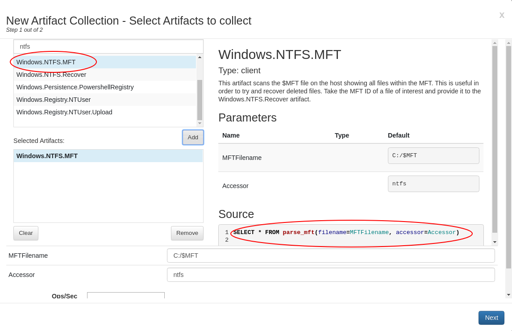
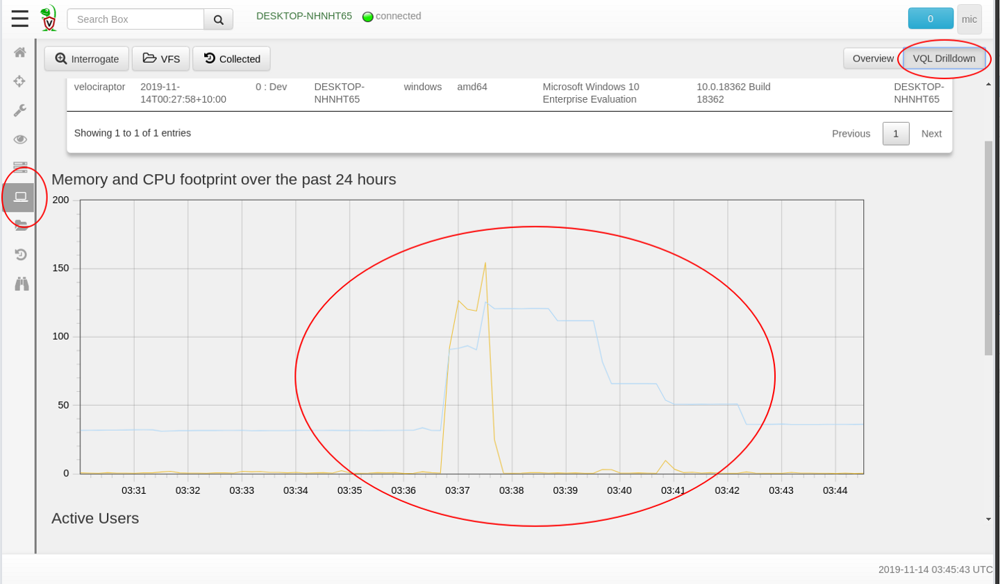
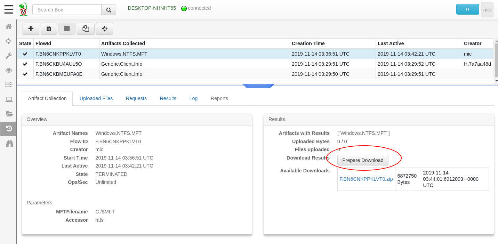
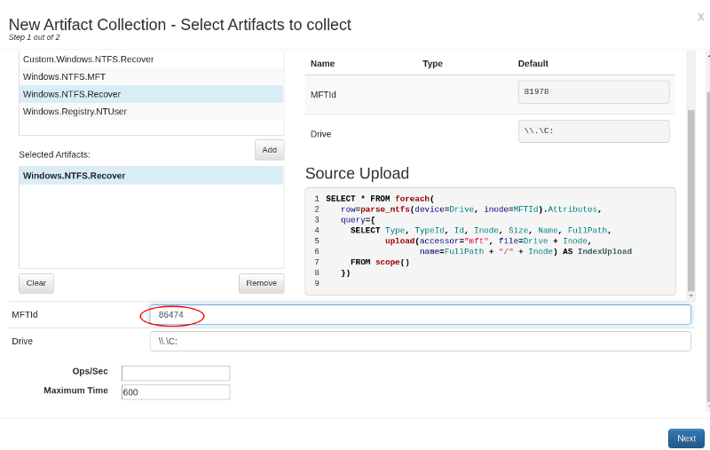

#### By Mike Cohen

On a recent engagement we responded to an intrusion where the attacker has added a new scheduled task to the Windows Task Scheduler directory (_%systemroot%\\System32\\Task_) some time ago. This is a common TTP for achieving persistence (See [Mitre Att&ck](https://attack.mitre.org/techniques/T1053/)). Unfortunately the actual task file was later removed and event logs were cycled past the time of interest.

In that case we were able to use Velociraptor to employ some deep forensic techniques and with a bit of luck were able to recover the deleted task file.

In this post I will explain the technique and demonstrate it on a deliberately deleted file. It should be noted that this technique relies on the file not being overwritten and the MFT entry not being reused by the system. So there is a rather large probability that it won’t work for any specific file. It is worth knowing though, just in case you get lucky and are able to recover a file critical to your incident!

#### NTFS and The Master File Table

On Windows systems the most common filesystem is the NTFS filesystem. I won’t go into details about NTFS as there are many great references — the following description is extremely simplified and mentions just the concepts required to follow the discussion.

NTFS uses a large file called the $MFT — the master file table, containing the metadata of all files on the volume. This file is essentially an array of equal sized structures called MFT entries. Each entry has an MFT ID (which is the index of the entry in the array). Thus MFT Entry 0 is the first entry in the $MFT file, entry 100 is the 100th entry and so on.

Each file on disk is represented by one or more MFT entries. In NTFS, files contain multiple attributes, such as the file’s names (long name and/or short names) and standard information like timestamps etc. The file’s MFT entry contains information about the file’s attributes. One of the most important attributes for a file in NTFS is the $DATA attribute — which is also stored in the MFT entry for the file. The $DATA attribute contains the file’s runlist — essentially a list of clusters (disk sectors) containing the file’s actual data.

When a file is deleted, the MFT Entry for the file is marked as unallocated and is free to be used by the Operating System to store another file. If we are lucky though, the OS has not reused the MFT entry for the deleted file of interest, and we would be able to still read the data.

Additionally, when a file is deleted, the blocks that store the file’s data are also marked as unallocated, and are free for reuse — but they are not actually wiped and so might be available for recovery.

This post is about trying to recover such deleted files from NTFS. This is the realm of deep forensic analysis but Velociraptor allows us to perform this analysis instantly and remotely on the live system — giving a unique capability for recovering evidence of intrusions quickly and efficiently.

#### Scenario

To demonstrate this scenario I will create a file called “secret\_file.txt”. I will paste a familiar text into the file. I will then delete the file and try to recover it using deep NTFS forensic analysis.

#### The setup

I will now dump the MFT from the endpoint by collecting the **Windows.NTFS.MFT** artifact.

This artifact will cause the endpoint to parse the $MFT file and emit a single row for each MFT entry that represents a file on disk. The VQL Query shown above simply calls on the _parse\_mft()_ VQL plugin. Note that this is different than simply collecting the $MFT file as can be done with the **Windows.KapeFiles.Targets** artifact — in that case we still need to parse the $MFT with another tool. This time we parse the $MFT on the endpoint itself and simply stream the results to the server.

The nice thing about parsing the entire $MFT is that we now have a complete record of all files on the system (without having to walk directories etc). However this table is rather large! On my test system the produced CSV file is over 130mb in size (Being text it compresses really well though!).

#### Performance check

This particular collection is rather heavy so I always check Velociraptor’s impact on the endpoint when I run such heavy collections. I simply open the **Host Information** screen and click the **VQL Drilldown** to see the client’s CPU and memory footprint as the query is running (Velociraptor collects its own footprint telemetry constantly).

In this case the query took around 5 minutes to fully complete, the CPU load spiked up to 150% for about 1 minute and the rest of the time was spent sending the large payload to the server with minimal CPU utilization. Top memory footprint was 120Mb for a few minutes falling to the baseline of 30mb quickly after the query completed.

If the collection was taking too long or using up too many resource on
the endpoint, I can always cancel it by clicking the “Stop” button in
the **Collected Artifacts** GUI. Velociraptor will immediately abort
the query on the endpoint when the collection is cancelled in the GUI.

#### Viewing the results

We can view the results of the query by clicking the Results tab. We see a number of useful columns including the EntryNumber (i.e. the MFT ID we discussed before), the InUse column indicates if the file is still in use or deleted as well as the full path of the file stored at that MFT ID. Note that this artifact simply prints the file stored at each consecutive MFT entry — there are over 255,000 rows in our example! (Not shown are created and modified timestamps as well for each file)

The Velociraptor GUI only displays the first 500 rows from each artifact in order to keep the GUI fast and responsive. Because this query returned over 250k rows, we would need to download the data and post-process it. The easiest way is to prepare a download package and download it from the provided link. The CSV file can then be extracted and processed with other tools (e.g. grep or a database).

#### Tweaking the query

In this exercise we already know the name of the file we are after is **secret.txt** so we do not really need a complete dump of the entire MFT — we only want all the MFT entries with the filename containing the word “secret”. We can therefore customize the artifact by adding a VQL **WHERE** clause after the query to only send interesting rows to the server. We will add a new parameter **FullPathRegex** allowing the user to customize the filtering terms in the future (for example search for deletions in the Tasks directory).

Now we can collect the customized artifact specifying that only rows matching “secret” will be retrieved.

The result is similar to the full dump above but now only 5 rows are returned from the endpoint. This is much faster than getting all 130mb CSV file and post processing it (Collection time is less than 1 minute now). By refining the artifact we have made Velociraptor more surgical in its approach — only returning the data we really want

We can see in the above that the file is deleted (InUse is false) and its EntryNumber is 86474. We can use this to try and recover the file’s data by collecting the **Windows.NTFS.Recover** artifact for this MFT entry

The **Windows.NTFS.Recover** simply uploads to the server all NTFS streams belonging to the MFT entry specified. We can see both $FILE\_NAME attributes (long and short names) and the $DATA attribute.

Since the file is deleted, the MFT Entry is not allocated and a new file may be written in this MFT entry at any time. Therefore the contents of the $DATA stream may be completely unrelated to the file we are looking for. We can use the content of the $FILE\_NAME and $STANDARD\_INFORMATION to double check the validity of the file and confirm it is the file we expect.

To view the file we simple prepare a download as before and use an archiving tool to open the ZIP file. We then extract the $DATA stream and confirm it is the file we expected.

#### Conclusions

Velociraptor provides access to low level NTFS analysis techniques within VQL. This means we can build VQL artifacts to automate some of the low level analysis — such as the recovery of deleted files, and scanning the MFT for remnants of old deleted files.

There are two pieces of information we can gather from such low level analysis:

1.  The deleted file metadata is found in the unallocated MFT entry and includes the file’s creation and modification timestamps.
2.  The data of the file may still exist on disk.

In practice, MFT entries are reused pretty quickly and so there is a high chance that the old deleted entry will not remain. Additionally $DATA blocks may also be reused so it is likely that even if we identify a deleted file we may not be able to recover its data using this technique.

So in practice, we use the **Windows.NTFS.MFT** artifact to collect metadata about deleted files, even though we are usually not able to recover their data.

If the system has an SSD rather than a spinning disk we are unlikely to recover any deleted file’s data. This is because SSDs aggressively reclaim unused blocks and wipe the block so it can be remapped in the wear leveling pool \[see [here](https://blog.elcomsoft.com/2019/01/life-after-trim-using-factory-access-mode-for-imaging-ssd-drives/)\].

Do you commonly use this technique in your investigations? Share your thoughts below.
