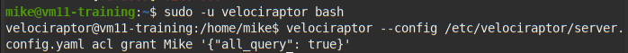
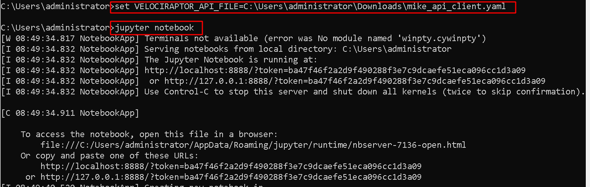
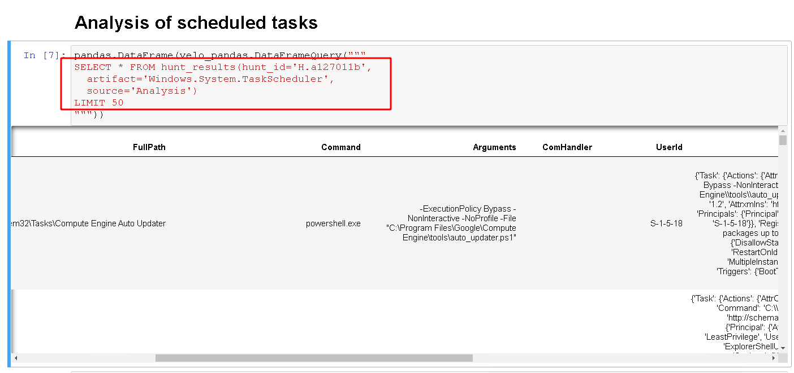

Velociraptor is a powerful endpoint visibility tool. The unique strength of the tool is being able to collect endpoint state by using the Velociraptor Query Language (VQL) via custom or curated “[Artifacts](https://www.velocidex.com/docs/user-interface/artifacts/)”. Not only can one collect artifacts from a single host, but one can collect the same artifact from many thousands of hosts within seconds.

Being able to collect a lot of data quickly is awesome, but the flip side is that a lot of data makes it harder to review manually. We can always tune artifacts by editing the VQL to be more surgical which helps with reducing the collected data, but we would often still like to be able to post process and understand the data we get back in a convenient way.

Velociraptor allows you to download the results of a hunt into a zip file. In the zip file, you can find a combined CSV file containing the results from all endpoints. You can process this file using an external tool or upload to a database.


In a [previous article](../2020-01-12_hunting-malware-using-mutants-ea08e86dfc19/) we have seen how to forward Velociraptor collected data to Elastic and Kibana for post processing. While this is certainly useful, we often want to quickly analyze the data we have and provide a working document of our findings without needing additional infrastructure.

### Jupyter Notebook

[Jupyter notebook](https://jupyter.org/) is an amazing project fusing interactive data analysis and documentation into a single application. A Jupyter notebook consists of a series of cells, each cell can be either markdown formatted text, or a Python code snippet, which gets evaluated and the results are stored in the cell’s output section. The notebook contains the analyst work as they are working and can then be exported as a final report using a variety of formats (pdf, html etc).

The notebook approach is ideal for DFIR investigations. Since we don't typically know what is important when we start our investigation, we go through checking various things and drilling down into various evidence sources. The notebook keeps track of all our work and records our analysis until we narrow down the intrusions, documenting any dead-ends we might encounter and documenting our findings in a logical easy to follow way.

In this article I will show how to use Jupyter to post-process some simple Velociraptor hunts to perform a typical DFIR response.

{}
Note that while Jupyter and Pandas are both written in Python you do not actually need to know Python to use Jupyter with Velociraptor. Jupyter simply evaluates VQL statements on the Velociraptor server and displays their result in the notebook. Similarly you don't need to be a VQL expert — Event a basic understanding of VQL is sufficient to be able to drill down into the hunt results.
{}

### Configuring Jupyter access to the Velociraptor Server

In order for Jupyter to connect to the Velociraptor server, we will use the Velociraptor API to issue VQL queries directly on the server.

By default, the server’s API service is not exposed to the internet. We can modify the server’s configuration to allow this by simply changing the API’s bind port to 0.0.0.0

In our example we have an Ubuntu server running Velociraptor in[ the recommended way](https://www.velocidex.com/docs/getting-started/cloud/#deploying-to-the-cloud). When used in this way, Velociraptor runs under a low privilege user account called “velociraptor”.

We therefore need to change to that user, edit the configuration file and restart the service. Finally we check that the service is listening on all interfaces with port 8001.


### Creating an API key

In order to allow access, Velociraptor requires an API key file to be created. This file contains certificates and key material for authenticating an API client with the server. Simply generate a new key and name it with a unique name (In our case we will call the key **Mike**)


Since release 0.4.0 you will also need to explicitly grant the key query permissions



### Installing Jupyter and Pandas

Jupyter and Pandas are written in Python and therefore can be easily installed using the pip package manager that comes with python. We will also use Velociraptor’s python bindings to talk with the server (If you want to plot graphs you will also need to install matplotlib).

```
# pip install pyvelociraptor jupyter pandas
```


Next copy the API key we generated on the server to your workstation and make sure that the api_connection_string is pointing to the server’s public DNS name


The easiest way to provide Python programs with the API key is to simply set the path to the key file in the environment variable **VELOCIRAPTOR_API_FILE**. We can then launch the Jupyter notebook.



This will open the browser and should present the Jupyter web app. We can now create a new notebook using the regular Python3 kernel.


### Running VQL in the notebook

Jupyter notebooks provide cells with input editable areas, where you can write python code. The code will be evaluated when pressing CTRL-Enter and the result is shown in the output part of the cell.

Pandas is a popular data exploration and transformation library which works great with Jupyter. We will use Pandas to explore the result of VQL queries we issue to the server.

To test our connection, we run the simple query “SELECT * FROM info()” which just provides information about the running platform.

```python

import pandas
from pyvelociraptor import velo_pandas

pandas.set_option('display.max_colwidth', None)
pandas.set_option('display.max_columns', None)
pandas.set_option('display.max_rows', None)

pandas.DataFrame(velo_pandas.DataFrameQuery("""
  SELECT * FROM info()
"""))
```

If all goes well, the Velociraptor Python bindings will attempt to connect to the server, run the VQL statement on the server and present the results as a table within the notebook.


{}

NOTE: The VQL queries we issue in the notebook run directly on the server. You can do anything with these queries, including collecting new artifact on any endpoint, starting and stopping hunts and inspecting any collected data. Velociraptor currently does not offer fine grained ACLs — being able to run VQL is effectively the same as having root level access everywhere. Please take care to secure the API key file on your workstation.

{}

### Using Jupyter to investigate a hunt

With the power of Jupyter and VQL you can do some really sophisticated analysis, but in this section I will just demonstrate a very typical process of drilling into data, including and excluding filters and identifying important trends.

For this example I will schedule a collection of the windows task scheduler files in a hunt. Malware typically installs scheduled tasks to ensure persistence — the task will run at a later time and will guarantee the malware is re-installed.

*We schedule the Windows.System.TaskScheduler hunt to collect and analyze all scheduled tasks.*

In a real investigation, the hunt will collect all the scheduled tasks from thousands of machines, making manual analysis tedious and challenging.

*We can see the hunt id assigned to this hunt. We will need this ID when querying through the API*

We start off by exploring the results of the hunt — simply select all columns from the hunt results but limit the result of only a small set for inspection. We will call the [hunt_results](https://www.velocidex.com/docs/vql_reference/server/#hunt-results) VQL plugin and provide it with the hunt id, the artifact we collected and the source in the artifact.

```python

pandas.DataFrame(velo_pandas.DataFrameQuery("""
SELECT *
FROM hunt_results(hunt_id='H.a127011b',
    artifact='Windows.System.TaskScheduler',
    source='Analysis')
LIMIT 50
"""))
```

It is very important to limit the query otherwise the server will send too many rows and take a long time. If this happens you can select Jupyter’s Kernel->Interrupt menu to abort the query.



The collected hunt contains too many columns for our current purpose, so we simply restrict the columns shown to **FullPath, Command, Arguments and Fqdn.**


This looks better!

We know that many malware scheduled tasks tend to run cmd.exe as the command, so we want to only check for tasks running cmd.exe next. We simply add a **WHERE Command =~ ‘cmd.exe’** clause (In VQL =~ is the regex match operator).


After some investigation we determine that the commands running **silcollector** are actually legitimate. Also **dsregcmd.exe** is not related to the malware and is legitimate. Simply add some more filters to exclude those conditions.


This isolated the data we actually want. In a large malware infection, we might see many suspicious tasks deployed to many hosts at the same time. We can repeat the process of including, and excluding tasks based on various criteria to get an idea of which machines are compromised.

### Plotting graphs

[Pandas](https://pandas.pydata.org/) also supports plotting graphs through [matplotlib](https://matplotlib.org/). The next VQL snippet simply extracts the kill timestamp (when a flow ended) from a particular hunt to visualize how this hunt actually progressed over time. We can use Pandas to manipulate the timestamps and then plot them into the notebook.


As can be see in the above plot, this particular hunt collected artifacts from about 1750 endpoints within about a minute (collecting the machines currently connected to the server) then as the next few days progressed, more machines came back online completing the collection. Slowly the total number reached gradually the entire fleet.

This graph demonstrates that in practice, while we can query the hunt immediately in order to triage those machines currently online, as machines are added to the hunt over time the hunt’s data is growing and changing.

Jupyter allows each cell to re-run and refresh its output at any time. For important cells we might want to re-run them a few days later to ensure more complete data coverage.

### Conclusions

Jupyter is a great analysis tool because it provides for a way to document our reasoning behind our findings. We can keep a record of all the things we checked, together with the relevant VQL queries. Once complete, the notebook can be exported to HTML for a static view of our findings and can form part of our report.

Through the Velociraptor API we are able to issue VQL queries directly to the server. This avoids having to export data, move it to another system, insert into another database and then query it. The query will always access the latest data available on the server.

Although Velociraptor might feel a little like a database as we query it to post process hunts, it does not actually maintain any indexes. This means that each query, Velociraptor is effectively doing a full row scan on the entire hunt result. This can get quite slow for artifacts that collect huge amounts of data. However, in practice we tend to collect surgical artifacts with a relatively small data set by selecting pre-filters within the client side artifacts. There is a tradeoff between being surgical in collection and managing large data sets in post processing.

If you see yourself executing a lot of queries repeatedly on the same dataset it is probably faster to upload it to Elastic. However, in most cases, we simply want to examine one hunt at a time, and triage the results in a fairly rudimentary way, so that row scan is acceptable.

I especially like the Jupyter notebook and intend to write entire reports in it as a way of keeping track of any investigation details and results obtained.

I find that in practice I tend to write very simple VQL queries into the notebook. Most of the time I narrow the columns down, then add inclusion and exclusion filters to see the relevant data. Although VQL is extremely powerful, I think most people would find the simple VQL in the notepad pretty straight forward. Give it a try and see how you go!
