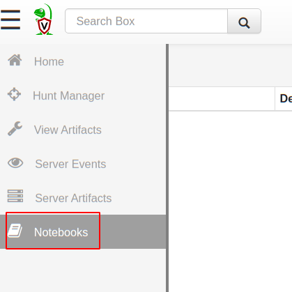
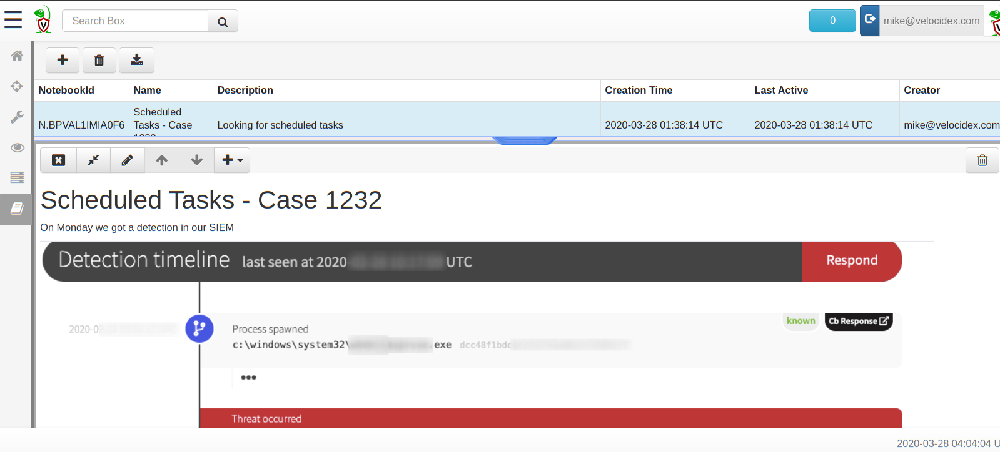
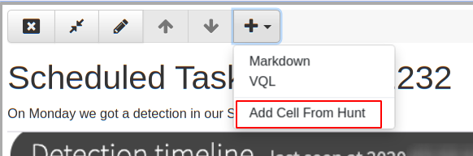
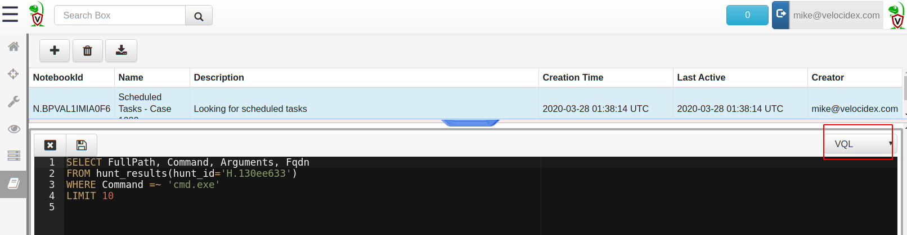
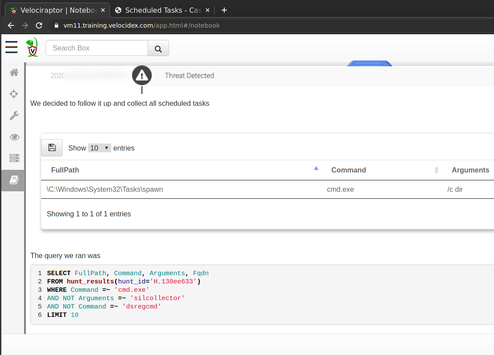

Velociraptor is a great tool for collecting endpoint state easily and efficiently. It is so efficient, that sometimes we end up with a lot of collected data and are left with the task of making sense of the data, and documenting our investigative process.

In [a previous article](../2020-03-06-velociraptor-post-processing-with-jupyter-notebook-and-pandas-8a344d05ee8c/) we have seen how post-processing of collected data can be done using [Jupyter notebooks](https://jupyter.org/). The notebook is a living document, allowing us to run analysis code interspersed among documentation which can be updates in real time, as the analyst post-processes and annotates the data.

Although one can still use Jupyter notebooks to post process Velociraptor collected data, the latest Velociraptor release (0.4.1) added a notebook feature built in. This saves the effort of connecting Jupyter via the API and running python wrappers to manipulate VQL. Velociraptor notebooks are also better integrated into the rest of Velociraptor with native support for VQL, markdown and embedded images. In this article we will explore a typical workflow of using Velociraptor notebooks to investigate a DFIR

## Velociraptor’s notebooks

In the following article we analyze the same case as in our [previous article](../2020-03-06-velociraptor-post-processing-with-jupyter-notebook-and-pandas-8a344d05ee8c/). After installing the latest [Velociraptor release](https://github.com/Velocidex/velociraptor/releases) (0.4.1) we see a new “Notebooks” menu option on the navigation sidebar.

### What are notebooks?

Notebooks are free form, shared documents built right into the Velociraptor GUI. Multiple analysts can view and edit the same notebook simultaneously.

Typically in DFIR work, analysts do not necessarily immediately know the root cause of an intrusion. Analysis is often a long process of collecting evidence, post processing it in some way, analysing the results and collecting further evidence based on our findings.

Notebooks are a way of documenting this process while facilitating collaboration between different team members. During the investigation phase, they are a living document collecting conclusions from multiple artifacts, and coordinating team members. While after the investigation they are a document indicating what was done, and the logical process of reaching the final conclusions.

### Case study — scheduled tasks

This is a typical DFIR investigation. We suspect malware has installed malicious scheduled tasks to restart itself. We previously ran a hunt to collect all scheduled tasks and would like to examine the results (see the previous article for background).

### Creating a new notebook

We will create a notebook to document our analysis process. Selecting the Notebook menu in the sidebar and then clicking the “New Notebook” toolbar button.

We will name our notebook *“Scheduled Tasks — Case 1232”,* and add a useful description. Clicking the *“Add Notebook”* button will create the new notebook which will now be visible in the top pane, and we can see an initial notebook created on the bottom pane.

A notebook consists of a series of **cells**. Each cell can be of type “Markdown” or “VQL”. In our new notebook, the first cell consists of the name and description we entered earlier. Clicking on the cell shows actions that can be done with that cell.

Let’s edit this cell and add our rationale for this investigations. Clicking the “Edit Cell” button will open an editor and allow us to write cell content in markdown (If you are not familiar with markdown, GitHub has an excellent guide [Mastering Markdown](https://guides.github.com/features/mastering-markdown/)). The cell editor can be either in Markdown mode or VQL mode as selected by the pull down on the right.

Let’s also assume that this investigation was started by an alert we received from our SIEM. We can simply take a screenshot of our SIEM alert and paste it into the cell editor to add context to our notebook. Velociraptor will automatically add the image into the notebook and substitute with the markdown to reference it.

Once we finish adding relevant background information to our notebook, we can save the cell by pressing the *“Save” *button (or pressing* CTRL-Enter*).

Velociraptor will render the markdown in the notebook and we can see our screenshot.

Next we need to post process the scheduled tasks we collected earlier in a hunt. Clicking the “Add Cell” pulldown provides a number of options — in our case, we want to add a cell from an existing hunt.

Velociraptor will then ask us which hunt we want to use

Selecting the hunt and clicking OK will produce a new VQL cell, already populated with the basic query we need to run to see the results of the hunt. Note that we always use the **LIMIT** clause to prevent the GUI from processing too much data. At this stage we only want to see the first 10 rows until we can refine our query.

Clicking “Save” will calculate the query and show us the columns available.

We can now refine the columns we see by specifying them in the VQL query. In our case we only wish to see **FullPath, Command, Arguments** and **Fqdn** (The hostname of the endpoint). We know that our alert was for executing “cmd.exe” so we narrow our query to only see scheduled tasks with the **cmd.exe** command *(WHERE Command =~ “cmd.exe”)*.

After more investigation we determine that the `silcollector` and
`dsregcmd` tasks are not malicious so we can exclude them.

We repeat the process as needed until left only with the suspicious commands.

In practice we can now add more markdown cells to explain our findings, implement remediation hunts to remove the malicious scheduled task etc. We can even include the VQL we ran in the report by using markdown code blocks.

### Exporting the notebook

It is great to have a notebook inside Velociraptor, but we really need to be able to print it or share it with others. Additionally, DFIR cases are typically very fluid and the notebook will evolve through multiple revisions. As new data becomes available, perhaps conclusions reached in previous versions need to be revised. This is why we say a notebook is a **living** document

For these reasons, Velociraptor allows users to export the notebook into plain HTML. The HTML export is a point-in-time export, as the investigation proceeds and new information becomes available, the same notebook may be exported again and again, each version revealing new findings.

To export our notebook we select it in the top pane then click on “Export Notebook” button in the toolbar. The dialog box shows us all the existing exports from previous times and also allows us to create a new export.

Clicking on any of the exported files, opens the exported HTML file in another browser window.

Although in this view the tables are not interactive as before, the data is all available there.

Alternatively, we might want to export the result of each post-processed table. To export one table to CSV we can simply click the “Export to CSV” button at the top left of each notebook table

## Conclusions

The new Velociraptor notebook interface adds to Velociraptor’s capabilities as a one stop shop for DFIR investigations. Not only do we have the ability to quickly and efficiently collect artifacts from endpoints, we can now post-process these artifacts in the tool itself. Being able to document our investigative process and produce a report gives us great flexibility without resorting to clunky file exports and spreadsheets.

Having notebooks as a built-in feature and usable out of the box removes the need for fiddly setup with API connectivity, and supporting external programs like Jupyter or Python. Simple, powerful, works out of the box!
