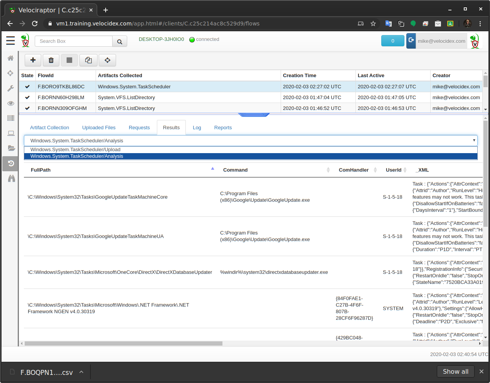
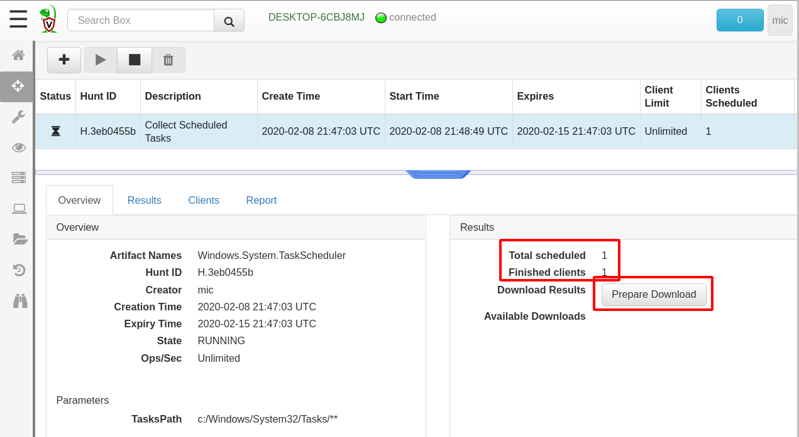

This is an introductory article explaining the rationale behind Velociraptor’s design and particularly how Velociraptor evolved with some historical context compared with other DFIR tooling. We took a lot of inspiration and learned many lessons by using other great tools, and Velociraptor is our attempt at pushing the field forward.

Digital forensics is primarily focused on answering questions. Most practitioners limit their cases around high level questions, such as did the user access a particular file? Was malware run on the user’s workstation? Did an attacker crack an account?

Over the years, DFIR practitioners have developed and refined methodologies for answering such questions. For example, by examining the timestamps stored in the NTFS filesystem we are able to build a timeline tracing an intruders path through the network. These methodologies are often encoded informally in practitioners’ experience and training. Wouldn’t it be great to have a way to formally document and encode these methodologies?

In many digital evidence based cases, time is of the essence. The forensic practitioner is looking to answer questions quickly and efficiently, since the amount and size of digital evidence is increasing with every generation of new computing devices. We now see the emergence of triage techniques to quickly classify a machine as worthy of further forensic analysis. When triaging a system, the practitioner has to be surgical in their approach — examining specific artifacts before even acquiring the hard disk or memory.

Triaging is particularly prevalent in enterprise incident response. In this scenario it is rare for legal prosecution to take place, instead the enterprise is interested in quickly containing the incident and learning of possible impacts. As part of this analysis, the practitioner may need to triage many thousands of machines to find those machines who were compromised, avoiding the acquisition of bit-for-bit forensically sound images.

## The rise of the endpoint DFIR agent

This transition from traditional forensic techniques to highly scalable distributed analysis has resulted in multiple offering of endpoint agents. An agent is specialized software running on enterprise endpoints providing forensic analysis and telemetry to central servers. This architectures enables detection of attackers from different endpoints as they traverse through the network and provides a more distributed detection coverage for more assets simultaneously.

One of the first notable endpoint agents was [GRR](https://github.com/google/grr), a Google internal project open sourced around 2012. GRR is an agent installed on many endpoints controlled by a central server. The agent is able to perform some low level forensic analysis by incorporating other open source tools such as the [Sleuthkit](https://www.sleuthkit.org/) and [The Rekall Memory forensic suite](http://www.rekall-forensic.com/). The GRR framework was one of the first to offer the concept of hunting — actively seeking forensic anomalies on many endpoints at the same time. For the first time, analysts could pose a question — such as “Which endpoints contain this registry key”, to thousands of endpoints at once, and receive an answer within hours.

Hunting is particularly useful for rapid triaging — we can focus our attention only on those machines which show potential signs of compromise. GRR also provides interactive remote access to the endpoint, allowing for user inspection of the endpoint (such as interactively examining files, directories and registry keys).

As useful as GRR’s approach was at the time, there were some shortfalls, mainly around lack of flexibility and limited scale and performance. GRR features are built into the agent making it difficult to rapidly push new code updates or new capabilities in response to changing needs. It is also difficult to control the amount of data transferred from the endpoint which often ends up being much too detailed than necessary, leading to performance issues on the server.

The next breakthrough in the field was the release of [Facebook’s OSQuery](https://osquery.io/). This revolutionary tool allows one to query the endpoints using a SQL like syntax query. By querying the endpoint, it is possible to adapt the results sent, apply arbitrary filtering and combine different modules in new creative ways. OSQuery’s approach proved to be very flexible in the rapidly evolving stages of incident response, where users need to modify their queries rapidly in response to emerging needs.

## Introducing Velociraptor

Learning from these early projects, [Velociraptor](https://github.com/Velocidex/velociraptor) was released in 2019. Similar to GRR, Velociraptor also allows for hunting across many thousands of machines. Inspired by OSQuery, Velociraptor implements a new query language dubbed VQL (Velociraptor Query Language) which is similar to SQL but extends the query language in a more powerful way. Velociraptor also emphasizes ease of installation and very low latency — typically collecting artifacts from thousands of endpoints in a matter of seconds.

**Figure 1** above shows an overview of the Velociraptor architecture. The Velociraptor server maintains communications with the endpoint agents (called Clients) for command and control. The web based administration user interface is used to task individual clients, run hunts and collect data.

Ultimately, Velociraptor agents are simply VQL engines — all tasks to the agent are simply VQL queries that the engine executes. VQL queries, just like database queries, result in a table, with columns (as dictated by the query) and multiple rows. The agent will execute the query, and send back the results to the server which simply stores them as files. This approach means the server is not really processing the results other than just storing them in files. Therefore the load on the server is minimal allowing for vastly scalable performance.

## Velociraptor artifacts

Writing free-form queries is a powerful tool, but from a user experience perspective, it is not ideal. Users will need to remember potentially complex queries. Velociraptor solves this by implementing “[**Artifacts](https://www.velocidex.com/docs/artifacts/)**”. An artifact is a text file written in YAML which encapsulates the VQL, adds some human readable descriptions and provides some parameters allowing users to customize the operation of the artifact to some extent.

As an example of this process, we consider the [Windows Scheduled Tasks](https://docs.microsoft.com/en-us/windows/win32/taskschd/task-scheduler-start-page). These tasks are often added by attackers as a way of gaining persistence and a backdoor to a compromised system (See Att&ck Matrix [T1053](https://attack.mitre.org/techniques/T1053/)). Velociraptor can collect and analyse these tasks if provided with the appropriate VQL query. By writing the query into an artifact we make it possible for other users to simply re-use our VQL.

**Figure 2** shows the **Windows.System.TaskScheduler** artifact as viewed in the GUI. The artifact contains some user readable background information, parameters and the VQL source. As **Figure 3** below shows, in the GUI, one simply needs to search for the scheduled tasks artifact, select it and collect it from the endpoint.

As soon as we issue the collection request, the client will run the VQL query, and send the result to the server within seconds. If the agent is not online at the time of the query, the task will be queued on the server until the endpoint comes back online, at which time the artifact will be collected immediately.

**Figure 4** shows the result of this collection. We see the agent took 5 seconds to upload the 180 scheduled task XML files, which took a total of 5.7mb. We can click the “**Prepare Download**” button now to prepare a zip file containing these files for export. We can then download the Zip file through the GUI and store it as evidence as required.

**Figure 5** shows the results from this artifact. The VQL query also instructed the endpoint to parse the XML files on the endpoint and extract the launched command directly. It is now possible to quickly triage all the scheduled tasks looking for unusual or suspicious tasks. The exported Zip file will also contain the CSV files produced by this analysis and can be processed using any tool that supports CSV formatted data (e.g. Excel, MySQL or Elastic through Logstash).

## Hunting with Velociraptor

Continuing our example of scheduled tasks, we now wish to hunt for these across the entire enterprise. This captures the state of the deployment at a point in time when the hunt was collected and allows us to go back and see which new scheduled tasks appeared at a later point in time.

Hunting is simply a way to collect the same artifact from many machines at the same time. The GUI simply packages the results from these collections into a single exported file.

**Figure 7** shows a hunt created to collect the **Windows.System.TaskScheduler** artifact. We can see the total number of clients scheduled and completed and that the hunt will expire in one week. If new machines appear within this time, they will also have that artifact collected. Finally we can prepare an export zip file for download that contains all the client’s collected artifacts.

## Forensic analysis on the endpoint

To be really effective, Velociraptor implements many forensic capabilities directly on the endpoint. This allows for writing artifacts that can leverage this analysis, either in a surgical way — identifying directly the relevant data, or in order to enrich the results by automatically providing more context to the analyst. In this section we examine some of these common use cases and see how they can be leveraged through use of artifacts.

## Searching for files

A common task for analysts is to search for particular filenames. For example, in a drive by download or phishing email case, we already know in advance the name of the dropped file and we simply want to know if the file exists on any of our endpoints.

The **Windows.Search.FileFinder** artifact is designed to search for various files by filename. **Figure 8** below illustrates the parameters that can be used to customize the collection. For a typical drive-by download, we might want to search for all binaries downloaded recently within the user’s home directories. We can also collect matching files centrally to further analyse those binaries. The artifact also allows us to filter by keywords appearing within file contents.

Searching for files is a very common operation which covers many of the common use cases, but it is limited to finding files that are not currently deleted. Velociraptor also includes a complete NTFS filesystem parser available through a VQL plugin. This allows us to extract low level information from every MFT entry.

**Figure 10 **shows a sample of this output. We can see details like the **FILE_NAME** timestamps, as well as the **STANDARD_INFORMATION** stream timestamps (useful for detecting time stomping).

While the **Windows.NTFS.MFT** artifact dumps all MFT entries from the endpoint, we can make this more surgical and specifically search for deleted executables. To do this we would need to modify the VQL query to add an additional filter.

Modifying or customizing an artifact is easy to do through the GUI. Simply search for the artifact in the “**View Artifacts**” screen, and then click the **“Modify Artifact”** button to bring up an editor allowing the YAML to be directly edited (Note that all customized artifacts, automatically receive the prefix “**Custom**” in their name setting them apart from curated artifacts).

In the figure above we added the condition **“WHERE FileName =~ ‘.exe$’ AND NOT InUse”** to restrict output only to deleted executables. We now select this customized version and collect it on the endpoint as before. Since we have filtered only those executables which are deleted in this query, the result set is much smaller and somewhat quicker to calculate. **Figure 11** below shows a single binary was found on our test system still recoverable in unused MFT entry.

**Figure 11** shows an MFT entry for a binary that had been removed from disk. If we are lucky we can attempt to recover the deleted file using the **Windows.NTFS.Recover **artifact. This artifact simply dumps out all the attribute streams from the specified MFT entry (including the **$DATA** attribute) and uploads them to the server. **Figure 12** below shows how we can select to collect this artifact, and specify the MFT entry reported in the previous collection as a parameter to the artifact.

**Figure 13** shows the output from the **Windows.NTFS.Recover **artifact, showing the **$DATA **stream was correctly recovered as verified by its hash.

The previous example demonstrates how having advanced forensic analysis capabilities is valuable during endpoint monitoring. The example of a drive by download required us confirming if a particular executable is present on any of our endpoints. We started off by performing a simple filename search for executables. But realizing this will only yield currently existing files, we move onto deep level NTFS analysis dumping all MFT entry information. We then modified the VQL query to restrict the output to only the subset of results of interest in our case.

This modified query can now run as a hunt on the entire fleet to determine which executables have recently been deleted anywhere, which would confirm if the malware was run on other machines we are not aware of. We can then potentially use NTFS recovery techniques to recover the binary for further analysis. Without the flexibility of the powerful Velociraptor Query Language it would be difficult to adapt to such a fluid and rapidly developing incident.

## Conclusions

Velociraptor includes many other low level analysis modules, such as parsing prefetch files, raw registry access (for [AMCache ](https://www.andreafortuna.org/2017/10/16/amcache-and-shimcache-in-forensic-analysis/)analysis), [ESE database](https://en.wikipedia.org/wiki/Extensible_Storage_Engine) parser (facilitating [SRUM database forensics](https://www.sans.org/cyber-security-summit/archives/file/summit_archive_1492184583.pdf) and Internet Explorer history analysis), [SQLite](https://www.sqlite.org/) parsers (for Chrome and Firefox history) and much more.

The true power of Velociraptor is in combining these low level modules with other VQL queries to further enrich the output or narrow down queries making them more surgical and reducing the amount of false positives. This more targeted approach is critical when hunting at scale in order to reduce the amount of data collected and assist the operator in focusing on the truly important evidence quickly and efficiently.

The type of analysis performed is driven by a flexible VQL query, written into an artifact by the user. This unprecedented level of flexibility and scale in a forensic tool allows for flexible and novel response and collection. It is really only limited by the imagination of the user.

We opened this article by imagining a world where experienced forensic practitioners could transfer and encode their knowledge and experience into actionable artifacts. Velociraptor’s artifacts help to bring this vision to life — allowing experienced users to encode their workflow in VQL artifacts opens these techniques up to be used by other practitioners in a more consistent and automated fashion. We hope to inspire a vibrant community of VQL Artifact authors to facilitate exchange of experience, techniques and approaches between practitioners and researchers alike.

Velociraptor is available under an open source license on [GitHub](https://github.com/Velocidex/velociraptor). You can download the latest Velociraptor release and use it immediately, or clone the source repository and contribute to the project. You can also contribute VQL snippets or artifacts directly to the project in order to share commonly used artifacts with the larger community.

{}
About the author: Mike Cohen is a digital forensic researcher and senior software engineer. He has supported leading open-source DFIR projects including as a core developer of Volatility and lead developer of both Rekall and Google’s Grr Rapid Response. Mike has founded Velocidex in 2018 after working at Google for the previous 8 years in developing cutting edge DFIR tools. Velocidex is the company behind the Velociraptor open source endpoint visibility tool.
{}
