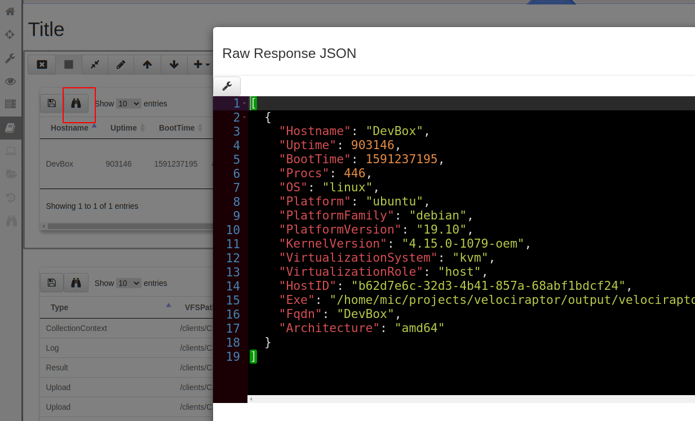
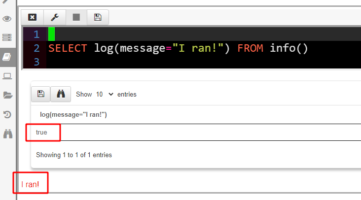
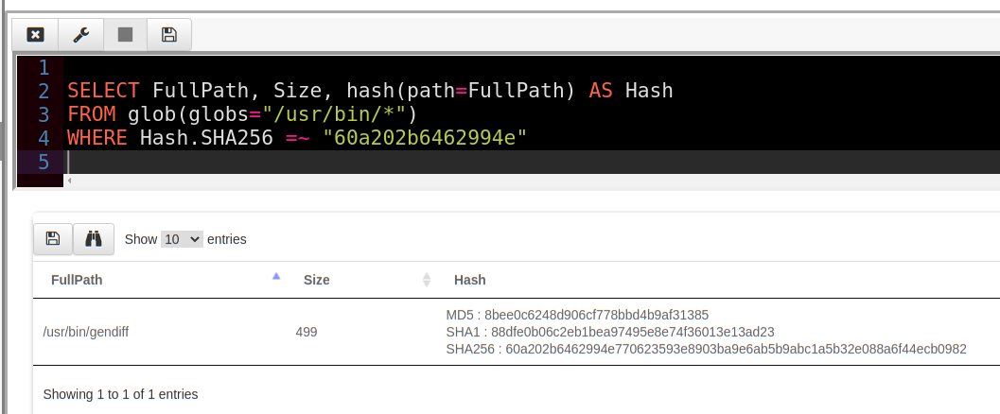

Velociraptor’s query language is central to the operation of Velociraptor. We find it being used in querying endpoints, collecting forensic artifacts and endpoint state and even in post processing data on the server.
> # Velociraptor is ultimately just a VQL query evaluation engine!

Why should you know more about VQL? Users do not actually need to know VQL to simply collect DFIR artifacts from endpoints, hunt for malware or remediate an infection. The Velociraptor GUI is powerful and provides expert DFIR knowledge at the tip of your fingerprints through built in and community contributed artifact definitions.

However being proficient in VQL will allow you to be able to write custom artifacts, post process data and adapt quickly to changing requirements during a fluid incident response exercise. You will also be able to understand, modify or adapt existing artifacts to your changing needs or to handle new evidence sources.

This is the first of a series of articles about the VQL query language. I hope this series will inspire you to develop and contribute new artifacts to this open source project — to the benefit of all members of the community.

### Why a query language?

Before we start, let's discuss why would we want a query language in an endpoint visibility and monitoring tool, such as Velociraptor.

In practice, the DFIR process is very fluid — sometimes we don't know in advance what we would encounter. We need a way to rapidly and flexibly deploy new hunting techniques and algorithms in order to responds to the dynamic nature of IR.

There are a number of other DFIR tools that do not feature a rich query language — but they all provide some method of dynamically adding code to the endpoint. For example [GRR](https://github.com/google/grr) supports “Python Hacks” to run arbitrary code at the endpoint, [Tanium](https://www.tanium.com/) supports running scripts and[ Carbon Black ](https://www.carbonblack.com/)allows running arbitrary commands using an API. All these methods cater for dynamic and flexible response.

[OSQuery](https://osquery.io/) was the first tool to offer SQL as a query language for accessing endpoint state. This is really powerful and is probably the most similar tool to Velociraptor’s VQL. So in this article we will often highlight similarities and differences between Velociraptor’s VQL and OSQuery’s SQL.

### Velociraptor Notebooks

In the articles in this series, we will be working with the Velociraptor notebook. The notebook is a way to collaborate with many investigators in the course of a DFIR investigation using a shared document consisting of cells (think of it like a Google docs for DFIR!).

If you want to follow along this article, you should install the Velociraptor frontend locally (simply generate a simple local config using velociraptor config generate -i and start the frontend using velociraptor.exe --config server.config.yaml frontend -v.

Start a new notebook by selecting the notebook in the sidebar then add a new notebook. Provide a title and description and then add a new VQL cell.

Notebooks consists of a series of **Cells**. There are a number of types of cells but the most common are **Markdown** Cells and **VQL** cells. VQL cells allow one to run arbitrary VQL directly within the notebook, and view the results in a table.

When you create a new notebook, the first cell wil be of type markdown. You can add a VQL cell below that by simply selecting Add VQL cell from the toolbar.

A VQL cell allows one to simply write VQL queries into the notebook. Note that VQL queries in the notebook are actually running on the server itself. It is therefore possible to control and automate the server using VQL (we will see this in a later article).

For now simply write the following query and click the save icon.
> # SELECT * FROM info()

When you finish writing your VQL query, click the “Save” button to update the notebook cell and recalculate the table.

You have just written your first VQL query!

One important thing to note is that the output of a query is always a table. The GUI will render the table in the VQL cell. The table will always return a sequence of rows, each row being a simple collection of columns. You can think of a row as simply a python dictionary with keys being the column names and values being arbitrary objects.

### VQL Basics

VQL was designed to be easy to use and simple to understand. It is also based on SQL but does not support more complex SQL constructs like joins. The basic statement in VQL looks like this:

VQL queries start with the SELECT keyword, and are then followed by a list of “Column Selectors” which specify the columns that will be emitted. A VQL query can also have a WHERE clause — representing a filter which the row must pass before it is emitted.

One of the biggest differences between VQL and SQL is the use of parameters given to plugins. SQL was designed to operate on static data tables, however, in VQL, data sources are not static — they are actually plugins which generate rows when called (for example *pslist()* is a plugin which returns one process per row).

Since plugins run code, it makes sense that they would accept arguments just like functions. Therefore in VQL plugins receive keyword arguments. VQL does not support positional arguments — all arguments are named. In the GUI pressing “?” inside a plugin will suggest all the keywords the plugin accepts so it is really easy to find the names for a plugin’s arguments.

VQL Plugins generate rows, but what exactly is a row? Unlike SQL which deals with simple data types, a VQL row can be thought of as a mapping (i.e. python dictionary or a JSON object) where keys are the column names, and values can take on simple types like integers, strings, as well as complex types like other objects, timestamps etc.

You can see the raw data for each row in the table by clicking the “Show Raw JSON” button (Looks like binoculars) in the table GUI. For example, for the above query we can see the raw data as below.

In our case the **info()** plugin generated a single row with information about the running platform. The raw data consists of a list of JSON objects — each object represents a single row. Rows have column names and each column may contain different data.

### Lazy VQL

One interesting aspect of VQL is lazy evaluation. Since VQL functions can be expensive or have side effects it is important to understand how they are evaluated. In the following discussion we will illustrate this by use of the **log()** VQL function — this function simply emits a logging message (you can think of it as the VQL equivalent of **print**).

Let us modify the above query to simply log a simple message “I ran!”

The GUI renders query logs in red under the table. As we can see the log() function evaluated to **true** and a side effect was logging a message.

It is best to understand how lazy evaluation works by looking at examples. Consider the following example:

In this query we add another column to the output of the info() plugin called “Log” which contains the **log() **function. We then use this column in the WHERE clause. Since the log() function always returns true, the row will pass the filter and be emitted, as well as a log message printed.

What happens however, if the row is filtered out? Let us change this query to be filtered only if the OS is windows (this query is running on Linux).

Since no rows are emitted, the log() function is never evaluated! Therefore we got no logging message. Notice how the log() function is evaluated lazily — since the output is not needed since the row is filtered out.

Let’s now change the query to consider the Log column in the WHERE clause

Because the WHERE clause needs to evaluate the column “Log” the log() function will be evaluated first — even though the row is ultimately eliminated, we still receive a log message!

VQL evaluates a logical expression in a lazy manner — the left hand side of the AND clause is evaluated, and if true the right hand side is evaluated.

Let’s swap the order of the AND clause

This time the row is eliminated by the left hand condition (OS = “Windows”) and VQL does not need to evaluate the Log column at all! Hence we get no logging message.

### Using laziness in practice

The previous discussion was rather theoretical but how would you use this behavior in reality? When we write VQL it is important to bear in mind how expensive we believe each operation would be.

For example consider the **hash()** function which calculates a hash of a file when evaluated. Suppose we were looking for a particular file with a known hash in the **/usr/bin** directory.

This query is rather expensive — we have to hash every single file in the directory and compare that to our malicious hash (In VQL **=~** is the regex match operator). If the directory is large, or we search through many directories, this can take many minutes!

Instead we can leverage the lazy evaluation property to make the query far more efficient by considering other attributes of the file which are quicker to calculate

This revised query is almost instant! We only really hash those files whose size is exactly 499 bytes and never hash any of the other files which are not the ones we are looking for!

We can now encode this VQL query in an artifact, and launch it as a hunt on our entire deployment. This low cost, almost instant hunt is well suited for very wide deployment without fear of adverse effects on endpoint performance.

## Conclusion

VQL is a very powerful way of searching for specific indicators on the end point. A good working knowledge of VQL pays dividends to the DFIR hunter. This first part in our series of articles about VQL internals hopes to provide you with the tools and confidence to forge your own VQL queries. In the next article we explore VQL’s control structures such as **if()**, **foreach()** and **switch()**.

If you want to know more about Velociraptor, VQL and how to use it effectively to hunt across the enterprise, consider enrolling for the next available training course at [https://www.velocidex.com/training/](https://www.velocidex.com/training/).
