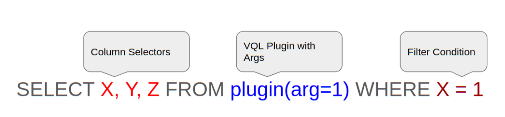
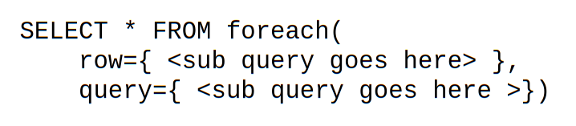

In our previous article I introduced the basics of the Velociraptor Query Language (VQL). We have learned the basic structure of VQL is similar to the SQL SELECT statement

However, one of the main differences between SQL and VQL is that VQL’s data sources are not simple data tables, but are instead executable code termed “plugins”. VQL plugins are simply generators of rows, and may take a number of named arguments.

### The scope

Just like most other programming languages, VQL has a concept of a scope. You can think of the scope as a bag of names referring to values. When VQL encounters a symbol reference within in the query, the VQL engine will consult the scope at that point and try to resolve the symbol’s name for an actual object.

For example consider the following simple query
> # SELECT * FROM info()

When VQL encounters the symbol “**info**” it looks at the scope object used to evaluate the query, for a plugin with that name. If there is such a plugin, VQL will call it and extract rows from it.

Scopes can also be nested — a scope is not one simple dictionary, instead it is a stack of dictionaries. Looking up a name in the scope walks the scope stack in reverse order (from inner scope to outer scope) looking for a match.

Consider the above query SELECT OS FROM info(). The query begins with a parent scope and then VQL will run the info() plugin. The plugin will emits a row containing information about the platform. VQL will then create a nested subscope appending the row to the parent scope, and propagate the row further in the query.

The column selector in this query refers to the symbol **OS**. In order to resolve this symbol, VQL will walk the nested scope in reverse and will find a column called OS in the row. This will resolve the name and end the search, causing the OS to be emitted into the result set.

Lets crank it up a bit — what if we refer to an unknown symbol?

In the above query SELECT OS, Foo FROM info() we refer to an unknown symbol called **Foo**. VQL will attempt to resolve this symbol by walking the scope stack as before, but since the symbol is not known this will fail.

VQL emits a warning that Symbol Foo is not found and helpfully prints the current scope at the point of resolution. As you can see from the warning message, the scope consists of a list of layers, each layer has a set of columns. This is why we refer to the scope as a scope stack.

The last element in the scope stack is the row produced by the info() plugin. (As can be seen by the usual columns emitted by info() including an OS column).

Note that VQL emits a warning but the query keeps going — most errors in VQL are “soft” errors that do not terminate the query from running. VQL does its best to continue with query execution as much as possible.

### The foreach plugin and looping

The previous section covered the query scope in what seems like a rather theoretical and very computer science manner — why should you care about it? The concept of scope is central to VQL and it is critical to understanding how data moves throughout the query.

Consider the example of the foreach() plugin. Unlike SQL, VQL does not support joins. Instead, VQL provides a plugin to enable data from two different data sources to be combined.

In VQL plugins accept named arguments, but the arguments do not have to be simple types like integers or strings. It is also possible to provide a subquery as an argument to a plugin. The foreach() plugin takes advantage of this property by accepting a **row** query and a **query** query. For each row emitted by the **row** query, the foreach() plugin executes the query provided in the **query** argument. This is illustrated in the diagram below.

How can we use this in practice? Consider the following example…

In this example, we select all columns from the foreach() plugin, providing the **row** argument a query which lists all the running processes and extract their binary path. For each binary path, we run the stat() plugin returning filesystem information (like timestamps, size etc).

While this query is obviously useful from a DFIR perspective (it tells us when the binary of each process was modified), it also shows how scope is used within VQL.

You might notice that we refer to a symbol Exe within the **query** query — where does this get resolved from? The foreach plugin creates a sub-scope in which to run the **query** query, and appends the row to it. In this way, it is possible to access symbols from the iterated row from the inner loop, and therefore stat a new file each time. Information flows from the **row** query into the **query** query by way of the nested scope that is shared between them.

### More foreach examples

The foreach plugin is one of the most often used plugins in VQL. It is very common to apply one plugin over the result set of another plugin. Here we give several examples:
> Yara scan files matching a glob expression:

> List all open file handles from all chrome processes:

### Conclusions

This second installment in our series of articles about VQL internals I introduced the idea of scope in VQL. We saw how scope lookups are central to controlling data flow within the query, with some plugins creating nested sub scope in which to evaluate subqueries.

We saw how this principle is applied in the **foreach()** plugin to implement a looping control flow — apply a query over each row produced by another query. This construct allows us to iterate over rows and act on each one with a second dedicated query. Although functionally equivalent to an SQL join operation, it is arguably easier to read and understand VQL queries.

In the next part we see how VQL queries themselves may be stored in the scope and reused. We go back to the concept of lazy evaluation we encountered in the first part and see how this applies to sub queries. We then introduce event queries as a way to run fully asynchronous and event driven VQL.

If you want to know more about Velociraptor, VQL and how to use it effectively to hunt across the enterprise, consider enrolling for the next available training course at [https://www.velocidex.com/training/](https://www.velocidex.com/training/).
