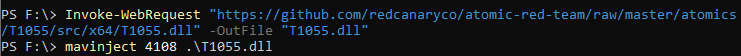
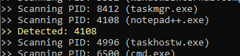
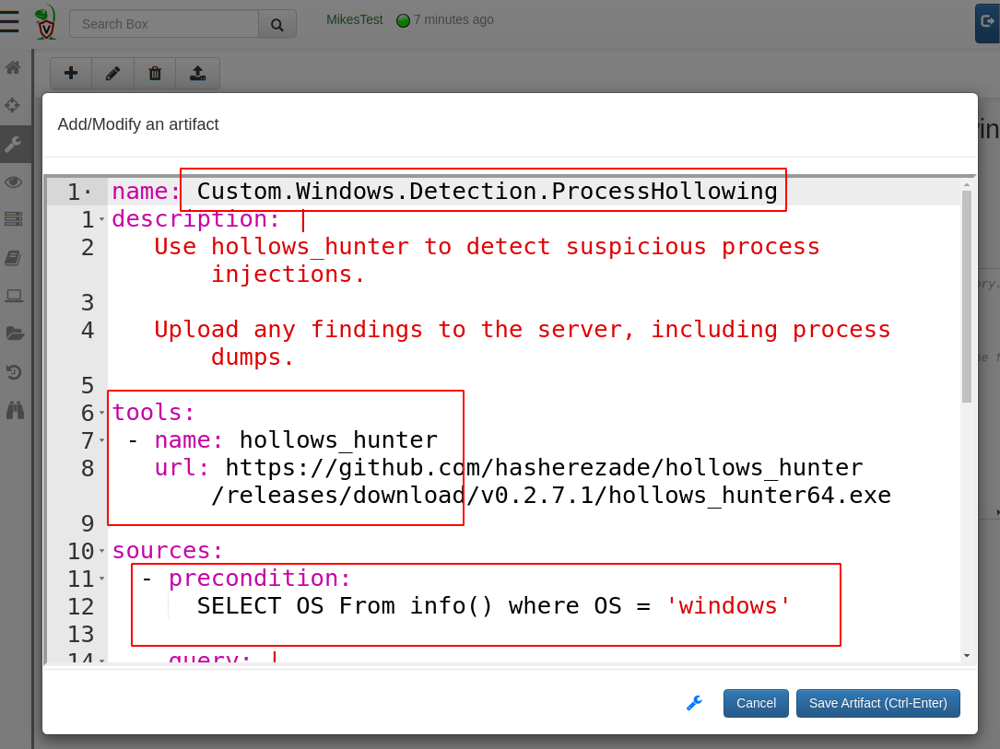
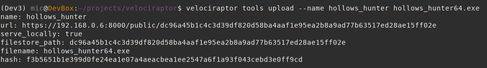

Velociraptor is a powerful endpoint visibility tool. It has plugins
and parsers for many file formats, such as raw NTFS access, raw
registry hive, prefetch files etc.

However, as most DFIR professionals know, there are so many tools out
there that we would love to use in our IR work. One of the strengths
of Velociraptor is its flexibility afforded by the use of the[
Velociraptor Query Language (VQL).]()

We have written before on how VQL can be extended by use of short
[PowerShell scripts]({}), by including these scripts directly in the Artifact
definitions. This is a great way to extend the functionality provided
by VQL, but what if we wanted to launch a completely separate binary
on the endpoint, or a larger powershell module? How can Velociraptor
facilitate the distribution, coordination and collection of tool
output from thousands of endpoints efficiently and quickly?

Since[ release
0.4.6](https://github.com/Velocidex/velociraptor/releases),
Velociraptor supports including external tools directly in the
artifact definition. This makes it easier than ever before to use
external tools in your artifacts transparently — Velociraptor will
ensure the tool is downloaded to the endpoint if needed and is
available for use in your VQL.

### Example: Hollows hunter

To illustrate the process, we will use the [hollows hunter
tool](https://github.com/hasherezade/hollows_hunter) as an
example. This tool is written by the amazing
[HASHEREZADE](https://hasherezade.github.io/) who develops a bunch of
useful tools to inspect binaries in memory (most famous is the
[pe_sieve](https://github.com/hasherezade/pe-sieve) tool).

We would like to develop a Velociraptor artifact that collects all
processes potentially injected by using the hollows hunter on the
endpoint. Before we start though, we need to actually have such a
sample to test on.

Thanks to the Atomic Red Team we can use a simple test to inject a dll
into notepad++. I will use the test for
[T1055](https://github.com/redcanaryco/atomic-red-team/blob/master/atomics/T1055/T1055.md#atomic-test-1---process-injection-via-mavinjectexe)
to inject the dll into *notepad++.exe* on my test VM (which has the
Process ID 4108):



Now we can check that hollows hunter detects this:



### Writing the artifact

We now create the artifact in the Velociraptor GUI. Start off by
selecting the *“View Artifacts”* pane in the left sidebar and click
the* “New Artifact”* button to bring up the artifact editor UI. The
editor will have a pre-filled in template which helps to guide the
user to produce the correct syntax so I will just edit that.



The first thing I will do is name the artifact
*“Custom.Windows.Detection.ProcessHollowing”*. Since this is a custom
artifact, it must start with the word **Custom. **to keep it distinct
from Velociraptor’s built in artifacts. I can also add a quick
description to help users understand what this artifact does.

Next I will declare that this artifact needs the **hollows_hunter**
tool. Velociraptor will ensure this tool is available on the endpoint
when the artifact is collected. The tool’s name is simply a string
that I will use to refer to the tool below. It will be automatically
added to Velociraptor’s inventory of external tools.

By providing the url, Velociraptor can fetch the tool by itself from
this URL. If the tool is not yet known to Velociraptor, the server
will fetch the file and calculate the hash the first time and store
it. In the next section we can see how to manage tools in
Velociraptor.

Now we are ready to write the VQL that will use the tool. The VQL will
run on the endpoint during collection and will need a valid path to
the hollows hunter executable. Velociraptor will manage uploading the
executable to the endpoint and caching the binary locally, ensuring
its hash does not change over time. To make this process as easy to
use as possible, as far as the artifact writer is concerned, they
simply need to call the *“Generic.Utils.FetchBinary()”* artifact to
get a path to the local binary.


The first VQL query simply calls the **Generic.Utils.FetchBinary()**
artifact with the required tool name (Note that we don't need to
specify a url since this is already known to the system). We assign
the result of this query to the *“binaries”* variable — which will
contain an array of rows as is always the case with assigning a query
to a variable (in this case only one row).

At the same time we also obtain a temporary directory to store results
in. This directory will be automatically removed when the query ends
to clean up.

Next we call the binary using the **execve()** plugin with the
appropriate arguments — We wish to dump the memory of affected
processed and write json results into the temp directory (The length
parameter forces the execve() plugin to wait until the buffer is full
before emitting the row — this will wait until the program is done and
emit a single row with Stdout as a column.)

After the hollows hunter program ends, we glob over all the files in
the temp directory and just upload them to the server (we chain the
two queries together using the *chain()* plugin).

The complete artifact can be seen below:

```yaml
name: Custom.Windows.Detection.ProcessHollowing
description: |
   Use hollows_hunter to detect suspicious process injections.

   Upload any findings to the server, including process dumps.
tools:
 - name: hollows_hunter
   url: https://github.com/hasherezade/hollows_hunter/releases/download/v0.2.7.1/hollows_hunter64.exe

sources:
  - precondition:
      SELECT OS From info() where OS = 'windows'

    query: |
      -- Get the path to the hollows_hunter tool and a fresh temp directory.
      LET binaries <= SELECT FullPath, tempdir() AS TempDir
      FROM Artifact.Generic.Utils.FetchBinary(
         ToolName="hollows_hunter")

      -- Run the tool and relay back the output, as well as upload all the files from the tempdir.
      SELECT * FROM chain(
      a={SELECT Stdout, NULL AS Upload
         FROM execve(argv=[binaries[0].FullPath,
           "/json", "/dir", binaries[0].TempDir], length=100000)},
      b={
        SELECT upload(file=FullPath) AS Upload
        FROM glob(globs="*", root=binaries[0].TempDir)
      })
```

### Collecting from the endpoint

Now let's test this artifact by collecting it from our test VM. Simply
search for the hostname in the search box, and view the* “Collected
Artifacts”* pane to see previously collected artifacts. Click the
*“Collect new artifacts”* button and search for our newly created
hollows hunter artifact.


Click* “Launch Collection” *to collect it from the endpoint. We can
view the query log as it is executing on the endpoint to really
appreciate what is happening behind the scenes.


The endpoint initially does not have a copy of the hollows hunter
binary cached locally, so it needs to download it. The endpoint will
now sleep a random time before actually downloading it in order to
stagger downloads from potentially thousands of endpoints in a hunt.

After a short sleep, the endpoint will download the binary directly
from GitHub, it will then calculate the hash of the binary it
downloaded with the expected hash that was sent by the server. If the
hashes match, then the endpoint will keep this file in the temp
directory. The hash comparison protects endpoints from the GitHub
binary changing unexpectedly.

Finally, the endpoint simply runs the tool, and uploads the results to
the server.


The user can access those results as normally by simply getting the
results in a zip file from the **Artifact Collection** tab.


We can now also hunt for this on our entire fleet to retrieve all the
injected binaries in minutes!

Note that once the binary is cached on the endpoint, the Velociraptor
client will not need to download it again, as long as the cached hash
matches the expected hash.

### Tool support — deep dive

In the above example, from the point of view of the artifact writer,
the hollows hunter binary just magically appeared on the endpoint when
it was required by an artifact that used it. How does this actually
work?

Velociraptor has integrated support for external tools since
0.4.6. The tools are managed by the velociraptor tools command. You
can see what tools Velociraptor knows about using the **velociraptor
tools show** command:


We can see that Velociraptor knows the hash of the hollows hunter tool
and it also keeps a copy of the binary in the filestore under a
special obfuscated name.

### Using a custom tool

Previously we have seen that the endpoints all downloaded the hollows
hunter binary directly from GitHub. In practice, if you have thousands
of clients all trying to download the same binary in a hunt it might
trigger GitHub’s DDoS protections. At larger scale it might be better
to serve binaries from more reliable source, like cloud buckets or
Velociraptor’s server itself.

Suppose we also wanted to use a special version of hollows_hunter
(perhaps an unreleased version with extra features or detections) so
we would really like to host the binary ourselves.

We can directly upload our custom version to Velociraptor using the
**velociraptor tools upload** command



Velociraptor will now serve the binary from the frontends directly
when used (seen by the serve_locally flag). Note that the binary will
still only be downloaded if the local copy on the endpoint does not
have the required hash so if this is a frequently used tool it will
generally not generate a lot of download traffic.

### Conclusions

The aim of the new tool integration is to have Velociraptor
automatically manage local caching on the endpoint of external
files. It is possible to have the endpoints download the files from
any URL, or serve it locally from Velociraptor itself. Either way,
Velociraptor ensures the file integrity by specifying in the
collection request the required file hash.

Although in this example we used a binary on the endpoint, this is not
necessary. The scheme works just as well with any file type. For
example, sysmon configuration files can also be kept in a central
place and artifacts can sync them on the endpoint and load them as
required.

The ability to resync tools on the endpoint opens the door to
versioned files. For example, we frequently use Yara rule files
containing frequently changing signatures from threat feeds and other
intel. By updating the hashes on the Velociraptor server we can force
endpoints to use the latest version of the signatures whenever an
artifact is run, but only if they don't already have the latest pack
of yara rules (which may be large).

Caching the files locally means the overheads of downloading the file
each time is eliminated, the artifact YAML itself contains all one
needs to collect this specific type of evidence. In the above example,
we can collect the hollows hunter multiple times, but the binary will
only be actually downloaded once per endpoint. The next collection
will simply use the same local binary while its hash is not changed.

To play with this new feature yourself, take Velociraptor for a spin!
It is a available on
[GitHub](https://github.com/Velocidex/velociraptor) under and open
source license. As always please file issues on the bug tracker or ask
questions on our mailing list
[velociraptor-discuss@googlegroups.com](mailto:velociraptor-discuss@googlegroups.com)
. You can also chat with us directly on discord
[https://www.velocidex.com/discord](../../img/discord)
