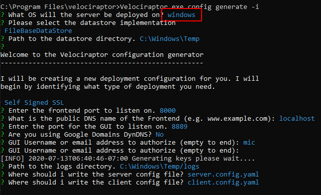
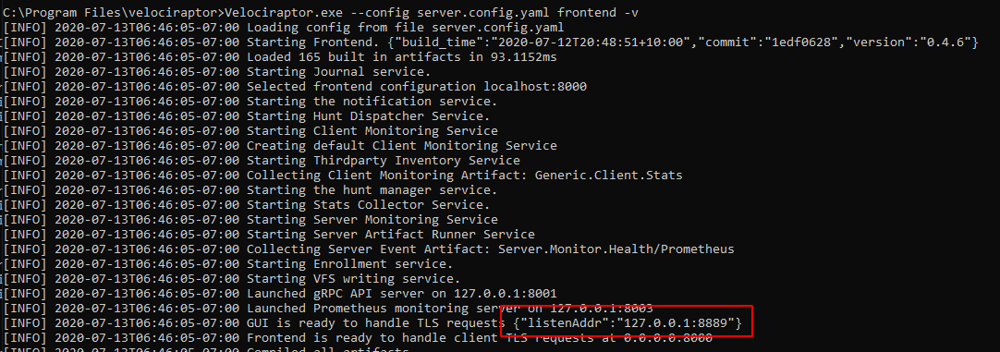

— [www.freepik.com](http://www.freepik.com)](https://cdn-images-1.medium.com/max/2560/1*M5dVyBt08NsIIsxq32V3uQ.jpeg)*[Woman vector created by vectorpouch ](https://www.freepik.com/free-photos-vectors/woman)— [www.freepik.com](http://www.freepik.com)*

Velociraptor is a great tool for collecting Artifacts such as files and other state information from endpoints. Artifacts are simply VQL queries wrapped inside a YAML file providing the query with sufficient context to operate. Typically the triage phase of the DFIR process involves collecting and preserving evidence as quickly as possible, performing quick analysis in order to identify machines of interest for further analysis.

The previous parts in this triage article series covered various scenarios where Velociraptor can help with triage. [Part 1](https://medium.com/velociraptor-ir/triage-with-velociraptor-pt-1-253f57ce96c0) explored the **Windows.KapeFiles.Targets** artifact — an artifact primarily focused on collecting and preserving files. [Part 2](https://medium.com/velociraptor-ir/triage-with-velociraptor-pt-2-d0f79066ca0e) explained how artifacts can be added to a configuration file embedded inside the binary producing an automated collector — as soon as the binary is run, it will simply collect the artifacts it was pre-programmed with. [Part 3](https://medium.com/velociraptor-ir/triage-with-velociraptor-pt-3-d6f63215f579) levels up our capabilities and shows how to automatically upload the collected files to a cloud bucket.

We have received a lot of feedback from users about the processes described in these articles and to be honest it is a bit fiddly — one needed to edit YAML config files and call a sequence of commands to make it work.

Therefore, in recent releases, Velociraptor has grown a GUI to make this process much easier and more robust. This article will introduce this GUI and discuss how you can build a custom offline collector that collects a bunch of artifacts, then uploads them into a cloud bucket.

### Installing a local server

Before we can create a new custom collector, we need to access the GUI — this means running a minimal Velociraptor server. If you already have a proper Velociraptor server deployed you could just use that. For this article I will work on windows by spinning up a local temporary server.

First I have downloaded and installed the official MSI package from the [Velociraptor releases page](https://github.com/Velocidex/velociraptor/releases). This will unpack the executable in the **C:\Program Files\Velociraptor\ ** directory.

In order to start a Velociraptor server I will create new server configuration file by running the interactive wizard using

```sh
# velociraptor.exe config generate -i
```



We will be running the server on **Windows**, Using the **FileBaseDataStore** with a **Self-signed SSL** configuration. I will also add a user called “**mic**” to the server (basically I pressed enter on each question to accept the default).

Now I can start the frontend using:

```sh
# velociraptor.exe -c server.config.yaml frontend -v
```



The GUI will be listening on [https://127.0.0.1:8889/](https://127.0.0.1:8889/) by default. So let's visit it with our browser


### Building the offline collector

An offline collector is simply a binary which is pre-configured to collect certain artifacts — when the user runs it without arguments, the binary will start collecting the artifacts and then terminate.

The script that actually builds the binary is a server side VQL artifact (it is actually running VQL on the server) hence we need to launch it from the “Server Artifacts” screen on the left sidebar.


Click the **Build Collector** button to bring up an artifact search dialog. This dialog is very similar to the one you use to collect artifacts from the endpoint in a client/server model — and for a good reason! An offline collector is simply a way to collect the artifacts that we could have collected using a client/server without having a full Velociraptor deployment. We are using sneakernet rather than internet to transfer the files, but the data we collect are exactly the same!

For this example, we will collect the KapeFiles targets as in previous articles. Simply click add to add this artifact to the collection set. You can add multiple different artifacts at the same time. Note that you are not restricted to just collect files! You can collect processes, memory or any other artifact you can think of — Velociraptor will just collect each one into the one output zip file.

### Configuring the artifacts

Velociraptor artifacts take parameters to control and customize the VQL they run. Depending on the chosen artifacts, different parameters will be available for configuration. Simply scroll down to select which Kape target file to collect As a reminder a KapeFile target (.**tkape**) file is a simple YAML file specifying a file glob pattern selecting certain files to collect.


We will simply select the **BasicCollection** which includes things like the registry hives, the USN Journal etc. When we are happy with the collection, click Next.


Velociraptor will repack the Velociraptor binary with the required artifacts, so here we need to select the target operating system. Let’s leave the **Collection Type** as *Zip Archive* for now — this simply creates a large Zip file containing all the collected data. Clicking Next now begins the build process. The first time we run this after install, Velociraptor will contact Github to download all the binaries it might require so it might take a few minutes to get started.


This process simply ends up calling the **Server.Utils.CreateCollector** artifact. The Artifact runs VQL query which creates the packed binary (on the server) and uploads it to the server again. We can simply click* “Prepare Download”* to obtain a zip file with the executable in it.

### Running the collector

I will now download the zip file from the server and extract the collector into the download directory for testing.


Simply running the binary will begin to collect all the artifacts we specified — in this case the KapeFile Basic Collection target. Finally an output Zip file and a HTML report will be produced using the hostname and timestamp.


### Including external tools

Since release 0.4.6, Velociraptor has built in support for external tools. This means that artifacts that declare tools that they need will receive those binaries on the endpoint when they are being collected. We previously described[ this process](https://medium.com/velociraptor-ir/velociraptor-in-the-tool-age-d896dfe71b9?source=friends_link&sk=20178bda3d9accc46d343b1c825c75a6) using the client/server model.

When building an Offline collector, Velociraptor will also embed the external tools directly into the binary without needing to do anything different with the artifact. Note that the offline collector **does not download** the tool from an external URL — the tool is already packaged in the collector binary itself.

{}

The artifact will run the same way when used in client/server mode or
in offline collector mode. This makes it easier to use the same
reusable VQL in different contexts.
{}

Let’s try to collect the same artifact we did previously — the **hollows hunter** artifact. Just to recap the artifact is shown below

<script src="https://gist.github.com/scudette/0f5d5102b6e3b1580b4feccdf7d59b53.js" charset="utf-8"></script>

I will just add it to the Offline Collector builder


Build the collector as before… extract it to the downloads directory again and launch the collector binary.


We can see that the **hollows_hunter64.exe** binary is copied into a temp file, executed and its results uploaded into the zip file. All temp files are cleaned up after collection.

### Collecting to the cloud.

Previously we collected files into a local Zip file. Sometimes it is more convenient to upload the collection to a cloud bucket so the user does not need to worry about transferring a large collection to us.

To do this, simply select a different Collection Type — I will choose AWS bucket or you can also upload to Google Cloud Storage. You will need to obtain an upload key for the S3 bucket. This is described in the [AWS documentation](https://docs.aws.amazon.com/general/latest/gr/aws-sec-cred-types.html#access-keys-and-secret-access-keys). You should also restrict key access to the bucket to upload only since the keys are embedded inside the collector binary (See the AWS [examples on user policies](https://docs.aws.amazon.com/AmazonS3/latest/dev/example-policies-s3.html)).


Running this, the collector will automatically upload the zip file and the report to the cloud bucket.


### Conclusions

Velociraptor is simply a VQL evaluation engine. Although it works best in client/server mode sometimes we have to use an offline collector. The Offline collector is independent and pre-programmed to collect the most appropriate artifacts for triage and then upload the data to a safe location. You can launch the offline artifact across the network via group policy, WMI or WinRM as a kind of poor-man’s remote forensics platform.

Remember that the offline collector is not limited to simply collecting files! It has the full power of Velociraptor at its disposal so it can collect any volatile machine state that can be collected by Velociraptor — including process memory scanning and dumping, file yara scans, MFT analysis and more.

To play with this new feature yourself, take Velociraptor for a spin! It is a available on [GitHub](https://github.com/Velocidex/velociraptor) under an open source license. As always please file issues on the bug tracker or ask questions on our mailing list [velociraptor-discuss@googlegroups.com](mailto:velociraptor-discuss@googlegroups.com) . You can also chat with us directly on discord [https://www.velocidex.com/discord](https://www.velocidex.com/discord)
