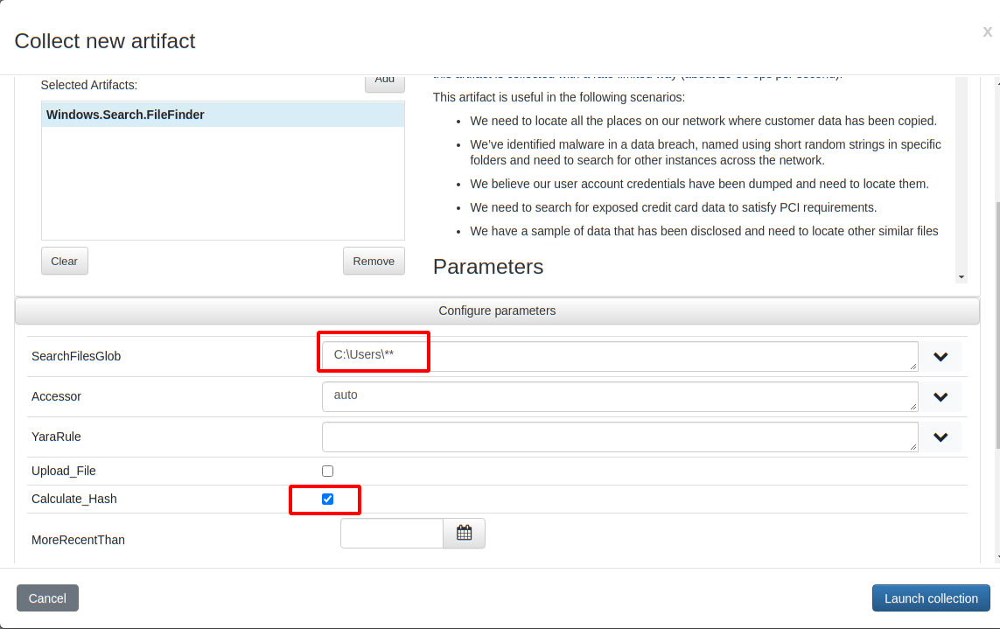
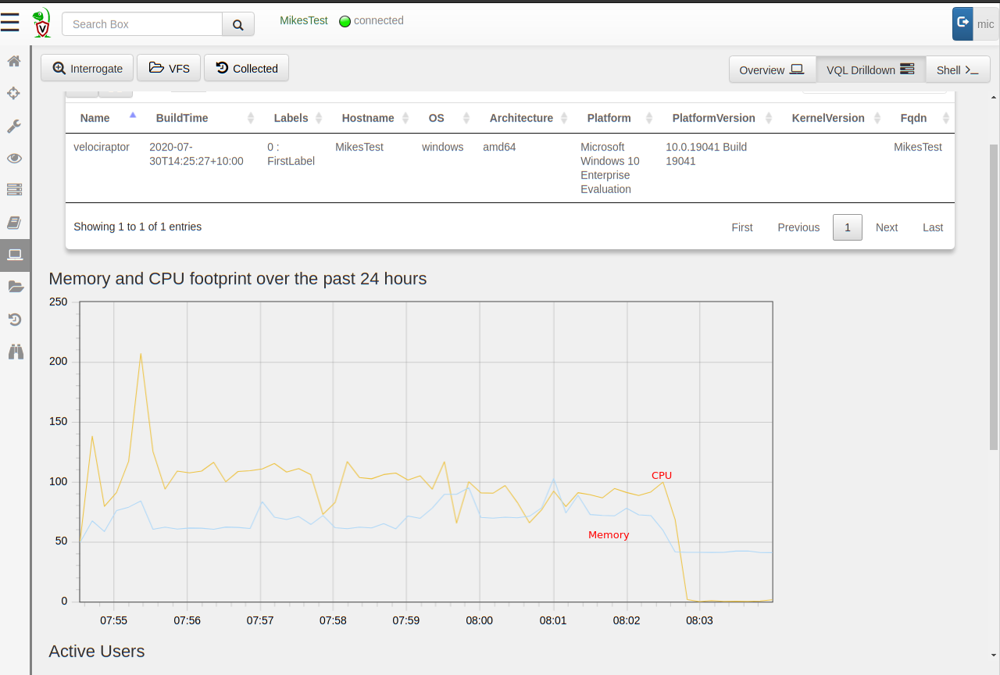
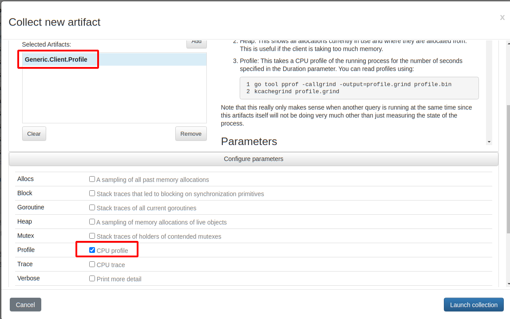
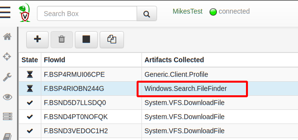
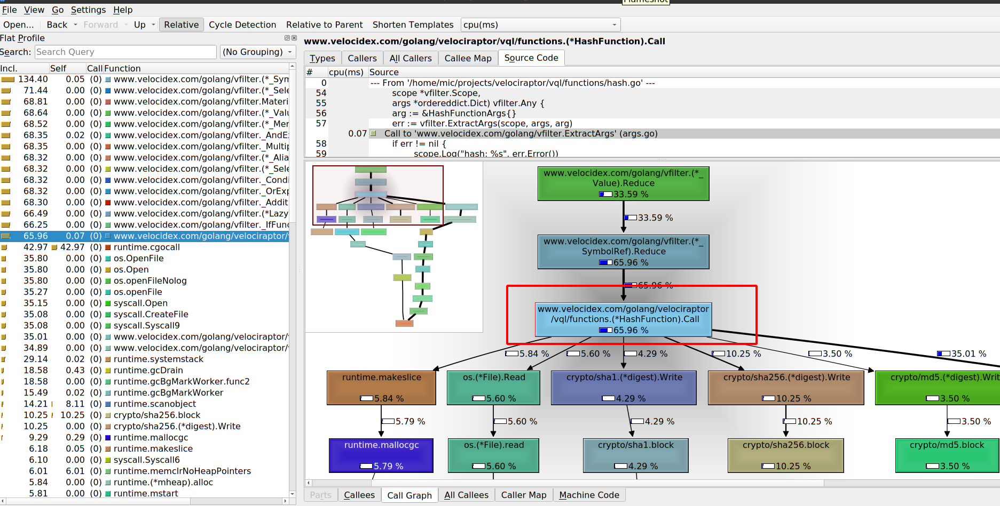

 on [Unsplash](https://unsplash.com?utm_source=medium&utm_medium=referral)](https://cdn-images-1.medium.com/max/10582/0*VRw2NF77V7mzrtQw?width=600px)*Photo by [Daniel Cheung](https://unsplash.com/@danielkcheung?utm_source=medium&utm_medium=referral) on [Unsplash](https://unsplash.com?utm_source=medium&utm_medium=referral)*

You might have previously heard about Velociraptor — fast becoming the standard open source agent for endpoint monitoring and collection. Being an open source project provides users with visibility into the inner workings of the tool since anyone can see the source code and even contribute to it!

While I usually write about Velociraptor features that make DFIR work easier and more effective, this time I am actually going to talk about a feature of the Golang programming language itself (which Velociraptor is written in). Golang provides unprecedented visibility to the state of production binaries, and these mechanisms are available and easily accessible within Velociraptor.

This post introduces new tools available for users since the 0.4.8 release to more easily gain visibility into the inner workings of Velociraptor, and be able to share these with the developers in order to assist in finding and fixing bugs. Although the post will focus on the very technical low level details available for developers, end users can see how they can assist developers by collecting important runtime information (Or even using it to understand what the tool is actually doing).

## Endpoint Telemetry

Those who have already seen Velociraptor in action might be very familiar with the built in telemetry available within the tool. The Velociraptor endpoint agents (termed Client) collect memory and CPU utilization information about the agent process every 10 seconds and send it to the server. The client performance stats are available right in the host overview page.


In the example above we see a typical hunt running on this specific endpoint — the CPU load spikes for a few seconds to a few minutes, then when the collection completes, the CPU load returns to normal levels (at less than 1% of one core), and a short time later memory use is also returned to the system. Of course depending on the specific hunt run, the amount of work the client has to do may be larger and take longer.

Similarly, the server also collects telemetry periodically, which you can see on the main dashboard (this data is also available using Prometheus/Grafana which are more appropriate for larger deployments). Again depending on the amount of post processing done on the server the CPU and memory footprint can vary.


## Profiling

Velociraptor is written in Golang and one of the more useful (if not well advertised) feature of the Go runtime is the ability to profile the running program. Most programming languages have mechanisms to profile running code and collect information about memory allocations, backtraces etc — however in many programming languages, this information can only be collected by running a special debug build of the binary.

What makes Golang different is that **every binary** has the ability to profile itself out of the box. Obviously this capability is disabled by default (since profiling itself has a non-trivial runtime cost) but it can simply be switched on at runtime for a limited time and then switched off. This means that we do not need to restart the binary in debug mode, nor replace a running binary with a special debug build! As a developer, I can not overstate the usefulness of this!

{}
If we see a Golang process running in production and want to inspect its inner working all we need to do is enable profiling for a short time (say 30 seconds) capturing execution traces **without restarting or otherwise affecting the running process!**
{}

Velociraptor exposes this functionality by simply offering the **profile()** VQL function. This is then utilized by two artifacts:

1. The **Generic.Client.Profile** artifact allows collecting profile information for a running client on the endpoint.

1. The **Server.Monitor.Profile** artifact similarly allows to collect profiling information from the server.

In the following example we examine how profiling can be used to gain an understanding of what is going on under the covers.

### Example — recursive file hash

To illustrate this process I will launch a CPU heavy collection on my endpoint. I create a new artifact collection of the **Windows.Search.FileFinder** artifacts, searching recursively for all files below *C:\Users* and hashing them all.



This collection is very CPU intensive and actually takes some time to complete on the endpoint. I can tell this because the CPU footprint in the host’s VQL drilldown pane shows the collection progressing with CPU load around 100% of a core and memory use between 50 and 100mb for about 8 minutes.



For the sake of this discussion, assume that I am not 100% sure what is going on with this collection and why it is taking so long (although I have a theory!). I can remotely acquire profiling information from the client, **while the collection is taking place!**

Simply schedule a new collection of the **Generic.Client.Profile** artifact, selecting the CPU profile checkbox (There are a number of other debugging data and traces that can be acquired at the same time but I won’t go into these here).



When launching this collection, the profiles will be acquired concurrently (note that Velociraptor can collect multiple artifacts at the same time). So actually collecting the **Generic.Client.Profile** artifact will result in collecting information on whatever else is happening within the Velociraptor process at the same time — Collecting this artifact essentially starts recording traces for 30 seconds, then stops recording traces and sends those traces back.



By default the profile is taken over 30 seconds, after which it is uploaded to the server like any uploaded file. I can simply download the profile from the **Uploaded Files** tab by clicking the link.


After downloading the profile file, I convert it to a callgrind format, so it can be viewed by my favourite profile inspector [kcachegrind](https://kcachegrind.github.io/html/Home.html) (there are other similar viewers and the Golang one is [called pprof](https://github.com/google/pprof)).

```sh
$ go tool pprof -callgrind -output=profile.grind profile.bin
$ kcachegrind profile.grind
```



The [kcachegrind](https://kcachegrind.github.io/html/Home.html) tool allows me to interactively inspect the relative CPU time spent on each function. In the screenshot above we can see the left pane showing the relative amount of time taken by each function. The bottom right pane shows an interactive call graph visualizing how each function spends its time. In this case we can see the *HashFunction.Call()* function is responsible for 65% of the time spent. In turn it spends about 5% of CPU time reading the file, 4% calculating the sha1, 10% the sha256 and 3.5% the md5 hashes. (The exact numbers will depend on the actual set of files present on the endpoint)


Scrolling the call graph in this case shows that the `os.Open()`
function spends about 35% of the time. Since `os.Open()` is not a part
of our own code, it shows we end up spending most of our time in the
operating system. In fact 35% of our time is spent waiting for Windows
Defender’s real time scanner (which blocks `os.Open` for us as it
scans the files on demand — Windows defender is a huge performance
killer.).

{}
Our job as Velociraptor developers is to spend as little time as possible in our own code relative to the time spent in the operating system or external libraries.
{}

The function’s source code is shown in the top right pane and we see how much time is spent at each line of code. This makes it easy to see what function calls end up taking the most time and guides our thinking into possible optimizations

A performance bug arises when our function does more work than is necessary and therefore spends too long doing it. This slows down processing. Clearly in this case the biggest contributors are hashing and filesystem operations which exist outside our code base — so this VQL query is pretty good already.

NOTE: The astute reader may spot 5.8% lost to the garbage collector through calls to *makeslice()* in line 67. These calls were eliminated by a recent commit.

### Conclusions

Velociraptor is an open source project — exposing its inner working to all users. While we do not require users to be able to understand the profiling information themselves, they are able to easily collect this data on running production deployments.

By exposing debugging and profiling tools in an easy way to end users, developers enable users to attach more useful traces to bug reports, and allow developers to assist in a more efficient way than simply reporting qualitative information such as high memory use or non-performant code.

The profiling traces are typically much smaller than full memory core dumps and usually do not contain sensitive information. Profiles only contain high level statistics about memory and CPU usage (For example the CPU profile we saw in this article are obtained by statistic analysis of[ sampled backtrace](https://golang.org/pkg/net/http/pprof/)s).

We find this extremely valuable in the Velociraptor project, but the same approach can be replicated by any Golang project:

{}
By exposing profiling and debugging information to our users, in running production binaries we are able to easily get high value visibility into hard to reproduce error conditions and therefore be more effective in isolating and fixing bugs.
{}

If you are interested in looking inside Velociraptor’s inner workings, check out the[ GitHub](https://github.com/Velocidex/velociraptor) page and join us on Discord and our mailing list.
