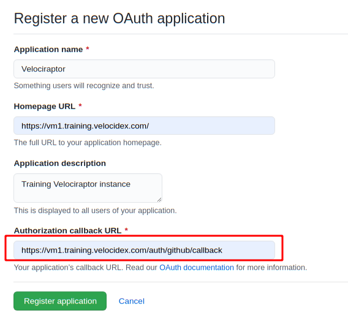
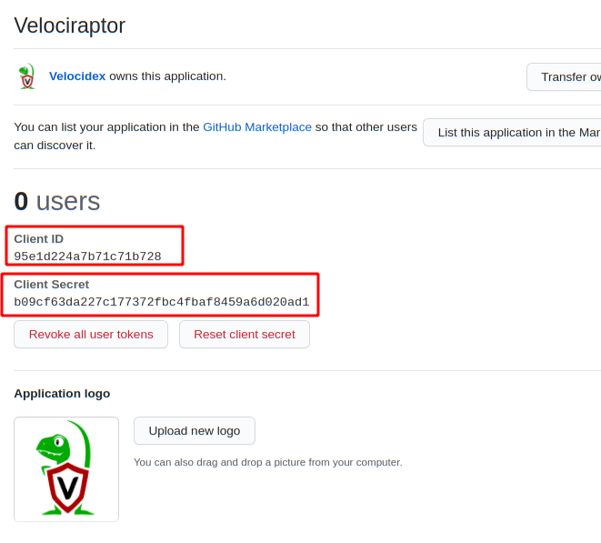
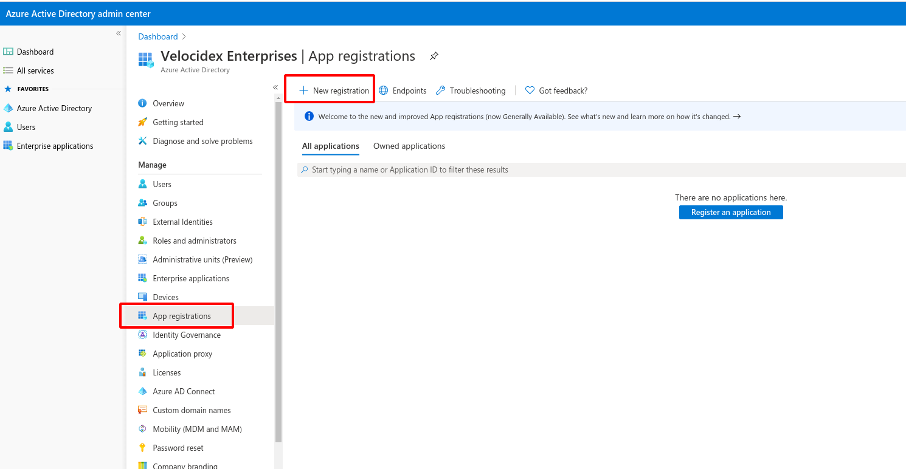
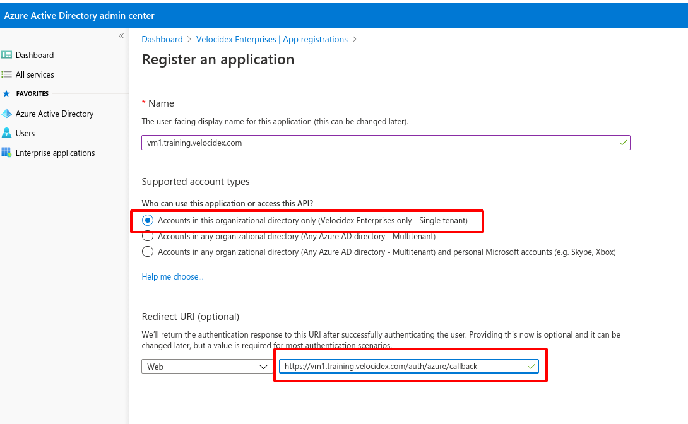
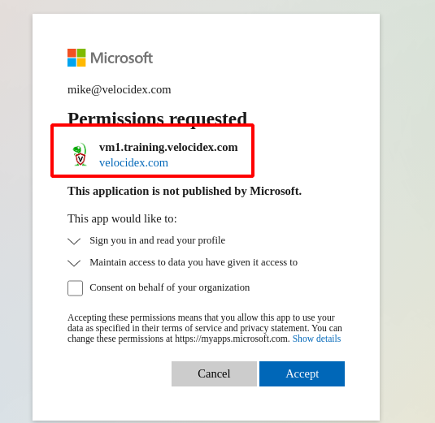

The Velociraptor GUI allows administrators and DFIR team members to rapidly respond and hunt across their entire deployment in seconds. This is a powerful capability, and must be adequately protected.

### Modes of authentication

Velociraptor supports two modes of authentication:

1. Basic authentication

1. Single Sign On using third party OAuth2 logon flow.

In the basic authentication mode, GUI users are added by the administrator and given passwords. When a user logs into the GUI, their browser prompts them to enter a username and password, and the password hashes are checked against those hashes stored in the database.

This traditional authentication flow is simple to use and implement but has a number of shortfalls — the main one being that the user needs to remember yet another password for Velociraptor and so they are likely to reuse an existing password. Modern secure applications also use 2 factor authentication as an additional security mechanism with potentially complex authentication schemes (e.g. secure token).

### OAuth2 flow

Velociraptor supports delegating the authentication to an identity provider (Currently Github, Microsoft or Google and potentially many others in future). This means that Velociraptor never gets to see a user’s password or actually logs them in at all — Velociraptor relies on the OAuth2 provider to assert that the user authenticated correctly (and potentially used the required 2FA method). There are many resources about OAuth2 for example t[his](https://www.digitalocean.com/community/tutorials/an-introduction-to-oauth-2) or the [RFC6749](https://tools.ietf.org/html/rfc6749) also has a lot of details.

While the OAuth2 protocol allows an application to request access to different resources owned by the user, Velociraptor only requests basic access to their email address — Velociraptor associates ACL policies with the user’s email address.

The following steps are performed to log a user into the Velociraptor GUI:

1. The User’s browser makes a request to the Velociraptor GUI

1. Velociraptor redirects the browser to the OAuth2 provider (e.g. Google)

1. The user logs on to their provider and receives a consent screen asking them if they wish to authorize Velociraptor to receive their email address.

1. Once the user authorizes the app, the OAuth2 provider redirects back to the Velociraptor **callback URL **with a token. The callback URL is the path location within the Velociraptor App that will handle the incoming token.

1. At this point Velociraptor already knows the user’s email address and can log them in, as long as they have sufficient permissions (The Velociraptor [ACL model](https://www.velocidex.com/blog/medium/2020-03-29-velociraptors-acl-model-7f497575daee/) still applied).

The advantage of this scheme is that Velociraptor never handles user passwords, and additional authentication requirements like 2FA can be imposed by the OAuth2 provider.

### Google OAuth2

Velociraptor previously [only supported Google ](https://www.velocidex.com/blog/html/2018/12/23/deploying_velociraptor_with_oauth_sso.html)as an OAuth2 provider. However this recently changed when new providers were added.

This post outlines the process of setting up OAuth2 authentication for both GitHub and Microsoft O365 environments.

### GitHub OAuth2 flow

Setting up a Github OAuth2 application is detailed in [their extensive developer docs](https://docs.github.com/en/developers/apps/creating-an-oauth-app), so I will not repeat it here. I will just include a screenshot of the final screen. For this example I will set up one of our training VMs:

The most important item in this form is the Authorization callback URL, which must be of the form
> # https://public DNS name/auth/github/callback

Once I click Register Application, Github will provide me with a client id and a client secret — Those are used by Velociraptor to send authorization requests to Github for authentication.

Now that we have the client id and secret we can create our configuration file using the interactive config generator
> velociraptor.exe config generate -i

Be sure to enter the proper external DNS name of your Velociraptor server, select **Authenticate users with SSO** and choose **Github** as the provider. Velociraptor will show once again, the correct redirect URL that needs to be entered into the GitHub form as we have seen above.

Finally enter the Github client ID and secret and create the server config files. To deploy on a typical Debian based VM, simply build the debian package ready to deploy to your server.

I will now push the Debian package to the server and install it using SCP and SSH. When I navigate to the public URL at [https://vm1.training.velocidex.com](https://vm1.training.velocidex.com) I am redirected to Github to authenticate and upon authorizing the app I can log into my Velociraptor server.

The GitHub OAuth2 flow is excellent! I received an email immediately when my user was authorized and I can see the total number of users authorized to this application.

### Microsoft Azure OAuth2 flow

Many Velociraptor users are using Office 365 and Azure to manage their organizations. I can set up the Microsoft OAuth2 flow in a very similar way to the previous flow. The only main difference with O365 is the concept of tenants — Azure provides each organization with a tenancy which is normally their domain name.

First I will navigate to the Azure Active Directory application and select **App Registrations**. Click on **New registration** to add a new App.

Now I provide the app with a name. Here I can select if this app should be used by users from different tenants or restricted to my org only.

Finally enter the callback URL as before. Note that this is a different URL because it is using the Azure authenticator within Velociraptor. When submitting this, Azure AD will only create a client ID for our application. We need to manually create the client secret using an additional step in the UI. I will select **Certificate & Secrets** from the menu.

Then create a new secret by giving it a name and an expiry.

Now we have both the client id and secret from the previous screen. We simply need to copy those to the configuration wizard. This time we need to provide the tenant ID as well.

After installing this server and accessing it with a web browser, the authentication will redirect to Microsoft to authenticate the user.

## Conclusions

We have seen how to secure the GUI with the new OAuth2 providers. Having a choice of providers allows different organizations to deploy Velociraptor safely at scale and integrate Velociraptor directly into their enterprise architecture.

Note that OAuth2 is only responsible for authentication — i.e. the user is who they claim to be. It does not automatically grant them any permission within the GUI. If a user does not have a specific ACL record they will be rejected:

You can assign or delete users using the **velociraptor user add **command. You can also assign roles to users using the **velociraptor acl grant** commands. The configuration wizard offers to provision an initial set of administrator users for smoother install, but you can always add users later using the command line.

If your favorite authentication provider is not yet supported, please file a feature request on our [GitHub](https://github.com/Velocidex/velociraptor) project, or even send us a pull request!
