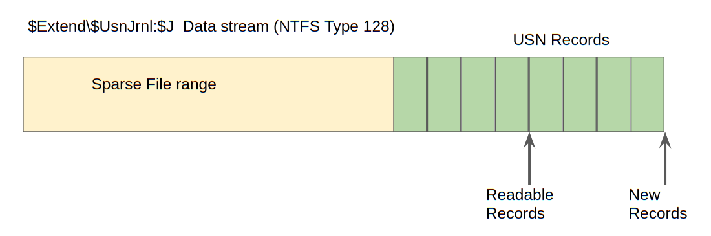
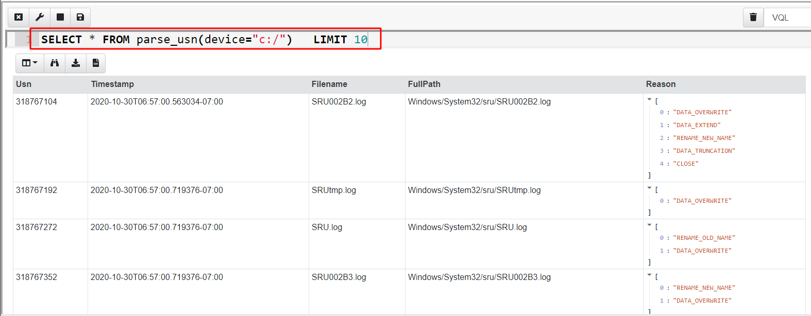
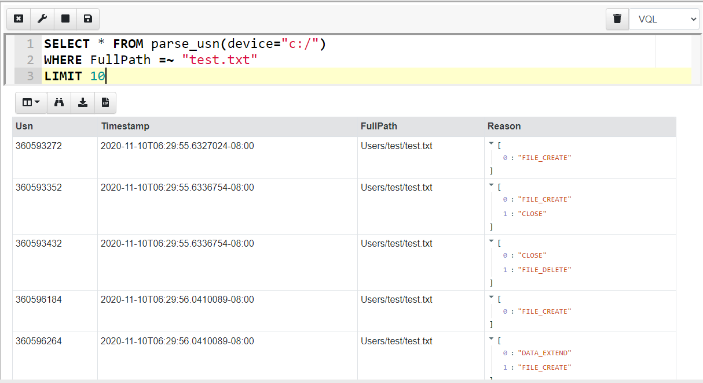
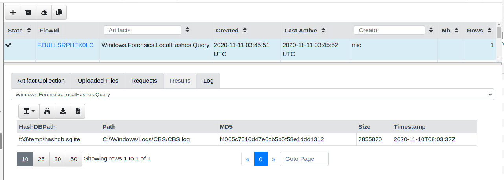

*Thanks to [Matt Green ](https://twitter.com/mgreen27)for discussions, ideas and code….*

NTFS is the default filesystem on Windows systems, so it is important for DFIR tools to support extracting as much system state information as possible from it. Velociraptor already has a full featured [NTFS parser](https://www.velocidex.com/blog/medium/2019-11-15_recovering-deleted-ntfs-files-with-velociraptor-1fcf09855311/), and in a recent release (0.5.2) also added a parser for the **USN Journal** (Update Sequence Number Journal), or [Change Journal](https://en.wikipedia.org/wiki/USN_Journal).

### What is the USN Journal?

By default Windows maintains a journal of filesystem activities in a file called **$Extend\$UsnJrnl** in a special data stream called **$J**. This stream contains records of filesystem operations, primarily to allow backup applications visibility into the files that have been changed since the last time a backup was run.

The **$Extend\$UsnJrnl:$J** file begins life when the volume is created as an empty file. As files are modified on the volume, the $J file is extended with additional USN records.

In order to preserve space, the NTFS creators use an ingenious trick: The beginning of the file is erased and made into a sparse run. Since NTFS can handle sparse files (i.e. files with large runs containing no data) efficiently, the file effectively does not consume any more disk space than needed but does not need to be rotated or truncated and can just seem to grow infinitely.

This means that in practice we find the **$J** file on a live system reporting a huge size (sometimes many hundreds of gigabytes!), however usually the start of the file is sparse and takes no disk space, so the $J file typically only consumes around 30–40mb of actual disk space. This is illustrated in the diagram below.

USN Records are written back to back within the file. The USN records contain[ valuable information](https://docs.microsoft.com/en-us/windows/win32/api/winioctl/ns-winioctl-usn_record_v2):

* The USN ID is actually the offset of the record within the file. This is a unique ID of the USN record (since the file is never truncated).

* A Timestamp — This is a timestamp for the file modification

* Reason — is the reason of this modification for example DATA_TRUNCATION, DATA_EXTEND, FILE_CREATE, FILE_DELETE etc.

* Filename is the name of the file that is being affected.

* Parent MFT ID points to the parent record within the MFT (the changed file’s containing directory).

Using the Filename and Parent MFT ID allows Velociraptor to resolve the full path of the file from the root of the filesystem.

### Velociraptor’s USN Parser

Velociraptor provides access to the USN parser via the **parse_usn()** plugin. Let’s see what kind of data this plugin provides by running a simple query in the notebook

In the above I hid some of the less interesting fields, but we can immediately see the USN records are shown with their USN ID (which is the offset in the $J file), the timestamp, the full path to the modified file and the reasons for modifications.

When a program interacts with a file, we typically see a bunch of related filesystem events. For example, I can create a new file called **test.txt** using notepad and write some data into it. I can then query the USN journal for modifications to that file (The **=~** operator is VQL’s regex match)…

Notepad seems to interact with the file using a number of separate operations and this adds several events into the USN journal file for the same interaction.

Previously, Velociraptor was able to only collect the USN journal file and users had to rely on other third party tools to parse it (e.g. [this](https://tzworks.net/prototype_page.php?proto_id=5) or [this](https://github.com/PoorBillionaire/USN-Journal-Parser)). The problem with that approach is that external tools usually have no access to the original $MFT and therefore were unable to resolve the parent MFT id in the USN record to a full path. Parsing the USN records directly on the endpoint allows Velociraptor to immediately resolve the files into a full path making analysis much easier later.

### When to use the USN Journal?

The USN journal can provide visibility into filesystem activity going back quite a long time. It seems that Windows aims to keep the maximum actual size of the log file around 30–40mb (remember, the file is sparse) so if the machine is not used too heavily, we sometimes find the log goes back a week or two. This gives us visibility on past system activity.

Practically this can be useful:

* When a program is run, typically we can see the prefetch files modified which gives us a timestamp on execution (in the case where the prefetch files themselves were deleted).

* One can see file modification or creation of a particular file extension (e.g. executables) or within specific directories (e.g. Windows\System32\) which might indicate system compromise took place.

* Many compromises occur after an initial file based malware was run (e.g. office macros, or PDF). The USN journal can provide a time of initial infection.

* The USN journal can provide evidence of deleted files. With Velociraptor it is possible to efficiently hunt for all machines that had the particular file in the recent past — even if the file was subsequently deleted. This is useful to find evidence of attacker toolkit installation, or initial vectors of compromise.

### Watching the USN journal

In the previous section we saw how Velociraptor can parse the USN journal on a running system, enabling hunting and analysis of past filesystem activity.

However, Velociraptor is built around VQL — a unique query language allowing for asynchronous and event driven queries. Therefore, Velociraptor also has the unique ability to create event queries — queries that never terminate, but process data as it occurs.

As such, Velociraptor offers many event driven versions of the standard plugins. For USN Journals, Velociraptor offers the **watch_usn()** plugin as an event driven alternative to the **parse_usn()** plugin. When a query uses **watch_usn()**, Velociraptor will watch the USN log for new entries, and as they appear, the plugin will release the event into the rest of the query.

This allows Velociraptor to watch for file changes in near real time on the running system. You can easily see this effect by running an event query from the command line:

As filesystem changes occur they are picked up by the **watch_usn()** plugin and reported a short time later. This allows us to write queries that respond to filesystem events in near real time.

### Event monitoring example: Hash database

Having the ability for Velociraptor to actively watch for filesystem events in near real time opens the door for many potential applications. One very useful application is maintaining a local hash database on endpoints.

Hunting for a file hash on endpoints can be a very useful technique. While attackers can and do change their tools trivially to make hunting for file hash ineffective, once a specific compromise is detected, being able to rapidly hunt for the same hash across the entire fleet can reveal other compromised hosts.

Up until now, hunting for hashes on a machine was difficult and resource intensive. This is because trying to determine if any files exist on an endpoint having a given hash requires hashing all the files and comparing their hash to the required hash — so essentially hashing every file on the system!

Even after reasonable optimizations around file size, modification time ranges, file extensions etc, a hunt for hashes is quite resource intensive, and therefore used sparingly.

The ability to follow the USN journal changes all that. We can simply watch the filesystem for changes, and when a file is modified, we can hash it immediately and store the hash locally in a database on the endpoint itself. Then later we can simply query that database rapidly for the presence of the hash.

As mentioned in the previous section, a single change typically involves several USN log entries. We therefore need to deduplicate these changes. We simply need to know that a particular file may have changed recently (say in the last few minutes) and we can then rehash it and update the database accordingly.

All this can easily be implemented using a VQL query, which we can store in a VQL artifact. You can see the **Windows.Forensics.LocalHashes.Usn** [full artifact source here](https://github.com/Velocidex/velociraptor/blob/master/artifacts/definitions/Windows/Forensics/LocalHashes/Usn.yaml).

In order to get this query to run on the endpoints, we assign the artifact as a client event detection artifact, by clicking the “Client Events” screen and then the “Update Client monitoring table” button. After selecting the label group to apply to (All will apply this to all machines in your deployment), simply add the **Windows.Forensics.LocalHashes.Usn** artifact by searching for it.

The most important configuration parameter is the PathRegex specifying which files we should be watching. For example, you might only be interested in hashes of executables or word documents. Leaving the setting at “.” will match any file, including very frequently used files like event logs and databases — this setting can potentially affect performance. Finally you can suppress the artifact output if you like — this just means that hashes will not be additionally reported to the Velociraptor server. They will just be updating the local database instead.

Once the query is deployed it will run on all endpoints and start feeding hash information to the server (if required). You can see this information in the client monitoring screen by simply selecting the artifact and choosing a day of interest

You can now easily page through the data viewing the hashes and files that were added since the query started. You can also download the entire SQLite database file from the endpoint, or watch the events on the server for specific file types or hashes found across the entire deployment.

Let’s test querying this local database. I will just pick a random
hash and see if my endpoint has this hash. I will simply collect the
Windows.Forensics.LocalHashes.Query artifact on my endpoint and
configure it to search for the hash
`f4065c7516d47e6cb5b5f58e1ddd1312`. This hash can be entered as a
table in the GUI or simply as a comma delimited text field.

The artifact returns almost instantly with the file that this hash belongs to

The local hash database is simply a SQLite file maintained by the VQL query. As such I can easily collect this file with a hunt if I wanted to archive the hash database periodically from all my endpoints.

Collecting the **Windows.Forensics.LocalHashes.Glob** artifact will populate the local hash database by simply crawling a directory, hashing all files inside it and populated the database — this is useful to pre-populate the database with hashes of files created before Velociraptor was installed.

### Conclusion

Velociraptor brings unprecedented visibility to endpoint machine states using state of the art forensic capabilities. In this post we saw how parsing the USN Journal allows Velociraptor to gather information about past filesystem activity. We also saw how detection and monitoring queries can be used to respond to file modification or creation in near real time.

Finally we saw this capability put into practice by maintaining a local hash database which can be queried on demand to quickly answer questions like *which machine in my fleet contain this hash?*

To play with this new feature yourself, take Velociraptor for a spin! It is a available on [GitHub](https://github.com/Velocidex/velociraptor) under an open source license. As always please file issues on the bug tracker or ask questions on our mailing list [velociraptor-discuss@googlegroups.com](mailto:velociraptor-discuss@googlegroups.com) . You can also chat with us directly on discord [https://www.velocidex.com/discord](https://www.velocidex.com/discord)
