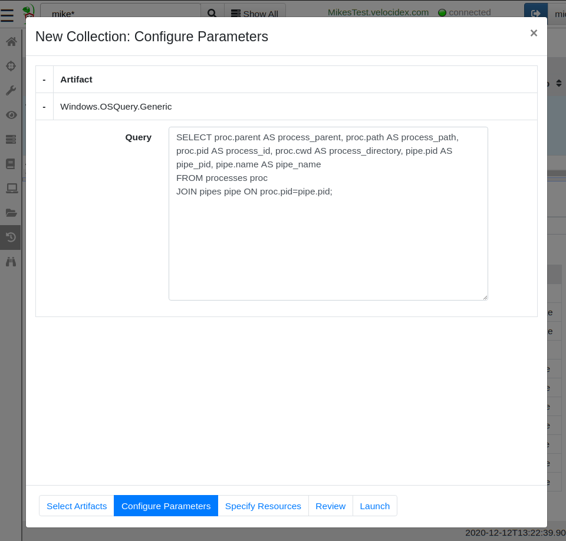
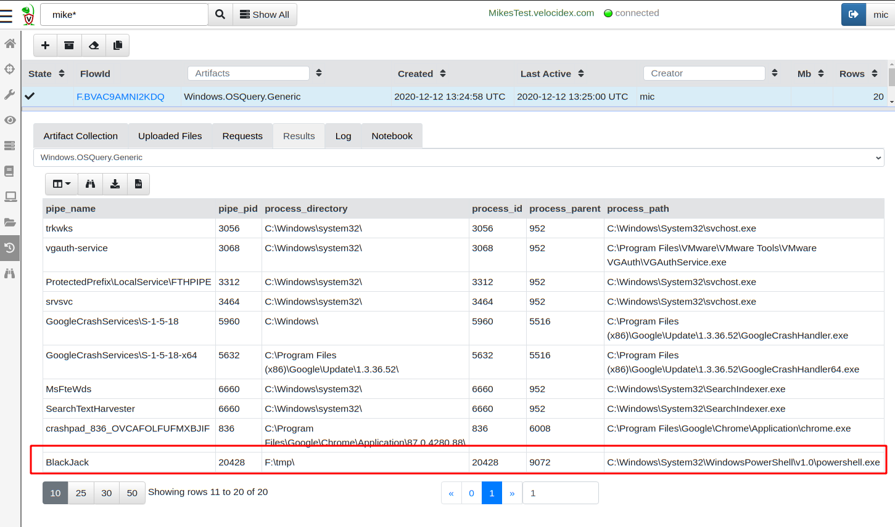

One of our favorite tools for endpoint visibility is [OSQuery](https://github.com/osquery/osquery). OSQuery has really transformed the state of endpoint visibility and DFIR by allowing analysts to flexibly issue queries to introspect endpoint state, just like a database. This flexibility has always been the inspiration for Velociraptor, and the development of the Velociraptor Query Language (VQL) followed the footsteps of OSQuery to provide a powerful and flexible query language.

However, while OSQuery provides a query engine with many plugins exposing machine state, it is not typically enough on its own. OSQuery itself does not provide a server, nor does it provide a GUI (there are a number of OSQuery servers, such as [FleetDM/Fleet](https://github.com/fleetdm/fleet)).

While, Velociraptor was designed to be a scalable DFIR tool that is easy to deploy (typically [deployed in minutes](https://www.youtube.com/watch?v=l1_sKDmNWS4&t=550s)). It is typically more complicated to deploy OSQuery at scale, use it to hunt widely and post-process the results.

Nevertheless, OSQuery has been around for a long time, and there are many existing queries that could be used immediately, without needing to convert then to VQL first.

{}

Velociraptor and OSQuery are not an either or choice — you can use
them both at the same time!

{}

In recent releases Velociraptor directly integrates OSQuery on all supported platforms — so you can issue the same OSQuery query you always did and it would work exactly the same within Velociraptor. This blog post explains how the integration is done, and we go though a typical example to how Velociraptor can use OSQuery to hunt through many machines quickly.

### OSQuery integration

OSQuery itself is a query engine — it is distributed a single executable which is capable of evaluating a query, and returning a result set (essentially a table of rows and columns). In this sense OSQuery is very similar to VQL queries, which also return a result set.

The goal of the OSQuery integration is to make OSQuery appear as a natural extension to VQL. That is, within Velociraptor, OSQuery output is indistinguishable from the output of native VQL queries. This allows one to filter and enrich the OSQuery query using standard VQL.

Let’s have a look at the VQL artifact that implements OSQuery integration

```yaml
name: Windows.OSQuery.Generic
description: |
  OSQuery is an excellent tool for querying system state across the
  three supported Velociraptor platform (Windows/Linux/MacOS).

  You can read more about OSQuery on https://osquery.io/

reference:
  - https://osquery.io/
  - https://github.com/osquery/osquery

# I am not actually sure if OSQuery allows arbitrary command execution via SQL?
required_permissions:
  - EXECVE

precondition: SELECT OS From info() where OS = 'windows'

tools:
  - name: OSQueryWindows
    github_project: Velocidex/OSQuery-Releases
    github_asset_regex: windows-amd64.exe

parameters:
  - name: Query
    default: "SELECT * FROM osquery_info"

sources:
  - query: |
      LET binary <= SELECT FullPath
      FROM Artifact.Generic.Utils.FetchBinary(ToolName="OSQueryWindows")

      LET result = SELECT * FROM execve(
         argv=[binary[0].FullPath, "--json", Query],
         length=1000000)

      SELECT * FROM foreach(row=result,
      query={
         SELECT * FROM parse_json_array(data=Stdout)
      })
```

As described in a[ previous post](https://medium.com/velociraptor-ir/velociraptor-in-the-tool-age-d896dfe71b9), Velociraptor will deliver the OSQuery binary to the endpoint securely (line 29–30), then shell out to the binary executing the provided query (line 32–34). Finally the result is parsed from JSON and returned as a standard VQL result set (line 36–39).

The entire OSQuery integration is implemented as above in VQL — one does not need to do anything else in order to launch an OSQuery query on a remote host… In particular, one does not need to have OSQuery installed on the endpoint in advance! Velociraptor will push the binary to the endpoint on demand, managing binary versioning if required and maintaining a local copy of OSQuery on the endpoint.

### Let’s go hunting…

Let’s look for an interesting OSQuery query that we might want to run. A great resource of public OSQuery queries can be found in Recon Infosec’s public OSQuery resource [https://rhq.reconinfosec.com/](https://rhq.reconinfosec.com/tactics/lateral_movement/). For this example I will choose the query looking for[ SMB/Named Pipes](https://rhq.reconinfosec.com/tactics/lateral_movement/), written by Eric Capuano.


A Named Pipe is a Windows IPC method that allows communication between different processes. Many attack tools open multiple processes, and use named pipes to communicate between those, [including metasploit or Cobalt Strike.](https://labs.f-secure.com/blog/detecting-cobalt-strike-default-modules-via-named-pipe-analysis/)

The query identifies processes using named pipes, making it a nice signal or a baseline for which processes in your environment typically communicate with pipes.

To test this query, I created a quick named pipe server in Powershell that creates a named pipe called **BlackJack**.

```powershell
while (1) {
  $npipeServer = new-object System.IO.Pipes.NamedPipeServerStream('BlackJack',
     [System.IO.Pipes.PipeDirection]::InOut)

  $npipeServer.WaitForConnection()
  $npipeServer.Close()
}
```

After selecting my test machine in the Velociraptor GUI, I created a new collection then searched for the OSQuery artifact. Since this is a Windows system, I select the Windows variant of the artifact.


After selecting the **Windows.OSQuery.Generic** artifact, I can click the “Configure Parameters” screen where I am able to enter the OSQuery query to run.



Finally I click the “Launch” button to start the new collection. This will collect the **Windows.OSQuery.Generic** artifact on this machine, Velociraptor will push the OSQuery binary to the endpoints and cache it locally. On subsequent collections, the endpoint will compare the local hash of the binary with the required hash and only fetch a new version if necessary — therefore subsequent executions are very rapid.



As can be seen above, the OSQuery query produces a table of results, indistinguishable from a typical Velociraptor artifact.

### Extending OSQuery with VQL

The previous OSQuery query returns all the named pipes on the endpoint and their owner processes. Suppose we now wanted to build on this query and identify high value signals — for the sake of this example, suppose the named pipe “**BlackJack**” is a known malicious name belonging to a specific malware variant. Let us therefore, collect a process memory dump of all processes which open a named pipe with the name BlackJack for further analysis. We wish to do so by extending the OSQuery query we had earlier with some VQL.

I created a new custom Velociraptor artifact by wrapping some VQL around the existing OSQuery artifacts. To do this I click on the “View Artifacts” screen, select “Add an Artifact” and type the following YAML artifact into the GUI.


The full artifact text is also shown here.

```yaml
name: Custom.OSQuery.BlackJack
description: |
   Get memory dumps of all processes with a named pipe called BlackJack

parameters:
   - name: NamedProcessRegex
     default: BlackJack
   - name: OSQuery_query
     default: "SELECT proc.parent AS process_parent, proc.path AS process_path, proc.pid AS process_id, proc.cwd AS process_directory, pipe.pid AS pipe_pid, pipe.name AS pipe_name FROM processes proc JOIN pipes pipe ON proc.pid=pipe.pid;"

sources:
  - precondition:
      SELECT OS From info() where OS = 'windows'

    query: |
      LET matching_processes = SELECT *
      FROM Artifact.Windows.OSQuery.Generic(Query=OSQuery_query)
      WHERE pipe_name =~ NamedProcessRegex
      GROUP BY process_id

      SELECT * FROM foreach(row=matching_processes,
      query={
          SELECT pipe_name, process_id, process_path,
                    upload(file=FullPath) AS MemDump
          FROM proc_dump(pid=int(int=process_id))
      })
```

Velociraptor Artifacts are simply YAML files which encapsulate VQL queries and provide the whole thing with a name. Users now simply need to collect the **Custom.OSQuery.BlackJack** artifact without needing to write their own VQL.

Let’s take a look at how this artifact works. The VQL simply calls the same **Windows.OSQuery.Generic** artifact we ran previously, it then filters the result set to only match the **BlackJack** pipe. For each matching process, the VQL then call the **proc_dump()** plugin to obtain a dump of process memory and then uploads it to the server.


The result is a 230Mb dump file that can be opened by the windows debugger for each process found holding a named pipe called BlackJack.

We can now hunt our entire deployment looking for specific named pipes in seconds.

### Conclusions

In this blog post I demonstrated how Velociraptor integrates OSQuery as a natural extension to the Velociraptor Query Language. To use OSQuery with Velociraptor, one simply collects the relevant artifact from the endpoint. Users do not need to have OSQuery installed on the endpoint — Velociraptor manages the distribution and update of the binary as needed transparently behind the scenes.

We then saw how to extend OSQuery queries seamlessly with the additional functionality built into Velociraptor, by capturing and uploading memory dumps as additional triaging artifacts.

So what are the pros and cons of using OSQuery within Velociraptor?

The biggest advantage of the OSQuery integration is that existing OSQuery queries just work without modifications. This avoids having to rewrite the same queries in VQL using Velociraptor’s native query language (and potentially having to learn yet another query language). Having the ability to directly use OSQuery queries makes all the OSQuery resources on the web immediately available for use with Velociraptor (For example [Carbon Black’s Query Exchange](https://community.carbonblack.com/t5/Query-Exchange/idb-p/query_exchange)).

An obvious disadvantage of the integration is that Velociraptor still ends up shelling to OSQuery to actually perform the query — therefore Velociraptor has no control of the resource usage consumed by OSQuery during query execution (however cancelling the artifact collection will terminate the OSQuery process). While normal VQL queries have throttling setting controlling the CPU load, we lose this ability when running the OSQuery process.

To play with this feature yourself, take[ Velociraptor for a spin](https://github.com/Velocidex/velociraptor)! It is a available on GitHub under an open source license. As always please file issues on the bug tracker or ask questions on our mailing list [velociraptor-discuss@googlegroups.com](mailto:velociraptor-discuss@googlegroups.com) . You can also chat with us directly on discord [https://www.velocidex.com/discord](https://www.velocidex.com/discord)
