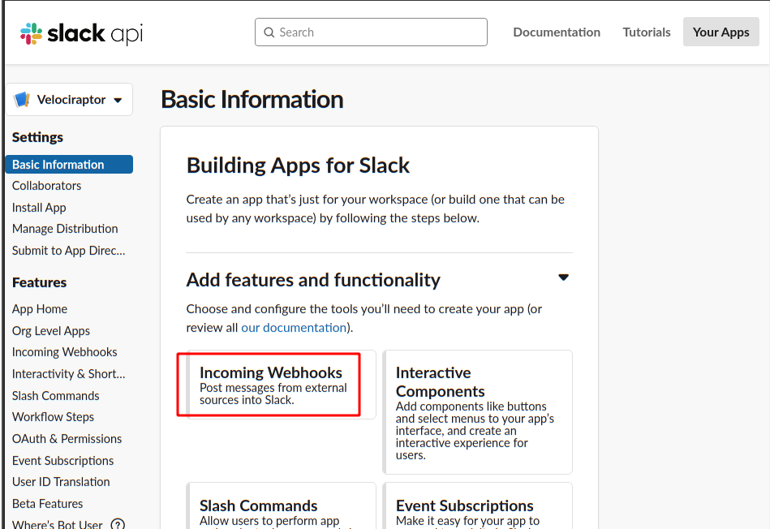
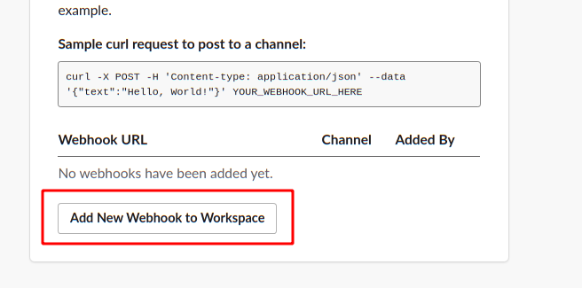
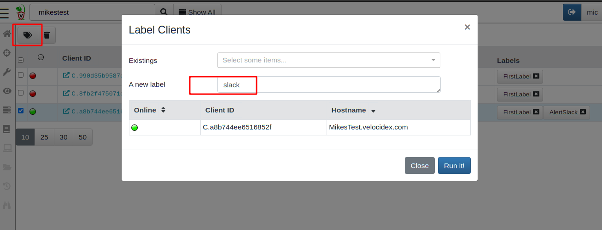
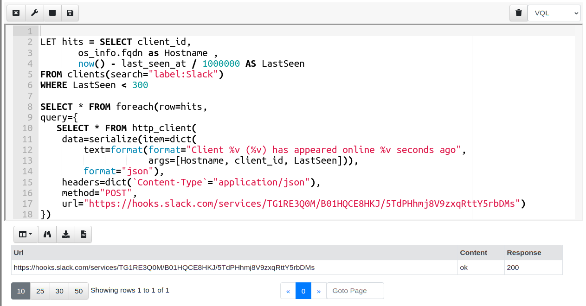
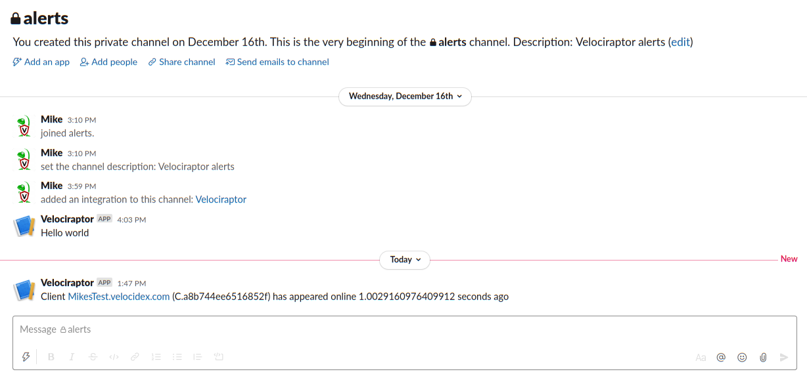
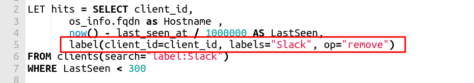

 on [Unsplash](https://unsplash.com?utm_source=medium&utm_medium=referral)](https://cdn-images-1.medium.com/max/12030/0*bkglpXK2FLycHuia?width=600px)*Photo by [Joan Gamell](https://unsplash.com/@gamell?utm_source=medium&utm_medium=referral) on [Unsplash](https://unsplash.com?utm_source=medium&utm_medium=referral)*

You might have heard of [Slack](https://slack.com/) — a chatting app that has grown in popularity over the past few years. Slack allows for API access to the the workspaces, which opens the door to novel applications and automation.

In this blog post I will demonstrate how to connect Slack to Velociraptor, and be notified within a Slack channel of various events that happen on your Velociraptor deployment.

### Creating a Slack App

The first thing I will do is create a Slack channel to receives messages from Velociraptor. This keeps Velociraptor messages separate and I can subscribe a small number of users within my Slack workspace to that channel.

I will create a new channel called “alerts”

Next I will create an App which will communicate with the workspace and be able to post messages to the alerts channel. (This [reference ](https://api.slack.com/start/overview#creating)has a lot of details on this step, which I will just skip but you should consult it for your own use). First I visit the slack API page at [https://api.slack.com/apps](../../img/apps)

Next I will create an app called “Velociraptor” that will be able to push messages to my workspace.

Since I just want Velociraptor to inform me about events, it really only needs to push messages. I will therefore select the “Incoming Webhooks” app type.

Enable the webhook by sliding the option to on

Webhooks are simply HTTP REST APIs which can be used by any software to post to the channel providing they have a special secret called a “Token”. I can add a new webhook to my workspace on this page

I now allow the webhook to post to the alerts channel

Posting the message is a very simple HTTP request — Slack even shows an example using curl

The curl command line indicates that the request:

1. Needs to be using the POST method

1. Needs to have a content type of *application/json*

1. Needs to POST a JSON encoded object with a key called “text” which contains the message text.

### Posting a message from Velociraptor

Next I will test my new webhook by writing a quick VQL query in a Velociraptor notebook. I like to develop my VQL in a notebook, since that allows me to easily iterate over my query. Going to my Velociraptor console, I add a new notebook and add a VQL cell.

Here I am just replicating the curl command line above using VQL’s http_client plugin. Once I save the cell, Velociraptor will make an API request to the slack servers and my message will appear in the alerts channel.

### Alerting on events

Sending messages to Slack is pretty cool, but we really want to know when interesting stuff happens in response to events. One interesting use case that people always ask me about is to alert when a particular machine comes back online so it can be interactively investigated.

From a usability perspective, I want to tell the server to monitor a number of endpoints, and then when each comes back online, send a Slack message and stop monitoring that system.

Whenever I have a set of machines that we want to operate on, I think of client labels. In Velociraptor, we can attach any number of labels to a client, and then search for all machines that have the label efficiently (this effectively creates a group of machines).

I will add the label “Slack” to my test machine by simply selecting it in the client search page and clicking the “Add Label” button.

Going back to my notebook, I am ready to develop this VQL query step by step.

### Step 1: Is the client online now?

The first query I will write will return all the clients in the **“Slack”** label group, and show how many seconds ago they were online.

I am using the now() VQL function to return the number of seconds since the epoch. The client’s **last_seen_at** time is given as microseconds since the epoch so I quickly convert it to seconds.

I can quickly retrieve the clients in the **“Slack”** label group by using the clients() plugin and applying a search expression “label:Slack”. Note that searching the clients by label in this way is much more efficient since it uses the label index rather than a row scan over all clients.

### Step 2: Alert for recently seen clients

The next step is to send a Slack message for all clients which have been seen recently (say in the last 5 minutes).

I add a WHERE Condition to the previous query, then for each client, I re-use my earlier Slack query to post a message informing me which client is online.

### Step 3: Removing the client from the watchlist

Once I sent a slack alert for this client, I do not want to check it again. Let’s modify the above query to remove the label as well.

### Step 4: Creating a monitoring artifact

We previously saw how I can check for clients and send slack messages in the notebook. While this is fun and helps to develop VQL, in order to actually run this, we need to have the server monitoring for new clients all the time — in other words we need a Monitoring (Or Events) Artifact.

The previous query just ran once and stopped, but I really want to run it continuously every minute say. I do this by running the previous query periodically using the **clock()** plugin.

I go to the “View Artifacts” sidebar and then click the “Add an artifact” button.

The two main differences here are that this is a SERVER_EVENT artifact — i.e. it is running on the server continuously. I then use the clock() plugin to trigger the previous query to run every minute and scan for new clients coming online (line 27: **foreach** **clock** event, run the **send_message** query).

### Step 5: Install the artifact

To install the artifact on the server, I will go to the Server Monitoring screen, and add it in the search view by clicking the “update server monitoring table” toolbar button.

Now I can add the label to any client I am interested in and within a minute of it coming back online I will receive an alert in my slack channel

### Conclusions

In this post we saw how to make outbound REST API calls from the Velociraptor server using VQL. The example of Slack integration is a great use case for such an artifact, but there are many systems using HTTP style APIs (RESTfull or not) to be able to receive information from Velociraptor.

We saw how VQL can be written to run a continuous monitoring query on the server, checking for a condition that we are interested in. You could probably think of many examples of events that you will want to be notified of in a similar way (e.g. psexec used on any endpoint can be detected in near real time and escalated automatically to a Slack channel, or getting notified when a critical domain account is used anywhere on the network).

Escalating to Slack is suitable for fairly low frequency but high value events. If there are too many events, the channel will be too noisy and not useful (people will just mute it), so consider how frequently the alert will be fired, and how you intend to deal with it.

To play with this feature yourself, take[ Velociraptor for a spin](https://github.com/Velocidex/velociraptor)! It is a available on GitHub under an open source license. If you want to learn more about VQL and Velociraptor consider joining us on one of our [upcoming training sessions](https://www.velocidex.com/training/).

As always please file issues on the bug tracker or ask questions on our mailing list [velociraptor-discuss@googlegroups.com](mailto:velociraptor-discuss@googlegroups.com) . You can also chat with us directly on discord [https://www.velocidex.com/discord](https://www.velocidex.com/discord)
