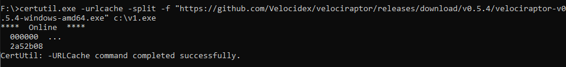
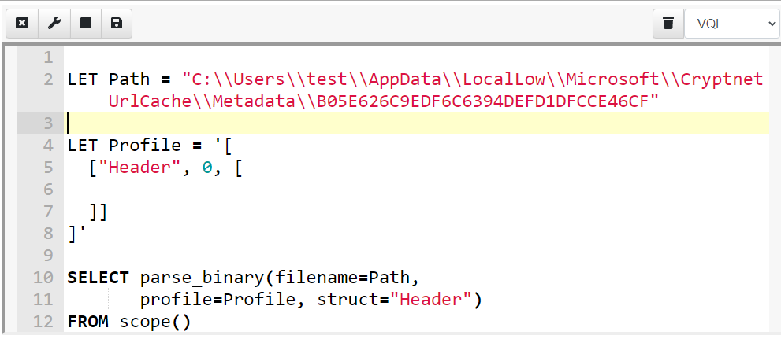
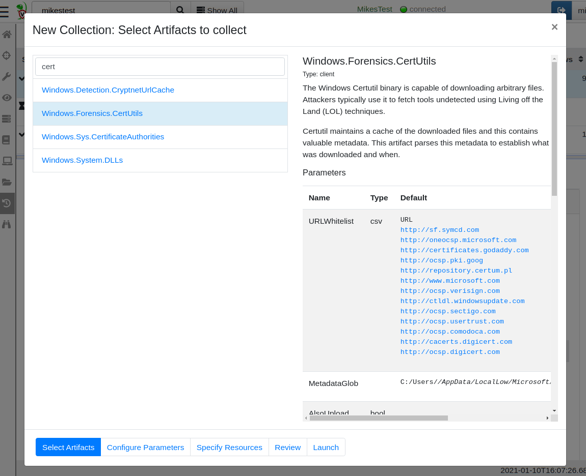

During the course of our DFIR work, we typically need to extract some
information from endpoints from various files and registry keys on the
system. Sometimes it is possible to extract the needed information
using text processing tools — such as a regular expression applied on
a configuration file.

In many cases however, the information we need is encoded inside a
binary file. A large part of DFIR analysis involves parsing binary
structures from files, registry keys and even event logs.

While it is always possible to write a dedicated parser for whatever
file format we are interested in, this leads to operational
complexities — if we download an adhoc parser for a particular file
format, how do we push new program or script to the endpoint? how to
ensure it has any dependencies (e.g. Python, .NET etc)?

The entire premise of VQL is that users should be able to rapidly
issue new queries to the endpoint, in a consistent and easy to learn
way. Wouldn’t it be great if users can parse binary files directly in
VQL without needing to use external programs?

As of Velociraptor 0.5.5, VQL contains a powerful new built in binary
parser. This post introduces the new parser and shows a practical
example of using it to develop a powerful Velociraptor artifact.

### Binary parsing overview.

Binary files store information for machine consumption — this is termed serialization. Ultimately serialization is a way to represent data as binary digits by encoding integers, structs and other concepts into a binary representation.

While it is certainly possible to write parsers that procedurally unpack various bits of data from the file, these are typically hard to maintain and understand. It is better to visualize what the data actually means and how it is laid onto the file. Therefore we want to write parsers in a descriptive way rather than procedural — Ideally we want the parser to be easy to understand and maintain.

Velociraptor’s binary parser has taken inspiration from other great parsers, such as Volatility and Rekall’s Vtype system (with some syntax simplification).

The best way to introduce the new parser is with an example so I will jump straight in!

### `Certutil` metadata parsing

The `certutil` program is a native, built in Windows tool used to download certificate information. It is a commonly used [Lolbin](https://lolbas-project.github.io/lolbas/Binaries/Certutil/), with attackers misusing the tool to download malicious code to compromised endpoints (see [Att&ck S0160](https://attack.mitre.org/software/S0160/)).

I was reading an excellent blog post recently titled [`Certutil` Artifacts Analysis](https://u0041.co/blog/post/3) where `Aalfaifi` analyses the forensic evidence left behind by `certutil`. Let’s write a parser for this!

We start off by using `certutil` in a malicious way — rather than downloading certificate revocation lists we will download an executable to the system for testing.

The `certutil` tool will download our executable and create a metadata file containing some very interesting data but what does it mean?

Luckily `Aalfaifi` has done the sleuthing work and their excellent article covers the details. I will interactively develop my VQL parser using the Velociraptor notebook. I first add a new notebook then add a VQL cell to it. I can now write and evaluate free form VQL.

Let’s begin by just hard coding the path to the metadata file I created. I will also define a profile and an initial struct called Header.

### What is a profile?

A profile is a data driven template that describes how the data is overlaid onto the binary file. Velociraptor uses the profile to drive the parser but the profile is also meant for human consumption — it simply describes all the structs and their fields, sizes etc. Profiles are designed to be succinct and quick to write but also easy to read and understand.

The basic structure of a profile is a JSON encoded data structure:

* The Profile contains a list of struct definitions

* Each struct definition is a list of **[name, size, list of field definitions]**

* Each field definition is a list of** [name, offset, type, options]**

I will start to define the Header struct with the following fields (offsets and fields taken from the Blog post above)

* UrlSize is a 32 bit integer laid at offset 12

* HashSize is a 32 bit integer laid at offset 100

* DownloadTime is a 64 bit timestamp at offset 16

You can see the profile and the resulting object in the screenshot below. Velociraptor calls the parse_binary() VQL function which opens the file and parses the struct **Header** at offset 0.

### Dynamic properties

So far things are simple — we specified the offsets and types of each field and Velociraptor just parsed them. However, now we want to extract the URL. According to the Blog post the URL starts at offset 116 and has a length specified by the UrlSize field. It is then followed by the hash with a length specified by the HashSize field.

Because the offsets and sizes are not known in advance (URLs have different lengths), we need to define the profile dynamically. The profile will accept a **VQL lambda** function in many places. The lambda function receives the partially parsed struct and can use it to derive other values dynamically at runtime.

We can specify the URL as being a **String** type with a length determined dynamically by the **x.UrlSize** field. Similarly we can declare the offset of the Hash field as the lambda **x=>x.UrlSize + 116**

### Putting it all together

This was easy! We now know the url the `certutil` tool downloaded
from, the hash and the timestamp — all are critical in a DFIR
investigation to distinguish the legitimate use of `certutil` from
malicious.

While the above VQL only parsed a single hard coded metadata file, in practice we want to search for all metadata files from all users and parse them in a single collection.

You can see the full artifact here [https://github.com/Velocidex/velociraptor/blob/master/artifacts/definitions/Windows/Forensics/CertUtil.yaml](https://github.com/Velocidex/velociraptor/blob/master/artifacts/definitions/Windows/Forensics/CertUtil.yaml) including extra functionality like filtering out whitelisted domains, and an option to also fetch the downloaded file from the **CryptUrlCache**

### Collecting the new **artifact**

I will now collect the artifact from my endpoint. Using the GUI, I click the **add new collection** button, then search for my **Windows.Forensics.CertUtil **artifact.

Now I can configure the whitelist and possibly also choose to download the cached files.

The files are parsed on the endpoint and we see the relevant information in seconds

Doing a hunt across all my endpoints will now tell me if `certutil` was ever used to download a suspicious tool, from where, and potentially uploading the tool itself in the **CryptUrlCache**.

### Conclusions

Although this was a simple example, the binary parser is extremely capable. Some other examples include **Windows.System.Powershell.ModuleAnalysisCache** (parses the powershell module analysis cache) and **Windows.Forensic.Lnk **(Parse link files) and many more.

Being able to go from reading an analysis in a blog post to running a hunt across your entire network in a matter of minutes is a truly powerful capability, allowing our DFIR team to be proactive and innovative. Having a powerful binary parser in your toolbox is a real bonus making many types of hunts possible.

If you are interested in learning more about Velociraptor, check out our hands on training courses on [https://www.velocidex.com/training/](https://www.velocidex.com/training/) or join us on discord [https://www.velocidex.com/discord](https://www.velocidex.com/discord).
