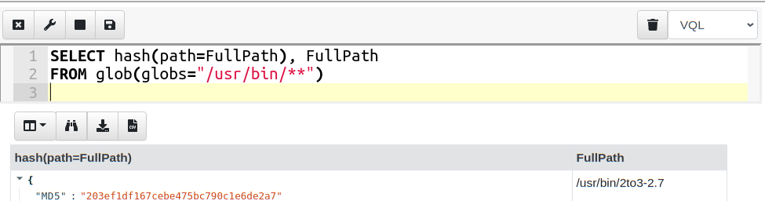
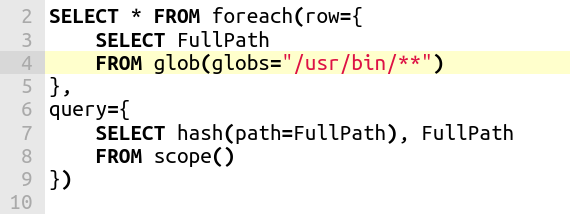

Velociraptor’s special source is really the Velociraptor Query Language (VQL). Using VQL allows administrators to query their endpoints and respond to new threats quickly and flexibly.

VQL was always intended to be a simple query language which users could pick up in a matter of hours, while being powerful at the same time. We never intended VQL to be a full blown programming language. Nevertheless, performance is a critical feature of VQL, simply because queries typically need to process large amount of data quickly. The challenge is how to expose powerful multithreaded programming concepts to VQL’s simple model of operation.

In this blog post we explore one of the new performance features that allow users to harness the full processing power of their platform.

### Simple example: hash every file

Let’s consider a simple use case — hash every file on the system. I wrote a simple query to simply glob recursively through the filesystem, and for each file found calculate its hash.

To test this query I ran it in a notebook within the Velociraptor GUI.

This query is simple to understand, and fits the mental model of VQL: The glob() plugin searches the filesystem for files matching the glob expression (wildcards) and emits a single row per matched file. The query then processes each of these rows and passes the path to the hash() function which returns the hash.

When I ran the above query on my system, I kept an eye on my CPU activity monitor applet and I could see a single core spiking, but most of my other cores were idle (This is a 24 core machine).

After a while, the query completes and I get the results (There were 4700 files hashed) and it took 46 second overall.

While this is satisfactory, I was a bit worried about my idle cores . This simple query was unable to fully utilize the processing capacity of my machine because the query was essentially sequential — each row was hashed in turn, before hashing the next row.

In this case, 46 seconds is not too bad, but if I wanted to hash the entire hard disk (as opposed to the **/usr/bin** directory) it could take a very long time.

### Run the hash in parallel

My query receives its file names from the glob() plugin which is very fast — clearly the performance blockage in my query is the **hash** function which is CPU intensive. I would therefore love to have a hash operation sent to each core in parallel, then all my cores will be recruited and the query will run faster.

Since Velociraptor 0.5.5, the foreach() plugin has an additional “workers” parameter. Readers who use Velociraptor extensively are familiar with the foreach() plugin, as it is probably the most common plugin in use. We also covered it in detail in an earlier blog post, [here](https://medium.com/velociraptor-ir/the-velociraptor-query-language-pt-2-fe92bb7aa150).

In a nutshell, the foreach() plugin takes 2 parameters. The “row” parameter is another query which will be run, taking each row produced by it. The “query” parameter is another query which will be evaluated with a nested scope containing the row obtained (Conceptually, the foreach plugin acts in a similar way to the SQL JOIN operator).

For example the above query can be refactored to

The “row” query simply calls the glob() plugin and extracts the FullPath of each file matching the wildcards. The foreach() plugin will take that row and evaluate the query on the scope (therefore evaluating the hash() function).

This still does not buy us very much because each row is still processed in sequence one after the other.

In 0.5.5 the foreach() plugin has the “workers” parameter: This allows the plugin to create workers in a pool, and send them each row in parallel. While the “row” query is still evaluated sequentially, the “query” query will now be evaluated on a worker pool in a separate thread.

This time when I run the query, my CPU load applet lights up — all cores are busy!

The same query now takes 6 seconds instead of 46 seconds! A factor of 8 times faster.

This query was particularly suitable for parallelization because the CPU intensive operation was done on each row (hashing) but generating the rows themselves is very quick (globbing).

### Other use cases

In 0.5.5, Velociraptor’s offline collector now uses the above technique to upload multiple files simultaneously into the collection Zip file. Coupled with a multithreaded Zip writer implementation this allows parallel compression of many files at once — speeding up acquisition on most machines. The below screenshot shows the collector making good use of CPU resources during acquisition with a significant speed up.

### Thoughts about design

Many users when they first are introduced to VQL ask me about the “query optimizer/planner”. I guess this is because VQL is very similar to SQL in syntax. However, VQL does not have any query rewriting behind the scenes — with VQL what you write is what you get!

I feel that having some magic box rewrite your query behind your back is suboptimal — people have to constantly run “explain” to try to figure out what the optimizer/planner is going to do to their query and then try to rewrite their query in non-obvious ways to provide hints to the optimizer to get it to do what they actually wanted it to do. This adds complexity to the language and makes it more difficult to use.

In VQL, if you wanted more performance, you can do it by structuring your query — Velociraptor is not going to second guess what you wanted to do.

Additionally, extra performance may not always be what you want. If my goal was to hash the entire filesystem on an endpoint, I typically do not want the endpoint to use all its resources, because this may negatively impact the end user. For a machine with many cores, having a single core hash every file for a few hours is much less impactful or noticeable than all cores saturating, even for a short time.

For these reasons parallelism in VQL is opt in — users have to structure their query to take advantage of it. The language remains simple and easy to use with a predictable model for how it works.

To play with this feature yourself, take[ Velociraptor for a spin](https://github.com/Velocidex/velociraptor)! It is a available on GitHub under an open source license. As always please file issues on the bug tracker or ask questions on our mailing list [velociraptor-discuss@googlegroups.com](mailto:velociraptor-discuss@googlegroups.com) . You can also chat with us directly on discord [https://www.velocidex.com/discord](https://www.velocidex.com/discord)

If you want to know more about Velociraptor, VQL and how to use it effectively to hunt across the enterprise, consider enrolling for the next available training course at [https://www.velocidex.com/training/](https://www.velocidex.com/training/).
