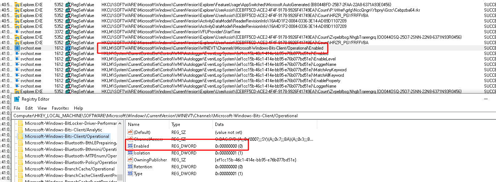
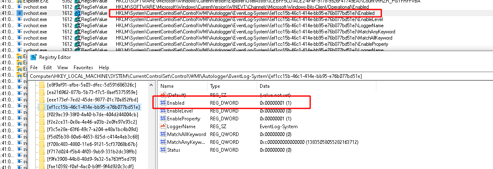

### Detecting malicious activity with Velociraptor

 on [Unsplash](https://unsplash.com?utm_source=medium&utm_medium=referral)](https://cdn-images-1.medium.com/max/11520/0*8Z6QxIV2lCx4PYPT)*Photo by [Jonny Caspari](https://unsplash.com/@jonnysplsh?utm_source=medium&utm_medium=referral) on [Unsplash](https://unsplash.com?utm_source=medium&utm_medium=referral)*

Windows information security techniques are heavily reliant on the availability and integrity of event logs. Many state of the art systems use event log forwarding to aggregate information from endpoints and detect malicious behavior across the enterprise.

But how reliable really are event logs? I was playing around with the Windows Event Viewer to understand how event logs can be interfered with in practice. We [previously covered](https://medium.com/velociraptor-ir/windows-event-logs-d8d8e615c9ca) the general structure of the Windows Event Log system, so you might want to have a quick read of [that post](https://medium.com/velociraptor-ir/windows-event-logs-d8d8e615c9ca) before you dive into this one.

### Example: BITS transfer

For this post I will use the example of a BITS transfer using bitsadmin.exe. BITS is a transfer service built into the Windows operating system, normally used to fetch windows (or application) updates. However, is it also commonly used by threat actors to deliver malicious payloads because BITS is typically trusted by endpoint tools (since it is a standard windows service). See [Mitre Att&ck T1197](https://attack.mitre.org/techniques/T1197/).

For this test I will use bitsadmin to download a page from the internet and store it on the filesystem. By default, the BITS service will generate several log messages in the log file `%SystemRoot%\System32\Winevt\Logs\Microsoft-Windows-Bits-Client%4Operational.evtx` as shown in the screenshot below

The command I will run fetches a file from the internet and stores it locally

```shell
bitsadmin.exe /transfer /download /priority foreground [https://www.google.com](https://www.google.com) c:\Users\test\test.ps1
```


Many tools rely on the presence of these eventlog messages to escalate an alert for this malicious activity.

While I was playing with this technique I noticed an interesting option in the Windows Event Viewer: `isabled Log` available by simply right clicking on the log file.


Sure enough when the log file is disabled, no events are recorded in the event log at all! Any solutions that rely on detecting event logs will be completely blinded by this setting!

### What does this setting do?

I wanted to know if I can detect when a log file was disabled on an endpoint. My working hypothesis was that this UI would change some registry keys and I know how to collect those!

I started up procmon and clicked the button to disable the log. After some applications of filtering I was able to narrow it down to the following value HKLM\SOFTWARE\Microsoft\Windows\CurrentVersion\WINEVT\Channels\Microsoft-Windows-Bits-Client/Operational\Enabled which is set to 0 for disabling the log file.



### Detecting this setting

Ok, great, I want to write a Velociraptor artifact to detect the state of log files. To develop the required VQL I will create a new notebook and simply write the VQL in it.


In this query we glob for all keys within the registry query above and extract the channel name (as the name of the subkey) and the Enabled valued. For the sake of simplicity I filtered the above to only examine the bits channels we are currently interested in.

### Other avenues

Running the above query shows all the channels (i.e. log files) that are disabled, but there are other ways to disable logging.

Lets look back at the procmon output above we see another interesting value is being set



What happens if we change this Enabled value to 0? Lets try this, and reboot…


This time logging is also disabled, but the log file is showing as enabled!

This second registry key disables the provider itself, while the previous method disables the channel (log file). The GUID in the registry key corresponds to the provider name. As described in our previous article the provider name can be derived from the registry key `HKEY_LOCAL_MACHINE\SOFTWARE\Microsoft\Windows\CurrentVersion\WINEVT\Publishers\` which can be used to resolve the GUI to a name


Let’s write some VQL to display the Enabled status of the BITS provider.


This VQL also resolves the GUID to a provider name via the `HKEY_LOCAL_MACHINE\SOFTWARE\Microsoft\Windows\CurrentVersion\WINEVT\Publishers\` key as well as showing the modification time of the registry key in question.


### Converting to an artifact

Armed with the above VQL queries, we can now write an artifact that collects this information from the endpoint. I also added some potential filters to make my artifact more targeted for hunting. You can see the full source of the `Windows.EventLogs.Modifications` artifact [here](https://github.com/Velocidex/velociraptor/blob/master/artifacts/definitions/Windows/EventLogs/Modifications.yaml).


Let’s see all the logs that were disabled or enabled in the past day


Within 2 seconds we see that the BITS admin channel was manipulated within the previous day


And the provider was also disabled very recently.


Next stop is to perform a hunt across my enterprise and look for recently modified channel settings, as well as stacking across my endpoints to see which log channels are disabled on few machines but are generally supposed to be enabled.


In the above screenshot I ran a hunt on about 100 endpoints which have the default enabled logs, and a single endpoint with that log disabled. The stacking operation (GROUP BY) immediately reveals the outliers.

### Conclusions

This was a fun little exercise in trying to understand event logging in Windows. Adversaries often just disable logs during the period of their activities, so solutions completely dependent on log files are very vulnerable to these techniques.

Velociraptor’s power is in being able to quickly and easily recover forensic evidence on activity on the endpoint. In most environments disabling log file or providers is not a legitimately common, so hunting for such activity produces high value signals and leads to a better understanding of how attackers are able to hide their tracks.

The above example is just one of the exercises we do in our hands on Velociraptor courses. If you are interested in learning more about Velociraptor, check out our hands on training courses on [https://www.velocidex.com/training/](https://www.velocidex.com/training/) or join us on discord [https://www.velocidex.com/discord](https://www.velocidex.com/discord).

### P.S.

You can automate event log enable/disable using the following powershell

```powershell
$logName = ‘Microsoft-Windows-DNS-Client/Operational’
$log = New-Object System.Diagnostics.Eventing.Reader.EventLogConfiguration $logName
$log.IsEnabled=$true
$log.SaveChanges()
```
