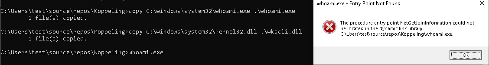
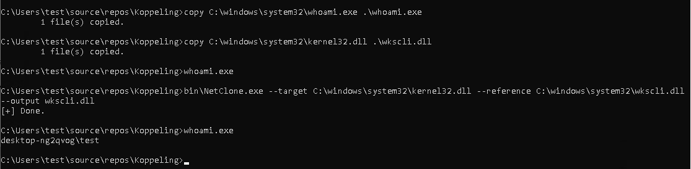

One of my favorite pastime is reading Twitter and following other security researchers. I love being able to see a new tool or technique and develop an understanding and detections for it. A while back, I was reading my feed and saw an excellent article titled [I Like to Move It: Windows Lateral Movement Part 3: DLL Hijacking](https://www.mdsec.co.uk/2020/10/i-live-to-move-it-windows-lateral-movement-part-3-dll-hijacking/).

The article describes an interesting form of lateral movement — DLL Hijacking. DLL Hijacking is an abuse of the Windows DLL search order resolution process. Typically, when an executable is started, the executable will declare dependent DLLs in its import table. Windows will search for these DLLs in a number of paths, until a suitable DLL is found, and its exported symbols will be resolved into the new image. DLL Hijacking works by placing a malicious DLL, with the same name as a legitimate DLL, in a directory that is searched earlier, thereby tricking the loader into loading the malicious DLL instead of the legitimate one.

DLL Hijacking is often used for persistence — simply place a malicious DLL earlier in the search path, and programs that are started (potentially with higher privileges) will load the malicious DLL, thereby granting execution.

In the above article an interesting approach is described to escalate privileges or laterally move to a remote system — simply write a malicious DLL using e.g. SMB on the target machine, and wait until a user or process on the remote machine runs the vulnerable program.

Actually getting DLL hijacking to work successfully is [quite tricky](https://silentbreaksecurity.com/adaptive-dll-hijacking/). The details are described well by Nick Landers in [Adaptive DLL Hijacking](https://silentbreaksecurity.com/adaptive-dll-hijacking/) which presents a number of approaches.

One of the simplest technique, is to simply create a DLL with a bunch of forwarded functions. Normally a DLL contains an *Export Table*, listing all the functions it exports. However sometimes, the need arises to legitimately forward an export that would normally be found in one DLL to another DLL (e.g. in the case where a DLL was refactored this allows replacing the dll without rebuilding programs that depend on it).

In this case, the export table contains a forward entry — i.e. it forwards the loader into another DLL. Nick Landers published a tool to help build such a dll [https://github.com/monoxgas/Koppeling](https://github.com/monoxgas/Koppeling)

### Example Injection

I will use the Koppeling tool above to build a simple DLL forwarder as per the example in the repository.





### Parsing the DLL

Velociraptor has a function that allows parsing a PE file, lets see what information is available — Simply use parse_pe() on the injection file.


We see that although the file is called **wkscli.dll** it really is **kernel32.dll** (since we have modified its exports to forward to the original wkscli.dll residing in C:\Windows\System32).

While it is normal for a dll to forward to another dll, it is very unusual for a dll to forward to **another dll of the same name**. So I think a strong signal for a potentially hijack dll is one that contains forwards to another dll with the same base name.

As usual I created a Velociraptor notebook and developed the VQL within it. The full query I entered in the notebook cell is shown below:

```vql
LET Glob = '''C:\windows\**\*.dll'''

-- Apply the glob to search for matching DLLs.
LET DLLs = SELECT FullPath, Name, parse_pe(file=FullPath).Forwards AS Forwards,
     lowcase(string=parse_string_with_regex(regex="^(?P<BareName>[^.]+)", string=Name).BareName) AS DLLBareName
FROM glob(globs=Glob)
WHERE NOT FullPath =~ "(WinSXS|Servicing)"

-- For each DLL, extract the forward strings.
SELECT * FROM foreach(row=DLLs, workers=20,
query={
  -- For each forwarded export, split the string into
  -- a DLL path and export name
  SELECT FullPath AS DllPath, ForwardedImport,
         Parse.DllPath AS DllImportPath,
         Parse.Export AS DLLExportFunc,
         DLLBareName,
         basename(path=lowcase(string=Parse.DllPath)) AS ExportDLLName
  FROM foreach(row=Forwards,
  query={
      SELECT parse_string_with_regex(
          regex="(?P<DllPath>.+)\\.(?P<Export>[^.]+$)", string=_value) AS Parse,
          _value AS ForwardedImport
      FROM scope()
  })
  -- Only select forwarded functions that forward to the same dll name.
  WHERE ExportDLLName = DLLBareName
})
```

1. First I search for all DLL files in the provided glob (excluding **winsxs** and **servicing** directory). I also lowercase the name of the dll and strip the extension.

1. For each DLL I parse out the forwarded functions and use a regular expression to split the string into a target DLL and an exported function.

1. I then filter all rows to show only those with the target DLL the same as the name of the dll itself.

### Testing the VQL

I copied the hijack DLL I created with [Koppeling](https://github.com/monoxgas/Koppeling) into the Windows directory. I then created an artifact and collected it on my VM. I chose to recursively scan all dlls in the windows directory to get an idea of the performance impact.


Velociraptor reports all forwarded functions that target a DLL with the same name as the one it is currently parsing. Velociraptor parsed about 9000 Dlls and took 62 seconds to find the one injection dll and one false positive (C:\Windows\SysWOW64\rpcrt4.dll).

### Conclusions.

This quick VQL is only suitable to detect one type of DLL hijack — one using forwarded functions. There are many other types of hijacking which might be more difficult to detect (more are discussed in the paper above). It is also possible to detect dll injection after the fact (by looking at loaded DLLs in process memory images), but this query is looking for “time bombs” — simply files that stay on the endpoint until a time in the future where they allow reinfection or escalation.

In this exercise we went from a blog post and a POC tool to a detection artifact in a short time, and were able to easily deploy and subsequently hunt for these.

The above example is just one of the exercises we do in our hands on Velociraptor courses. If you are interested in learning more about Velociraptor, check out our hands on training courses on [https://www.velocidex.com/training/](https://www.velocidex.com/training/) or check out the code on [GitHub](https://github.com/Velocidex/velociraptor). To chat, please join us on discord [https://www.velocidex.com/discord](https://www.velocidex.com/discord).
