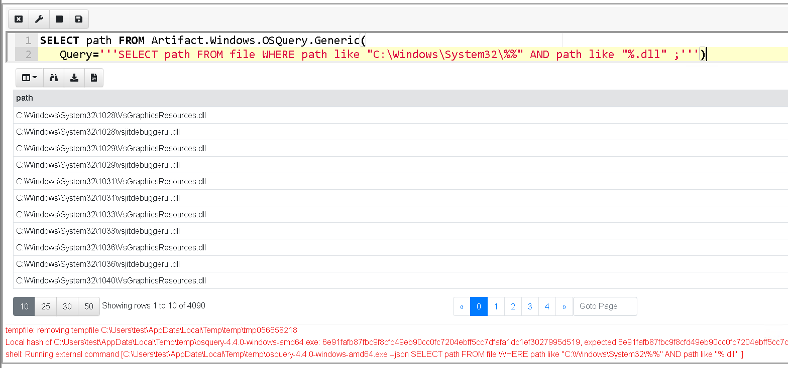
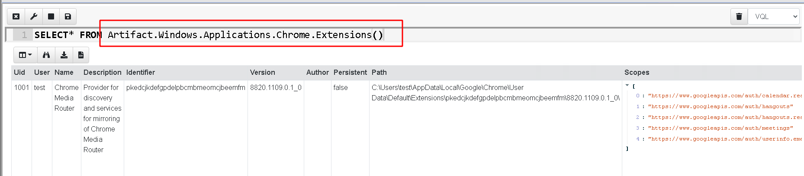
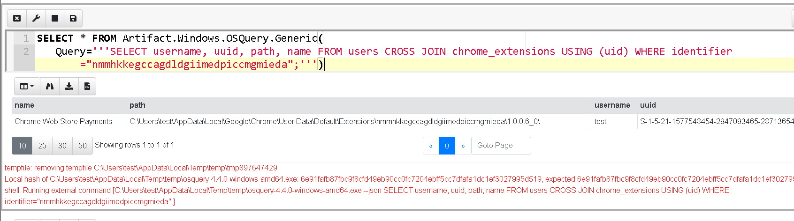
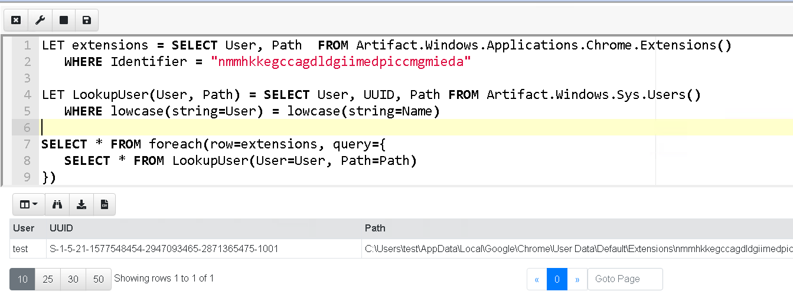

## Tips for the journey

[OSQuery](https://osquery.io/) has been around for a while now, and
was actually the initial inspiration for Velociraptor. Back in the
day, it became clear to me that the way to provide unprecedented
flexibility for endpoint visibility was to have a flexible and
powerful query language. OSQuery was historically a proof that a
powerful query language was the way forward, and VQL was designed to
improve on OSQuery and push the state of the art.

Many new Velociraptor users have existing OSQuery queries and
installations and are migrating to Velociraptor for powerful and
efficient endpoint visibility. I have written [previously about
Velociraptor’s OSQuery
integration](https://medium.com/velociraptor-ir/velociraptor-and-osquery-2a4306dd23c),
allowing OSQuery queries to run directly inside Velociraptor.

This integration, however, is simply a stopgap measure during
migration. It is much better to write VQL queries within Velociraptor,
since VQL is much more powerful and also much faster.

This post aims to help this migration by comparing typical OSQuery
queries with native VQL Velociraptor queries. This side by side
comparison hopefully sheds some light on VQL and will encourage you to
start writing new VQL artifacts.

This post does not compare the scalability, ease of deployment and
management GUI of OSQuery‘s various fleet implementations with
Velociraptor’s — we only look at the query language itself.

### The file table

One of the most often used OSQuery table is the file table. For example we can see information about a file:
```sql
SELECT * FROM file WHERE path = "C:\Windows\notepad.exe";
```

Because OSQuery uses SQL as its underlying implementation, there is no
way to tell the query that it is only interested in a single file (A
naive implementation would scan all files on disk and compare the path
by the condition eliminating all but one — a very expensive
approach!).

To avoid a full scan of the filesystem, OSQuery peeks at the WHERE
clause to figure out what it needs to do. It is therefore required
that a WHERE clause is provided and the path or directory be
restricted in some way.

Compare this to VQL. The main realization in VQL was that unlike in a
relational database, tables are implemented by code, the code must be
able to accept arguments. Therefore VQL’s syntax requires “tables” to
take arguments (in VQL these are termed plugins):

```sql
SELECT * FROM glob(globs="C:\\Windows\\notepad.exe")
```

The VQL equivalent to the file table is the glob() plugin, which
accepts a glob expression (i.e. wildcards) to search the filesystem
directly. (Note also that VQL does not use a semicolon `;` as a
statement separator — it is not needed, just string multiple
statements together).

So far both queries simply return a single row for a specific
file. OSQuery allows us to specify a wildcard for filenames as well,
however it uses the SQL **like** syntax. For example to return all
dlls in the system32 directory:

```sql
SELECT * FROM file WHERE path like "C:\Windows\system32\%.dll";
```

The equivalent VQL is
```sql
SELECT * FROM glob(globs="C:\\Windows\\System32\\*.dll")
```

You can test the VQL in the Velociraptor notebook right in the
GUI. Simply select **Notebooks** from the sidebar and add a new
notebook. Click on the top cell and add a new VQL cell where you can
write arbitrary queries.


You can also test OSQuery in the notebook cell by simply invoking the
`Windows.OSQuery.Generic()` artifact (In this case Velociraptor will
shell out to OSQuery and collect the results).


If you tried this you would immediately see a difference in
performance — the VQL example took less than a second to return 3384
rows while OSQuery took over 6 sec to return the same data. While 6
seconds is not too bad, this gets worse when we try to fetch more dlls
from the disk…

In VQL we can use `**` to denote recursive glob wildcard. This time
the query took 2 seconds and returned 4090 rows.


OSQuery uses `%%` for the same purpose. However OSQuery only allows a
recursive wildcard at the end of a LIKE string (see discussion
[here](https://blog.kolide.com/the-file-table-in-osquery-is-amazing-99db0f52a066)),
so we need to break up the condition into a more complex query with
two conditions.



This time OSQuery takes 52 seconds to return the same number of
rows. If you keep an eye on the task manager you would also see an
increasing memory footprint for OSQuery because it queues up all rows
in memory before returning them, so the more rows it returns the more
memory it uses. If we now increase the size of the glob, to return all
dlls on the system the query times out without returning any data at
all!


The timeout is imposed by Velociraptor’s OSQuery integration. This is
another interesting difference between OSQuery and VQL — VQL has
active query cancellation, and a timeout after which the query is
cancelled (In this case the VQL that shells out to OSQuery has timed
out and actively killed the OSQuery process after 10 minutes).

This makes running larger queries much safer as it provides an upper
bound on the amount of resources taken on the endpoint. Once this
bound is exceeded, the query is terminated.

Running a similar query with Velociraptor is much faster returning 64k
rows in 66 seconds.


Performance issues in the OSQuery file table have been discussed
previously (see
[https://blog.kolide.com/the-file-table-in-osquery-is-amazing-99db0f52a066](https://blog.kolide.com/the-file-table-in-osquery-is-amazing-99db0f52a066))
and the advice is to just be more targeted in your queries, however if
you need to know if a file exists anywhere on the disk then an
exhaustive search is necessary.

Although being targeted is helpful, With VQL we can confidently run
the exhaustive search because VQL has our back, in case our queries
are more expensive than expected. VQL is designed to deal with many
rows (e.g. the `Windows.NTFS.MFT` Artifact can return the entire
contents of the MFT which can be around 400–500k rows within a couple
minutes). VQL queries stream their results as soon as possible, so
Velociraptor can maintain a low memory footprint even for very large
result sets (typical memory footprint is 50–100mb).

**NOTE**: VQL does not use the `like` keyword as in SQL. Instead VQL
has the `=~` operator which means a regular expression match. SQL’s
`like` syntax is archaic and much less powerful than a simple
regular expression.

The following selects all user details for usernames matching “user” followed by a digit.
```sql
SELECT * FROM Artifact.Windows.Sys.Users() WHERE Name =~ "user[0–9]"
```

### Queries and Artifacts

One major difference between OSQuery and Velociraptor is that
Velociraptor does not usually directly run queries on
endpoints. Instead, a VQL query is wrapped in an “Artifact” — a
specially formatted YAML file which is stored within the Velociraptor
server. Artifacts make queries discoverable and allow for queries to
be shared with the community. Once an artifact is written, the user
does not need to worry about remembering or entering a query.

Artifacts can also be directly used within another VQL query. This
allows VQL to encapsulate a complex algorithm, but at the same time,
users can easily build on top of this.

In contrast OSQuery uses hard coded internal tables to provide a lot
of functionality requiring c++ coding to add a lot of simpler
functionality to the tool.

Let’s consider the OSQuery **chrome_extensions** table — this table
allows us to list all the chrome extensions installed by all users on
the system. The query simply extract all rows but the actual logic of
extracting and decoding the chrome extension data is hard coded inside
OSQuery.


On the other hand, Velociraptor’s
`Windows.Applications.Chrome.Extensions` artifact is written in pure
VQL (see [the source code
here](https://github.com/Velocidex/velociraptor/blob/master/artifacts/definitions/Windows/Applications/Chrome/Extensions.yaml)). You
can view the artifact in the GUI by selecting the “View Artifact”
screen from the sidebar. Note that artifacts can take parameters — in
this case the artifact allows the user to adjust where the chrome
extensions folder can be found.


You can just call another artifact seamlessly from VQL as if it was
just another plugin.



This feature encourages users to develop reusable VQL Artifacts that
can be put together like Lego bricks. Additionally, since artifacts
are just VQL queries it is possible to add new capabilities to the
tool with just a simple query — no need to write new tables in c++
like in OSQuery.

VQL provides very flexible primitives that can be much lower level
than OSQuery. For example, a binary parser is provided built into the
language, thereby allowing users to parse arbitrary files in their
queries. The additional flexibility means that even complex
functionality can be implemented entirely in VQL.

As a VQL query writer, seek to utilize one of the hundreds of built in
artifacts in your queries. There are many artifacts that are
functionally equivalent to OSQuery’s tables, but are written in VQL
(So you can just customize them as well). If you come up with
interesting artifacts, please share them with the community either by
sending us a pull request on GitHub or hosting the YAML yourself.

### Joins and foreach()

Many newcomers to VQL look for the familiar SQL constructs like
JOIN. However, VQL does not use joins at all, keeping the language
simpler. In my experience SQL joins are confusing and difficult for
people to really understand (quiz: what is the difference between a
left join, right join, cross join, inner join and outer join?).

Since VQL can provide parameters to plugins, we can create a plugin
which takes another query as a parameter. This is the fundamental idea
behind the foreach() plugin (I wrote about it[
previously](https://medium.com/velociraptor-ir/the-velociraptor-query-language-pt-2-fe92bb7aa150)). The
foreach plugin accepts the “rows” parameter and the “query”
parameter. It simply runs the “rows” query and for each row it
produces, the plugin evaluates the “query” query and emits the
results.

Let’s take a simple example: an OSQuery query designed to display
information about specific chrome extensions.



This OSQuery query joins the **users** table and the
**chrome_extension** table to fill information about the user

The equivalent VQL simply runs two queries — for each row emitted by
the **Windows.Applications.Chrome.Extensions** artifact that matches
the extension of interest, we iterate over all the users, and select
the user record of the user matching the relevant record so we can
display its UUID.


The VQL syntax is a lot of more readable without using a join
statement. VQL also supports stored queries (similar to stored
procedures) which take parameters and encourage query reuse.

A more refined query might use variables to store subqueries and then
simply call them:



### Conclusions

This post described some of the more obvious differences between
OSQuery and Velociraptor. To summarise

1. The OSQuery file table equivalent is the VQL glob() plugin. Glob
   takes a glob expression as a parameter. Glob expressions use * and
   ** as wildcard instead of % or %%.

1. VQL does not have a like operator, instead using the regular
   expression operator =~

1. The Glob plugin is much faster than the OSQuery file table and
   there are no restrictions on where a recursive wildcard goes.

1. VQL queries time out by default after 10 min so there is no danger
   of overrunning the endpoint. If you prefer low and slow approach it
   is possible to rate limit the VQL query as well as increase the
   timeout.

1. Artifacts are YAML files that encapsulate VQL queries. Velociraptor
   does not directly collect VQL queries on the endpoint — you need to
   create an artifact first.

1. If you previously reached for an OSQuery table that provides the
   data you need, simply look at existing VQL Artifacts that do the
   same. If there are none available, you can add your own
   **Artifacts** in a modular way in the GUI (without needing to
   rebuild clients or servers).

1. VQL does not use **join**, instead the foreach plugin provides the
   same functionality in a clearer way. Foreach also takes the
   **workers** parameter allowing it to run concurrently on multiple
   cores.

Users who are currently migrating from OSQuery can still reuse the
existing investment they have in OSQuery queries directly in
Velociraptor, but I hope this article convinced you that it is well
worth porting your existing queries to native Velociraptor VQL to take
advantage of the flexibility and performance enhancements that
Velociraptor offers.

The above example is just one of the exercises we do in our hands on
Velociraptor courses. If you are interested in learning more about
Velociraptor, check out our hands on training courses on
[https://www.velocidex.com/training/](https://www.velocidex.com/training/)
or check out the code on
[GitHub](https://github.com/Velocidex/velociraptor). To chat, please
join us on discord
[https://www.velocidex.com/discord](https://www.velocidex.com/discord).
