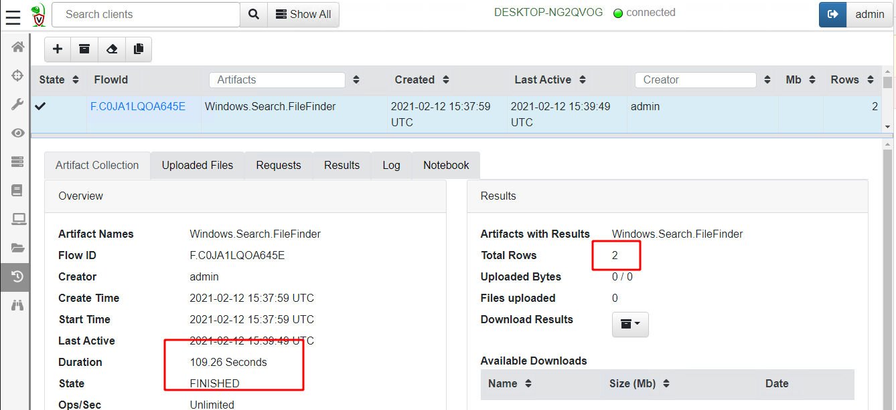
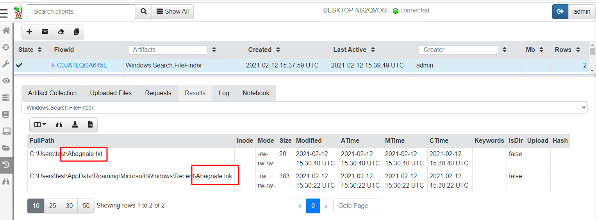
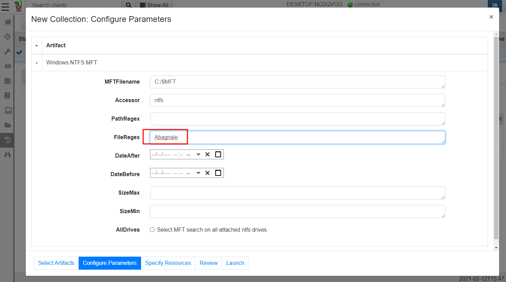

One of the most common questions in digital forensics is:

```text
Is a file with a specific filename currently present on this system or was it in the past?
```

There are many scenarios that lead to this question, from theft of IP by rogue employees, to drive by downloads from malicious websites or even victims of phishing emails. Often we need to scope this question to the entire network (Which machines had this file?) or potentially 10s of thousands endpoints.

This post recounts some of the techniques we can use within Velociraptor to answer this question. Most of these techniques should be very familiar to DFIR practitioners, but we will discuss how they are implemented in Velociraptor specifically.

For this post I will create a text file with a unique name Abagnale.txt and I will attempt to find it on my test system.


### Searching for files using Windows.Search.FileFinder

The first artifact we can use to search for files is the aptly named FileFinder artifact (There are variants for Linux/MacOS and Windows). I will simply add a new collection, search for the file finder and select the `Windows.Search.FileFinder`.


Next I will configure the artifact parameters.


The FileFinder artifact uses a glob expression to find files through the filesystem. A glob expression uses simple wildcards to match files by filename. In Velociraptor a `**` glob expression means recursively descend into subdirectories, so in our case the glob expression `C:\**\Abagnale*` will enumerate all files in the C: drive to locate the file of interest.



Globbing through all files took 109 seconds on my test VM and returned two hits (my original text file and a lnk file created by notepad itself):



### Scanning the Master File Table

On Windows, the NTFS filesystem is almost ubiquitous. NTFS uses a special hidden file called the $MFT to store all metadata on all files (such as their filenames, size, dates etc). Metadata is stored in the $MFT within MFT entries — fixed size data structures stored back to back in the $MFT file.

Therefore, by scanning the $MFT file and parsing all MFT entries, we are able to enumerate all files’ metadata on the disk.

Velociraptor offers an artifact called `Windows.NTFS.MFT` that will enumerate all entries within the $MFT filtering out only the relevant ones.


I will again proceed to configure the artifact parameters. This time I am able to filter the filename by a regular expression. I will just search for all files with filenames containing the word **Abagnale** .



Again this artifact found the same 2 files as the previous one


So how is the MFT search method different from the Glob method?

Parsing the MFT tends to be faster than using the APIs in a glob when searching over the entire disk (87 sec vs 109 sec), although if you know that the files can only be in a more confined part of the disk (e.g. inside the C:\Users directory) then the glob method is faster since it is looking at fewer files.

However, the MFT search may be able to detect deleted files. When a file is deleted in NTFS the MFT entry is marked as unallocated and can be reused at any time, but until it does, the old data structures are still present and will be parsed by the MFT parser.

Additionally the MFT parser has access to the **$FILENAME** stream’s timestamps and so can report those as well. Timestamps in the **$FILENAME** streams (Shown in the above results as Created0x30, LastModified0x30 etc) can not be altered by timestomping tools and so are more reliable indicators of when the file was created or modified.

### Searching the USN journal

While the previous two methods were great for detecting files that are currently present on the endpoint, what if the file was since deleted? I mentioned that the MFT parser may still find evidence of a deleted file in unallocated MFT entries, but this will only happen if the entry is not reused by the system for something else.

Luckily, Windows keeps another record of file operations in the NTFS USN journal. I wrote in details previously about [the USN journal](https://medium.com/velociraptor-ir/the-windows-usn-journal-f0c55c9010e) but for our purposes it is sufficient to know that file operations are continuously written by the system into a journal file internal to the NTFS filesystem (so it is not generally altered by adversaries).

Velociraptor contains a built-in parser for the USN journal which is made available via the `Windows.Forensics.Usn` artifact. I will select this artifact for collection as before


I now select “Configure Parameters” where I can specify a path regular expression.


This time the artifact returns 7 rows in 29 seconds


Let’s take a look at the rows returned from this query


Since the USN journal stores metadata about file operations, we see each time the file was interacted with by a program. This is not exactly the same as the previous results which just show the final state of the file.

For example, if the file was edited at one point in time and then edited again at a later time, the USN journal will show 2 separate interactions with the file, but the previous artifacts will only show the last modified time. This can be significant for some investigations, in particular if the file is deleted.

Typically we find the USN journal is kept for around 2–3 weeks by the system, providing excellent visibility of past activities.

### Hunting the entire network

Previously we collected the artifacts on a single host. However, in some investigations we need to determine if any machine in our network contains the file in question.

Velociraptor hunts are specifically designed to coordinate collections of the same artifact across the entire fleet. I will create a new hunt and give it a description, then proceed to select the `Windows.Forensics.Usn` artifact configuring its parameters as before.


Running the hunt over a small network returns results within minutes


While it may seem that a USN journal scan of an entire network is an expensive operation, in reality it places very little load on the server.

The server simply collects the result sets from running the VQL query across each endpoint in the deployment. Since these artifacts are highly targeted in returning only positive hits for the files in question the total number of rows returned is pretty small. In this hunt, most of the heavy lifting is done by the endpoints themselves — this is the secret for Velociraptor’s scalability!

### Conclusions

In this post we looked at some of the common ways to determine if a file was present on a system. Each method has advantages and disadvantages and this article explored when you should use one method over another. You can of course, just use all methods at the same time, and interpret their results accordingly.

All the described methods are very quick ranging from under 30 seconds for a USN journal scan, to a couple of minutes for a large glob operation. Using Velociraptor we can perform an exhaustive search of a large 10–20k endpoint deployment in minutes. This unprecedented agility and scalability is rather unique in an open source DFIR tool.

To play with these artifacts yourself, take[ Velociraptor for a spin](https://github.com/Velocidex/velociraptor)! It is a available on GitHub under an open source license. As always please file issues on the bug tracker or ask questions on our mailing list [velociraptor-discuss@googlegroups.com](mailto:velociraptor-discuss@googlegroups.com) . You can also chat with us directly on discord [https://www.velocidex.com/discord](https://www.velocidex.com/discord)

If you want to know more about Velociraptor, VQL and how to use it effectively to hunt across the enterprise, consider enrolling for the next available training course at [https://www.velocidex.com/training/](https://www.velocidex.com/training/).
