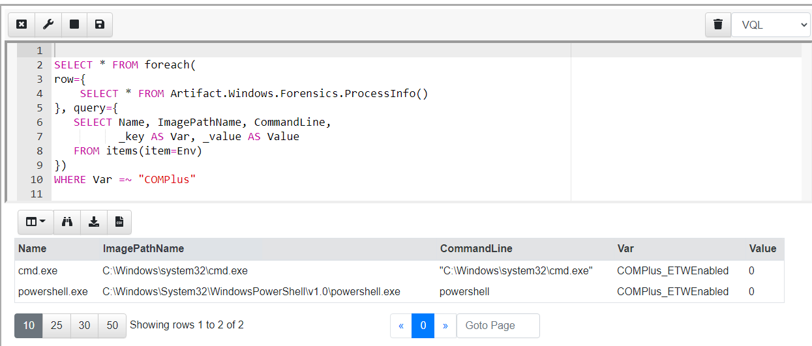

Unlike traditional dead disk forensic tools, Velociraptor’s main advantage is that it is capable of directly looking at volatile system state, such as running processes, open files and currently connected sockets. This class of forensic artifacts are called Volatile Artifacts since they change rapidly as the system operates — processes can start and stop quickly, files can be closed etc.

Traditionally, acquiring volatile artifacts meant taking a raw physical memory image, and then analyzing this with a memory analysis framework such as [Volatility](https://github.com/volatilityfoundation/volatility) or [Rekall](https://github.com/google/rekall). These frameworks reassemble the contents of physical memory into higher level abstractions, like processes, threads, registry content etc.

While at first it might appear that a physical memory image contains a perfect snapshot of the running state of a system, this is not typically the case. The physical memory image only contains those pages currently locked into physical memory — however, modern operating systems use virtual memory to represent process and kernel memory address spaces. Each virtual memory address may refer to either paged out memory (i.e. only present in the page file) or memory mapped files (i.e. only present on the file system in e.g. dll or executable files), neither of which are typically included in a physical memory image.

Additionally, most physical memory images obtained in a DFIR setting, contains acquisition smear (i.e. the memory is changing during the acquisition process). This smear leads to inconsistencies, making memory analysis from physical memory samples generally a hit or miss affair.

For DFIR purposes it is preferable to extract data directly from the running system, rather than rely on fragile memory analysis. For example, to obtain a list of processes, it is always more reliable to use the system APIs than to take a full memory image, ship it off the endpoint, and then use a framework like Volatility to extract the same data from the raw image.

Many of the same techniques implemented in Volatility for physical memory analysis can also be implemented directly on the endpoint using OS APIs. Velociraptor already contains plugins such as “vad”, “pslist”, “modules”, “handles”, “objtree” etc.

Consider the identification of malicious processes running in memory. Many modern tools use memory only injection, where malicious code is added to processes but is never written to disk. Detecting this type of malware requires inspection of process memory using for example a Yara signature.

For example, [Malpedia](https://malpedia.caad.fkie.fraunhofer.de/) contains Yara signatures for common malware families derived from automated identification of common code blocks. We can apply these signatures to detect memory injected [Cobalt Strike beacon](https://malpedia.caad.fkie.fraunhofer.de/details/win.cobalt_strike) by simply scanning each process address space and reporting any hits.

Velociraptor included bindings to libyara’s process scanning capabilities for a while now, exposed through the VQL plugin proc_yara() and usable through artifacts such as [Windows.Detection.ProcessMemory.CobaltStrike](https://github.com/Velocidex/velociraptor/blob/master/artifacts/definitions/Windows/Detection/ProcessMemory/CobaltStrike.yaml).

### Direct access to process memory

Since release 0.5.8, Velociraptor provides direct access to process memory via the “process” [accessor](https://www.velocidex.com/docs/user-interface/investigating_clients/virtual_filesystem/#filesystem-accessors). This allows any plugins and functions that normally operate on files to also operate on process memory, as if the process memory was just another file.

To demonstrate this new accessor, I will write “this is a test” in notepad without saving the file on disk (so the string exists only in memory). I will then write some VQL to detect this string in the process memory of notepad

In the above example, I am iterating over all processes with a name matching “notepad” and then applying a yara signature over their process address space. The “process” accessor allows me to open the process represented by the filename “/<pid>” as if it was a file. The `yara()` plugin (which normally operates on files) will just see process memory as another file to scan.

I can then also extract some context around the hits to see if the hit is a false positive.

### Determining process environment variables

When a process is launched it receives environment variables that often affect the way the launched program behaves. I was curious to see if it is possible to determine the environment variables that a process is launched with?

On windows, each process is started with a [Process Environment Block](https://docs.microsoft.com/en-us/windows/win32/api/winternl/ns-winternl-peb). This data structure is populated by the OS before the process is created and contains important information about the proces. Processes can extract this information at runtime. The process environment variables are stored in the PEB too and therefore we can parse these out from each process’s memory.

Velociraptor has a powerful binary parser built in, as was described previously in the post “[Parsing binary files](https://velociraptor.velocidex.com/parsing-binary-files-d31114a41f14)”. Having the process memory exposed via an accessor allows us to apply this parser to process memory via a VQL query.

If you are interested in the details, check out the VQL for the `Windows.Forensics.ProcessInfo` artifact [here](https://github.com/Velocidex/velociraptor/blob/master/artifacts/definitions/Windows/Forensics/ProcessInfo.yaml), but here is the result of collecting the process information (including each process’s environment variables) from my system

### Detecting ETW subversion.

Recently I read Adam Chester’s [blog post](https://blog.xpnsec.com/hiding-your-dotnet-complus-etwenabled/) where he described his finding that the .NET ETW provider can simply be disabled by setting the `COMPlus_ETWEnabled` environment variable to 0. This is dramatically demonstrated by using process hacker to inspect the .NET assemblies of a powershell process.

When the `COMPlus_ETWEnabled` environment variable is set to “0”, process hacker will be unable to inspect the loaded assemblies, since it relies on ETW support to do so and this is disabled within the running powershell process.

While this anti-detection technique is very simple for attackers to implement — they simply set an environment variable before launching the target binary, it should be very easy for us to detect it, using the following heuristics
> Iterate over all processes, and if any process has an environment variable starting with “COMPlus_” then it is suspicious.

Our VQL can take advantage of the existing `Windows.Forensics.ProcessInfo` artifact and simply inspect each process’s environment dictionary

In the above query we extract each process and its environment dictionary from the `Windows.Forensics.ProcessInfo` artifact, then iterate over each key and value using the *items()* plugin, filtering any keys beginning with “COMPlus”.

To convert this VQL into a detection, we now encapsulate the query in an artifact and hunt all our endpoints for processes that have the environment variable set. In practice, there should not be any legitimate reason to switch off the .NET ETW provider, so if we see this variable set in the environment, it is a very strong signal and requires further investigation.

### Conclusions

This post introduced the “process” accessor, which exposes process memory to all VQL plugins that can usually access files. The process accessor allows us to implement memory analysis techniques on running processes in real time, safely, quickly and reliably, without needing to resort to acquiring and analysing full physical memory images. This provides unprecedented visibility into the state of the endpoint and forms the basis for novel detection and hunting possibilities.

To use this feature yourself, take[ Velociraptor for a spin](https://github.com/Velocidex/velociraptor)! It is a available on GitHub under an open source license. As always please file issues on the bug tracker or ask questions on our mailing list [velociraptor-discuss@googlegroups.com](mailto:velociraptor-discuss@googlegroups.com) . You can also chat with us directly on discord [https://www.velocidex.com/discord](https://www.velocidex.com/discord)
