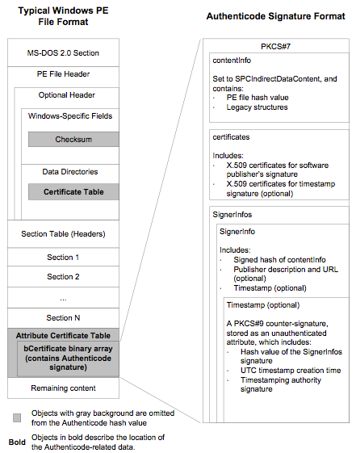
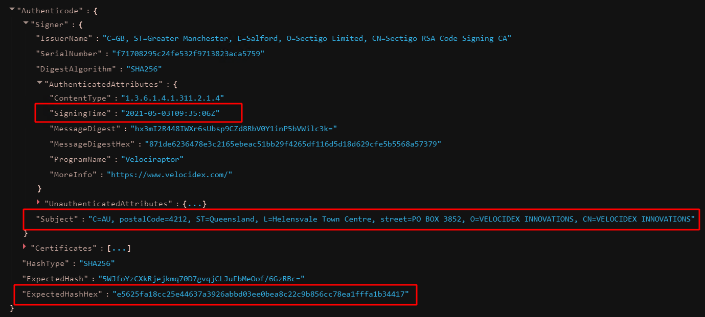
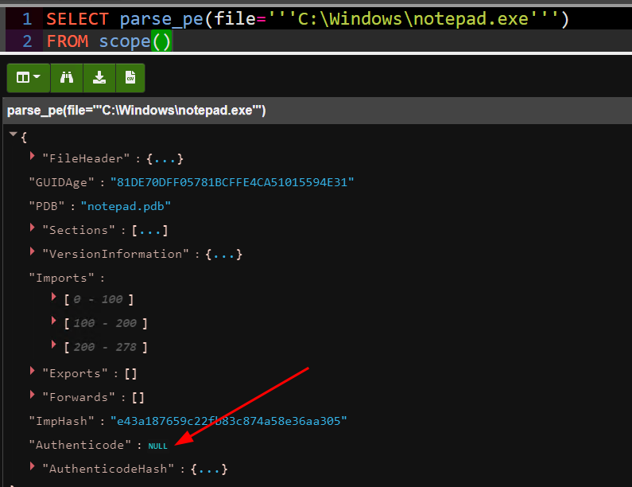

How do we know if a windows executable is a legitimate program written
by the purported developer and not malware? Users may run malicious
binaries with increasingly devastating consequences, including
compromise or ransomware.

To address this concern, Microsoft has introduced a standard called
Authenticode, designed to sign trusted binaries, so they can be
identified by the operating system. Additionally, recent versions of
Windows will refuse load unsigned device drivers, therefore
maintaining kernel integrity.

While the Authenticode standard itself is well documented, as DFIR
practitioners we need to understand how Authenticode works, and how we
can determine if an executable is trusted during our analysis.

This post explains the basics of Authenticode, and how Velociraptor can be used to extract Authenticode related information from remote systems. Since release 0.6.0, Velociraptor features an Authenticode parser allowing much deeper inspection of signed executables.

### Is a binary signed?

Windows users can easily determine if a binary is signed by simply looking at the Explorer GUI: Right click on the binary and select “Properties” and the “Digital Signatures” tab. This offers a “Details” options where users can view if the signature is ok, who the developer was that signed the executable and other details.

For example, let’s inspect the Velociraptor binary itself which is signed.


Obviously we can not use this method to verify thousands of binaries found on remote systems, so we need to understand how Authenticode is implemented under the covers.

Authenticode uses a number of file format standards to actually embed the signature information into the binary file itself, as illustrated in the [diagram below](http://download.microsoft.com/download/9/c/5/9c5b2167-8017-4bae-9fde-d599bac8184a/Authenticode_PE.docx):



The above diagram shows that signing information is embedded in the PE
file itself, and consists of a PKCS#7 structure, itself an `ASN.1`
encoded binary blob. The information contains a hash of the PE file,
and a list of certificates of verifying authorities.

Velociraptor can parse the authenticode information from the PE file
using the parse_pe() VQL function. This allows a VQL query to extract
signing information from any executable binary (Since this is just a
file parser and does not use native APIs, you can use this function on
all supported OSs).

Let’s parse Velociraptor’s own PE file in a Velociraptor notebook
using the following simple query:

```vql
SELECT parse_pe(file=’’’C:\Program Files\velociraptor\velociraptor.exe’’’)
FROM scope()
```



Among all the usual PE file properties, we can now also spot an Authenticode section, providing information about the subject who signed the binary, the signing time and an expected hash of the file.

### Authenticode hashes

As we can see in the above screenshot, the authenticode standard provides an expected hash within the signature. However this is not the same as a file hash. We can verify this by simply calculating the hash using the VQL hash() function.


None of the calculated hashes is the same as the “ExpectedHash” provided in the Authenticode signature! This is because Authenticode hashes do not cover the entire PE file, as regular hashes do. Authenticode hashes only cover specific PE sections, in a specific order. They specifically allow PE sections to be reordered, and some regions in the file to be modified.

{}
Many people find it surprising that signed PE files can be modified without invalidating the signature.
{}

This means that hash database detection commonly used in DFIR do not work to identify malicious signed binaries. I have demonstrated this recently in a [video](https://www.youtube.com/watch?v=dmmliSh91uQ) where I modified a vulnerable driver to change its file hash, maintaining it’s authenticode hash. This allowed the driver to be loaded, even through its file hash was completely different and not found on Virus Total.


Typically Authenticode hashes are not maintained by malware classifiers such as Virus Total so it is hard to verify if a file has been modified in this way.

### Catalog files

Armed with our new understanding of Authenticode, we may run VQL queries to collect all authenticode information from windows executables. One might be surprised then to discover that many native windows binaries do not contain any authenticode information at all.



The example above shows that notepad.exe, does not typically contain embedded signing information. Similarly, if one clicks on the the notepad.exe binary in the GUI no digital signature information is shown


Could Microsoft simply have forgotten to sign such an integral part of the OS as notepad.exe?

The answer turns out to be more interesting. When distributing a large
number of binaries, a developer has the option of signing a “catalog
file” instead of each individual binary. The catalog file is
essentially a list of authenticode hashes that are all
trusted. Catalog files are stored in
`C:\Windows\system32\CatRoot\{F750E6C3–38EE-11D1–85E5–00C04FC295EE}`

While .cat files are simply encoded in PKCS#7 format, they do contain a few Microsoft specific objects. Velociraptor can parse the PKCS#7 files directly and supports the extra extensions using the parse_pkcs7() VQL function.


As can be seen in the above query, the cat file consists of a signer, and a list of hashes. Typically no filenames will be given for the hash (although sometimes there will be a filename hint). It is only the hashes that are important in cat files — this allows files to be renamed, but still verified.

Again these hashes are authenticode hashes as before, so you can not compare them against our usual hash databases like Virus Total. You can calculate the authenticode hash of a PE File using the VQL: *parse_pe(file=FileName).AuthenticodeHash*

To verify that a PE file on disk is signed, one must:

1. Calculate the Authenticode PE hash of the file.

1. Enumerate all cat files on the system

1. Parse each cat file to extract the list of hashes

1. Check if any of these hashes match the one calculated in step 1.

This process is obviously too slow for the OS itself to use. To speed things up, Windows uses a shortcut: A database file exists on the system which simply contains all the trusted hashes directly. The database uses the Microsoft ESE format and is located in C:\Windows\System32\catroot2\*\catdb


The file is typically locked so you would need to use Velociraptor to collect it (Velociraptor will automatically parse the file out of the NTFS volume). The database contains tables mapping the hash to a cat file name and may contain hashes of old cat files that have been uninstalled from the system.

### Verifying Signed files

So far we have learned how authenticode stores hashes in the PE file and we can verify if the hash of the current file matches the hash within the signature information, but how can we trust that this hash is correct?

To really verify a signature, Windows must verify the trust chain by following the certificates to a trusted root certificate. Windows maintains a list of trusted certificates in a “Certificate Root Store” within the registry. There are several stores, a main one for the OS and each user also has a certificate store in their NTUSER.dat hive.

Velociraptor can inspect the certificate root store using the certificates() plugin. This plugin uses the Windows APIs to query the root store and report the trusted certificates. It is typically important to verify the trusted certificate root store since if a adversary adds a new certificate to the root store, their executables will be trusted by the OS.

For example, I added the Velociraptor CA (a self-signed CA cert) to the windows root store below. I can see now that Windows trusts this certificate


Where are the trusted certificates stored on the system? A quick registry search will show a set of keys and values for the trusted certificates within the windows registry


The values are undocumented binary data. Luckily, Didier Stevens has previously written about the format of these registry keys [here](https://blog.nviso.eu/2019/08/28/extracting-certificates-from-the-windows-registry/) explaining these are simple length encoded items.

We can use Velociraptor’s built in binary parser to automatically parse these keys. The details are in the [Windows.System.RootCAStore artifact](https://github.com/Velocidex/velociraptor/blob/master/artifacts/definitions/Windows/System/RootCAStore.yaml) but collecting it from the endpoint is easy


An added bonus of parsing the certificate directly from the registry keys is that now we have a registry key modification time to indicate when the certificate was installed into the root store. A quick VQL search to narrow down recently installed certificates can quickly zero in on malicious alterations and provide a timeline of compromise. Adding new certificates to a root store is not commonly done and even then they are likely to be done by a software update (so they should apply to most systems in the fleet). A hunt collecting this artifact and stacking by frequency can reveal compromises in minutes.


### Putting it all together

In this blog post we looked at how authenticode signing works on Windows. We found that authenticode signatures can be embedded within the PE file, but that is not the whole story. Sometimes signatures are applied to a catalog file which contains the hash of the PE file instead.

Ultimately we simply need to know if a particular binary file is trusted or not. Velociraptor’s authenticode() function was upgraded in the 0.6.0 release to support both methods of trust automatically. Simply apply it to the PE file and it will include the method of trust as well.


The above screenshot shows both our examples — The velociraptor binary was signed via embedded signature on the right and Notepad.exe was signed via catalog. In both cases Velociraptor is showing the signer and their issuers and if the file is trusted. We additionally get the catalog file that is used to verify the file if applicable.

If you would like to quickly verify your windows executables at scale, take[ Velociraptor for a spin](https://github.com/Velocidex/velociraptor)! It is available on GitHub under an open source license. As always please file issues on the bug tracker or ask questions on our mailing list [velociraptor-discuss@googlegroups.com](mailto:velociraptor-discuss@googlegroups.com) . You can also chat with us directly on discord [https://www.velocidex.com/discord](https://www.velocidex.com/discord)
