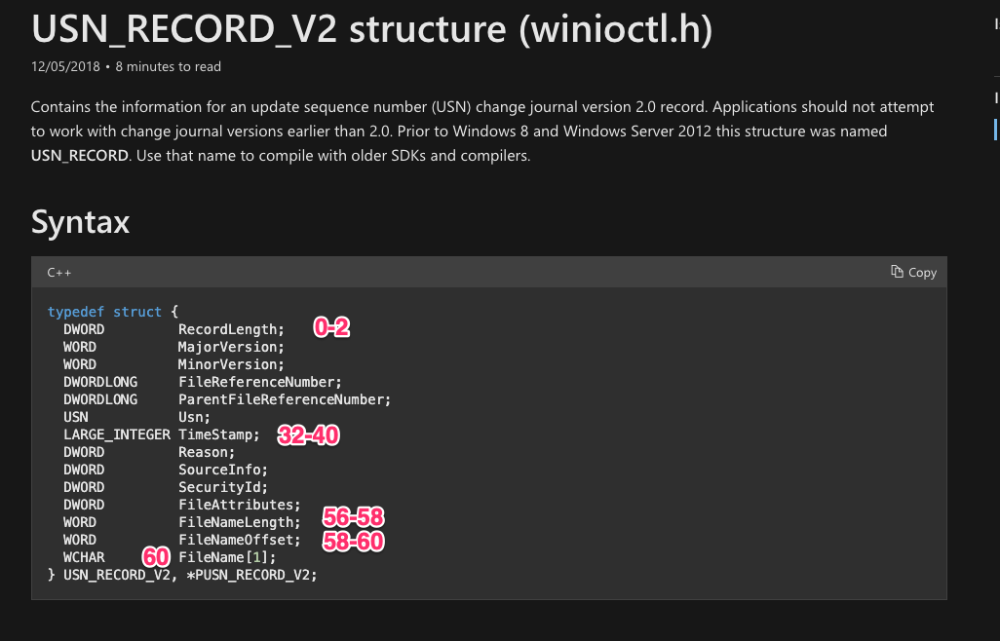
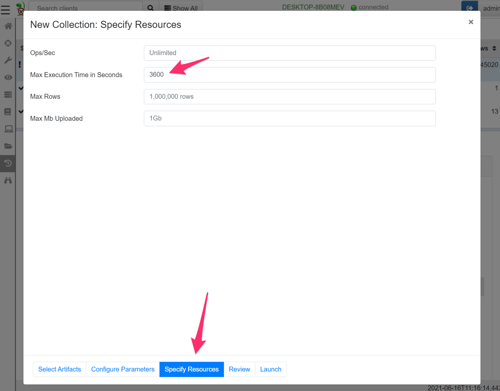

## Digging even deeper!

One of the most important tasks in DFIR is reconstructing past filesystem activity. This is useful for example, in determining when files were introduced into the system (e.g. in a phishing campaign or drive by downloads) or when binaries were executed by way of modifications of prefetch files.

I have previously written about the [Windows Update Sequence Number journal (USN)](https://velociraptor.velocidex.com/the-windows-usn-journal-f0c55c9010e). The USN journal is a file internal to the NTFS filesystem that maintains a log of interactions with the filesystem.

The USN journal is a unique source of evidence because it can provide a timeline for when files were deleted, even if the file itself is no longer found on the system. In the screenshot below I parse the USN journal using Velociraptor’s built in USN parser. I filter for all interactions with the **test.txt** file and find that it has been removed (The **FILE_DELETE** reason).

While the USN journal is very useful, it is short lived. The system keeps around 30mb worth of USN log, and older entries are removed by making the start of the file sparse. On a busy system this might result in less than a day’s worth of logs!

### Carving the USN journal

Carving is a very popular forensic technique that aims to uncover old items that might still be present in unstructured or unallocated data on the drive. One would resort to carving in order to uncover new leads.

Carving attempts to recover structured information from unstructured data by identifying data that follows a pattern typical for the information of interest.

In the case of the USN journal, we can examine the raw disk and extract data that looks like a USN journal record, without regard to parsing the record from the NTFS filesystem or using any structure on the disk.

{}

Disclaimer: Depending on the underlying hardware carving may or may
not be effective. For example, when running on an SSD, the hardware
will aggressively reclaim unallocated space, making it less
effective. We typically use carving techniques as a last resort or to
try to gather new clues so its worth a shot anyway.

{}

### The structure of a USN journal record

In order to carve the USN record from the disk, we need to understand what a USN record looks like. Our goal is to come up with a set of rules that identify a legitimate USN journal record with high probability.

Luckily the USN journal struct is well documented by Microsoft

In the above we can see that a USN record contains a number of fields,
and we can determine their offsets relative to the record. Let’s look
at what a typical USN record looks like. I will use Velociraptor to
fetch the USN journal from the endpoint and select the hex viewer to
see some of the data.

In the screen shot above I can identify a number of fields which seem
pretty reliable — I can develop a set of rules to determine if this is
a legitimate structure or just random noise.

1. The RecordLength field starts at offset 0 and occupies 4 bytes. A
   real USN journal must have a length between 60 bytes (the minimum
   size of the struct) and 512 bytes (most file names are not that
   large).

2. The MajorVersion and MinorVersion is always going to be the same —
   for Windows 10 this is currently 2 and 0. These 4 bytes have to be
   02 00 00 00

3. The next interesting field is the timestamp. This is a Windows
   FileTime format timestamp (so 64 bits). Timestamps make for a good
   rule because they typically need to be valid over a narrow range to
   make sense.

4. The filename is also stored in the record with the length and the
   offset both specified. For a reasonable file the length should be
   less than say 255 bytes. Since the filename itself follows the end
   of the struct, the filename offset should be exactly 60 bytes (0x36
   — the size of the struct).

Let’s take a look at the timestamp above. I will use [CyberChef ](https://gchq.github.io/CyberChef/#recipe=Windows_Filetime_to_UNIX_Timestamp%28'Seconds%20%28s%29','Hex%20%28little%20endian%29'%29From_UNIX_Timestamp%28'Seconds%20%28s%29'%29&input=MDRlY2VkZWE1ODYyZDcwMQ) to convert the hex to a readable timestamp.

What is the lowest time that is reasonable? The last byte (most
significant byte) should probably be 01, the next byte in should be
larger than `0xd0`. I can quickly check the earliest time that ends with
`0xd0` `0x01` using `CyberChef` — it is after 2015 so this is probably good
enough for any investigations run in 2021. Similar logic shows we are
good until 2028 with the pattern “d? 01”

### Developing the VQL query for the carver

A good carver is fast and accurate. Since we need to scan a huge amount of data in a reasonable time (most hard disks are larger than 100Gb), we need to quickly eliminate obviously invalid data.

The usual approach is to use a fast but rough matcher for a first level sieve — this will eliminate most of the obviously wrong data but might have a high false positive rate (i.e. might match invalid data that is not really a USN record at all).

We can then apply a more thorough check on the match using a more accurate parser to eliminate these false positives. If the false positive rate remains reasonably low, we wont waste too many CPU cycles eliminating them and will maintain a high carving velocity while still having high accuracy.

When I need a binary pattern matching engine, I immediately think of Yara — the Swiss army knife of binary searching! Let’s come up with a good Yara rule to identify USN journal entries. You can read more about Yara rule syntax [here](https://yara.readthedocs.io/en/stable/), but I will use a binary match rule to detect the byte pattern I am after.

As usual in Velociraptor, I will create a notebook and type a query into the cell. As a first step I will stop after one hit (LIMIT 1) and view some context around the hit. Accessing the raw disk using its device notation (**\\\\.\\C:**) and the NTFS driver provides access to the raw logical disk from Velociraptor versions after 0.6.0.

The rule will match a **RecordLength** smaller than 512 bytes,
**Version** must match 2. The timestamp field must end in D? 01
(i.e. `0xD0–0xDF` followed by `0x01`). Finally the filename length
must be smaller than 256 and the file offset must be exactly 60
(0x36).

As you can see above I immediately identify a hit and it looks pretty similar to one of the USN entries I extracted before.

### Parsing the USN record

The Yara signature will retrieve reasonable candidates for our carver. Now we need to parse the record properly. In order to do that I will use Velociraptor’s binary parser. First I will write a profile to describe the USN struct and apply the parser to extract the MFT entry ID from the record. I can then use Velociraptor’s built in NTFS parser to resolve the MFT entry ID to a full path on disk.

You can see the full details of the artifact [here](https://github.com/Velocidex/velociraptor/blob/master/artifacts/definitions/Windows/Carving/USN.yaml) but collecting this artifact from the endpoint is easy — simply create a new collection and select the Windows.Carving.USN artifact.

Since carving usually takes a long time, it is likely to exceed the default 10 minute collection timeout. For this artifact it is recommended to increase the timeout in the “Specify Resources” wizard pane (On my system, this artifact scans about 1Gb per minute so an hour will be enough for a 60Gb disk).

After a while the carver will produce a lot of interesting hits — some of which might be from a long time before what can normally be found in the USN journal (several months even!). If we are lucky we might see something from the timeframe of our incident.

We can post process the results to try to put a timeline on a compromise. For example, I will write a post processing query to find all prefetch files that were deleted (Deleting prefetch files is a common [anti-forensic technique](https://attack.mitre.org/techniques/T1070/004/)).

I can see two occasions where prefetch files were removed. I can see the timestamp based on the USN record, as well as the offset into the disk where the hit is found (around 3Gb into the drive).

Note that in the case of deleted files, the filename stored in the USN record may be completely different than the FullPath shown by the artifact. The FullPath is derived by parsing the NTFS filesystem using the MFT entry id referenced by the USN record.

For deleted files, the MFT entry may be quickly reused for an unrelated file. The only evidence left on the disk of our deleted prefetch file is in the USN journal, or indeed in USN record fragments we recovered once the journal rolls over.

### Conclusions

Carving is a useful technique to recover new investigative links or clues. Because carving does not rely on filesystem parsing it might recover older deleted records from a long time ago, or from previously formatted filesystem.

The flip side is that carving is not very reliable. It is hard to predict if any useful data will be found. Additionally, if the adversary wants to really confuse us they might plant data that happens to look like a USN record — without context we really can not be sure if this data represents a real find or an anti-forensic decoy. A common issue is finding hits in what ends up being Virtual Machine disk images that just happen to have been stored on the system at one time — so the hits do not even relate to the system we are investigating.

Take all findings with a grain of salt and corroborate findings with other techniques.

This article demonstrated the general methodology of writing an effective carver — use a fast scanner to extract hits quickly, despite a potentially higher false positive rate (using an engine such as Yara). Then use more thorough parsing techniques to eliminate the false positives and display the results (such as Velociraptor’s built in binary parser). Finally apply VQL conditions to surgically target findings to only relevant records to our investigation.

To play with this new feature yourself, take Velociraptor for a spin! It is available on [GitHub](https://github.com/Velocidex/velociraptor) under an open source license. As always please file issues on the bug tracker or ask questions on our mailing list [velociraptor-discuss@googlegroups.com](mailto:velociraptor-discuss@googlegroups.com) . You can also chat with us directly on discord [https://www.velocidex.com/discord](https://www.velocidex.com/discord)
