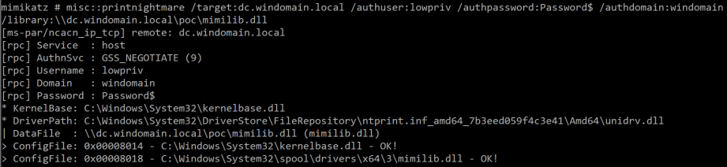

## Hunting a Zero day!
#### Matthew Green and Mike Cohen

Velociraptor is an advanced open source endpoint visibility framework
based on a flexible query language called
[VQL](https://docs.velociraptor.app/docs/vql/). What makes
Velociraptor unique from other endpoint tools is the flexibility to
develop new queries to address emerging threats.

This post walks through a common use case for Velociraptor’s VQL:
detecting exploitation of a new zero day (A newly announced
vulnerability without a patch available). Once a zero day has been
announced, time is of the essence! Defenders must scramble to
determine possible remediations and detect exploitation on their
network.

This is when Velociraptor’s quick and flexible approach shines: As
defenders we can develop a query to detect past exploitation of the
vulnerability, ensure hardening or patching has been applied to
prevent future exploitation. Additionally, Velociraptor provides a
mechanism for ongoing real-time monitoring using VQL queries,
therefore allowing us to use it for real time detection or future
attacks.

## Background

On the 29th of June a POC exploit for a critical vulnerability was
accidentally released by a researcher that targeted the Microsoft
Print Spooler service. The “PrintNightmare” vulnerability
(CVE-2021-[1675](https://msrc.microsoft.com/update-guide/vulnerability/CVE-2021-1675)/[34527](https://msrc.microsoft.com/update-guide/vulnerability/CVE-2021-34527) ), could be used to remotely compromise a Windows
system with SYSTEM privileges. While a patch was initially released
during the June 8 patch cycle, security researchers quickly discovered
it was incomplete and exploitation was still available on fully
patched windows hosts.

At this time, we wanted to rapidly develop a VQL query that would
indicate if any endpoint had been exploited through this vector. Our
first task was to learn more about the issue and particularly try to
understand what Digital Forensic artifacts were left behind on the
system after a successful exploitation attempt.

While many other researchers were focusing solely on windows event
logs, Velociraptor provides access to many more forensically
significant artifacts, because it is running on the endpoint. This
allows us to explore a richer and more accurate set of artifacts in
order to detect exploitation attempts.

## Exploitation

We will first begin by replicating the issue using a couple of the
open source POC exploits. For our testing we used the MimiKatz
PrintNightmare capability and a local privilege escalation powershell
POC available here.

An excellent walk through of the vulnerability can be found [here](https://www.kb.cert.org/vuls/id/383432) and
[here](https://www.rapid7.com/blog/post/2021/06/30/cve-2021-1675-printnightmare-patch-does-not-remediate-vulnerability/), but what does the exploit actually do?

1. Attackers connect to the Print Spooler Service by sending a request to add a printer using a windows API (AddPrinterDriverEx) over SMB, or RPC.

2. When installing a new “print driver” the attacker can configure several module paths and configuration inside pDriverContainer and these paths are copied to the print spool folder during installation.

3. Some of the POC variations copied files in slightly different ways but each ended up with an attacker controlled module being executed by the spoolsv.exe as a driver datafile, enabling the Remote Code Execution or Local Privilege Elevation.

We can use Procmon to see what files were modified on the system.

So a successful exploit results in the copying of a new dll into the
spool directory and the dll being loaded by the spoolsv.exe service
process.

### Detecting new files in the spool directory.

As a first iteration, let's use Velociraptor to recursively list all
the binaries in the spool/drivers directory. We can use the regular OS
APIs to list the directory, but in our case we will scan the entire
filesystem by parsing the NTFS internal structures (Analysis of the
NTFS may even reveal presently deleted files).

The above query parses the entire master file table (MFT) and returns
information about those files in the spool directory.

While the proof of concept malicious drivers are immediately
recognizable by name (mimilib.dll and nightmare.dll) we don't want to
rely on name alone since that is easily changed by a real
attacker. Let’s add to this query some more information about the
executable file itself, such as PE attributes (like export table,
import tables) hashes and specifically, if the file is signed or not
(i.e. its authenticode signature verification). An [example query](https://gist.github.com/scudette/e24c32528b4aee679209b688afa40839) is shown below.

The additional information about any modules found is critical in
allowing analysts to quickly discount legitimate binaires and speed up
the triage process.

In the example above, we can see the Mimikatz exploit loads the
mimikatz DLL into the spools directory. The DLL is easily recognizable
by its authenticode signature which in most environments would
immediately designate it as suspicious.

We can also view obvious malicious PE exports or similarly, an absence
of print function related imports as a good signal that the binary is
not a legitimate printer driver. Finally time based filters for the
time period of exposure can be used as data points for potential
exploitation.

The Mimikatz POC loaded a signed component, but many other exploits
will load an unsigned binary. A binary with an untrusted Authenticode
signature is a valuable data point in detecting malicious code. See
[this previous post](https://docs.velociraptor.app/blog/2021/2021-06-09-verifying-executables-on-windows-1b3518122d3c/) for information on Authenticode. Below we see the
dll loaded by the second exploit POC we tried, based on powershell.

Because Velociraptor is running on the endpoint, its Authenticode
verification code can verify catalog based signatures. Most Microsoft
authored print drivers are signed via catalogs - meaning there is no
authenticode signature section in the file itself! One has to verify
the hash in a system wide hash “catalog” file, itself signed by the
developer.

Many binary classification services are not able to verify catalog
signatures, therefore displaying the file as unsigned. This can be
confusing for analysts who can not quickly triage the file as
legitimate. The below screenshot shows a VirusTotal search for a
legitimate Microsoft print driver. Although the file is not detected
as malicious, it is not shown as signed either.

All original Microsoft printer drivers are trusted and properly signed
via catalog, as shown by Velociraptor. Note that Velociraptor is also
able to indicate who signed the respective catalog file.

## Conclusions

In this post we developed a VQL artifact to detect exploited systems
by searching for residual printer drivers in the spools directory. We
enriched our detection using Authenticode signature verification, file
timestamps, file hashes and PE attributes (like the import/export
table) to quickly determine which drivers were legitimate and which
could indicate past exploitation.

We can collect this information from the entire Velociraptor fleet in
minutes by simply running a “hunt” over the deployment.

We have uploaded our query and a version to monitor print driver creation in the form of a VQL artifact to the
Velociraptor [“Artifact Exchange”](https://docs.velociraptor.app/exchange/) - a central place for the community
to share Velociraptor artifacts. This saves time for other
Velociraptor users, who can simply reuse our work and quickly hunt the
artifact across their entire deployment to determine if they were
previously exploited by this vulnerability.

If you would like to try hunting for this indicator, take Velociraptor
for a spin! It is available on [GitHub](https://github.com/Velocidex/velociraptor) under an open source license. As
always, please file issues on the bug tracker or ask questions on our
mailing list velociraptor-discuss@googlegroups.com. You can also chat
with us directly on discord at https://www.velocidex.com/discord
