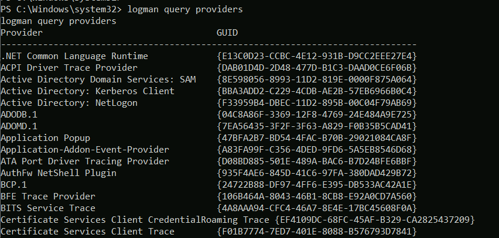
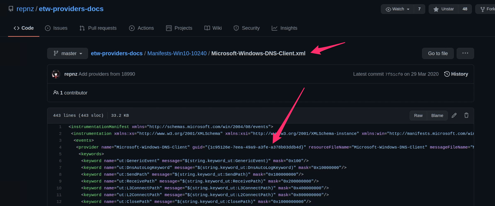
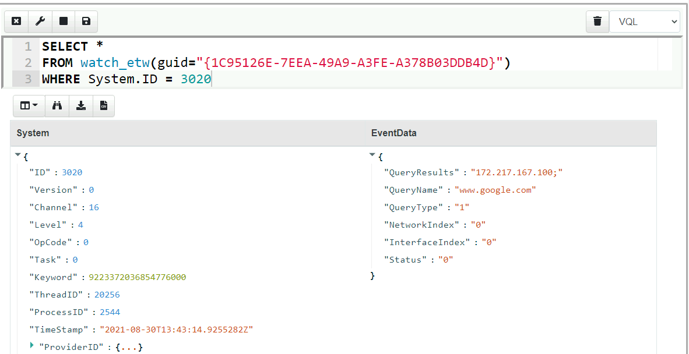
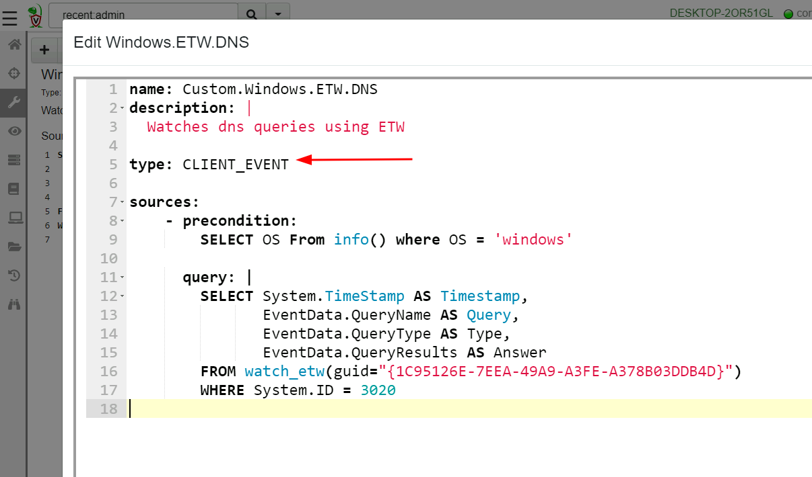
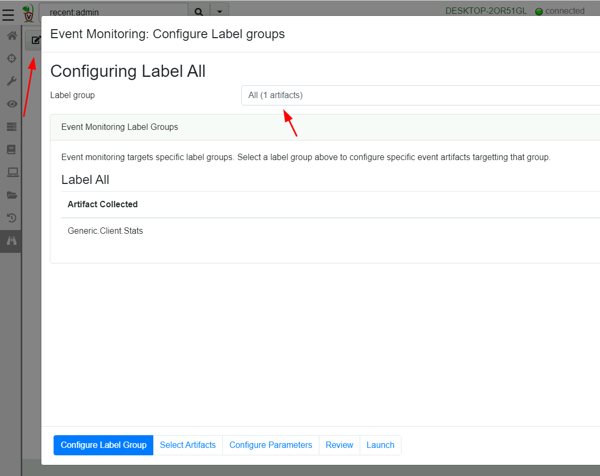
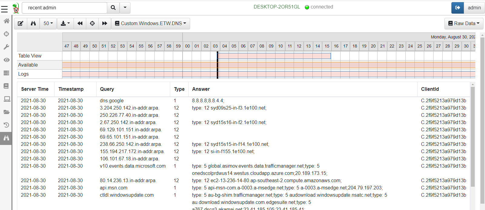

## Digging into Windows Internals

One of the most important aspects of modern operating systems is
instrumentation of the running software on the system. Instrumentation
provides the visibility to understand what the system is doing at any
given moment. This is obviously important for system administrators
and software developers, but visibility into machine state is
increasingly being used for security monitoring and response.

In Windows, system instrumentation is provided by the Event Tracing
For Windows (ETW), an extensive framework for instrumentation and
visibility.

Much has been written about ETW so I will not cover the details here,
this blog post is the first of a series of posts that examine how we
can leverage ETW for security monitoring using Velociraptor
specifically.

### Event tracing for windows.

The Event Tracing for Windows framework is [documented extensively by
Microsoft](https://docs.microsoft.com/en-us/windows-hardware/test/weg/instrumenting-your-code-with-etw). In
a nutshell, the framework is designed to facilitate interaction
between event **Consumers** and event **Providers**.

Velociraptor provides the VQL event plugin `watch_etw()` to register
Velociraptor as a **Consumer**.  If you have not read about
Velociraptor's event queries, check out the
[documentation](https://docs.velociraptor.app/docs/vql/events/). In
Velociraptor, event queries allow us to write real time monitoring
rules on the endpoint, then forward events to the server, enrich the
event with other information or respond to the event autonomously.

In this blog post we will go through some examples to illustrate the
general technique but there are so many possibilities for advanced
detection rules.

### Exploring ETW - Monitoring DNS lookups

In this blog post, we will be building a Velociraptor query to monitor
for DNS lookups on the endpoint. We mentioned previously that ETW
connects providers and consumers, so our first task is simply to find
a provider that will provider relevant data.

In this post we explore how you might develop new ETW based queries by
discovering new providers and experiementing with novel detection
rules.

ETW is designed to be self documented via `manifest` files, so each
provider in the system can describe what it will provide to some
extent. You can see all the providers on your system using the `logman
query providers` command. We can immediately see some providers
identified by the globally unique identifier (GUID).



Although it is possible to query for providers on the command line,
using APIs it is possible to dump the entire manifest containing much
more information about each provider.

There are some public efforts to better document ETW providers, for
example https://github.com/repnz/etw-providers-docs contains a dump of
various manifest files. I like to search that repository to find
likely useful providers. In this case I will look for a provider that
might give DNS information. The `Microsoft-Windows-DNS-Client`
provider looks like a likely candidate.



Let's get Velociraptor to watch the provider's GUID for any
events. VQL provides the `watch_etw()` plugin to attach Velociraptor
to the provider.

```sql
SELECT *
FROM watch_etw(guid="{1C95126E-7EEA-49A9-A3FE-A378B03DDB4D}")
```



After some trial and error we find the event ID we are interested in
as being ID 3020. We can consult with the manifest file to get more
information, such as the event data provided. Limiting the VQL query
to filter for event 3020 and extracting the most relevant columns
gives a nice DNS monitoring query:

```sql
SELECT System.TimeStamp AS Timestamp,
       EventData.QueryName AS Query,
       EventData.QueryType AS Type,
       EventData.QueryResults AS Answer
FROM watch_etw(guid="{1C95126E-7EEA-49A9-A3FE-A378B03DDB4D}")
WHERE System.ID = 3020
```

## Deploying the query on endpoints

Our VQL query is able to monitor the endpoint for DNS lookups but we
need a way to deploy the query to the endpoint. In Velociraptor,
client side event queries are encapsulated in `Client Event` artifacts
(Simple YAML files that include the VQL query, as well as human
readable descriptions and parameters allowing for simple
customization).

Simply select "Add new artifact" in the `View Artifacts` screen. By
default Velociraptor presents a template for an artifact definition -
ready for us to fill in the right information. Simply copy the VQL
query into the new artifact under the `Sources.Query` section
(remember to indent the query to fit within the YAML format). Since
this artifact will be an event artifact running on the client, we must
specify its type as `CLIENT_EVENT`



{}

What is the difference between a `CLIENT` and a `CLIENT_EVENT` artifact?

A `CLIENT` artifact is collected from the client, by sending a query,
having the client execute the query, returning a result set
(i.e. rows) back to the server. Therefore the `CLIENT` artifact
normally has a limited lifetime (by default 10 minutes) over which to
complete its work and return a result.

`CLIENT_EVENT` artifacts are designed to run continuously on the
client, streaming rows to the server when events occur. Therefore
these are treated differently by the client: The client simply records
the event queries it is to run in a `Client Event Table`.

The client starts running all the event queries when it first
starts. If the client table changes on the server (perhaps because the
user added a new event artifact to the client), the client will resync
its event table and restart all its queries.

{}

Once Velociraptor contains the new artifact it is time to deploy the
artifact to endpoints. Velociraptor can target different event
artifacts to different clients by means of `Label Groups`. By simply
assigning a label to a client, we can control the event artifacts
running on the client. For example, some of our endpoints are more
sensitive so we might want to only deploy certain monitoring queries
on those clients only by labeling them as "Sensitive".

For our example, we will deploy the query on `All` clients.



Once the query is deployed we can begin seeing any DNS events
generated on the endpoint.



## Conclusions

Hopefully you were inspired by this post to search for your own
detection queries. ETW is a rich source of endpoint state telemetry!
There are many other providers to explore and many possibilities of
combining ETW with other information sources.

While many users are familiar with Velociraptor's ability to collect
endpoint state and hunt for indicators at scale, the event monitoring
capability is a different approach making certain types of detections
much more convenient and effective.

For example, many users ask "how do I schedule a hunt to run
periodically?" While there are some cases when this is a good solution,
in most cases users are trying to find out what has changed in the
endpoint's state between two times.

An event monitoring artifact can inform of state changes on the
endpoint and perform the preliminary triage and analysis of these
events automatically.

In the next part of this article series we will be examining more
examples of utilizing ETW for enhancing end point visibility and
facilitating advanced response. We will also be discussing limitations
with this technique.

If you have a great idea for a new detection query, take [Velociraptor
for a spin](https://github.com/Velocidex/velociraptor)! It is a
available on GitHub under an open source license. As always please
file issues on the bug tracker or ask questions on our mailing list
[velociraptor-discuss@googlegroups.com](mailto:velociraptor-discuss@googlegroups.com)
. You can also chat with us directly on discord
[https://www.velocidex.com/discord](https://www.velocidex.com/discord)
.

There is still time to submit it to this year's [2021 Velociraptor
Contributor
Competition](https://docs.velociraptor.app/announcements/2021-artifact-contest/),
where you can win prizes, honor and support the entire DFIR
community. Alternatively, you can share your artifacts with the community on
[Velociraptor's Artifact
Exchange](https://docs.velociraptor.app/exchange/).
