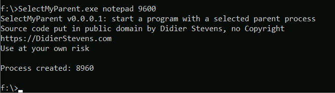
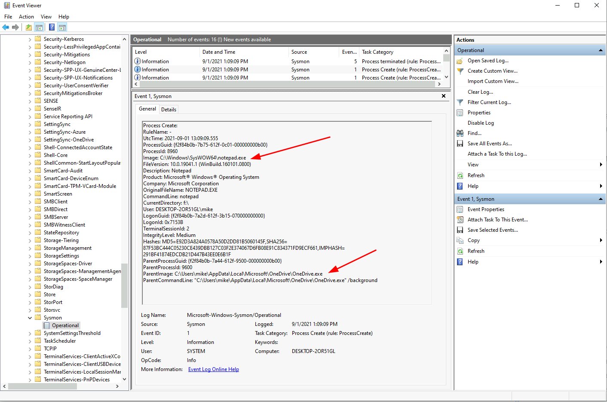
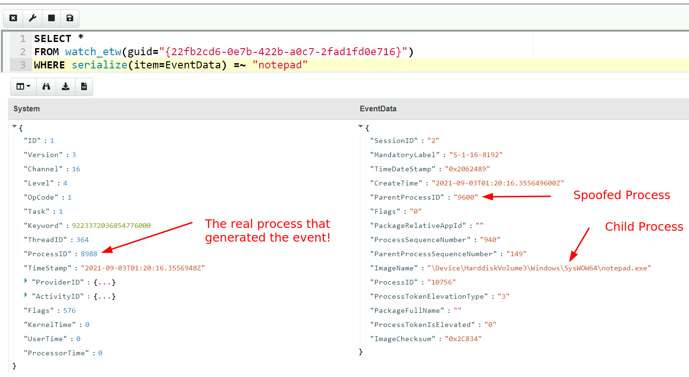
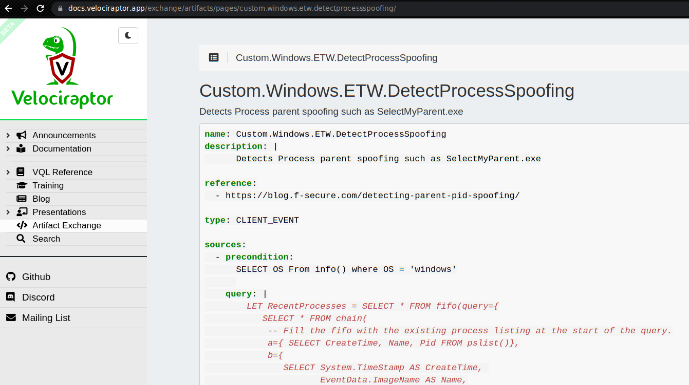
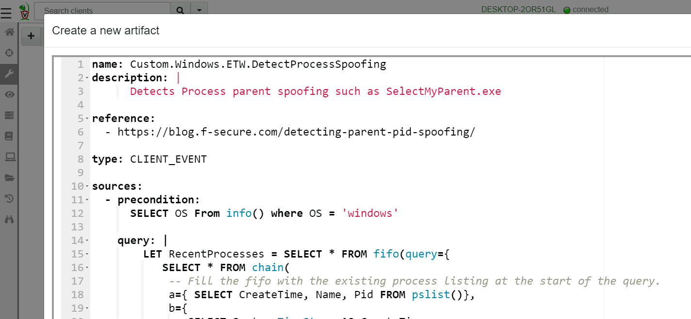
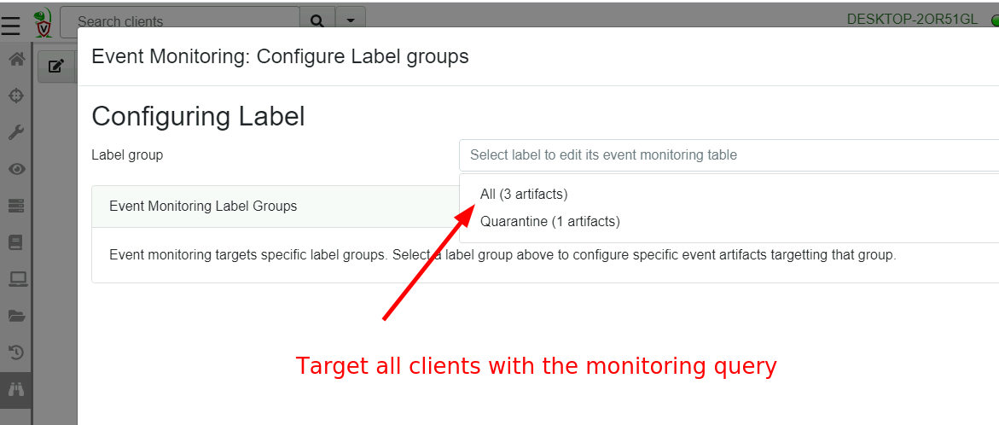
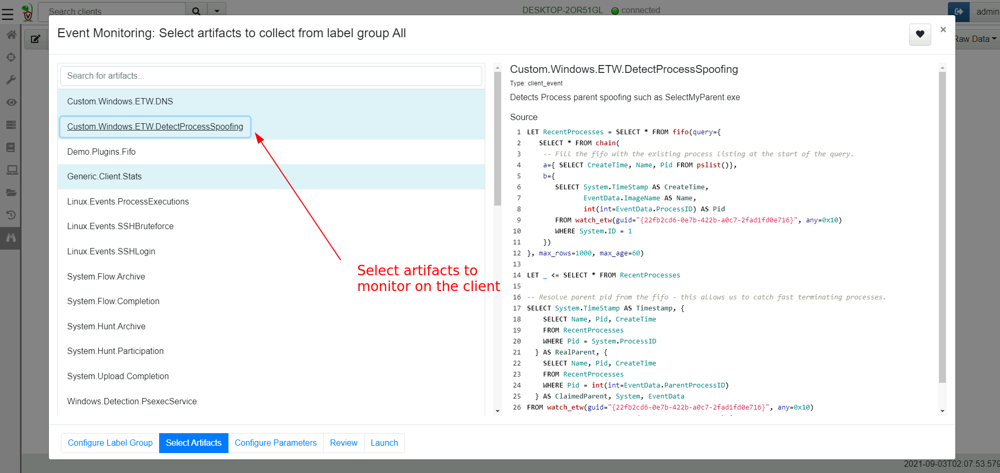
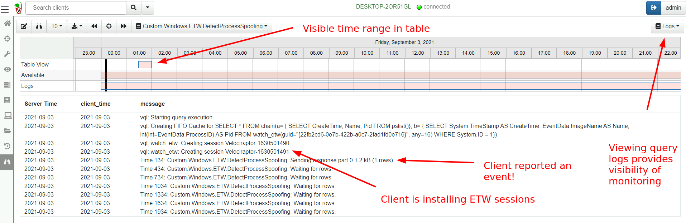
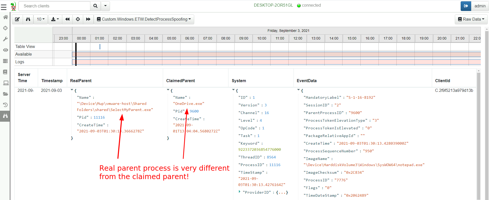

## Process Parent Spoofing

A lot of the current state of the art detection techniques rely on
process creation logs, and their implied parent/child
relationships. For example, many detection rules alert when Powershell
is launched from `WinWord.exe` as it typically indicates a macro has
started a powershell payload.

Many people are sometimes surprised to learn that on Windows
parent/child process relationship is not particularly reliable. Back
in 2009, Didier Stevens released a demo tool called
[SelectMyParent](https://blog.didierstevens.com/2009/11/22/quickpost-selectmyparent-or-playing-with-the-windows-process-tree/)
demonstrating a quirk of the Windows CreateProcess API that allows any
caller to simply spoof the parent process ID.  This is particularly
troublesome, especially when so much of the DFIR industry relies on
process tracing of parent/child call chain. Further, parent spoofing
does not require any special privileges and can be performed by
non-admin users as well.

Didier Stevens wrote about it again in 2017's post [That Is Not My
Child Process!](https://blog.didierstevens.com/2017/03/20/) where even
`Sysmon` and `Volatility memory analysis` are demonstrated to be
fooled by `SelectMyParent`!

If you thought this was an unknown technique, rest assured that most
attack tools integrate parent process spoofing already. For example
[Cobalt Strike](https://www.youtube.com/watch?v=DOe7WTuJ1Ac) has been
able to do this for a number of years now, and the technique is
actively used frequently to avoid behavioural detection.

How can one detect this kind of spoofing? I found it surprising that
there are no indicators that a process has been spoofed that can be
gathered from an already running process (If you know of any, please
let me know!). As Didier Stevens shows in his 2017 post above, even
memory analysis can not reveal the real parent of a process.

The only way to learn that a process parent has been spoofed is using
ETW, as outlined in the F-Secure post [Detecting Parent PID
Spoofing](https://blog.f-secure.com/detecting-parent-pid-spoofing/). Let's
play with this detection and see how effective it is.

### Spoofing Parent processes

I will use Didier's tool `SelectMyParent` to spoof `notepad.exe` as
being a child of `OneDrive.exe`. First I use the task manager to find
the Process ID of OneDrive and then start notepad with this as the
parent.



On this system I have Sysmon installed, so I will find the process
creation event in the event viewer.



It shows the parent process of notepad is `OneDrive.exe`!

Let's write a VQL query to detect this spoofing. According to the post
above, the provider to watch is the `Microsoft-Windows-Kernel-Process`
provider which has a GUID of
`{22fb2cd6-0e7b-422b-a0c7-2fad1fd0e716}`. Since the provider emits a
lot of information about all processes in the system, I will initially
narrow down event to only those that have `notepad` somewhere in the
event data.

```vql
SELECT *
FROM watch_etw(guid="{22fb2cd6-0e7b-422b-a0c7-2fad1fd0e716}")
WHERE serialize(item=EventData) =~ "notepad"
```



In the above query we can see the anomaly immediately! The process
that generated the EWT event is not the same as the process parent
pid!

This anomaly allows us to detect the spoofing behavior, now we just
need to enrich the event with extra detail of the real parent, the
spoofed parent etc. You can find the full VQL artifact on the [Velociraptor Artifact Exchange](https://docs.velociraptor.app/exchange/) [here](https://docs.velociraptor.app/exchange/artifacts/pages/windows.etw.detectprocessspoofing/)



To add this artifact, I will navigate to the `View Artifacts` screen,
then click `Add an Artifact` button, then copy and paste the Artifact
definition from the exchange into the editor.



Now I will add this artifact to all client's monitoring
configuration. I click the `Event Monitoring` screen in the GUI then
the `Update client monitoring table` button.



To add the new artifact to the client's monitoring table I will select
it in the next step.



As soon as the monitor table is updated, all clients will refresh
their configuration and start monitoring for spoofing. We can see this
by viewing the query logs in the event viewer GUI



We can clearly see the client is installing some ETW sessions to
monitor the provider. We also see a message every few minutes to
remind us that the client is still monitoring for events. When an
event is detected, the client immediately forwards the event to the
server.

We can repeat our experiment and see the event generated by selecting
the `Raw Data` view in the GUI.



Again we see the events in the timeline, but this time the row
contains all the enriched information, like the real identity of the
parent process!

## Conclusions

In this post we implemented a sophisticated ETW based detection rule
in VQL. We then wrote an artifact to encapsulate it and shared the
artifact over the `Velociraptor Artifact Exchange` for other members
of the community to use.

After adding the artifact to our deployment, we then issued the
monitoring query to all clients. When any client detected the spoofing
behavior, an event was sent to server in real time. We could then
utilize any escalation mechanism such as [escalation through
slack](https://docs.velociraptor.app/blog/2020/2020-12-26-slack-and-velociraptor-b63803ba4b16/)
or a [The
Hive](https://wlambertts.medium.com/zero-dollar-detection-and-response-orchestration-with-n8n-security-onion-thehive-and-10b5e685e2a1).

The interesting thing about this approach is that the detection rule
is implemented on the endpoint itself. It is the endpoint that is
watching the ETW events directly and making the decision about the
anomalous nature of the event. Therefore the number of events actually
streamed to the server is very small - most events will be high value
events (such as real parent spoofing, UAC elevation and crashes).

Other Log forwarding technologies simply stream **all process creation
events** to a large backend server, where detection queries are
implemented in large data mining engines. This increases the volume of
irrelevant events forwarded to the server (most process execution
events are not malicious!), requiring more backend processing
capacity.

Velociraptor's approach is very different! Velociraptor moves the
initial analysis and triage to the end point, implemented via the
powerful VQL query language. This means we do not need a lot of
processing on the backend to scale to many thousands of monitored
endpoints, as the server only sees high value, low volume events. We
are essentially using the end point itself to create a de-centralized
detection engine for a fast and scalable alerting system.

Unfortunately an ETW watcher must be running at the time the process
is created, to be able to identify the spoofed parent. I am not
currently aware of a way to detect that an existing process's reported
parent is not correct (Please let me know if you know of a way!). This
means that simply collecting information at a point in time after the
process is started (as in a Velociraptor `pslist` hunt for example)
does not reveal this information easily.

In the next blog post in this series we will be looking at how ETW can
be abused by malware and some of the limitations around ETW.

If you have a great idea for a new detection query, take
[Velociraptor for a spin](https://github.com/Velocidex/velociraptor)!
It is a available on GitHub under an open source license. As always
please file issues on the bug tracker or ask questions on our mailing
list
[velociraptor-discuss@googlegroups.com](mailto:velociraptor-discuss@googlegroups.com)
. You can also chat with us directly on discord
[https://www.velocidex.com/discord](https://www.velocidex.com/discord)
.

There is still time to submit it to this year's [2021 Velociraptor
Contributor
Competition](https://docs.velociraptor.app/announcements/2021-artifact-contest/),
where you can win prizes, honor and support the entire DFIR
community. Alternatively, you can share your artifacts with the
community on [Velociraptor's Artifact
Exchange](https://docs.velociraptor.app/exchange/).
