I am very excited to announce the latest Velociraptor release
0.6.1. This release has been in the making for a few months now and
has a lot of new features. I wanted to take some time to tell you all
about it in our blog so I can show some of the new screenshots in more
detail.

## GUI Visible changes

#### Most Recently Used

One of my favorite new features is the new `Most Recently Used` (MRU)
list in the GUI. Typically, a Velociraptor deployment may contain many
thousands of clients, but an investigator typically only interacts
with a few relevant hosts. While you could always search for the hosts
you are interested in, Velociraptor now keeps a most recently used
list in each user's profile, making it easy to go back to a host under
investigation.

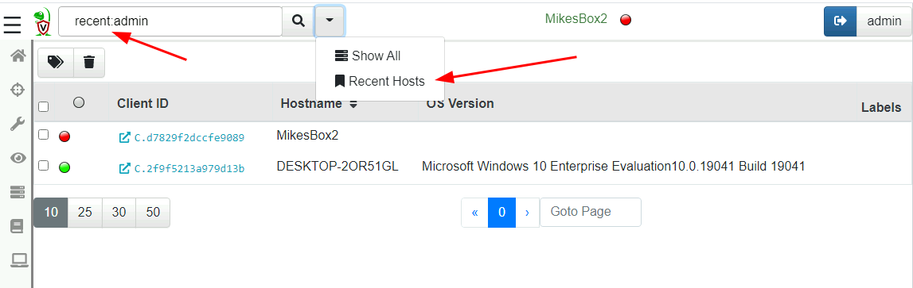

You don't have to do anything to get hosts added to the MRU list,
simply search for them normally and select the client to interact
with. The MRU list is sorted in most recent order so it should always
contain relevant hosts.

{}

Although it might appear by the search term, that you can view other
user's most recently used list this is not the case - each user has
their own list of hosts. The username after the `recent:` is currently
ignored.

{}


#### Free disk space

Many users asked to be able to see the free disk space available in
the dashboard. This is useful to keep an eye during investigations. If
the disk fills up during a large hunt, the client connections will
fail to upload data. Since Velociraptor does not know which specific
filesystem contains your file store, it just shows the total disk
space in all mounted filesystems.

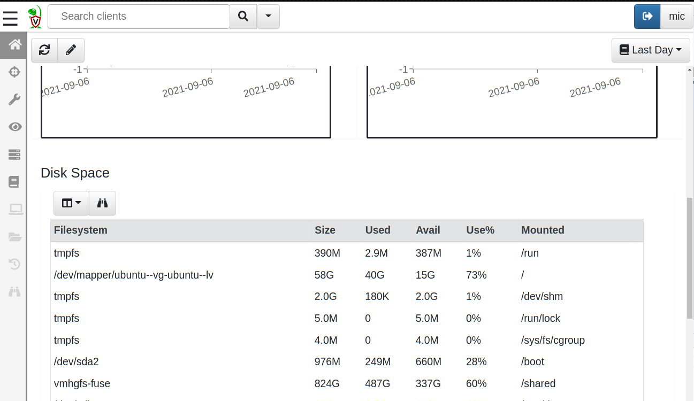


#### Quarantine hosts

Velociraptor allows users to quarantine hosts using the
`Windows.Remediation.Quarantine` artifact. This artifact updates the
client's firewall rules so it can only communicate with the
Velociraptor server, and some limited exceptions. When a host is
quarantined, no network connections are succuessful, but the
investigator can still communicate with the host using Velociraptor.

This feature is useful in cases when time is of the essence and it
made sense to expose the feature right in the GUI. From the host overview screen, simply click "Quarantine this host":

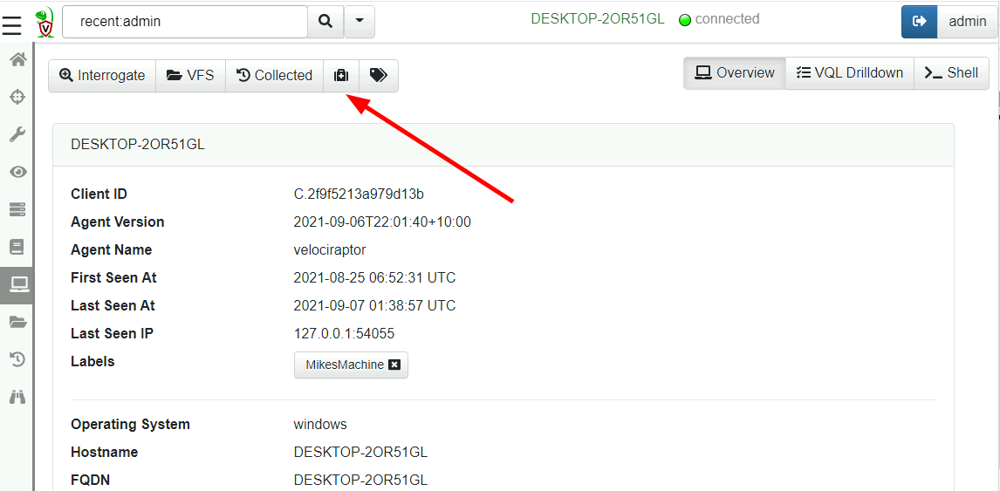

You may also add a message for the logged in user

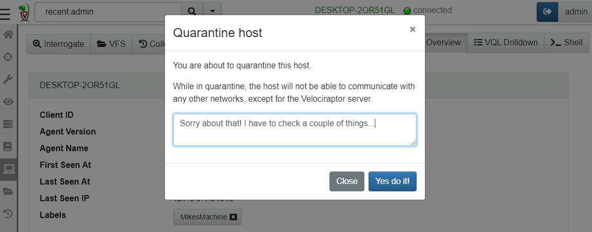

At this point the machine is quarantined. It gains a label of
Quarantine which indicates to the system that the client is
quarantined.

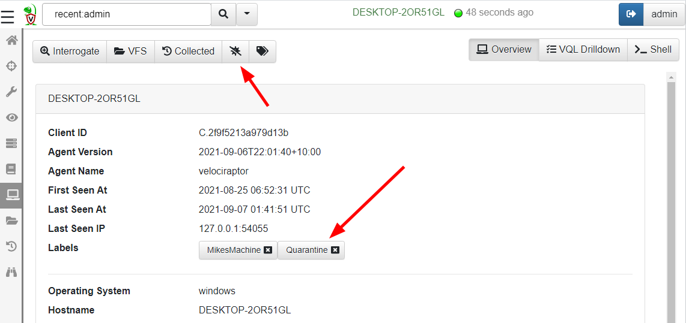

{}

Velociraptor uses labels to place host into `Label Groups`. This is
used to control the types of monitoring artifacts that are running on
the client. It is actually the `Quarantine` label that makes the host
quarantine itself because the `Windows.Remediation.QuarantineMonitor`
artifact is assigned to the Quarantine label group.

The host will continuously check that it is quarantined as long as the
label is set. This means the quarantine status also survives a reboot!

To remove the host from the Quarantine group, simply remove the label
or click the "Unquarantine Host" button. This will immediately release
the host from the quarantine.

{}

#### Notebook full screen

Velociraptor Notebooks have always been the best way for running and
exploring VQL queries. The notebooks are a collaborative shared
document, allowing a group of investigators to share their work and
analysis.

The new full screen mode allows an uninterrupted view of the notebook
as a shared document. Other GUI elements are hidden and the notebook
takes on full screen.

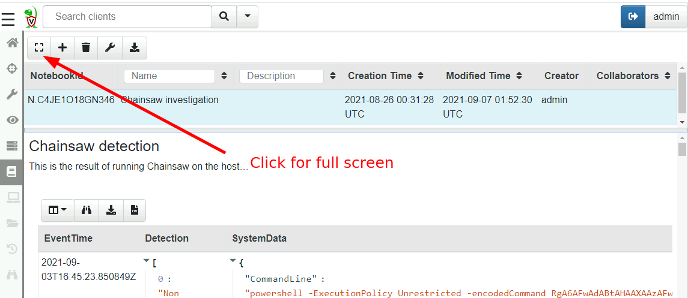

You can switch back from full screen mode by simply clicking the button.

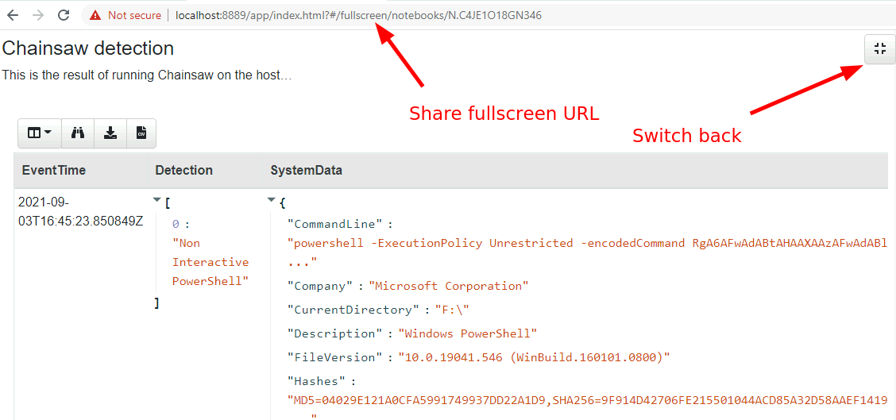

Note that the URL contains the full screen mode so you can share a
notebook URL with your team already in full screen.

#### Favorite collections

If you are like me and often use the same combination of artifacts
with similar parameters, but are just too lazy to create a custom
artifact that combines them all, you might enjoy the latest `Favorite`
feature. Simply click the `Save Favorite` button when a collection is
selected.

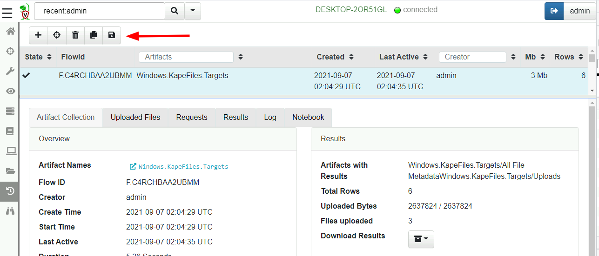

This will save the specific combination of artifacts to collect as
well as their parameters used in the previous collection under a name.

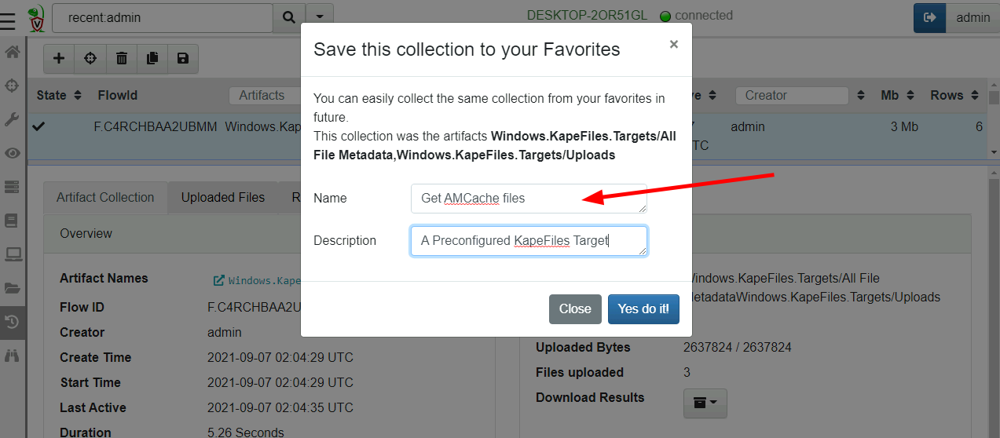

Now when we create a new collection, we can retrieve the favorite
collection by name

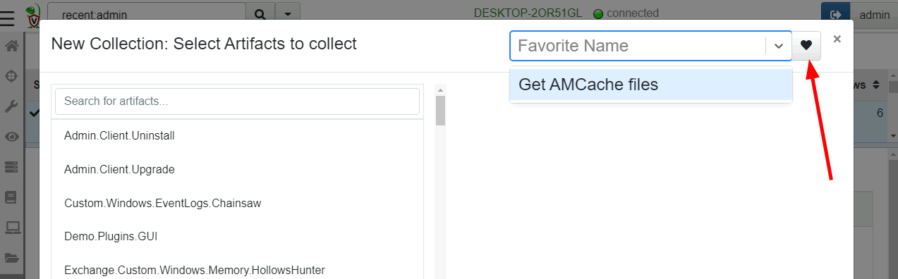

{}

Favorites are currently stored in the GUI user's profiles so each user
can maintain their own list of favorites. However you can save a
favorite into your own profile using the
[favorite_save](/vql_reference/server/#favorites_save) VQL function,
so a team may create a set of common favorites using a SERVER VQL
artifact.

{}

#### Event Monitoring tables

Velociraptor's `CLIENT_EVENT` artifacts run an event query on the
client and stream the results back to the server. This can be used to
create sophisticated monitoring rules on the endpoint.

In the latest release these events are now indexed by time which
allows for a much more flexible UI experience.

You can view the results from the client's monitoring artifacts by
clicking the `Client Events` screen and selecting the specific event
artifact you want to see.

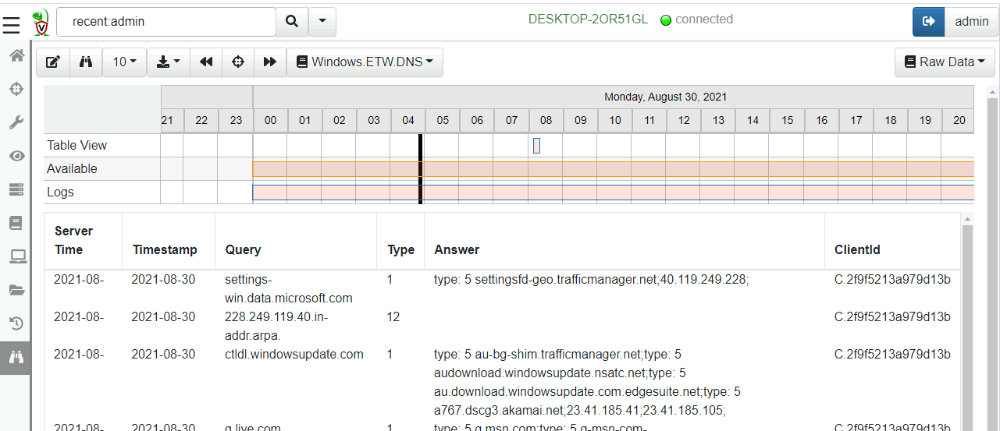

The view is split into two halves. The top half is the timeline view
while the bottom half is the table view. The events can be viewed in
the table, while the timeline view provides a quick way to navigate
different time ranges.

You can see the timeline view is split into three rows:

1. `Table View` visualizes the time range visible in the table currently.
2. `Available` shows the days which have any events in them.
3. `Logs` visualizes the days that have any logs in them (You can view query logs by selecting the `Logs` pull down on the top right).

In order to keep the table brief the timestamps are abbreviated - you
can hover the mouse over those to get the full timestamp. Usually the
exact timestamp in the table is not important as we can see a
visualization of the time range in the timeline above.

You can zoom in and out of the visible time ranges using `Ctrl-Mouse
Wheel` or by clicking the timeline itself.


By clicking the tool bar it is possible to page through the table to
view visible events. If you need to export the data, simply click the
`Export` button and select either JSON or CSV format. The export
functionality applies to the visible time range so you can finely tune
which events should be exported (simply zoom the visible range in or
out).

#### Timelines

One of the most exciting new features in 0.6.1 is the new built in
timeline functionality. What is a timeline? It is a way to visualize
time based rows from multiple sources. The main concepts to understand
are the `Super Timeline` and the `Timeline`.

A super timeline is a grouping of several timelines together (you can
see them on the same timeline, turn each on or off etc). You can add
child timelines to a super-timeline to be able to compare them
together by seeing their separate events together.

A timeline is just a series of rows keyed on a time column - the rows
can be anything at all, as long as a single column is specified as the
time column and it is sorted by time order.

It is even possible (and necessary) to add the same rows multiple
times to each super timeline, each time having a different key column.

##### Adding timelines

The first step is to view a table in a notebook - any table generated
using any query. In the example below, I collected the MFT then post
processed it by filtering it. Once I can see a table with some
results in it, I can add the table to the super timeline.

In this example I just collected the MFT from the client. The full MFT
has about 380k rows, but in practice I might be able to filter it down
by date range or file type so the total size of the table is not too
large.

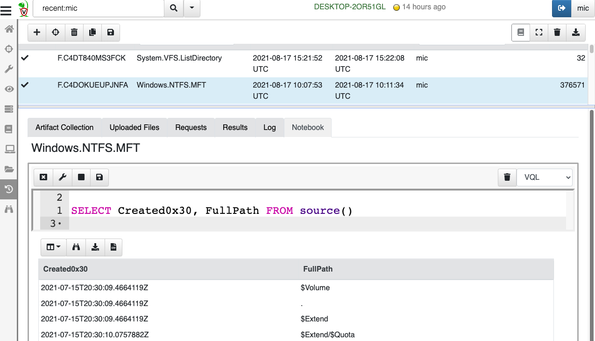

Next I can add the table to the Super Timeline by generating a
timeline from it. I simply click the `timeline` icon at the tool bar
of each table. Velociraptor will then present the timeline dialog.

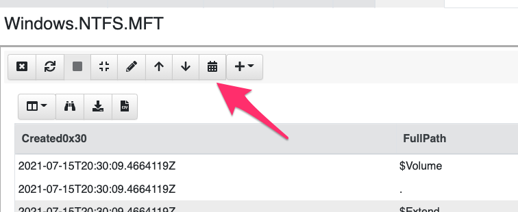

When adding a timeline to a super timeline, I need to specify the
Supertimeline's name (If there is no super timeline yet, I can create
a new one). Then I can specify the child timeline's name and a time
column to use as the index.

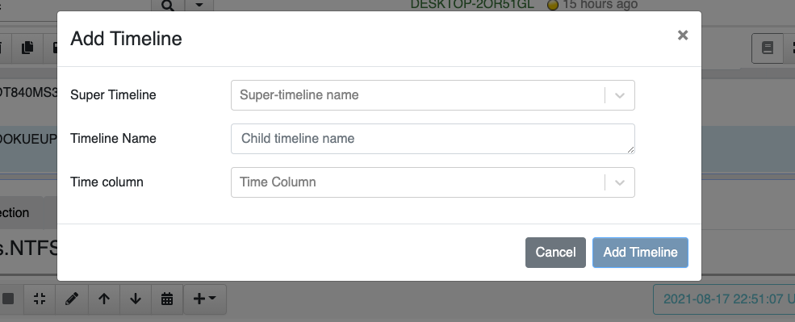

In this case I will add the Created times from the MFT to the timeline
`MFT Analysis`. Velociraptor will sort the table on the Created Time and will add the timeline to the super timeline.

Since I dont have a Super Timeline yet, I can create a new one by
starting to type in the box. Later I can add other timelines from any
tables to the same supertimeline.

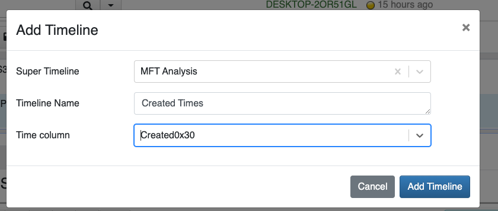

##### Viewing timelines

Once this is done, nothing appears to have happened! But really the
supertimeline is added to the notebook. We just need to view it.

Timelines are simply rendered through special markdown syntax. I can
just add a new cell with the timeline in it.

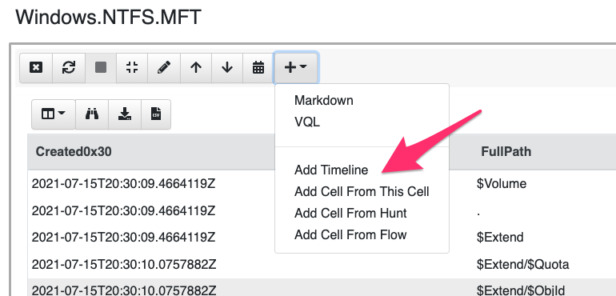

Choose which timeline to add.

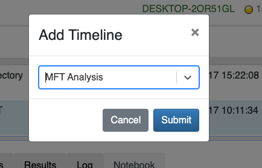

And we get to see the super timeline (which currently has only one
timeline). It is actually a bit easier to see with full screen so I
recommend to switch to that now.

##### Inspecting timelines

The cell is divided into two: At the top we see the timeline - it has
a bar for each child timeline added as well as the top bar
representing the visible range of the table.

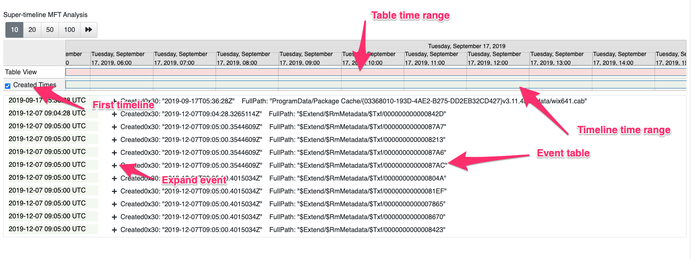

Below the timeline we see the table of all the events from all
timelines intermixed. The table has two columns, on the left is the
event time, while on the right are all the other fields of the
original table row. You can expand and contract each row to see more
data. Note that the columns we see here are actually the same columns
in the original table that was added to the timeline, so we can always
tweak the original table VQL to only present the columns we care about
and make sure it is not too crowded here.

You can zoom the time in and out by clicking the year or month headers,
but I find it easier to just `Ctrl-Mouse Scroll`.

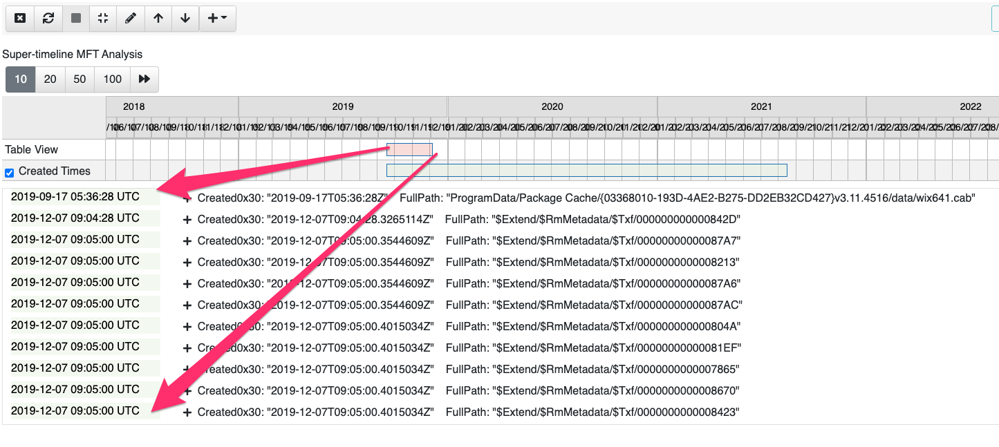

You can either step through the table using the regular next/previous
buttons or you can click on any time you like.

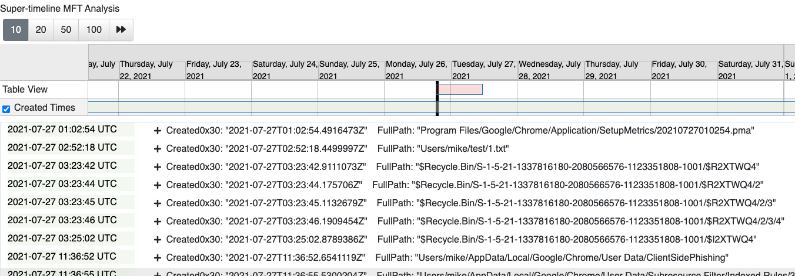

When you add other timelines to the same Super-timeline you will see
the events in order on the same table rendered with different
colors. You can turn a child timeline on or off by unchecking the name
of the child timeline within the timeline view.

## VQL Changes

In this release there are many improvements to the VQL language
including new plugins, functions and enhanced capability. Let's talk
about some of the interesting changes.

##### Starlark is now available in VQL

VQL has always been more of a glue language - connecting the results
of multiple plugins, filtering and some basic manipulation of the
results. Although VQL is getting more powerful all the time, sometimes
it is just easier to do more complicated operations in a more
traditional language, such as Python.

[Starlark](https://github.com/bazelbuild/starlark) is a mini-python
interpreter that can be embedded into Go programs. Velociraptor now
features a starlart interpreter built in! This is useful when you need
to perform more intricate functional style of programming.

Here is a very simple example
```vql
LET StarCode = starl(code='''
def Foo(x):
   return x + 2
''')

SELECT StarCode.Foo(x=2)
FROM scope()
```

The first statement defines a Starlark module by simply calling the
`starl()` function on some python code. The `starl()` function
compiles the code into a module. VQL queries can then access code
within the Startlark module by just calling is as normal. This is most
helpful when we need to do specific manipulation of strings, numbers
etc.

##### Functions that manipulate endpoint state

When we first designed Velociraptor we wanted it to be a read only,
forensic system. However, as people use Velociraptor more and more for
`Response` we realized that the R in DFIR requires the tool to
actively change the endpoint! Whether it is to uninstall malware,
correct a vulnerability, or cut off access to a compromised system, we
needed the ability to change settings on the endpoint.

That is why the latest release introduces a number of new VQL
functions, such as `rm`, `reg_set_value`,`reg_rm_value` and `reg_rm_key`
that allow VQL queries to modify the registry or files.

##### Server side VQL functions

On the server, Velociraptor now has the `user_delete()` and
`user_create()` to manipulate GUI users. This allows for VQL to
automate initial server provisioning by adding the right users to a
new server.

We also have the ability to enrich IP addresses via the `geoip()` VQL
function. This function allows using a MaxMind database to resolve IP
addresses to location.

## Notable artifacts

##### Carving Cobalt Strike configurations from memory

The `Windows.Carving.CobaltStrike` artifact can now carve and decode
the CobaltStrike configuration from memory. This is very helpful to
identify the C&C and other configuration parameters encoded within the
configuration.

## Other changes

##### Client index rewrite

The client index is used in Velociraptor to quickly search for clients
in the GUI. Previously this was implemented in a way that proved very
inefficient on network volumes like EFS. The index has been upgraded
in 0.6.1 to a more performant structure.

The index will be converted to the new format when the latest 0.6.1
Velociraptor is started for the first time. On EFS volume conversion
might take a while (several hours) due to the underlying slow
filesystem. Once this conversion is complete it need not be done
again.

The new index performs well above 20k clients on EFS (Previously only
SSD was usable at these numbers).

If you liked the new features, take [Velociraptor for a
spin](https://github.com/Velocidex/velociraptor)!  It is a available
on GitHub under an open source license. As always please file issues
on the bug tracker or ask questions on our mailing list
[velociraptor-discuss@googlegroups.com](mailto:velociraptor-discuss@googlegroups.com)
. You can also chat with us directly on discord
[https://www.velocidex.com/discord](https://www.velocidex.com/discord)
.

There is still time to submit it to this year's [2021 Velociraptor
Contributor
Competition](https://docs.velociraptor.app/announcements/2021-artifact-contest/),
where you can win prizes, honor and support the entire DFIR
community. Alternatively, you can share your artifacts with the
community on [Velociraptor's Artifact
Exchange](https://docs.velociraptor.app/exchange/).
