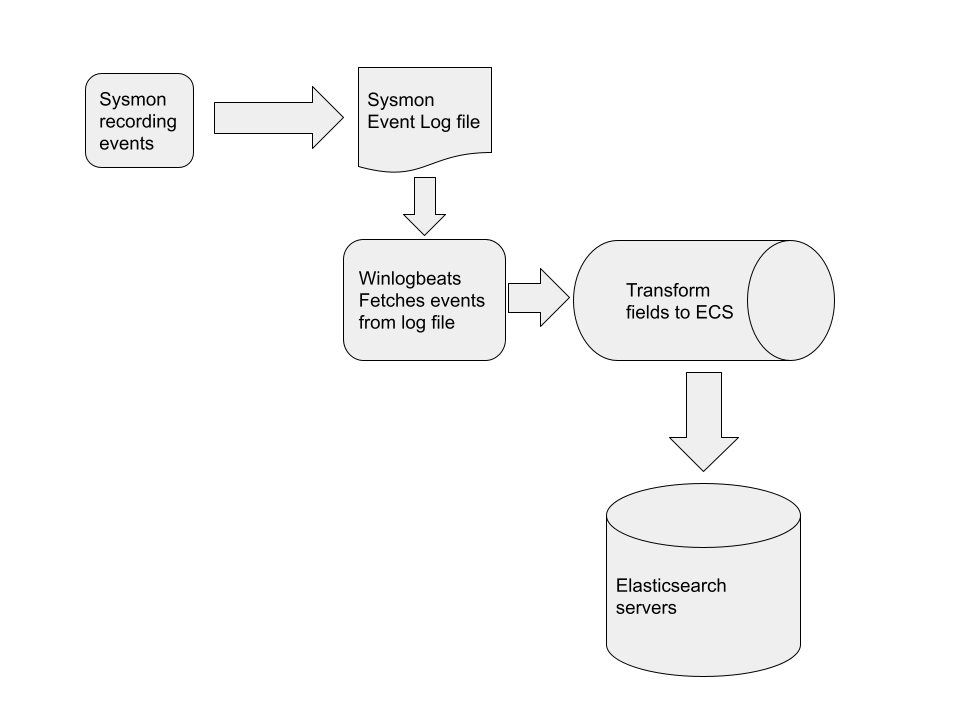
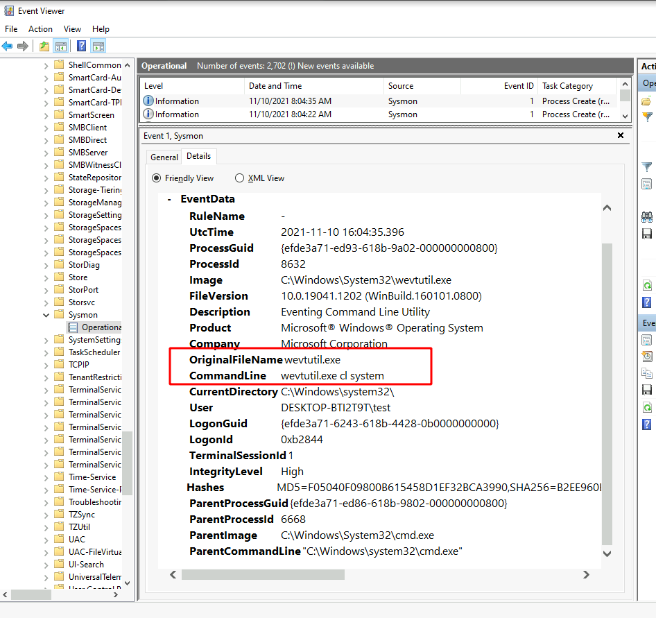
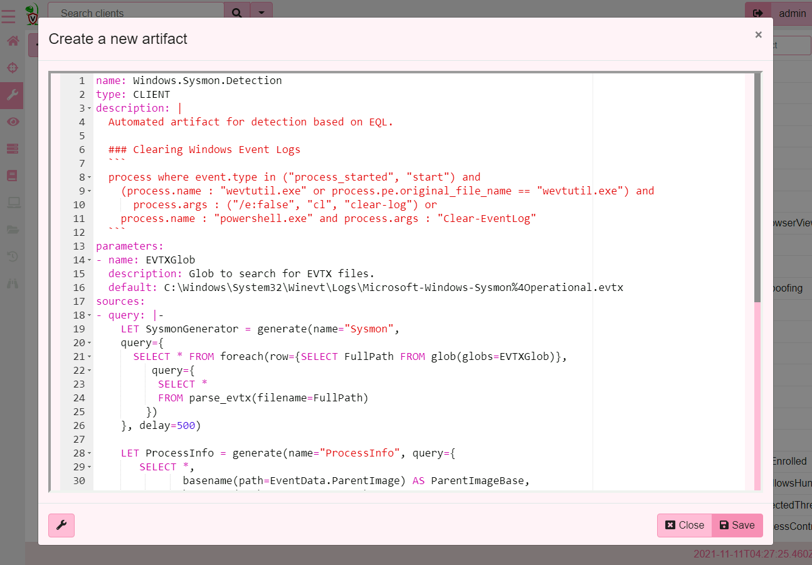
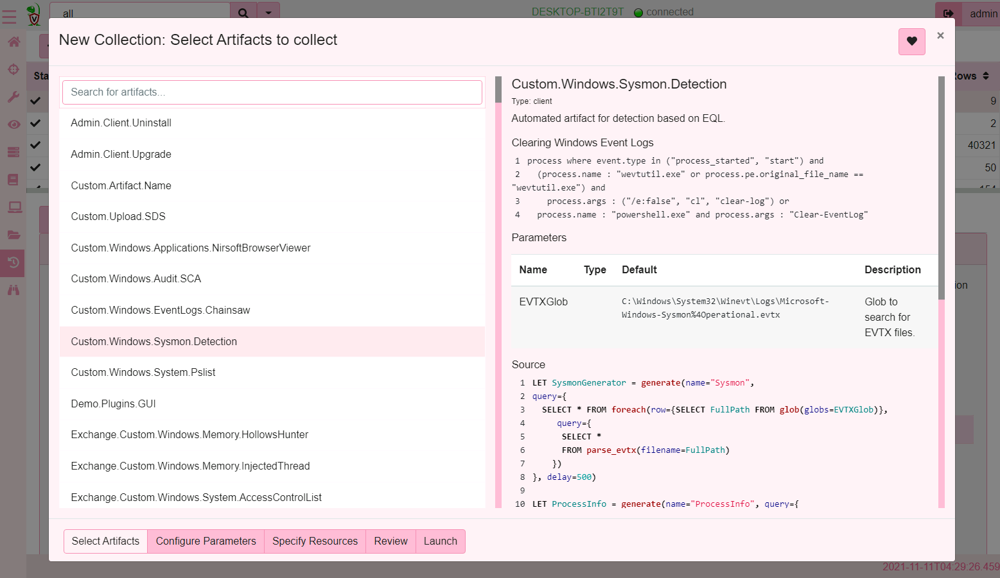
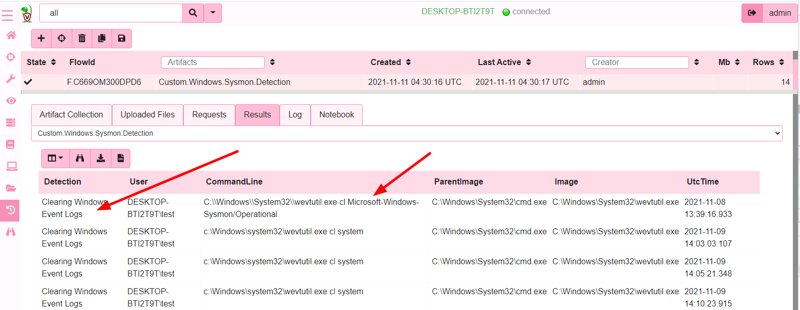
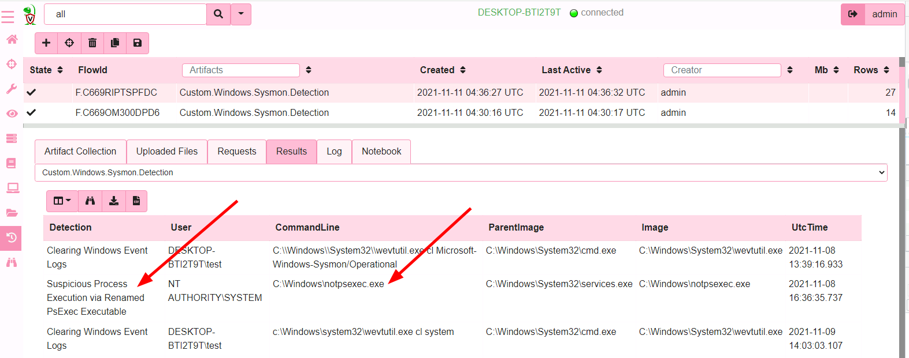
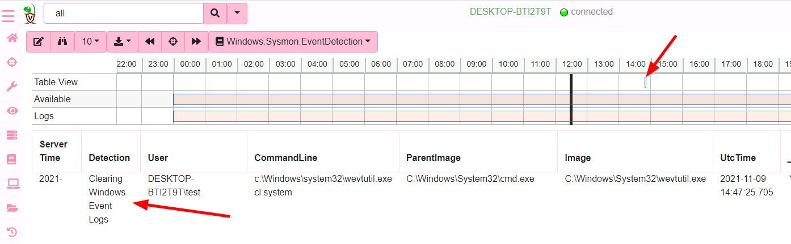

{}

This article describes a threat detection approach that has since been
superseded by Velociraptor's [built-in Sigma
functionality](),
however it is retained here for historical and instructive purposes since it
also demonstrates how the flexibility of VQL makes novel solutions possible.

{}

If you have been following the development of Velociraptor for a while
you are probably more than familiar with Velociraptor's flexible query
language (VQL). Because Velociraptor is an agent running on the
endpoint, VQL facilitates access to all manners of data sources, from
event logs, event tracing for Windows (ETW) to live analysis and
triaging - all orchestrated using VQL as the flexible glue language.

While VQL can be used for hunting or detection, many traditional
threat hunting platforms work by forwarding logs to a central location
and then running queries over the aggregate data from all
endpoints. There is a large body of existing work in detection queries
or threat intelligence feeds designed to work on top of a central data
mining solution such as Elastic or Splunk. We have been wondering for
a while how to make use of that existing logic within Velociraptor. By
reusing existing detection resources in different contexts, we are
able to enhance their overall effectiveness.

In this post we discuss how to leverage detections targeting EQL (an
Elastic search query) within Velociraptor. I thought it would also be
interesting to discuss the main differences between more traditional
logs aggregation solutions (such as Elastic or Splunk) and
Velociraptor's endpoint centric design.

## What is EQL anyway?

The [Event Query
Language](https://www.elastic.co/blog/introducing-event-query-language)
(EQL), is a query language designed to identify specific conditions in
collected telemetry from endpoints in order to implement detections of
anomalous behavior.

EQL forms a central part of the Elastic detection platform and has a
large number of [existing detection
rules](https://github.com/elastic/detection-rules). It is also a
target for some other threat detection platforms, for example
[Sigma](https://github.com/SigmaHQ/sigma) can generate EQL queries
from Sigma rules.

By implementing EQL support for Velociraptor we can leverage the
existing resources and use them in a wider context - as we will see
below.

## How do EQL detections work?

EQL detections are part of the wider Elastic solution - which is
pretty typical for traditional centrally processed SIEM based systems:

1. Events are collected from the endpoint using a collection
   agent. Commonly the agent is
   [winlogbeat](https://www.elastic.co/beats/winlogbeat) collecting
   [Sysmon](https://docs.microsoft.com/en-us/sysinternals/downloads/sysmon)
   generated events, providing process execution logs, file and
   registry modification events and DNS lookup events.

2. The data is transformed on the endpoint into a standard data schema
   for transmission into the Elastic server. EQL relies on the data being in
   [Elastic Common
   Schema](https://www.elastic.co/guide/en/ecs/current/index.html) so
   it can be indexed by the backend.

3. The transformed data is received on the server and fed into large
   scale data mining warehouse (e.g. The Elastic search server) where
   it is aggregated and indexed.

4. Detection queries are applied on the data mining engine to detect
   anomalies.

The following diagram illustrates the process



Let's work through a specific example of a Sysmon event as it works
its way through the EQL echo-system, eventually matching the
[following
detection](https://github.com/elastic/detection-rules/blob/main/rules/windows/defense_evasion_clearing_windows_event_logs.toml):

```py
process where event.type in ("process_started", "start") and
  (process.name : "wevtutil.exe" or process.pe.original_file_name == "wevtutil.exe") and
    process.args : ("/e:false", "cl", "clear-log") or
   process.name : ("powershell.exe", "pwsh.exe", "powershell_ise.exe") and process.args : "Clear-EventLog"
```

The above rule is looking for process executions, where the
`wevtutil.exe` program is run with command line arguments matching
"cl" or "clear-log" (Or the equivalent powershell)

What happens when I run the command `wevtutil.exe cl system` on my
test system?

Sysmon will detect the process start and write an event into the
system event log.



Eventually the event will be forwarded to the Elastic stack, detection
queries run over it and potentially an alert will be escalated.

Since we know this event will trigger the EQL detection, let's see how
Sysmon event fields are mapped into the ECS fields that the EQL query
works on.


| Sysmon Field | ECS Field |
|--------------|-----------|
| System.EventID | maps to event.type = "start" |
| EventData.Image | strip directory part and store in `process.name` |
| EventData.OriginalFileName | stored in `process.pe.original_file_name` |
| EventData.CommandLine | is split into array and stored in `process.args` |
-------

All the details of how the original Sysmon event fields are
transformed to ECS fields can be found coded in
[winlogbeat-sysmon.js](https://github.com/elastic/beats/blob/master/x-pack/winlogbeat/module/sysmon/config/winlogbeat-sysmon.js)

## How can we use EQL detection queries?

So now that we understand how EQL detections work, how can we use the
same detection logic in Velociraptor? Velociraptor's philosophy is
that detection should be distributed - rather than forwarding all raw
events to a central place for triaging, we wish to be able to do the
detection directly on the endpoint.

In order to do this, we need to convert the EQL to VQL that works
directly on the raw source event logs as produced by Sysmon - in other
words we need to reverse the above transformation from the ECS fields
mentioned in the EQL query back to the original event log fields found
on the endpoint.

### The `eql2vql` project

Let me introduce a new project to automatically convert EQL detection
rules to VQL artifacts: https://github.com/Velocidex/eql2vql

The aim of this project is to automatically produce a VQL artifact
that parses a set of EQL detection rules into a single VQL
artifact. The produced artifact can be used to hunt for notable event
log patterns at scale in minutes using Velociraptor's hunting
capabilities!

Let's take a look at an example to illustrate how it works. I will
keep it simple and just convert the single rule
`defense_evasion_clearing_windows_event_logs.toml` containing the
sample EQL query above, to create a new VQL artifact

```sh
$ python3 parser/eql2vql.py -p SysmonEVTXLogProvider ~/projects/detection-rules/rules/windows/defense_evasion_clearing_windows_event_logs.toml -o /tmp/detection_vql.yaml
Created artifact 'Windows.Sysmon.Detection' with 1 detections
```

In this case I selected the `SysmonEVTXLogProvider` as I wanted to
search the EVTX files directly on the endpoint.

Let's take a look at the produced VQL

```vql
LET SysmonGenerator = generate(name="Sysmon",
query={
  SELECT * FROM foreach(row={SELECT FullPath FROM glob(globs=EVTXGlob)},
     query={
      SELECT *
      FROM parse_evtx(filename=FullPath)
    })
}, delay=500)

LET ProcessInfo = generate(name="ProcessInfo", query={
   SELECT *,
          basename(path=EventData.ParentImage) AS ParentImageBase,
          basename(path=EventData.Image) AS ImageBase,
          commandline_split(command=EventData.CommandLine) AS CommandArgs,
          get(item=ProcessTypes, field=str(str=System.EventID.Value)) AS event_type
   FROM SysmonGenerator
   WHERE System.EventID.Value in (1, 5)
})

LET ProcessTypes <= dict(`1`="start", `5`="stop")

LET _ClearingWindowsEventLogs = SELECT 'Clearing Windows Event Logs' AS Detection,
       EventData.User AS User,
       EventData.CommandLine AS CommandLine,
       EventData.ParentImage AS ParentImage,
       EventData.Image AS Image,
       EventData.UtcTime AS UtcTime,
       EventData || UserData AS _EventData,
       System AS _System
FROM ProcessInfo
WHERE  (  ( event_type IN ('process_started', 'start' )
  AND  ( ImageBase =~ '^wevtutil\\.exe$' OR EventData.OriginalFileName = 'wevtutil.exe' )
  AND CommandArgs =~ '^/e:false$|^cl$|^clear-log$' )  OR  ( ImageBase =~ '^powershell\\.exe$'
  AND CommandArgs =~ '^Clear-EventLog$' )  )

SELECT * FROM _ClearingWindowsEventLogs
```

The query is split into two main parts:

1. The `Provider` is a set of queries that extract Sysmon EVTX events
   ready for further filtering. In this case we just read the events
   from the EVTX files on disk.

2. The second part of the query implements the detection logic as
   expressed by the EQL query above.

Let's test this artifact on our test system that we used previously to
run the command `wevtutil.exe cl system`, I will first add the new
artifact to Velociraptor by simply copy/pasting the generated code as
a new artifact in the GUI



Now I will schedule the artifact for collection on my endpoint



And in literally seconds, I find the system that triggered the rule
and the command line that triggered it.



To search a large number of hosts, I can start a hunt with this
artifact and in minutes find which of my hosts triggered the rule.

### Adding more rules

We have seen how the EQL translates to a VQL detection query, but what
if we have many rules? Lets convert the entire set of detection rules
into a single artifact.

```sh
$ python3 parser/eql2vql.py -p SysmonEVTXLogProvider ~/projects/detection-rules/rules/windows/* -o /tmp/detection_vql.yaml
Created artifact 'Windows.Sysmon.Detection' with 165 detections
```

The new artifact applies all the detection queries simultaneously on
all rows from the EVTX files. Collecting it again we have found some
new detections!




## Real time detections

Velociraptor's hunting capabilities make it a breeze for actively
searching for signed of past compromise on endpoints. However what
about real time alerting? It would be nice to receive immediate
notification when a detection rule is triggered.

Velociraptor supports real time [client monitoring]() via event queries. Event queries run
constantly on the endpoint receiving rows from events.

We have previously explored how Event Queries can be used for real
time monitoring and in particular how VQL can leverage [Event Tracing
for Windows]() (ETW).

### Using EQL detections with real time monitoring

The `eql2vql` project contains a second provider that reads Sysmon
events directly from ETW sources. This bypasses the windows event log
system completely, and applies the VQL directly on real time ETW
events.

```sh
$ python3 parser/eql2vql.py -p SysmonETWProvider ~/projects/detection-rules/rules/windows/defense_evasion_clearing_windows_event_logs.toml -o /tmp/detection_vql.yaml
Created artifact 'Windows.Sysmon.EventDetection' with 1 detections
```

{}

We have previously discussed how event logs can be [turned off or
disabled](/blog/2021/2021-01-29-disabled-event-log-files-a3529a08adbe/)
which would interfere with tools that rely on event logs
directly. However, ETW sources still work, even if the event log itself
is disabled.

{}

This time we have used the `SysmonETWProvider` to source the Sysmon
events directly from Sysmon's ETW subsystem:

```vql
LET SysmonGenerator = generate(name="Sysmon",
query={
  SELECT dict(EventID=dict(Value=System.ID),
              Timestamp=System.TimeStamp) AS System,
         EventData
  FROM watch_etw(guid='{5770385f-c22a-43e0-bf4c-06f5698ffbd9}')
  WHERE get(field="EventData")
}, delay=500)

--- Rest of query is exactly the same as before
```

The only difference here is that the artifact produced is a client
monitoring artifact so it can be installed on all clients permanently,
continuously monitoring their Sysmon event source for the same EQL
detections. As soon as an EQL rule matches, Velociraptor will emit a
single row and send it to the server.




We can escalate such detections, through a number of mechanisms,
such as [Slack alerts](), or escalate to an external case management tool like [The Hive
](https://wlambertts.medium.com/zero-dollar-detection-and-response-orchestration-with-n8n-security-onion-thehive-and-10b5e685e2a1). See [Server Monitoring]() for more information.

We can even use the resulting VQL artifact as a base for other queries
to provide further enrichment and response capabilities.

## The Velociraptor difference

In this blog post we discussed a current effort to port EQL detections
to Velociraptor. Being able to automatically convert EQL detection
rules into VQL allows us to apply these rules in a wider context - We
can hunt a large set of EVTX files for past compromise, or apply the
same rules in real time to allow the endpoint to autonomously detect
and response without needing to be online or connected to the SIEM.

The main premise of Velociraptor's value proposition is to `push the
processing to the endpoint`. Instead of feeding all events from
thousands of endpoints to a central location and then using a high
performance database to churn though thousands of events per second,
Velociraptor simply runs the VQL query **on each endpoint
independently** and forwards only those high value detections to the
server. This solution scales very well because each endpoint is doing
it's own independent detection and does not need to forward **all**
events to the server. What does get forwarded is a very high value
subset of events that typically indicate a successful detection!

## Conclusions and further work

We are still working on the EQL to VQL conversion engine. Currently
not all EQL syntax is fully converted to VQL yet so some detection
rules can not be converted. We hope that with time we build enough
coverage to make the conversion as accurate as possible.

Since VQL is a much more capable language with access to a lot more
data (since it is running on the endpoint), we hope to build more
accurate and powerful detection rules. For example by correlating
information from the filesystem, NTFS analysis, Yara scans, memory
analysis etc. These capabilities can build on the basic EQL detection
rules to help eliminate false positives. At the same time we can draw
on the existing body of work in detection rules available with EQL.

We decided to focus on EQL because it is fairly similar to VQL in
spirit (both are query languages) so the conversion is a little
easier. But there are other sources of threat intelligence such as Sigma
which also output to EQL! A good coverage of the EQL capabilities will
get us Sigma support as well.

I wanted to write about this effort and have the community help us in
testing, further suggestions and other contributions, even in this
very early stage.  If you would are interested in improving endpoint
detection technology, take Velociraptor for a spin! It is available on
[GitHub](https://github.com/Velocidex/velociraptor) under an open
source license. As always, please file issues on the bug tracker or
ask questions on our mailing list
velociraptor-discuss@googlegroups.com. You can also chat with us
directly on discord at https://www.velocidex.com/discord
