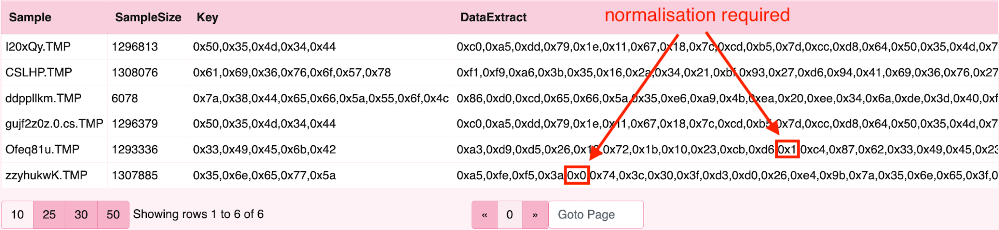
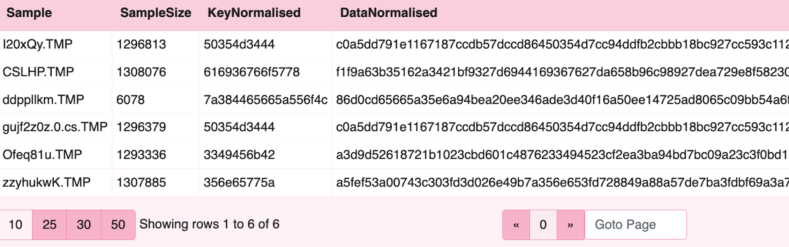
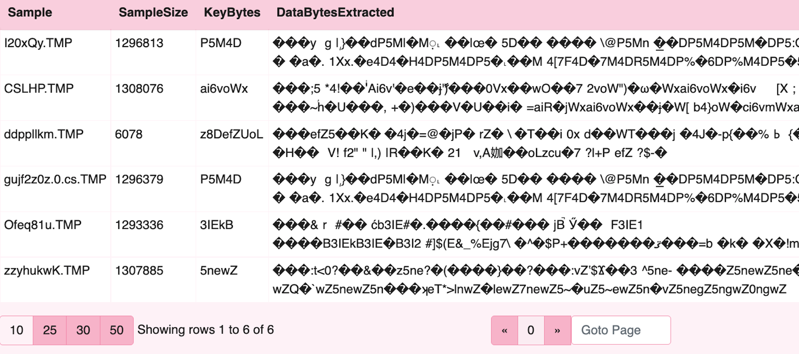
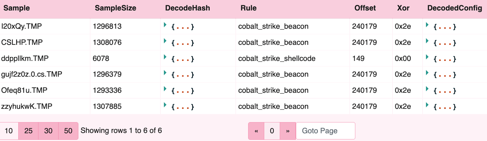
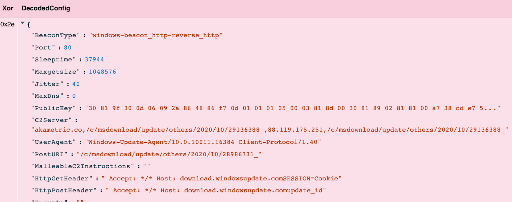
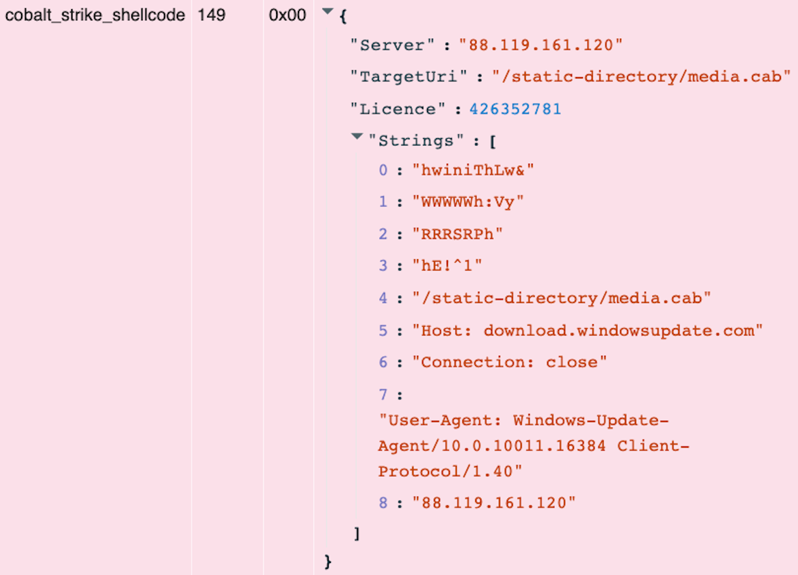
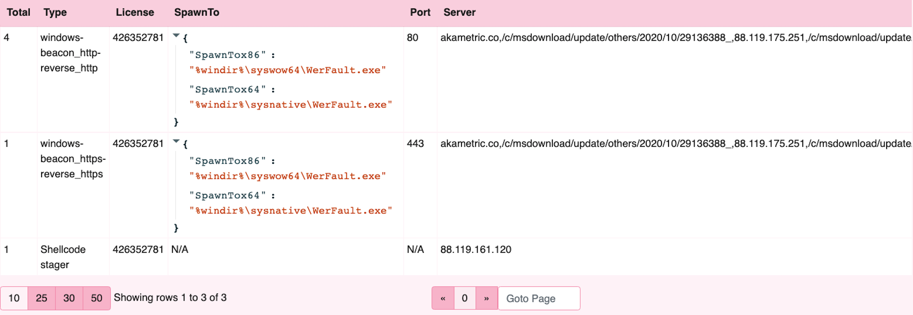

Velociraptor’s ability for data manipulation is a core platform capability
that drives a lot of the great content we have available in terms of data
parsing for artifacts and live analysis. After a recent engagement with
less common encoded Cobalt Strike beacons, and finding sharable files on
VirusTotal,  I thought it would be a good opportunity to walk through some
workflow around data manipulation with VQL for analysis. In this post I
will walk though some background, collection at scale, and finally talk
about processing target files to extract key indicators.


## Background

The Microsoft Build Engine (MSBuild.exe) is a signed Windows binary that
can  be used to load C# or Visual Basic code via an inline task project
file. Legitimately used in Windows software development, it can handle XML
formatted task files that define requirements for loading and building
Visual Studio configurations. Adversaries can abuse this mechanism for
execution as defence evasion and to bypass application whitelisting -
[ATT&CK T1127](https://attack.mitre.org/techniques/T1127/001/).

In this particular engagement, the Rapid7 MDR/IR team responded to an
intrusion in which during lateral movement, the adversary dropped many
variants of an MSBuild inline task file to several machines and then
executed MSBuild via wmi to load an embedded Cobalt Strike beacon.
Detecting an in memory Cobalt Strike beacon is trivial for active threats
with our process based yara and carving content.

The problem in this case was: how do you discover, then decode these encoded
files on disk quickly to find any additional scope using Velociraptor?


## Collection

First task is discovery and collecting our files in scope from the network.
Typically this task may be slow to deploy or rely on cobbled together
capabilities from other teams. The Velociraptor hunt is an easy button for
this use case.


Velociraptor has several valuable artifacts for hunting over Windows file
systems with yara: `Windows.Detection.Yara.NTFS` and `Generic.Detection.Yara.Glob`
spring to mind readily.  In this instance I am selecting Yara.NTFS. I have
leveraged this artifact in the field for hunting malware, searching logs or
any other capability where both metadata and content based discovery is desired.

{}
* This artifact searches the MFT, returns a list of target files then runs Yara over the target list.
* The artifact leverages `Windows.NTFS.MFT` so similar regex filters can be applied including Path, Size and date.
* The artifact also has an option to search across all attached drives and upload any files with Yara hits.

Some examples of path regex may include:

* Extension at a path: Windows/System32/.+\\.dll$
* More wildcards: Windows/.+/.+\\.dll$
* Specific file: Windows/System32/kernel32\.dll$
* Multiple extentions: \.(php|aspx|resx|asmx)$
{}


The file filter: `Windows/Temp/[^/]*\.TMP$` will suffice in this case to target
our adversaries path for payloads before applying our yara rule. Typically when
running discovery like this, an analyst can also apply additional options like
file size or time stamp bounds for use at scale and optimal performance.
The yara rule deployed in this case was simply quick and dirty hex conversion of
text directly from the project file referencing the unique variable setup that
was common across acquired samples.

```yara
rule MSBuild_buff {
   meta:
      description = "Detect unique variable setup MSBuild inline task project file"
      author = "Matt Green - @mgreen27"
      date = "2021-10-22"
   strings:
    // byte[] buff = new byte[]
    $buff = { 62 79 74 65 5b 5d 20 62 75 66 66 20 3d 20 6e 65 77 20 62 79 74 65 5b 5d }

    // byte[] key_code = new byte[]
    $key_code = { 62 79 74 65 5b 5d 20 6b 65 79 5f 63 6f 64 65 20 3d 20 6e 65 77 20 62 79 74 65 5b 5d }

condition:
      any of them
}
```


After launching the hunt, results become available inside the hunt entry on the
Velociraptor server for download or additional analysis.


## Payload decode
The Cobalt Strike payload is a string with represented characters xor encoded
as a hex formatted buffer and key in embedded C Sharp code as seen below.


### Enumerate collected files and find location on server
So far we have only collected files that have suspicious content. Now we want
to post process the result and try to extract more information from the payload.

{}
The Velociraptor notebook is a gui component that lets the user run VQL directly
on the server. In this case we are leveraging the notebook attached to our hunt
to post process results opposed to downloading the files and processing offline.
{}

Our first step of decode is to examine all the files we collected in the hunt.
The first query enumerates all the individual collections in the hunt, while the
second query retrieves the files collected for each job.

```vql
-- find flow ids for each client
LET hunt_flows = SELECT *, Flow.client_id as ClientId, Flow.session_id as FlowId
FROM hunt_flows(hunt_id='H.C6508PLOOPD2U')

-- extract uploaded files and path on server
Let targets = SELECT  * FROM foreach(row=hunt_flows,
    query={
        SELECT
            file_store(path=vfs_path) as SamplePath,
            file_size as SampleSize
        FROM uploads(client_id=ClientId,flow_id=FlowId)
    })

SELECT * FROM targets
```


### Extract encoded payload and xor key
For the second step, to extract target bytes we leverage the `parse_records_with_regex()`
plugin to extract the strings of interest (Data and Key) in our target files.
Note: the buffer_size argument allows VQL to examine a larger buffer than the
default size in order to capture the typically very large payloads in these build
files. We have also included a 200 character limitation on the data field initially
as this will improve performance when working on VQL. We have also specified buffer
size to be larger than default and just larger than the biggest payload in scope.


```vql
-- regex to extract Data and Key fields
LET target_regex = 'buff = new byte\\[\\]\\s*{(?P<Data>[^\\n]*)};\\s+byte\\[\\]\\s+key_code = new byte\\[\\]\\s*{(?P<Key>[^\\n]*)};\\n'

SELECT * FROM foreach(row=targets,
    query={
        SELECT
            basename(path=SamplePath) as Sample,
            SampleSize,
            Key, --obtained from regex
            read_file(filename=Data,accessor='data',length=200) as DataExtract -- obtained by regex, only output 200 characters
        FROM parse_records_with_regex(
            file=SamplePath,buffer_size=15000000,
            regex=target_regex)
    })
```


{}
`parse_records_with_regex()` is a VQL plugin that parses a file with a set of regexp and yields matches as records. The file is read into a large buffer. Then each regular expression is applied to the buffer, and all matches are emitted as rows.

The regular expressions are specified in the Go syntax. They are expected to contain capture variables to name the matches extracted.

The aim of this plugin is to split the file into records which can be further parsed. For example, if the file consists of multiple records, this plugin can be used to extract each record, while `parse_string_with_regex()` can be used to further split each record into elements. This works better than trying to write a more complex regex which tries to capture a lot of details in one pass.
{}





### Extract normalisation

The third step adds a custom function for hex normalisation and converts the inline
C Sharp style encoding to a standard hex encoded string which VQL can easily parse.
In this case, the local normalise function will ensure we have  valid 2 character hex.
The `regex_replace()` will strip the leading '0x' from the hex strings and prepare for
xor processing.

```vql
-- regex to extract Data and Key fields
LET target_regex = 'buff = new byte\\[\\]\\s*{(?P<Data>[^\\n]*)};\\s+byte\\[\\]\\s+key_code = new byte\\[\\]\\s*{(?P<Key>[^\\n]*)};\\n'

-- normalise function to fix bad hex strings
LET normalise_hex(value) = regex_replace(source=value,re='0x(.)[,}]',replace='0x0\$1,')

SELECT * FROM foreach(row=targets,
    query={
        SELECT
            basename(path=SamplePath) as Sample,
            SampleSize,
            regex_replace(re="0x|,", replace="", source=normalise_hex(value=Key)) as KeyNormalised,
            regex_replace(re="0x|,", replace="", source=normalise_hex(value=Data)) as DataNormalised
        FROM parse_records_with_regex(
            file=SamplePath,buffer_size=15000000,
            regex=target_regex)
    })
```



### Extract to bytes

The fourth step converts hex to bytes and validates that the next stage is working. In the example VQL below
we pass the hex text to the `unhex()` function to produce raw bytes for our variables.

```vql
SELECT * FROM foreach(row=targets,
    query={
        SELECT
            basename(path=SamplePath) as Sample,
            SampleSize,
            unhex(string=regex_replace(re="0x|,", replace="", source=normalise_hex(value=Key))) as KeyBytes,
            read_file(filename=
                unhex(string=regex_replace(re="0x|,", replace="", source=normalise_hex(value=Data))),
                    accessor='data',length=200) as DataBytesExtracted
        FROM parse_records_with_regex(
            file=SamplePath,buffer_size=15000000,
            regex=target_regex)
    })
```




### Xor decode

VQL's flexibility comes with its ability to reuse existing artifacts in different ways.
The fifth step is running Velociraptor’s `xor()` function and piping the output into our
the existing `Windows.Carving.CobaltStrike()` configuration decoder.

```vql
-- extract bytes
LET bytes <= SELECT * FROM foreach(row=targets,
    query={
        SELECT
            SamplePath, basename(path=SamplePath) as Sample, SampleSize,
            unhex(string=regex_replace(re="0x|,", replace="", source=normalise_hex(value=Key))) as KeyBytes,
            read_file(filename=
                unhex(string=regex_replace(re="0x|,", replace="", source=normalise_hex(value=Data))),
                    accessor='data') as DataBytes
        FROM parse_records_with_regex(
            file=SamplePath,buffer_size=15000000,
            regex=target_regex)
    })

-- pass bytes to cobalt strike parser and format key indicators im interested in
SELECT *, FROM foreach(row=bytes,query={
    SELECT *,
        basename(path=SamplePath) as Sample,SampleSize
    FROM Artifact.Windows.Carving.CobaltStrike(TargetBytes=xor(key=KeyBytes,string=DataBytes))
})
```



Decoded Cobalt Strike configuration is clearly observed.



The smallest file also includes a Cobalt Strike shellcode stager, which I have recently
added to the Velociraptor Cobalt Strike parser.




### Additional analysis

Finally, we may have a desire to extract specific key indicators and compare across
samples. A simple data stack on key indicators of interest.

```vql
-- pass bytes to cobalt strike parser and format key indicators im interested in
LET cobalt = SELECT *, FROM foreach(row=bytes,query={
    SELECT
        basename(path=SamplePath) as Sample,SampleSize,
        Hash as DecodeHash,
        Rule,Offset,Xor,DecodedConfig
    FROM Artifact.Custom.Windows.Carving.CobaltStrike(TargetBytes=xor(key=KeyBytes,string=DataBytes))
})

-- quick data stack on a few things to show sample analysis
SELECT count() as Total,
    if(condition= Xor=~'^0x(2e|69)$', then=DecodedConfig.BeaconType, else= 'Shellcode stager') as Type,
    if(condition= Xor=~'^0x(2e|69)$', then=DecodedConfig.LicenseId, else= DecodedConfig.Licence) as License,
    if(condition= Xor=~'^0x(2e|69)$', then=dict(SpawnTox86=DecodedConfig.SpawnTox86,SpawnTox64=DecodedConfig.SpawnTox64), else= 'N/A') as SpawnTo,
    if(condition= Xor=~'^0x(2e|69)$', then=DecodedConfig.Port, else= 'N/A') as Port,
    if(condition= Xor=~'^0x(2e|69)$', then=DecodedConfig.C2Server, else= DecodedConfig.Server) as Server
FROM cobalt
GROUP BY Type, Licence,SpawnTo,Port,Server
```




## Conclusions

In this post we showed discovery, then decode of encoded Cobalt Strike beacons on disk.
Velociraptor can read, manipulate and enrich data efficiently across a large network
without the overhead of needing to extract and process manually.

Whilst most traditional workflows concentrate on collection and offline analysis,
Velociraptor notebook also enables data manipulation and flexibility in analysis.
If you would like to try out these features in Velociraptor, It is available on
[GitHub](https://github.com/Velocidex/velociraptor) under an open source license. As
always, please file issues on the bug tracker or ask questions on our mailing list
velociraptor-discuss@googlegroups.com. You can also chat with us directly on discord
at https://www.velocidex.com/discord.


## References
[MITRE ATT&CK T1127.001 - Trusted Developer Utilities Proxy Execution: MSBuild](https://attack.mitre.org/techniques/T1127/001/)
[MSBuild Inline Task template](https://github.com/3gstudent/msbuild-inline-task)
[VirusTotal sample - "I20xQy.TMP"](https://www.virustotal.com/gui/file/cf54b9078d63eaeb0300e70d0ef6cf4d3a4d83842fe08cb951f841549663e1e2)
[VirusTotal sample - "CSLHP.TMP"](https://www.virustotal.com/gui/file/52ade62a412fed9425b75610620c85d9c143593cd50c2269066b120ac05dc8c3)
[VirusTotal sample - "ddppllkm.TMP"](https://www.virustotal.com/gui/file/b4ede02ea3c198f5e7d3fbab3cadc1266538d23a43a2825ece7d4c75b7208fa9)
[VirusTotal sample - "gujf2z0z.0.cs.TMP"](https://www.virustotal.com/gui/file/152722a89fd87ecdf73fd18558622f22f980bddd6928cad31859453d41f7b8dd)
[VirusTotal sample - "Ofeq81u.TMP"](https://www.virustotal.com/gui/file/78d2078c4e740aff4a2a289387ba8cfc1de6c02ed48c4c65b53582303192dab2)
[VirusTotal sample - "zzyhukwK.TMP"](https://www.virustotal.com/gui/file/507f988ab1f8229e84bb83dcb5a896b1747957b998aad7c7ccdd301096726999)
