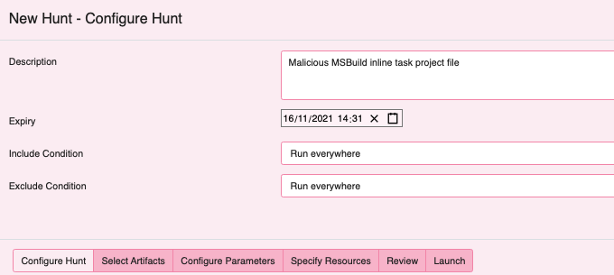
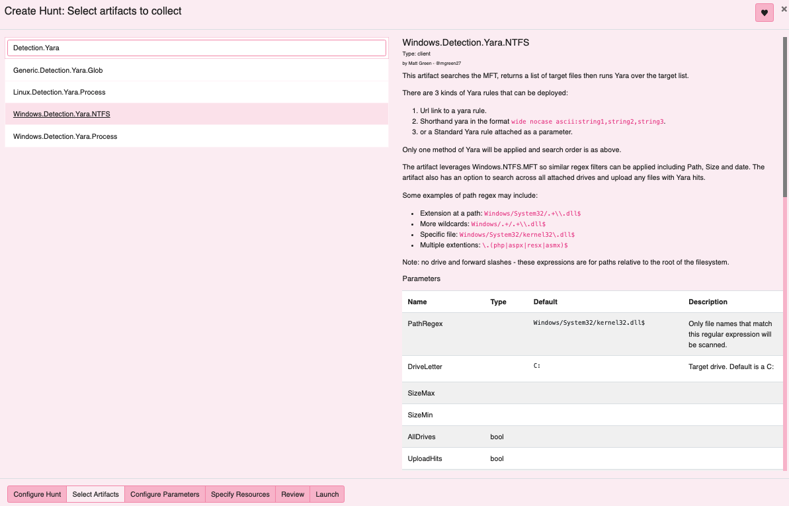

## Data manipulation in VQL: Cobalt Strike payload discovery

Velociraptor’s ability for data manipulation is a core platform capability 
that drives a lot of the great content we have available in terms of data 
parsing for artifacts and live analysis. After observing a recent 
engagement with several encoded Cobalt Strike beacons, then finding 
sharable files on VirusTotal,  I thought it would be a good opportunity 
to walk through some workflow around data manipulation and VQL for 
analysis.

## Background

The Microsoft Build Engine (MSBuild.exe) is a signed Windows binary that 
can  be used to load C# or Visual Basic code via an inline task project 
file. Legitimately used in Windows software development, it can handle XML 
formatted task files that define requirements for loading and building 
Visual Studio configurations. Adversaries can abuse this mechanism for 
execution as defence evasion and to bypass application whitelisting - 
[ATT&CK T1127](https://attack.mitre.org/techniques/T1127/001/).

In this particular engagement, the Rapid7 MDR/IR team responded to an 
intrusion where during lateral movement, the adversary dropped many 
variants of an MSBuild inline task file to several machines and then 
executed MSBuild via wmi to load an embedded Cobalt Strike beacon. 
Detecting an in memory Cobalt Strike beacon is trivial for active threats 
with our process based yara and carving content. The problem in this case 
was: how do you discover, then decode these encoded files on disk quickly 
to find any additional scope using Velociraptor?

## Collection

First task is discovery and collecting our files in scope. 

Velociraptor has several valuable artifacts for hunting over Windows file 
systems with yara: Windows.Detection.Yara.NTFS and Generic.Detection.Yara.Glob. 
In this instance I am selecting Yara.NTFS. I have leveraged this artifact 
in the field for hunting malware, searching logs or any other capability 
where both metadata and content based discovery is desired.

The file filter: `Windows/Temp/[^/]*\.TMP$` will suffice in this case before 
applying our yara rule. Applying other additional options like size or time 
stamp bounds before deploying the yara rule, enables targeted collection at 
scale and optimal performance. The yara rule deployed in this case was simply 
text directly from the project file referencing the unique variable setup.

