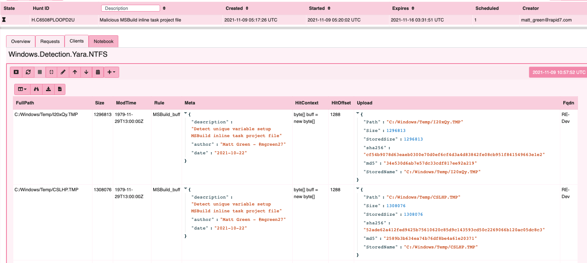
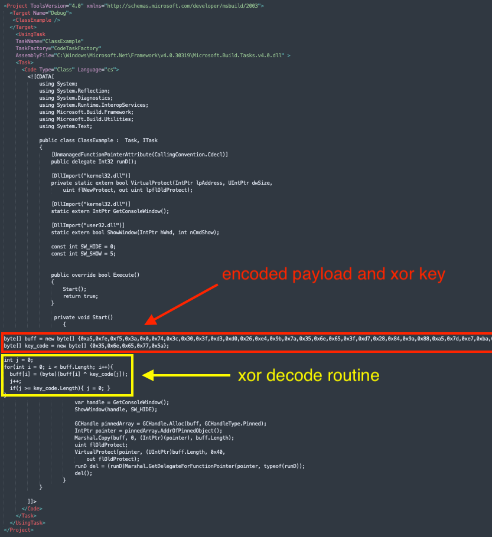

## Cobalt Strike payload discovery and data manipulation

Velociraptor’s ability for data manipulation is a core platform capability 
that drives a lot of the great content we have available in terms of data 
parsing for artifacts and live analysis. After observing a recent 
engagement with several encoded Cobalt Strike beacons, then finding 
sharable files on VirusTotal,  I thought it would be a good opportunity 
to walk through some workflow around data manipulation and VQL for 
analysis.

## Background

The Microsoft Build Engine (MSBuild.exe) is a signed Windows binary that 
can  be used to load C# or Visual Basic code via an inline task project 
file. Legitimately used in Windows software development, it can handle XML 
formatted task files that define requirements for loading and building 
Visual Studio configurations. Adversaries can abuse this mechanism for 
execution as defence evasion and to bypass application whitelisting - 
[ATT&CK T1127](https://attack.mitre.org/techniques/T1127/001/).

In this particular engagement, the Rapid7 MDR/IR team responded to an 
intrusion in which during lateral movement, the adversary dropped many 
variants of an MSBuild inline task file to several machines and then 
executed MSBuild via wmi to load an embedded Cobalt Strike beacon. 
Detecting an in memory Cobalt Strike beacon is trivial for active threats 
with our process based yara and carving content. 

The problem in this case was: how do you discover, then decode these encoded 
files on disk quickly to find any additional scope using Velociraptor?

## Collection

First task is discovery and collecting our files in scope from the network. 
Typically this task may be slow to deploy or rely on cobbled together 
capabilies from other teams. The Velociraptor hunt is an easy button for 
this use case.

Velociraptor has several valuable artifacts for hunting over Windows file 
systems with yara: Windows.Detection.Yara.NTFS and Generic.Detection.Yara.Glob
spring to mind readily.  In this instance I am selecting Yara.NTFS. I have 
leveraged this artifact in the field for hunting malware, searching logs or 
any other capability where both metadata and content based discovery is desired.

The file filter: `Windows/Temp/[^/]*\.TMP$` will suffice in this case to target 
our adversaries path for payloads before applying our yara rule. Typically when 
running discovery like this, an analyst can also apply additional options like 
file size or time stamp bounds for use at scale and optimal performance. 
The yara rule deployed in this case was simply quick and dirty text directly 
from the project file referencing the unique variable setup that was common 
across acquired samples.

After launching the hunt, results become availible at the server for download 
and additional analysis.

## Payload decode
The Cobalt Strike payload is a string with represented characters xor encoded 
as a hex formatted buffer and key in embedded C Sharp code as seen below.

In this case, I can run analysis directly in the hunt notebook on results. Our 
first step of decode is to examine all the files we collected in the hunt. The 
first query enumerates all the individual collections in the hunt, while the 
second query retrieves the files collected for each job.

For the second step, to extract target bytes we leverage the parse_records_with_regex() 
plugin to extract the strings of interest (Data and Key) in our target files. 
Note: the buffer_size argument allows VQL to examine a larger buffer than the 
default size in order to capture the typically very large payloads in these build 
files. We have also included a 200 character limitation on the data field initially 
as this will improve performance when working on VQL.

The third step adds a custom function for hex normalisation and converts the inline 
C Sharp style encoding to a standard hex encoded string which VQL can easily parse.

The fourth step converts hex to bytes and validates that the next stage is working.

VQL's flexibility comes with its ability to reuse existing artifacts in different ways. 
The fifth step is running Velociraptor’s xor function and piping the output into our 
the existing Cobalt Strike configuration decoder (originally designed to extract 
configuration from memory). 

## Conclusions

In this post we showed discovery, then decode of encoded Cobalt Strike beacons on disk. 
Velociraptor can read, manipulate and enrich data efficiently across a large network 
without the overhead of needing to extract and process manually.

Whilst most traditional workflows concentrate on collection and offline analysis, 
Velociraptor notebook also enables data manipulation and flexability in analysis. 
If you would like to try out these features in Velociraptor, It is available on 
[GitHub](https://github.com/Velocidex/velociraptor) under an open source license. As 
always, please file issues on the bug tracker or ask questions on our mailing list 
velociraptor-discuss@googlegroups.com. You can also chat with us directly on discord 
at https://www.velocidex.com/discord.

