Many people use Velociraptor's [offline collector]() feature to collect any artifacts without
having the Velociraptor client actually installed on the
endpoint. While the offline collector feature is great to
interactively triage a machine, the produced collection zip file is
normally quite large and unwieldy to transfer.

To help with this, Velociraptor offers the option to send the file
back to the cloud via a number of mechanisms, including upload to S3
buckets directly, WebDAV upload and using Secure FTP (sftp).

One of the challenges with automatic uploading to the cloud is
securely configuring the upload mechanism. Since the credentials for
any upload service are embedded inside the collector, it is important
to ensure that these credentials have minimal additional permissions.

For example, when using a cloud bucket to collect triage data from
endpoints, the bucket policy must be configured to allow a service
account full write access. However, using these credentials should not
allow anyone to list existing bucket resources, or to download
critical triage data from other hosts!

I have [previously]() described how to use Google cloud's service accounts to upload to
a GCP bucket securely.

In this post I describe how to set up Amazon's SFTP transfer service
to securely allow the Velociraptor collector to upload files without
granting the collector permission to download the files again, delete
them or discover other uploads in the bucket.

I would like to thank Simon Irwin from Rapid7 for his assistance and
guidance with AWS - I am certainly not an expert and needed a lot of
help figuring this process out. This is one of the reasons I wanted to
document the process in order to save others time.

## Overview

The main AWS service I will use is the [AWS Transfer Family](https://docs.aws.amazon.com/transfer/latest/userguide/what-is-aws-transfer-family.html) documented extensively on the AWS documentation site.

In a nutshell, the service requires creating an sftp transfer server
backed by an S3 bucket. The SFTP server does not use real usernames
for authentication, but rather throwaway usernames I create just for
that service.

Each of these throwaway sftp users are given an SSH key pair (public
and private keys) which they use to authenticate with the service. The
private key will be embedded in the Velociraptor collector and allow
the collector to upload to the service. However, by setting up
restrictive policies I can limit the permissions of the sftp user.

## Creating an AWS bucket

I will begin by creating an S3 bucket called `velociraptor-test` that
will contain all the collector files uploaded from the endpoints.

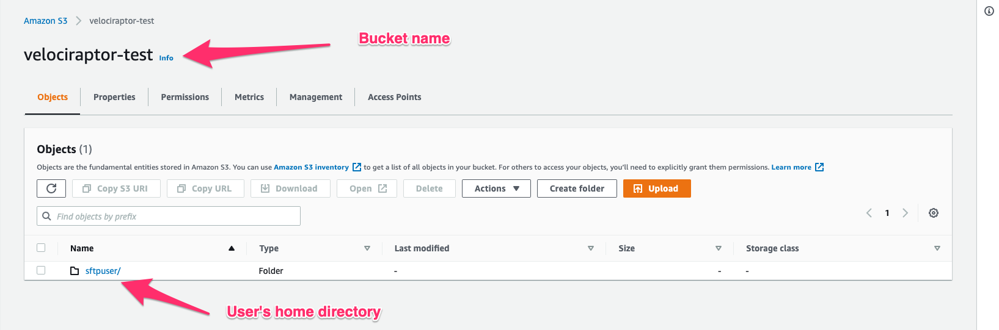

## AWS Policies

AWS controls access via roles and policies. For this configuration I
will need to create two policies:

1. The first policy I will call `velociraptor-upload-policy` grants
   full access to the AWS transfer service with full use of the
   provided s3 bucket.

2. The second policy I will call `velociraptor-sftp-upload-only`
   policy will apply to the sftp user and only grant upload
   permissions.

### velociraptor-upload-policy

This policy grants full access to the new bucket I created earlier.

```json

{
  "Version": "2012-10-17",
  "Statement": [
  {
    "Effect": "Allow",
    "Action": [
      "s3:PutObject",
      "s3:GetObject",
      "s3:ListBucket",
      "s3:DeleteObject",
      "s3:PutObjectAcl"
    ],
    "Resource": [
       "arn:aws:s3:::velociraptor-test",
       "arn:aws:s3:::velociraptor-test/*"
    ]
  }
 ]
}
```

### velociraptor-sftp-upload-only

This policy only grants upload rights

```json
{
"Version": "2012-10-17",
"Statement": [
  {
    "Sid": "AllowListingOfUserFolder",
    "Action": [
      "s3:ListBucket"
    ],
    "Effect": "Allow",
    "Resource": [
      "arn:aws:s3:::${transfer:HomeBucket}"
     ],
    "Condition": {
      "StringLike": {
          "s3:prefix": [
              "${transfer:HomeFolder}/*",
              "${transfer:HomeFolder}"
          ]
      }
    }
  },
  {
    "Sid": "HomeDirObjectAccess",
    "Effect": "Allow",
    "Action": [
      "s3:PutObject",
      "s3:PutObjectACL"
    ],
    "Resource": "arn:aws:s3:::${transfer:HomeDirectory}*"
  }
]
}
```

{}

I found that I needed to give the `s3:ListBucket` permission in order
to upload files - this seems a bit strange to me but I could not get
upload to work without this permission. Despite having this
permission, it is still not possible to actually list the files in the
bucket anyway.

{}

## AWS Roles

An AWS role is a set of policies that applies to a particular
service. In this case I will create a new role that allows uploading
to the s3 bucket I created. Search for the [IAM
screen](https://console.aws.amazon.com/iamv2/home#/roles) in the AWS
console and select "Create a new role".

In the first step, the UI asks us to associate the role with a
service, Select the `Transfer` as the service.

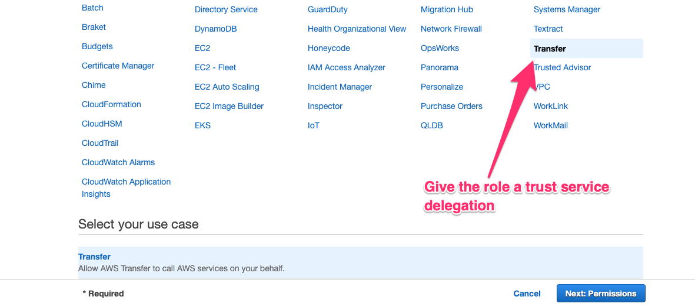

Next associate the role with the `velociraptor-upload-policy`
policy. I will name the role `velociraptor-upload-role`.

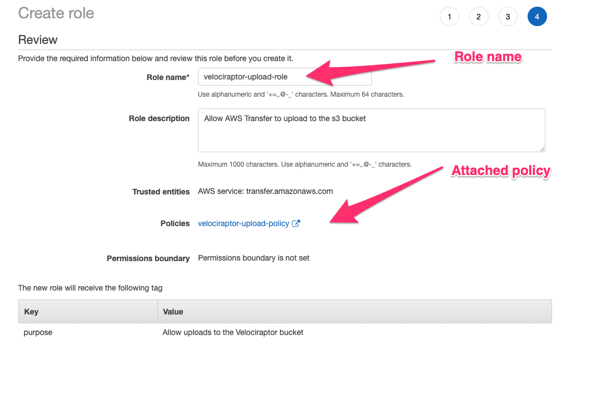

## Creating the SFTP server

Now I need to create an sftp server in the Transfer service. Search
for the [AWS Transfer
Family](https://us-east-2.console.aws.amazon.com/transfer/home) screen
and select "Create Server". I will choose this to be an SFTP server.

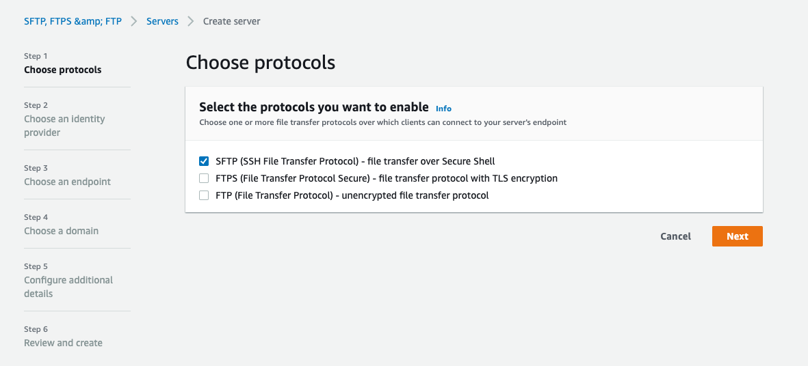

The identity provider is "Service managed" - this means I will manage
the sftp users with throwaway ssh keys.

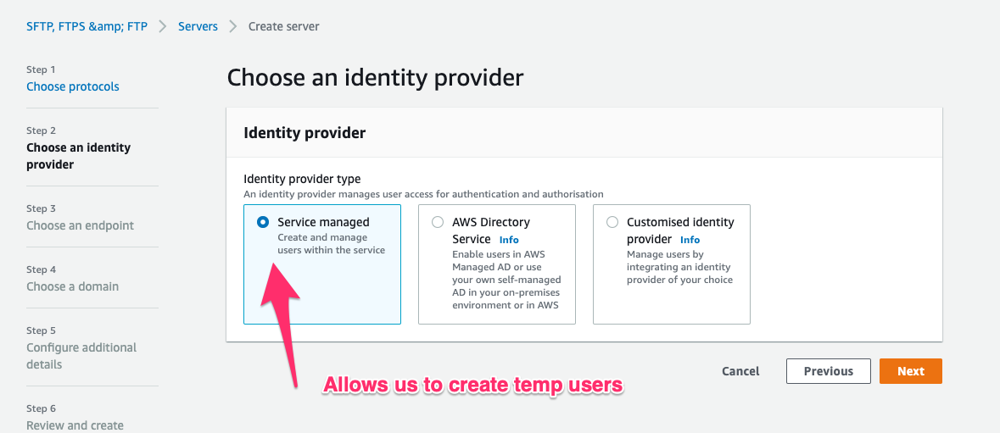

Finally I will choose S3 to be our storage backend

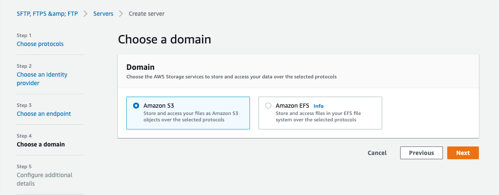

Once the server is created, the AWS console will remind us that no
users are added to the service yet. This will be our next task...

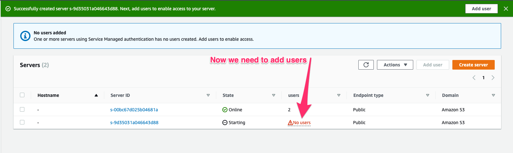

## Adding SFTP users to the sftp server.

Our ultimate goal is to create throw-away sftp users which can
authenticate to the service with an SSH key pair and upload triage
files.

I will now create an SSH key pair on my machine - this will contain a
private key and a public key (Note: do not protect these keys with a
passphrase):

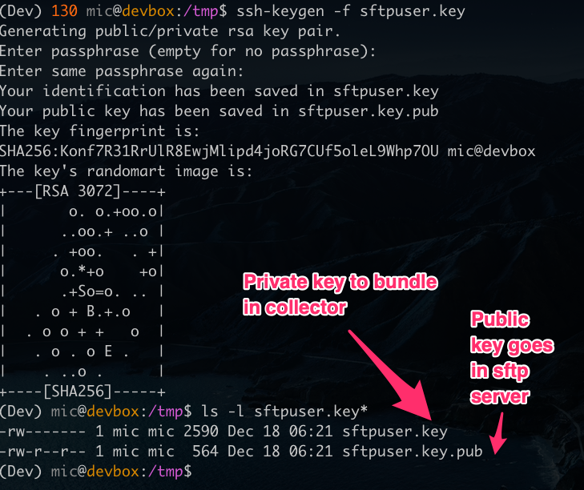

In the AWS console I select the new server and click on "Add user" to
add a new user.

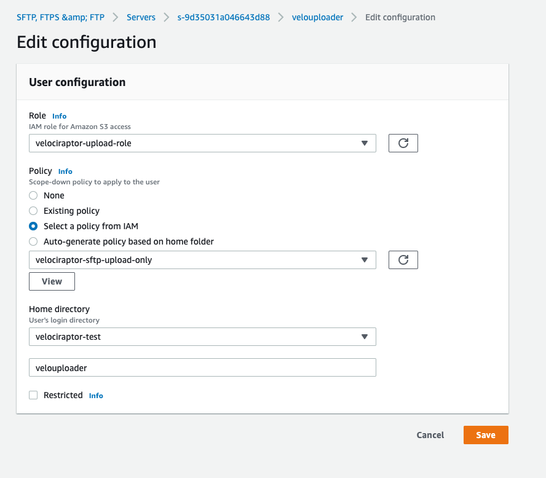

I will add the `velociraptor-upload-role` role I created earlier to
this sftp user, allowing the user to interact with the s3 bucket.

I will now also add a `scope down policy` to further restrict the
access this user has to upload only by selecting the
`velociraptor-sftp-upload-only` policy.

Next I will add the user's public key to the AWS console's
configuration by simply pasting the public key I generated earlier.

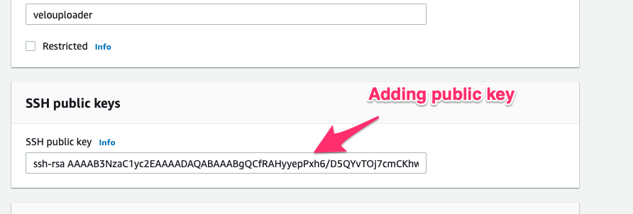

Finally I create the new user with the name `velouploader`

{}

In our example I created a user with an upload only policy that could
not read any of the files in the bucket. However, you can also create
a user with full access to the bucket by removing the scope down policy
or apply a different policy per user.

This is convenient to allow the investigator the ability to download
the collected files by creating a separate sftp user for them without
a scope-down policy.

{}

## Testing access controls

It is imperative to ensure that access controls are working the way
they are supposed to! Therefore I will now test my setup using the
built in sftp client in my operating system (I can find the endpoint's
public DNS name using the AWS console).

```sh
sftp -i sftpuser.key velouploader@s-9d35031a046643d88.server.transfer.us-east-2.amazonaws.com
```

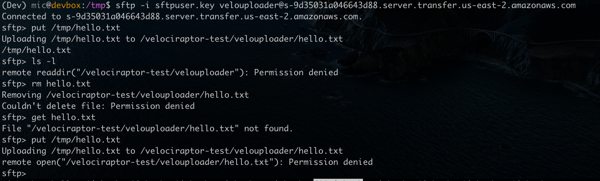

At first I upload a small file and confirm it works as expected. Then
I try to list the directory, and read the file out again - both
attempts fail due to the scope down policy.

Finally attempting to overwrite the old file by re-uploading the same
file again, also fails.

## Creating an SFTP Offline Collector

I am now ready to create our offline collectors. I will login to
Velociraptor's web UI and navigate to `Server Artifacts` screen. Once
there I click the `Build Offline Collector` button. For this example,
I will create a collector using the `Windows.KapeFiles.Targets`
artifact and just collect the `$MFT` file.

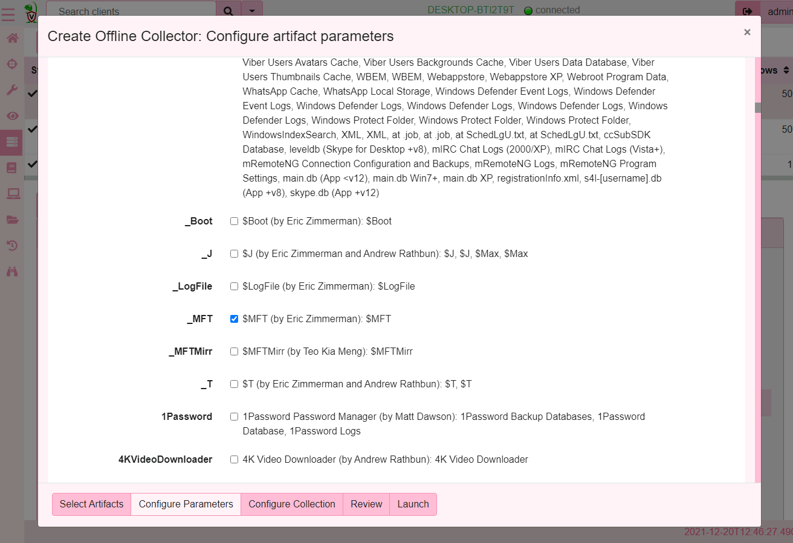

Now I will configure the collector to use the SFTP upload method,
giving the username I created earlier and pasting the private key I
generated.

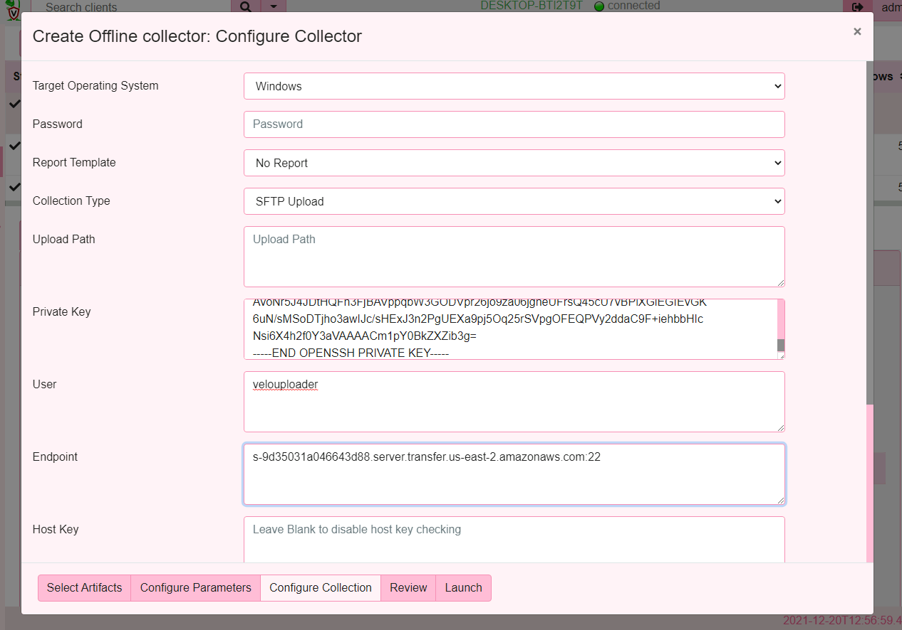

I selected the collection method to SFTP which changes the form to
allow for more parameters to be specified:

* The Private key is the file I generated earlier with `ssh-keygen` - I will just paste the file content into this form.
* The user is the sftp user that Velociraptor will log in as.
* The Endpoint is the DNS name of the sftp server I created followed
  by a colon and the port number (usually port 22).

Once the collector is created I am able to run it on a test system.

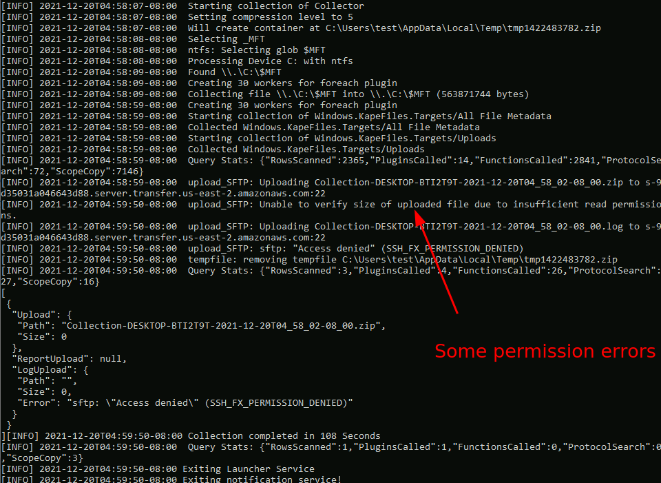

As can be seen the upload is mostly fine except there are some
features that are not possible due to the restricted
permissions. Although, the log file shows a failure the file did
successfully upload as can be confirmed in the bucket view.

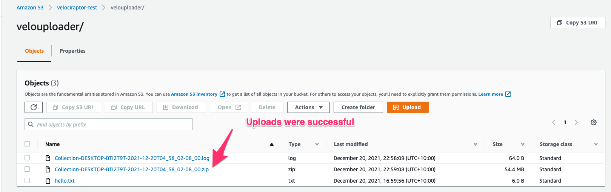

# Conclusions

In this post I examined how to configure a secure SFTP upload service
in AWS that can safely receive triage data from the Velociraptor
offline collector.

The sftp uploading functionality is actually implemented by the
`upload_sftp()` plugin [documented here](). This means that you can use
this functionality in any VQL query at all - either on the client side
or on the server side.

For example it is possible to automatically back up server side hunts
or collections to the SFTP bucket.
