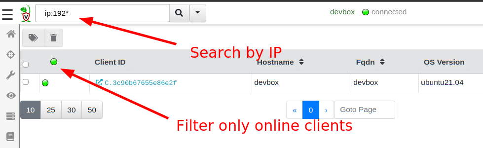
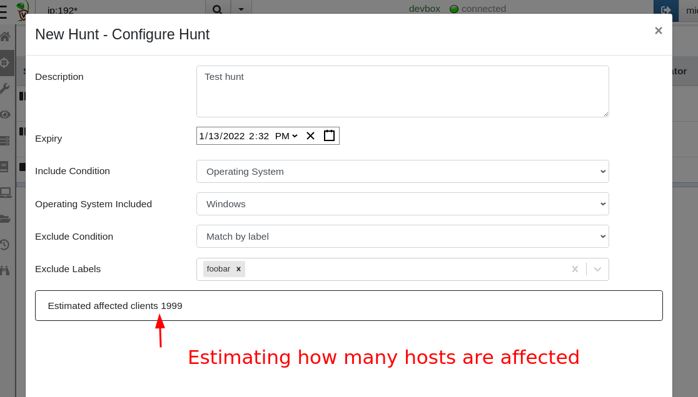
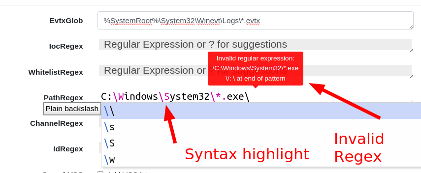
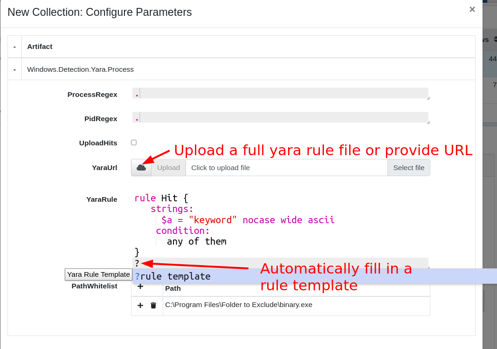

I am very excited to announce the latest Velociraptor release
0.6.3. This release has been in the making for a few months now and
has a lot of new features.

The main focus of development since our previous release was around
scalability and speed. Working with some of our larger partners on
scaling Velociraptor to a large number of endpoints, we have addressed
a number of challenges, which I believe have improved Velociraptor for
everyone at any level of scale!

## Performance running on EFS

Running on a distributed filesystem such as EFS presents many
advantages, not the least of which is removing the risk that disk space
will run out! Many users previously faced disk full errors when
running large hunts and accidentally collecting too much data from
endpoints! Since Velociraptor is so fast, it is easy to do a hunt
collecting a large number of files and then pretty soon the disk is
full.

Using EFS removed this risk since storage is essentially infinite (but
not free). So there is a definite advantage to running the data store
on EFS even when not running multiple frontends.  When scaling to
multiple frontends, EFS use is essential to facilitate as a shared
distributed filesystem among all the servers.

However, EFS presents some challenges. Although conceptually EFS
behaves as a transparent filesystem, in reality the added network
latency of EFS IO was causing unacceptable performance issues.

In this release we employed a number of strategies to improve
performance on EFS (and potentially other distributed filesystems
e.g. NFS). You can read all about the [new changes here](), but the gist of it is
that added caching and delayed writing strategies help to isolate the
GUI performance from the underlying EFS latency, making the GUI
snappy and quick even with slow filesystems.

I encourage everyone to test the new release on an EFS backend, to
assess the performance on this setup - there are many advantages to
this configuration. While this configuration is still considered
experimental it is running successfully in a number of environments.

## Searching and indexing

More as a side effect of the EFS work, Velociraptor 0.6.3 moves the
client index into memory. This means that searching for clients by DNS
name or labels is almost instant, much improving the performance of
these operations over previous version.

VQL queries that walk over all clients, are now very fast as well. For
example the following query iterates over all clients (maybe
thousands!) and checks if their last IP came from a particular subnet:

```vql
SELECT * , split(sep=":", string=last_ip)[0] AS LastIp
FROM clients()
WHERE cidr_contains(ip=LastIp, ranges="192.168.1.0/16")
```

This query will complete in a few seconds even with a large number of
clients.

The GUI search bar can now search for IP addresses
(e.g. `ip:192.168*`), and the online only filter is much faster as a
result!



Another benefit of rapid index searching is that we can now quickly
estimate how many hosts will be affected by a hunt (calculated based
on how many hosts are included and how many are excluded from the
hunt). When users have multiple label groups this helps to quickly
understand how targeted a specific hunt is.




## Regular expressions and Yara rules

Velociraptor artifacts are just a way of wrapping a VQL query inside a
YAML file for ease of use. Artifacts accept parameters that are passed
to the VQL itself controlling how it runs.

Velociraptor artifacts accept a number of parameters of different
types. Sometimes, they accept a windows path - for example the
`Windows.EventLogs.EvtxHunter` artifact accepts a Windows glob path
like `%SystemRoot%\System32\Winevt\Logs\*.evtx`. In the same artifact,
we also can provide a `PathRegex` which is a regular expression.

A regular expression is not the same thing as a path at all, and in
fact when users get mixed up providing something like
`C:\Windows\System32` to a regular expression field, this is an
invalid expressions - backslashes have a specific meaning in a regular
expression!

In 0.6.3 there are now dedicated GUI elements for Regular Expression
inputs. Special regex patterns such as backslash sequences are
visually distinct. Additionally the GUI verifies that the regex is
syntactically correct and offers suggestions. Users can type `?` to
receive further regular expression suggestions and help them build
their regex.



To receive a RegEx GUI selector in your custom artifacts, simply
denote the parameter's type as `regex`.

Similarly other artifacts require the user enter a Yara rule to use
the `yara()` VQL plugin. The Yara domain specific language (DSL) is
rather verbose so even for very simple search terms (e.g. a simple
keyword search) a full rule needs to be constructed.

To help with this task, the GUI now presents a specific Yara GUI
element. Users can press `?` to automatically fill in a skeleton Yara
rule suitable for a simple keyword match. Additionally, syntax
highlighting gives visual feedback to the validity of the yara syntax.



Some artifacts allow file upload as a parameter to the artifact. This
allows users to upload larger inputs for example a large Yara
rule-set. The content of the file will be made available to the VQL
running on the client transparently.

To receive a RegEx GUI selector in your custom artifacts, simply
denote the parameter's type as `yara`. To allow uploads in your
artifact parameters simply denote the parameter as a `upload`
type. Within the VQL, the content of the uploaded file will be
available as that parameter.


## Overriding Generic.Client.Info

When a new client connects to the Velociraptor server, the server
performs an `Interrogation` flow by scheduling the
`Generic.Client.Info` artifact on it. This artifact collects basic
metadata about the client such as the type of OS it is, the hostname,
the version of Velociraptor etc. This information is used to feed the
search index and is also displayed in the "VQL drilldown" page of the
`Host Information` screen.

In the latest release it is possible to customize the
`Generic.Client.Info` artifact and Velociraptor will use the
customized version instead to interrogate new clients. This allows
users to add more deployment specific collections to the interrogate
flow and customize the "VQL drilldown" page. Simply search for
`Generic.Client.Info` in the `View Artifact` screen and customize as
needed.

## Root certificates are now embedded

By default Golang searches for root certificates from the running
system so it can verify TLS connections. This behavior caused problems
when running Velociraptor on very old unpatched systems that did not
receive the latest [Let's Encrypt Root Certificate
update](https://letsencrypt.org/docs/dst-root-ca-x3-expiration-september-2021/). We
decided it was safer to just include the root certs in the binary so
we do not need to rely on the OS itself.

Additionally Velociraptor will now accept additional root certs
embedded in its config file (Just add all the certs in PEM format
under the `Client.Crypto.root_certs` key in the config file). This
helps deployments that must use a MITM proxy or traffic inspection
proxies.

{}

When adding a Root Certificate to the configuration file, Velociraptor
will treat that certificate as part of the public PKI roots -
therefore you will need to have `Client.use_self_signed_ssl` as false.

This allows Velociraptor to trust the TLS connection - however, bear
in mind that Velociraptor's internal encryption channel is still
present! The MITM proxy will not be able to actually decode the data
nor can it interfere with the communications by injecting or modifying
data. Only the outer layer of TLS encryption can be stripped by the
MITM proxy.

{}

## VQL Changes

### Glob plugin improvements

The `glob` plugin now has a new option: `recursion_callback`. This
allows much finer control over which directories to visit making file
searches much more efficient and targeted. To read more about it see
[Searching for files]().

## Notable new artifacts

Many people use Velociraptor to collect and hunt for data from
endpoints. Once the data is inspected and analyzed, often the data is
no longer needed.

To help with the task of expiring old data, the latest release
incorporates the `Server.Utils.DeleteManyFlows` and
`Server.Utils.DeleteMonitoringData` artifacts which allow users to
remove older collections. This helps to manage disk usage and reduce
ongoing costs.

## Conclusions

If you like the new features, take [Velociraptor for a
spin](https://github.com/Velocidex/velociraptor)!  It is a available
on GitHub under an open source license. As always please file issues
on the bug tracker or ask questions on our mailing list
[velociraptor-discuss@googlegroups.com](mailto:velociraptor-discuss@googlegroups.com)
. You can also chat with us directly on discord
[https://www.velocidex.com/discord](https://www.velocidex.com/discord)
.
