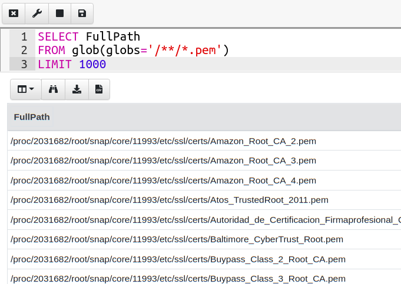
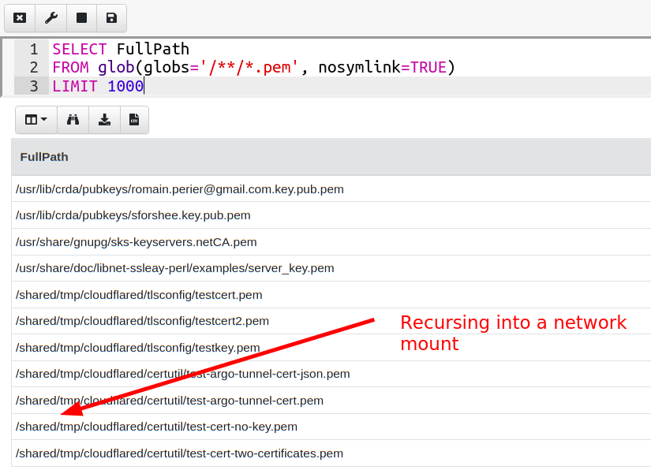
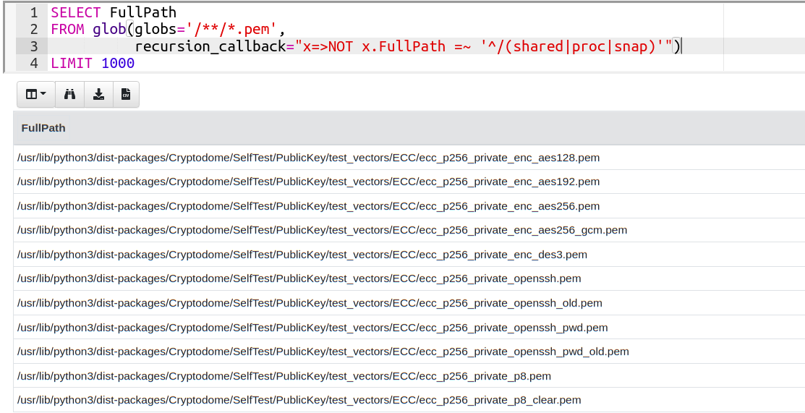
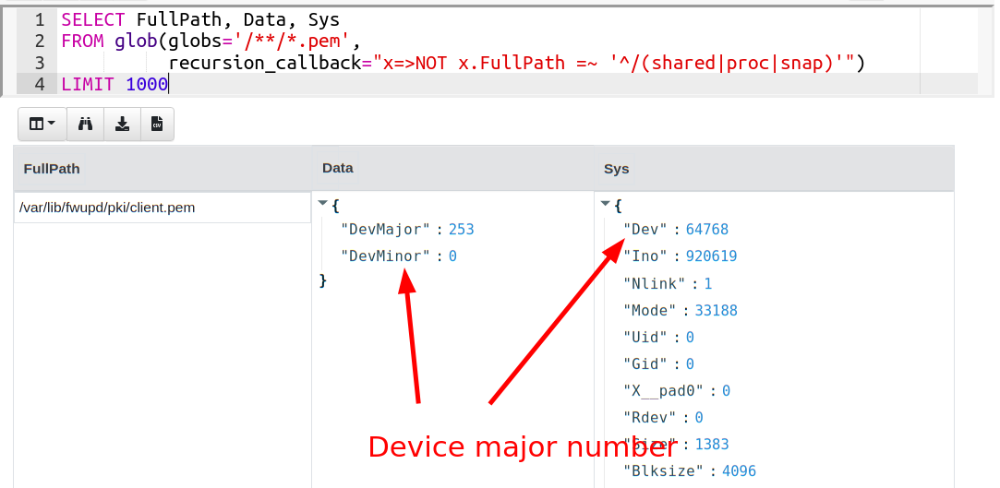

{}

This article discusses new features appearing in Velociraptor's 0.6.3
release. Earlier releases may not have the same features.

{}

Many DFIR tasks involve simply searching the filesystem for certain
files. In Velociraptor this capability is available through the
`glob()` plugin, that uses a glob expressions (containing wild cards)
to search the filesystem. Additional VQL plugins can be used to
further filter and process the results.

This capability is also available in many other tools, for example,
the `find` native Linux command allows searching the filesystem, and
most programming languages have similar features. For example in
Python the
[`os.walk`](https://docs.python.org/3/library/os.html#os.walk) method,
or in Golang the
[filepath.Walk](https://pkg.go.dev/path/filepath#Walk) method. The
following discussion applies equally to all methods and is also
relevant for single use scripts.

## The Log4j vulnerability

The Log4j vulnerability has been published in December 2021. Due to
the high severity and ease of exploitation many blue teamers scrambled
to identify the presence of vulnerable software on servers. A myriad
of scripts and single use tools were published that could search the
filesystem for vulnerable jar files (e.g. `find` based scripts
[`yahoo/check-log4j`](https://github.com/yahoo/check-log4j),
[`rubo77/log4j_checker_beta`](https://github.com/rubo77/log4j_checker_beta),
Go based
[`palantir/log4j-sniffer`](https://github.com/palantir/log4j-sniffer) ).

I wanted to share some of the potential pitfalls that one may
encounter searching the filesystem in the real world. In particular
some of these issues may present performance problems so should be
kept in mind when writing custom one off scripts, or new Velociraptor
artifacts.

## Following Symlinks

A symbolic link is a special type of filesystem object which points at
another file or directory. When walking the files in a directory, one
needs to decide if to follow the symbolic link or not.

If one follows the symbolic link and recurse into a directory which a
link points to, there is a danger that the link points back to a
higher place in the directory tree, leading to a symbolic link cycle.

A program that blindly follows links may become trapped in a symbolic
link cycle. This is particularly problematic when recursing through
the `/proc` filesystem, which contains links to / (e.g. a process's
working directory).

For example the below snippet can be seen with find, when instructed
to follow symbolic links:

```sh
# find -L /proc
/proc/self/task/1702267/root/lib/modules/5.11.0-44-generic/build/include/config/memstick/realtek
/proc/self/task/1702267/root/lib/modules/5.11.0-44-generic/build/include/config/memstick/realtek/usb.h
/proc/self/task/1702267/root/lib/modules/5.11.0-44-generic/build/include/config/memstick/realtek/pci.h
/proc/self/task/1702267/root/lib/modules/5.11.0-44-generic/build/include/config/hid.h
/proc/self/task/1702267/root/lib/modules/5.11.0-44-generic/build/include/config/alim7101
/proc/self/task/1702267/root/lib/modules/5.11.0-44-generic/build/include/config/alim7101/wdt.h
/proc/self/task/1702267/root/lib/modules/5.11.0-44-generic/build/include/config/snd.h
```

Such a program will never complete because each item in proc will cause
`find` to recurse through the entire filesystem until recursively
entering `/proc` again!

This is particularly dangerous when running this program remotely
using a tool that has no ability to constrain the time, CPU usage or
returned rows of external programs. This can lead to huge CPU
consumption on the target system and spinning out of control programs.

This is probably the reason why `find`'s default behavior is to
**not** follow symbolic links. However if not following symbolic links
it is possible to miss important files (for example many servers
contain symlinks to data drives so starting a find from `/var/www`
might miss files).

Velociraptor's `glob()` plugin does follow links by default, but keeps
track of visited inodes in order to detect cycles. This can still lead
to unintended loops especially when recursing through the `/proc`
filesystem.

## Remote filesystems

Many servers have distributed filesystems mounted at various points in
the filesystem. Running a large recursive search may recurse into
these remote filesystems which may be absolutely huge. Recursing into
these remote files can also lead to very long network delays
essentially preventing the search from completing at all!

It is difficult to predict in advance where remote filesystems are
mounted - especially when running a search on an unknown server. (This
situation is also present when mounting a filesystem over `fuse` for
example, a vmware shared folder).

The `find` command has a `-xdev` option that restricts searching to a
single filesystem. This flag ensures that `find` does not recurse into
remote mounted filesystems. As an added bonus `-xdev` also prevents
recursing into the `/proc` filesystem (which can be problematic as
described above)

Unfortunately many Unix systems have separate partitions for `/home`,
`/usr` or `/boot` and so preventing recursion into other filesystems
can prevent finding files in those partitions.

{}

In Linux it is possible to create a `bind` mount using the `--bind`
flag to mount another directory again inside a mount point
directory. This is similar to a symlink in the sense that it may point
further up the directory tree creating extra work for the `find`
command.

For example:

```
# mkdir /root/bount
# mount --bind / /root/bound/
# find /root/
...
/root/bound/usr/i686-w64-mingw32/lib/libcabinet.a
/root/bound/usr/i686-w64-mingw32/lib/binmode.o
find: File system loop detected; ‘/root/bound/root’ is part of the same file system loop as ‘/root/’.
```

The `find` command is able to detect these kinds of filesystem loops
and not get trapped but a custom program may not.

{}

# The glob plugin

Velociraptor's `glob()` plugin is the usual way that file searching is
implemented. Conceptually it is simple, to use - just provide a
wildcard expression and the glob plugin returns all the files that
match it. For example, one might be tempted to run the following query
looking for files with the `.pem` extension:

```vql
SELECT FullPath
FROM glob(globs="/**/*.pem")
```

On Linux such a query might encounter some problems! The `glob()`
plugin by default follows symlinks and as soon as the glob plugin
enters the `/proc` directory the plugin will likely encounter a
symlink further up the filesystem (usually back to /) and continue
recursing through that.



We can disable following symlinks using the nosymlink option to
glob. However this query will also take a very long time on this
system:



This test system has a large remote filesystem mounted on `/shared/`
so any recursion into that directory will be very slow.

## Excluding recursion into certain directories

Supposed that in this case we don't really care about remote
filesystems, we just want to search for pem files in the local
system. We know that certain directories should be excluded so we
might be tempted to write a query like:

```vql
SELECT FullPath
FROM glob(globs="/**/*.pem")
WHERE NOT FullPath =~ "^/(proc|shared)"
```

This query uses a WHERE clause to filter out any paths starting with
`/proc` or `/shared`. While this seems reasonable it does not work!
Thinking back to how VQL works (See [Life of a Query]() ), the `glob()` plugin will expand
the full glob into the query, and the WHERE clause simply filters out
non-matching rows. Therefore `glob()` will still get stuck in proc or
shared as before!

We need a way to tell the glob plugin itself **not** to recurse into
certain directories at all to save the unnecessary work. Since 0.6.3
the `glob()` plugin can accept a `recursion_callback` argument. This
is a VQL lambda function that receives the full row and return a
boolean to decide if the directory should be recursed into. If the
lambda returns FALSE, the glob plugin does not bother to enter the
directory at all, therefore saving a lot of effort.



In the above example, we used the VQL lambda returning true only for directories that have a path not starting with `shared` or `proc` or `snap`:

```vql
x => NOT x.FullPath =~ '^/(shared|proc|snap)'
```

## More powerful recursion callbacks

While controlling recursion using the directory path works well on
this system, we typically want to develop a more generalized solution
that we can apply to more systems. Ultimately, we can not predict
where various filesystems are mounted based on the path, but we just
want to ensure that we do not recurse into remote filesystems, or
virtual filesystems.

The `recursion_callback` mechanism is very flexible and allows us to
choose arbitrary conditions to control the recursion. Can we determine
what type of filesystem a particular file resides on?

On Linux, the `stat` filesystem call returns a `device` field. You can see
this with a simple stat shell command:

```bash
# stat /etc/passwd
   File: /etc/passwd
   Size: 2292            Blocks: 8          IO Block: 4096   regular file
Device: fd00h/64768d    Inode: 540077      Links: 1
Access: (0644/-rw-r--r--)  Uid: (    0/    root)   Gid: (    0/    root)
Access: 2022-01-06 22:08:44.793600319 +1000
Modify: 2021-12-09 17:19:40.768596398 +1000
Change: 2021-12-09 17:19:40.768596398 +1000
 Birth: 2021-12-09 17:19:40.768596398 +1000
```

The `Device` field is actually broken into two parts - the device
major part and the device minor part (8 bits each). These correspond
to the device shown in `/dev/` (`fd00` represents major `0xfd` (253)
and minor 0):

```bash
# ls -l /dev/dm-0
brw-rw-r-- 1 root disk 253, 0 Jan  6 01:55 /dev/dm-0
```

The device major number represents the device driver that is
responsible for this filesystem, listed in `/proc/devices`:

```
Block devices:
  7 loop
  8 sd
  9 md
 11 sr
 65 sd
 66 sd
 67 sd
 68 sd
 69 sd
 70 sd
 71 sd
128 sd
129 sd
130 sd
131 sd
132 sd
133 sd
134 sd
135 sd
253 device-mapper
254 mdp
259 blkext
```

The glob plugin can provide filesystem specific information in the
`Data` column:



Major numbers larger than 7 are considered "local". The following
query can therefore stay on the locally attached devices excluding the
loopback mounted filesystems:

```vql
SELECT FullPath
FROM glob(globs='/**/*.pem',
          recursion_callback='x=>x.IsLink OR x.Data.DevMajor > 7')
```

This query is very efficient, following links but skipping /proc,
remote filesystems but covering additional attached storage. We do not
need to rely on guessing where remote filesystems are mounted, and
excluding only those directories, instead limiting recursion to the
type of device hosting the filesystem.

# Conclusions

Searching files on the filesystems seems like a simple operation, but
can represent a number of pitfalls - particularly when run against
Linux system with unusual configuration. Not considering these issues
may result in runaway processes and severe load on the target systems.

It is difficult to predict how much work a recursive search will
perform so tools should have safety built in, such as timeouts
(Velociraptor's default 600 second timeout will cancel the search),
limits on number of rows returned or directory traversal depth
limitation (Velociraptor's glob expressions can specify a recursion
depth).

The `find` commandline tool has some safety mechanisms built in such
as cycle detection, in addition to the `-xdev` option limiting
recursion to a single filesystem. Any custom code needs to replicate
these mechanisms.

Velociraptor's `glob()` plugin has fine grained controls allowing
coverage of only a small set of filesystem types, or mount
points. This allows Velociraptor to safely search the entire system
for files balancing coverage with the risk following symlinks.
