WMI Eventing is a fairly well known technique in DFIR, however some 
tools may not provide the coverage you expect. This article covers 
WMI eventing visibility and detection including custom namespaces.

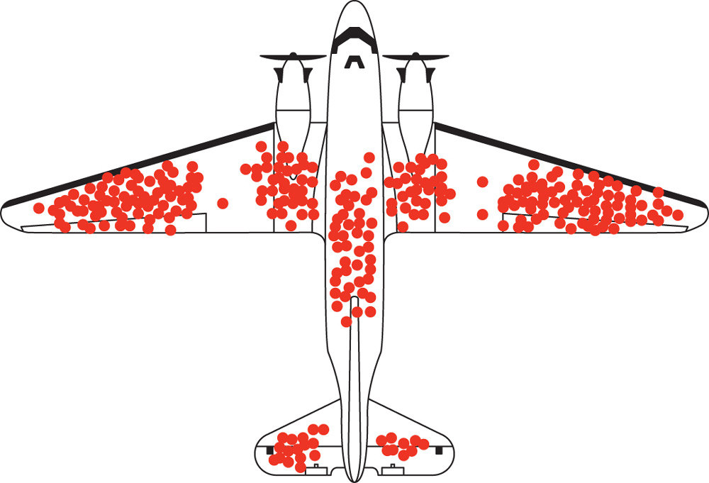

## Background

There has been a fair bit of research and observations of WMI eventing 
in field over the last years. In short, a WMI event consumer is a 
method of subscribing to certain system events, then enabling an action 
of some sort. Common adversary use cases may include persistence, privilege 
escalation, or as a collection trigger. Represented as ATT&CK T1546.003 
this technique has been observed in use from APT, through to trash-tic 
worm and coin miner threats.

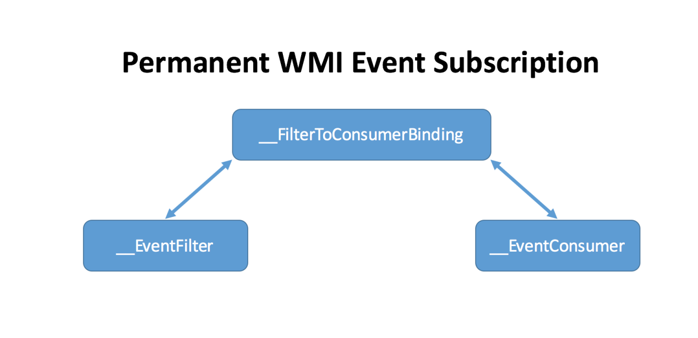

There are three system classes in every active event consumer:  

1. \_\_EventFilter is a WQL query that outlines the trigger event of 
interest.
2. \_\_EventConsumer is an action to perform upon triggering an event.
3. \_\_FilterToConsumerBinding is the registration mechanism that binds 
a filter to a consumer.

Most detection will focus on collecting the WMI classes in root/subscription 
and, in some tools root/default WMI namespaces.

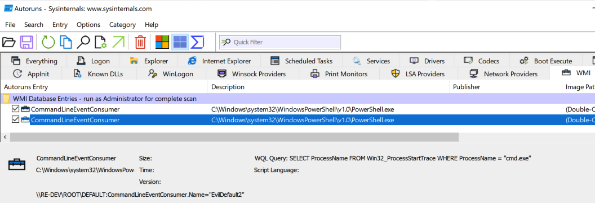


#### Custom Namespaces

At Blackhat 2018 Lee Christensen and Matt Graeber presented "Subverting 
Sysmon: Application of a Formalized Security Product Evasion Methodology". 
This excellent talk focused on defense evasion methodology and highlighted 
potential collection gaps in telemetry tools around WMI eventing. In this 
case, the focus was on Sysmon behaviour of collection only in 
root/subscription, interestingly, it also highlighted the possibility to 
implement \_\_EventConsumer classes in arbitrary namespaces. 

It is detection of WMI Event Consumers in arbitrary namespaces that i'm going 
to focus. For anyone interested in testing I have written 
[a script to generate WMI event consumers](https://github.com/mgreen27/mgreen27.github.io/blob/master/static/other/WMIEventingNoisemaker/WmiEventingNoisemaker.ps1). 
This script wraps several powershell functions released during the Black 
Hat talk to test creating working event consumers.

First step was to create a custom namespace event consumer. In this 
instance I selected the namespace name "totallylegit" and attached an 
ActiveScript event consumer.

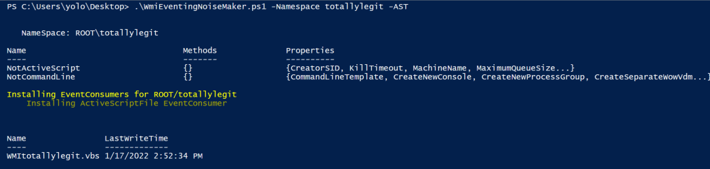


## Collection

Velociraptor has several valuable artifacts for hunting WMI Event 
Consumers: 

* `Windows.Sysinternals.Autoruns` - leverages a thirdparty deployment of 
Sysinternals Autoruns and typically my go to ASEP collection artifact but 
limited by visibility in root/default and root/subscription only.
* `Windows.Persistence.PermanentWMIEvents` - recently upgraded to query 
all ROOT namespaces.

{}
* This artifact reports currently deployed permanent WMI Event Consumers. 
* The artifact collects Binding information, then presents associated Filters and Consumers.
* Target a specific namespace, or tick AllRootNamespaces to collect all 
root namespace event consumers.

{}

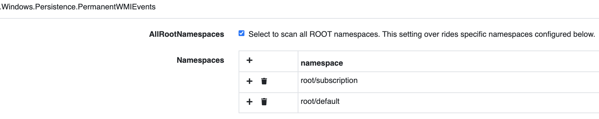

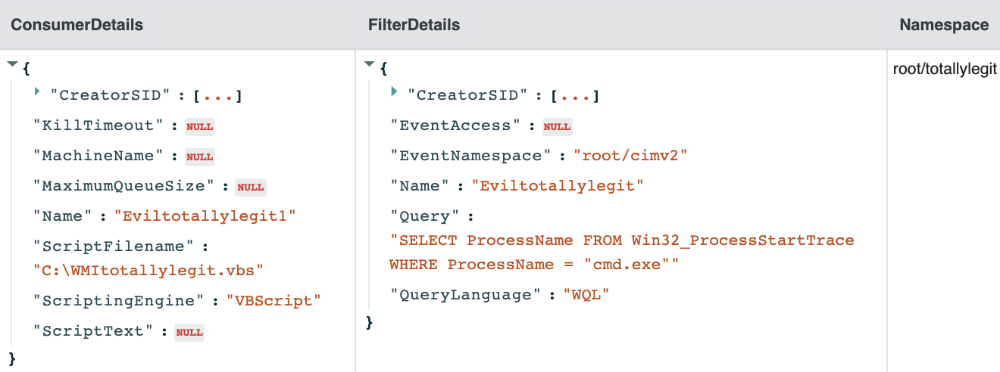


#### Telemetry

Unfortunately prior to Windows 10 WMI logging was fairly limited. Sysmon and 
other telemetry sources often rely on WMI eventing itself to collect WMI 
eventing telemetry events. That means custom classes require namespace and 
class existence prior to telemetry subscription. Sysmon as seen below also 
does not have coverage for root/default namespace.

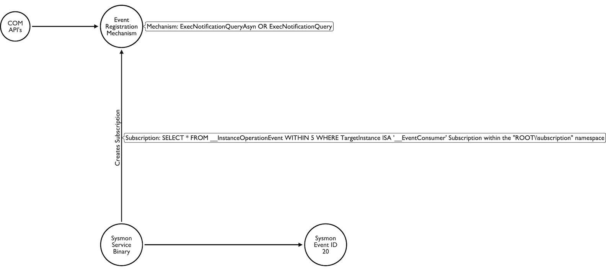

The good news is since Windows 10, WMI logging has improved significantly 
and we can now query the event log: Microsoft-Windows-WMI-Activity or 
subscribe the underlying ETW provider of the same name. In the VQL below 
I filter the ETW event on event consumer creation or delete operations.

```vql
SELECT
    System.TimeStamp AS EventTime,
    System.ID as EventId,
    strip(prefix='\\\\\.\\',string=EventData.NamespaceName) as NamespaceName,
    EventData.Operation as Operation,
    GetProcessInfo(TargetPid=int(int=EventData.ClientProcessId))[0] as Process
FROM watch_etw(guid="{1418ef04-b0b4-4623-bf7e-d74ab47bbdaa}")
WHERE EventId = 11
    AND Operation =~ 'WbemServices::(PutInstance|DeleteInstance|PutClass|DeleteClass)'
    AND Operation =~ 'EventConsumer|EventFilter|FilterToConsumerBinding'
```

I have included a completed artifact in the artifact exchange: 
[Windows.ETW.WMIEventing](https://docs.velociraptor.app/exchange/artifacts/pages/wmieventing/). 
That artifact includes process enrichment, targeting both creation and deletion of EventConsumers.

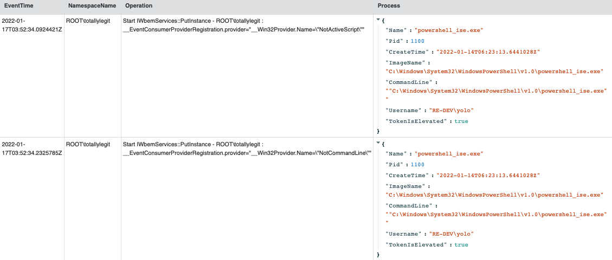

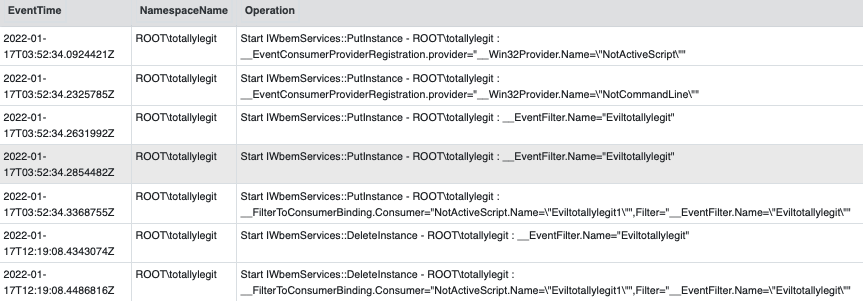


#### Event Log

Similar filters can be used with ```Windows.EventLogs.EvtxHunter``` for 
detection. Its worthy to note, event logs hold less verbose logging for 
the registration than ETW but this use case is helpful when coming late 
to the party during an investigation.

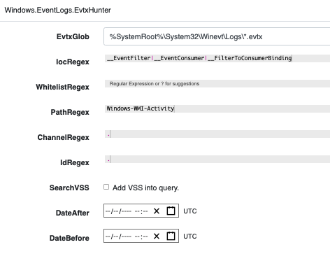

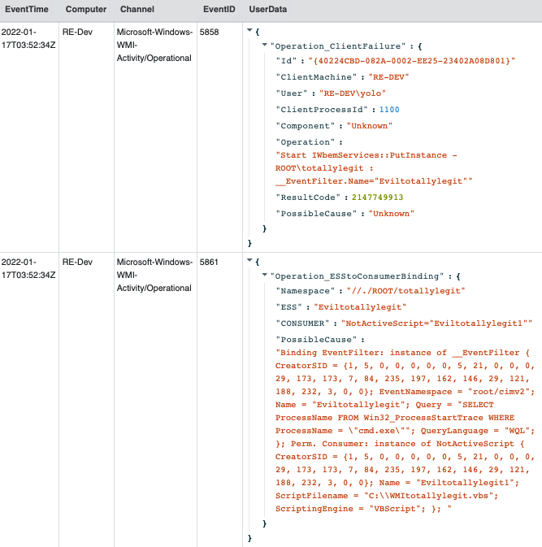


# Conclusions

During this post, we have shown three techniques for detecting WMI event consumers 
that are worth considering. We can collect these data-points over an entire 
network in minutes using Velociraptor's "hunt" capability. Similarly 
Velociraptor notebook workflow assists excluding known good entries quickly as part of analysis.

The Velociraptor platform aims to provide visibility and access 
to endpoint data. If you would like to try Velociraptor it is available on Github under an open source license. 
As always, please file issues on the bug tracker or ask questions on our 
mailing list velociraptor-discuss@googlegroups.com. You can also chat with 
us directly on discord at https://www.velocidex.com/discord


## References

1. [Microsoft documentation, About WMI](https://docs.microsoft.com/en-us/windows/win32/wmisdk/about-wmi)  
2. [MITRE ATT&CK T1546.003, Event Triggered Execution: Windows Management Instrumentation Event Subscription](https://attack.mitre.org/techniques/T1546/003/)  
3. [Christensen.L and Graeber.M, Blackhat 2018 - Subverting Sysmon: Application of a Formalized Security Product Evasion Methodology](https://www.youtube.com/watch?v=R5IEyoFpZq0)
4. [JSecurity101, Windows APIs To Sysmon-Events](https://github.com/jsecurity101/Windows-API-To-Sysmon-Events/)
