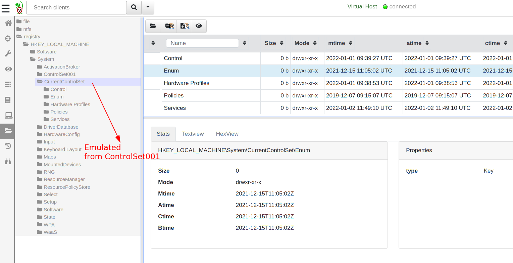

{}

This article discusses a feature available since 0.6.4 release. This
feature is still considered experimental and we are seeking feedback
and wider testing.

{}

Velociraptor's killer feature is its VQL language making it possible
to write powerful queries that triage and extract valuable forensic
evidence from the running system. One of the most attractive features
is the ability to write VQL `artifacts` encapsulating powerful VQL
queries. Users have access to a library of packaged `Artifacts` that
come with Velociraptor as well as a vibrant community and an [Artifact
Exchange]({}).

Previously Velociraptor was most useful as a live analysis
platform. Either deployed as an agent on the live endpoint, or via the
`Offline Collector` collecting artifacts from the running
system. However, many users are sometimes faced with analyzing a dead
disk image - for example, when handed a clone of a cloud VM disk after
a compromise.

It would be really nice to be able to leverage the same VQL artifacts
developed and shared by the community on a disk image or VM clone
without having to start the VM and install Velociraptor on it.

## Dead disk analysis

When we want to analyze a disk image we mean that:

1. A VQL query that looks at a disk (e.g. via the `glob()` plugin),
   should look inside the disk image instead of the real disk of the
   analysis machine.
2. A VQL query that looks at system state (e.g. process listing)
   should fail - otherwise we will accidentally mix results from the
   analysis machine and the machine the image came from.

Consider the following scenario: I have a dead disk image (In a `vmdk`
format) of a server on my analysis machine, and I want to run
Velociraptor to triage this image.

The following query retrieves all event logs from a windows system:

```vql
SELECT OSPath
FROM glob(globs="C:/Windows/System32/WinEVT/Logs/*.evtx")
```

When I run this query, I want the results to come from the image and
**not** from my analysis machine!

Of course I can always mount my dead image on a different drive (if my
analysis machine is Windows) or a different directory (if my analysis
machine is Linux). Then I can change the query accordingly to search
for the event log files in the new location. But this is tedious and
error prone - I have to carefully change all artifacts to point to the
new drive, and if there are references in the dead image to a `C:`
drive the artifact will look for files in the `C:` drive again.

What I really want is to **remap** the `C:` drive to the dead image -
so whenever Velociraptor attempts to access a path beginning with `C:`
drive, the data will come from the image! This way I can use all the
artifacts as they are **without modification**, thereby leveraging all
my existing favorite artifacts.

## Remapping accessors

Velociraptor accesses files using [filesystem accessors]({}). You can think
of an accessor as simply a driver that provides access to a file or
directory.

There are a number of types of accessors available, in the following
discussion the following accessors are important:

* The **auto** accessor is the default accessor used when an accessor
  is not explicitly specified. The query `SELECT * FROM
  glob(globs='/*')` will use the `auto` accessor since an explicit
  `accessor` parameter is not provided.

  On Windows the `auto` accessor attempts to open files using the OS
  API and failing this, reverts to NTFS parsing (for locked
  files). This is the most commonly used accessor.

* The **file** accessor uses the operating system APIs to open files
  and directories. It is used internally by the `auto` accessor but
  you can also use it explicitly.

* The **ntfs** accessor is used to access files using the built in
  NTFS parser.

## Mounting the image

The first step is to mount my dead disk image on my system so it can
be accessed by Velociraptor. Since this is a `vmdk` image, I can use
`vmware-mount` to mount a "flat" image easily:

```
$ sudo vmware-mount -f /vmware/TestVM/Windows\ 10\ x64.vmdk /mnt
$ ls -l /mnt/
total 62914560
-rw------- 1 mic mic 64424509440 Jan  5 16:42 flat
```

The entire disk image is now available as a classic `dd` style image
within the `/mnt/flat` file.

## Remounting configuration

Velociraptor normally interrogates the live machine it is running
on. However in this case we want to emulate the system under
investigation so that when Velociraptor attempts to access the system
it is really parsing the dead disk image. This process of emulation is
called `remapping` and it is controlled via remapping rules in the
configuration file.

Although I can write these rules by hand, Velociraptor offers a quick
tool that automates a lot of the remapping rule generation. Simply
point velociraptor at the mounted flat image using the
`--add_windows_disk` flag, and it will produce a new remapping yaml
config:

```
$ velociraptor-v0.6.4-linux-amd64 -v deaddisk --add_windows_disk /mnt/flat /tmp/remapping.yaml
velociraptor: Enumerating partitions using Windows.Forensics.PartitionTable
velociraptor: Searching for a Windows directory at the top level
velociraptor: Adding windows partition at offset 122683392
velociraptor: Searching for a Windows directory at the top level
```

Velociraptor will enumerate the partitions in the disk image and
attempt to mount each as an NTFS partition. It will then look for a
`/Windows` directory at the top level to indicate a system drive and
map it to the `C:` drive.

You can see the full generated configuration file
[here](https://gist.github.com/scudette/ffcd3ed2e589ebbdbe5c3edcf3914176)
but in the next few sections we will examine some remapping rules in
detail.

### The "mount" remapping rules

Let's take a closer look at the following rule of type `mount`

```yaml
- type: mount
  description: 'Mount the partition /mnt/flat (offset 122683392) on the C:
    drive (NTFS)'
  from:
    accessor: raw_ntfs
    prefix: |
      {
        "DelegateAccessor": "offset",
        "Delegate": {
          "DelegateAccessor": "file",
          "DelegatePath": "/mnt/flat",
          "Path":"122683392"
        },
        "Path": "/"
      }
  "on":
    accessor: ntfs
    prefix: '\\.\C:'
    path_type: ntfs
```

A `mount` rule tells Velociraptor to map all paths below a certain
directory to a delegate accessor. When a VQL query attempts to open a
file using the `ntfs` accessor, below the `\\.\C:` directory,
Velociraptor will automatically map the request to `raw_ntfs` accessor
with the above prefix.

For example, consider the request to list the `\\.\C:\Windows`
directory. Since this directory is below the mount point of `\\.\C:`,
Velociraptor will append the remainder (the `Windows` directory) to
the mount point's `from` prefix and use the `raw_ntfs` accessor to
list the result.

So the following pathspec will be opened instead:

```json
      {
        "DelegateAccessor": "offset",
        "Delegate": {
          "DelegateAccessor": "file",
          "DelegatePath": "/mnt/flat",
          "Path":"122683392"
        },
        "Path": "/Windows"
      }
```

The prefix is an OSPath object in the form of a complete pathspec
object describing how the `raw_ntfs` accessor is to access files:

1. The `raw_ntfs` accessor will first open it's delegate container and
   then parse out the `/Windows` path within it.
2. The delegate is the `offset` accessor - an accessor that maps an
   offset from it's own delegate (in order to extract the partition on
   which the filesystem is written).
3. The `offset` accessor in turn uses the `file` accessor to open the
   `/mnt/flat` image file. In this case the offset is 122683392 bytes
   into the image.

This remapping happens transparently - whenever Velociraptor accesses
the `ntfs` accessor the data will be automatically taken from the
remapped mount point.

Let's see how this works in practice. I will start the GUI using:

```
$ velociraptor-v0.6.4-linux-amd64 --remap /tmp/remapping.yaml gui -v
```

This simply starts the Velociraptor server and a single client talking
to it. However, due to the `--remap` flag, the remapping configuration
will be applied to both client and server configurations.

Now when I interact with the client's VFS view due to the remapping
the result comes from the `vmdk` image.


### Remapping the registry hives

The above default remapping rules also include the following rule

```yaml
- type: mount
  description: Map the /Windows/System32/Config/SOFTWARE Registry hive on HKEY_LOCAL_MACHINE\Software
  from:
    accessor: raw_reg
    prefix: |-
      {
        "Path": "/",
        "DelegateAccessor": "raw_ntfs",
        "Delegate": {
          "DelegateAccessor":"offset",
          "Delegate": {
            "DelegateAccessor": "file",
            "DelegatePath": "/mnt/flat",
            "Path": "122683392"
          },
          "Path":"/Windows/System32/Config/SOFTWARE"
        }
      }
    path_type: registry
  "on":
    accessor: registry
    prefix: HKEY_LOCAL_MACHINE\Software
    path_type: registry
```

This rule mounts the `registry` accessor's
`HKEY_LOCAL_MACHINE\Software` path on the
`/Windows/System32/Config/SOFTWARE` file found within the raw NTFS
partition.  Note how pathspec descriptors nest and can utilize
multiple different accessors to achieve the final mount point (in this
case, the `file` accessor, followed by `offset` followed by `raw_ntfs`
followed by `raw_registry`)..



Normally, when interacting with a live Velociraptor client, the
`registry` accessor refers to registry keys and values accessed
through the OS API. However now we were able to mount a raw registry
parser on top of the `registry` accessor.

{}

By remapping the traditional accessors with emulated content, we are
effectively allowing the same VQL queries to apply to very different
scenarios **without change**. For example, an artifact that queries
the registry using the API will now automatically query the raw
registry parser which accesses the hive file as recovered from parsing
the ntfs filesystem on a dead disk image.

We can apply the same artifacts to the dead disk image without any
modification!

{}

### Remapping CurrentControlSet

In Windows there are virtual parts of the registry that get remounted
at runtime. One such part is the
`HKEY_LOCAL_MACHINE\Software\CurrentControlSet` key which is mounted
from `HKEY_LOCAL_MACHINE\Software\ControlSet001`. Velociraptor can recreate this mapping using the following remapping rule:

```yaml
- type: mount
  description: Map the /Windows/System32/Config/SYSTEM Registry hive on HKEY_LOCAL_MACHINE\System\CurrentControlSet
    (Prefixed at /ControlSet001)
  from:
    accessor: raw_reg
    prefix: |-
      {
        "Path": "/ControlSet001",
        "DelegateAccessor": "raw_ntfs",
        "Delegate": {
          "DelegateAccessor":"offset",
          "Delegate": {
            "DelegateAccessor": "file",
            "DelegatePath": "/mnt/flat",
            "Path": "122683392"
          },
          "Path":"/Windows/System32/Config/SYSTEM"
        }
      }
    path_type: registry
  "on":
    accessor: registry
    prefix: HKEY_LOCAL_MACHINE\System\CurrentControlSet
    path_type: registry
```

This is very important for queries that read sub-keys of `CurrentControlSet`.

### Impersonating an operating system

We discussed how accessors can be remapped using the remapping rules
in order to make VQL plugins that access files emulate running on the
target system. However, many artifacts need to examine more than just
the filesystem. For example, most artifacts have a `precondition` such
as `SELECT * FROM info() WHERE OS =~ "Windows"`. If we were to run on
a Linux system these artifacts will not work since they are intended
to work on windows - despite the remapping rules emulating a Windows
system.

We therefore need to `impersonate` a windows system - even when we are
really running on a Linux machine. The impersonation rule looks like:

```yaml
- type: impersonation
  os: windows
  hostname: VirtualHostname
  env:
  - key: SystemRoot
    value: C:\Windows
  - key: WinDir
    value: C:\Windows
  disabled_functions:
  - amsi
  - lookupSID
  - token
  disabled_plugins:
  - users
  - certificates
  - handles
  - pslist
```

This rule has a number of functions

1. The OS type is set to Windows- This affects the output from
   `SELECT * FROM info()` - this query controls most of the artifact
   preconditions.
2. A specific hostname is set to "VirtualHostname". When the client
   interrogates, this hostname will appear in the Velociraptor GUI.

3. We specify a number of environment variables. This affects the
   `expand()` function which expands paths using environment
   variables. Many artifacts use environment variables to locate files
   within the filesystem.
4. Disabled functions and plugins: Many artifacts use plugins and
   functions that query non-disk system state in order to enrich the
   collected data. I.e. their output does not depend just on the
   disk. Using this impersonation rule we can disable those plugins
   and functions (essentially return nothing from them) so the query
   can complete successfully.

Impersonation aims to make it appear that the VQL artifacts are being
collected from the target system as if it were running live.

Here is an example of collecting some common Windows artifacts from my
flat image above - running on a Linux analysis machine. We can see
some of our favorite artifacts, such as `Windows.Forensics.Usn`,
`Windows.Timeline.Prefetch`, `Windows.Forensics.Bam` and many more.


## Analysis of non windows disk images

In the previous example, we exported the `vmdk` image as a flat file
and simply relied on Velociraptor to parse the filesystem using its
inbuilt NTFS parser.

For other operating systems, Velociraptor does not currently have a
native parser (for example for Linux or MacOS). Instead, Velociraptor
relies on another tool mounting the image filesystem as a directory.

We can still perform the analysis as before however, by remapping the
mounted directory instead of a raw image.

To demonstrate this process I will mount the flat image using the
Linux loopback driver and the built in Linux NTFS filesystem support.

```
$ sudo mount -o loop,offset=122683392 /mnt/flat /tmp/mnt/
```

I can now generate a second remapping configuration:

```
$ ./velociraptor-v0.6.4-linux-amd64 deaddisk --add_windows_directory /tmp/mnt/ /tmp/remapping2.yaml
velociraptor: Adding windows mounted directory at /tmp/mnt/
velociraptor: Checking for hive at /tmp/mnt/Windows/System32/Config/SOFTWARE
velociraptor: Checking for hive at /tmp/mnt/Windows/System32/Config/SYSTEM
velociraptor: Checking for hive at /tmp/mnt/Windows/System32/Config/SYSTEM
```

Velociraptor will inspect the directory and determine it is a Windows
image, then attempt to map the raw registry hives at the correct place
as before. The `C:` drive remapping rule is:

```yaml
- type: mount
  description: 'Mount the directory /tmp/mnt/ on the C: drive (NTFS)'
  from:
    accessor: file
    prefix: /tmp/mnt/
  "on":
    accessor: file
    prefix: 'C:'
    path_type: windows
```

## Conclusions

Velociraptor is an extremely capable triage and analysis tool which
works best when running live on the endpoint - where it can correlate
information from disk, memory and volatile system state. Velociraptor
has a vibrant community with powerful user contributed artifacts
designed for use in this context.

However, sometimes we do not have the luxury of running directly on
the running endpoint, but have to rely instead on dead disk images of
the target system. The latest Velociraptor release makes it possible
to impersonate a live system based on information from the dead
disk. While this is not perfect (because a lot of the enrichment
information obtained from the live system is missing) for basic disk
focused forensic analysis, we are able to use most artifacts directly
without change.

This feature opens Velociraptor to more traditional image based
forensic analysis use cases - these users are now able to leverage the
same artifacts we all use in live triage to quickly triage dead disk
images.

Since this is such a new feature it is still considered experimental -
we value your feedback, bug reports and discussions.  If you would
like to try out these features in Velociraptor, It is available on
GitHub under an open source license. As always, please file issues on
the bug tracker or ask questions on our mailing list
velociraptor-discuss@googlegroups.com. You can also chat with us
directly on discord at https://www.velocidex.com/discord.
