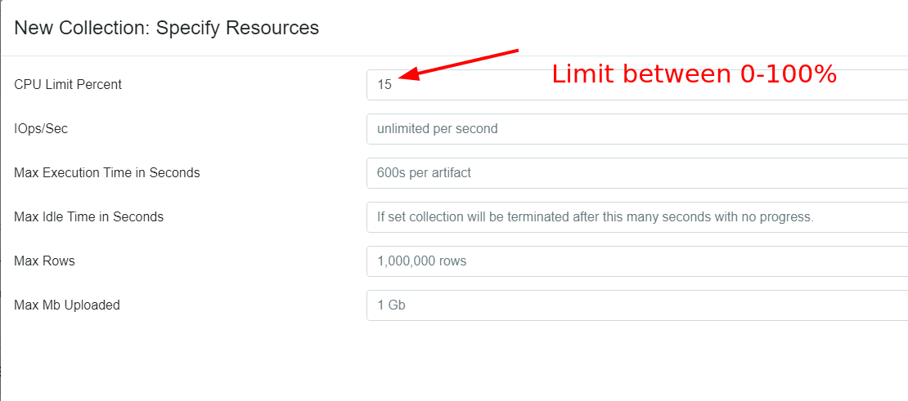
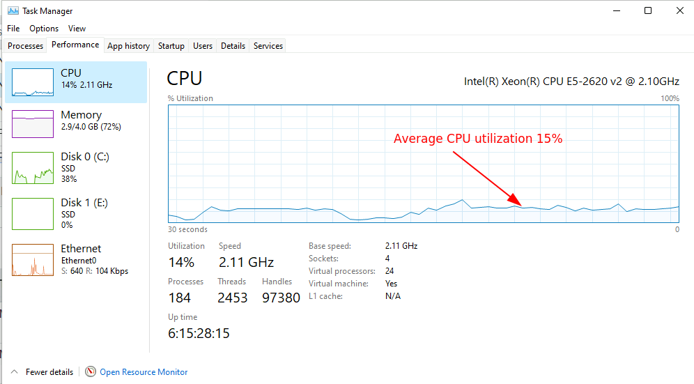
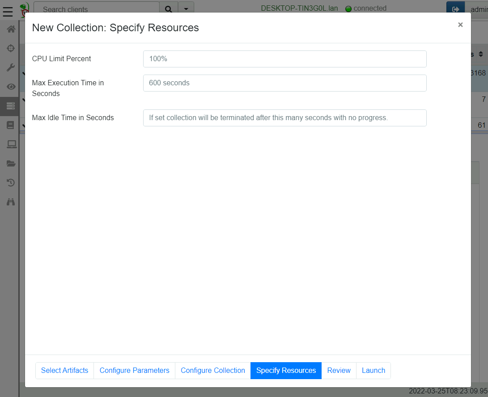
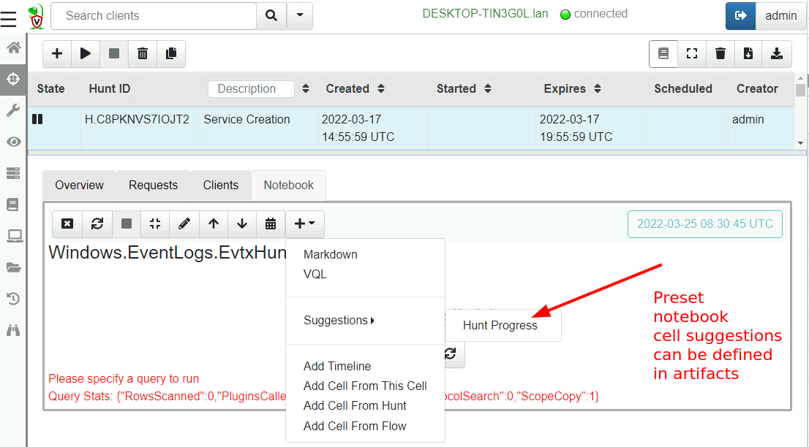
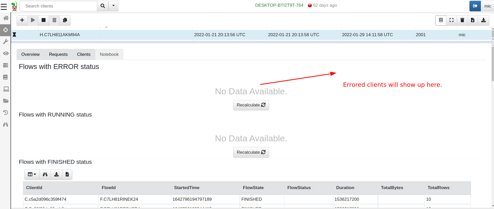
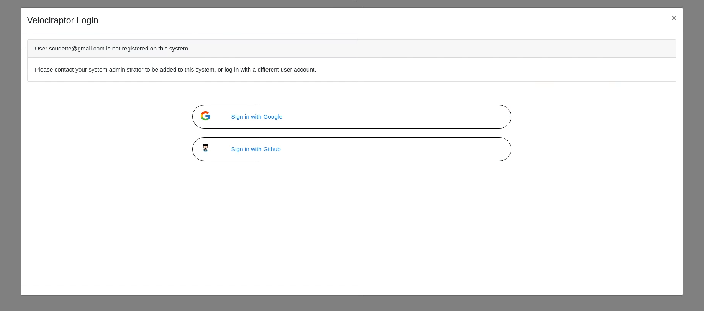
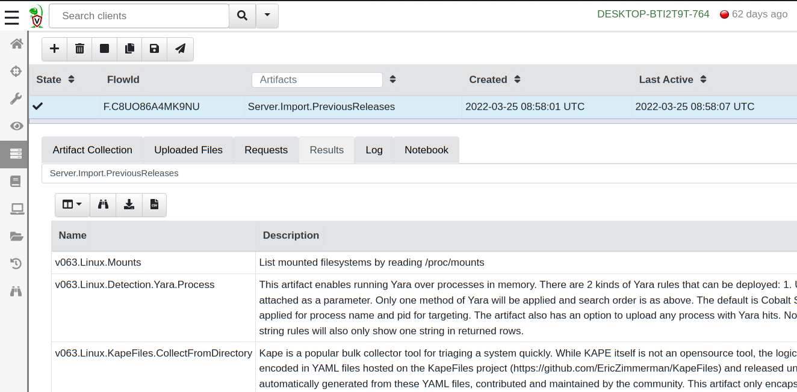

I am very excited to announce the latest Velociraptor release
0.6.4. This release has been in the making for a few months now and
has a lot of new features.

The main focus of this release is in improving path handling in VQL to
allow for more efficient path manipulation. This leads to the ability
to analyze dead disk images which depends on accurate path handling.

## Path handling

A path is a simple concept - it is a string similar to `/bin/ls` which
can be used to pass to an OS API and have it operate on the file in
the filesystem (e.g. read/write it).

However it turns out that paths are much more complex than they first
seem. For one thing, paths have an OS dependent separator (usually `/`
or `\`). Some filesystems support path separators inside a filename
too! To read about the details check out [Paths And Filesystem
Accessors]() but one of the
most interesting thing with the new handling is that stacking
filesystem accessors is now possible, for example it is possible to
open a docx file inside a zip file inside an ntfs drive inside a
partition.

### Dead disk analysis

Velociraptor offers top notch forensic analysis capability but it was
primarily used as a live response agent. Many users have asked us if
Velociraptor can be used on dead disk images. Although we rarely use
dead disk images in practice, sometimes we do encounter these (e.g. in
cloud investigations).

Previously we could not use Velociraptor easily on dead disk images
without having to carefully tailor and modify each artifact. In the
0.6.4 release we now have the ability to emulate a live client from
dead disk images. We can use this feature to run the exact same VQL
artifacts that we normally do on live systems, but against a dead disk
image. If you would like to read more about this new feature check out
[Dead Disk Forensics]().

## Resource control

When collecting artifacts from endpoints we need to be mindful of the
overall load that collection will cost on endpoints. For performance
sensitive servers, our collection can cause operational
disruption. For example, running a yara scan over the entire disk
would utilize a lot of IO operations and may use a lot of CPU
resources. Velociraptor will then compete for these resources with the
legitimate server functionality and may cause degraded performance.

Previously, Velociraptor had a setting called `Ops Per Second` which
could be used to run the collection "low and slow" by limiting the
rate at which notional "ops" were utilized. In reality this setting
was only ever used for Yara scans because it was hard to calculate an
appropriate setting: notional `ops` did not correspond to anything
measurable like CPU utilization.

In 0.6.4 we have implemented a feedback based throttler which can
control VQL queries to a target average CPU utilization. Since CPU
utilization is easy to measure it is a more meaningful control. The
throttler actively measures the Velociraptor process's CPU utilization
and when the simple moving average (SMA) rises above the limit, the
query is paused until the SMA drops below the limit.

The above screenshot shows the latest resource controls dialog. You
can now set a target CPU utilization between 0 and 100%. The image
below shows how that looks in the windows task manager

{}

By reducing the allowed CPU utilization, Velociraptor will be slowed
down so collections will take longer. You may need to increase the
collection timeout to correspond with the extra time it takes.

Note that the CPU limit refers to a percentage of the total CPU
resources available on the endpoint. So for example, if the endpoint
is a 2 core cloud instance a 50% utilization refers to 1 full
core. But on a 32 core server a 50% utilization is allowed to use 16
cores!

{}

### Iops limits

On some cloud resources IO operations per second (IOPS) are more
important than CPU loading since cloud platforms tend to rate limit
IOPS. So if Velociraptor uses many IOPS (e.g. in Yara scanning), it
may affect the legitimate workload.

Velociraptor now offers limits on IOPS which may be useful for some
scenarios. See for example
[here](https://docs.aws.amazon.com/AWSEC2/latest/UserGuide/ebs-volume-types.html)
and
[here](https://aws.amazon.com/blogs/database/understanding-burst-vs-baseline-performance-with-amazon-rds-and-gp2/)
for a discussion of these limits.

### The offline collector resource controls

Many people use the [Velociraptor offline collector]() to collect artifacts
from endpoints which they are unable to install a proper client/server
architecture on. In previous versions there was no resource control or
time limits imposed on the offline collector because it was assumed
that it would be used interactively by a user.

However experience shows that many users use automated tools to push
the offline collector to the endpoint (e.g. an EDR or another endpoint
agent) and therefore it would be useful to provide resource controls
and timeouts to control Velociraptor acquisitions. The below
screenshot shows the new resource control page in the offline
collector wizard.

## GUI Changes

Versions 0.6.4 brings a lot of useful GUI improvements.

### Notebook suggestions

Notebooks are an excellent tool for post processing and analyzing the
collected results from various artifacts. Most of the time similar
post processing queries are used for the same artifacts so it makes
sense to allow notebook `templates` to be defined in the artifact
definition. In this release you can define an optional `suggestion` in
the artifact yaml to allow a user to include certain cells when
needed.

The following screenshot shows the default suggestion for all hunt
notebooks: `Hunt Progress`. This cell queries all clients in a hunt
and shows the ones with errors, running and completed.

### Multiple OAuth2 authenticators

Velociraptor has always had SSO support to allow strong 2 factor
authentication for access to the GUI. However, previously Velociraptor
only supported one OAuth2 provider at a time. Users had to choose
between Google, Github, Azure or OIDC (e.g. Okta) for the
authentication provider.

This limitation is problematic for some organizations who need to
share access to the Velociraptor console outside their own
organizations (e.g. consultants need to provide read only access to
customers).

In 0.6.4 Velociraptor can be configured to support multiple SSO
providers at the same time. So an organization can provide access
through Okta for their own org at the same time as Azure or Google for
their customers.

## The Velociraptor knowledge base

Velociraptor is a very powerful tool. It's flexibility means that it
can do things that you might have never realized it can! For a while
now we have been thinking about ways to make this knowledge more
discoverable and easily available.

Many people ask questions on the Discord channel and learn new
capabilities in Velociraptor. We want to try a similar format to help
people discover what Velociraptor can do.

The [Velociraptor knowledge base]() is a
new area on the documentation site that allows anyone to submit small
(1-2 paragraphs) tip about how to do a particular task. Knowledge base
tips are phrased as questions to help people search for them. Tips
should be short and refer to more detailed documentation - they are
just a quick hint.

If you learned something about Velociraptor that you did not know
before and would like to share your experience to make the next user's
journey that little bit easier, please contribute a small note to the
knowledge base.

## Known issues

Updating the VQL path handling in 0.6.4 introduces a new column called
`OSPath` (replacing the old `FullPath` column) which was not present
in previous versions. While we attempt to ensure that older artifacts
should continue to work on 0.6.4 clients, it is likely that the new
VQL artifacts built into 0.6.4 will not work correctly on older
versions.

If you are upgrading the Velociraptor server but still have older
clients in the field, it is likely that collecting the built in
artifacts will fail due to the new features not being present in older
clients.

To make migration easier, 0.6.4 comes built in with the
`Server.Import.PreviousReleases` artifact. This server artifact will
load all the artifacts from a previous release into the server. You
can use those older versions with older clients.

## Conclusions

If you like the new features, take [Velociraptor for a
spin](https://github.com/Velocidex/velociraptor)!  It is a available
on GitHub under an open source license. As always please file issues
on the bug tracker or ask questions on our mailing list
[velociraptor-discuss@googlegroups.com](mailto:velociraptor-discuss@googlegroups.com)
. You can also chat with us directly on discord
[https://www.velocidex.com/discord](https://www.velocidex.com/discord)
.
