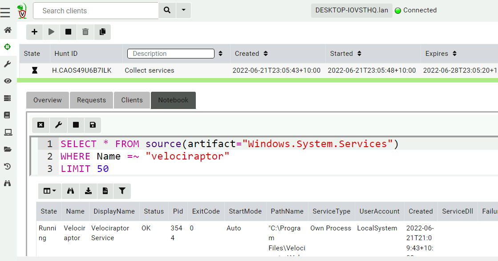
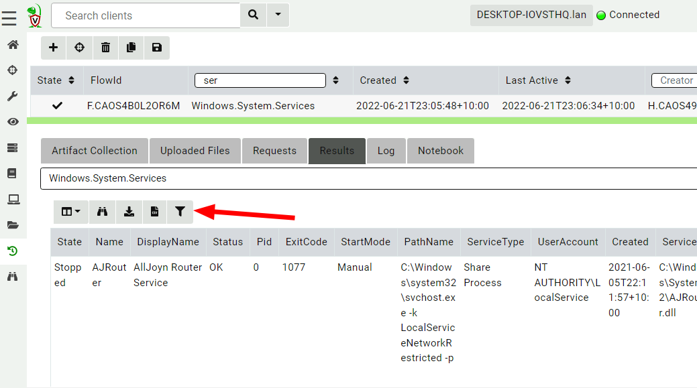
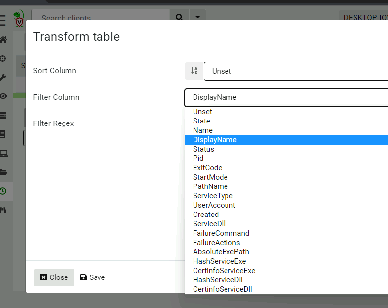
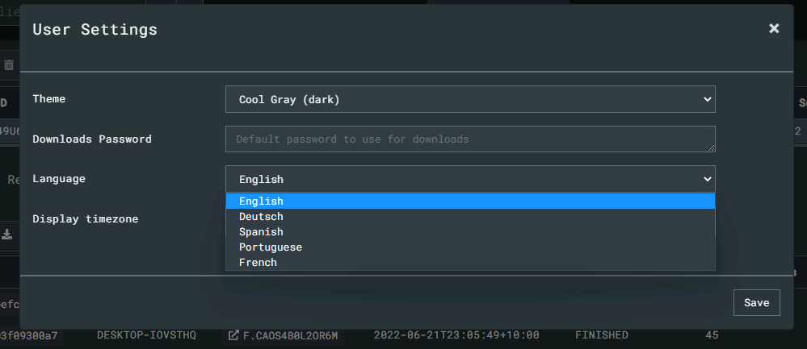
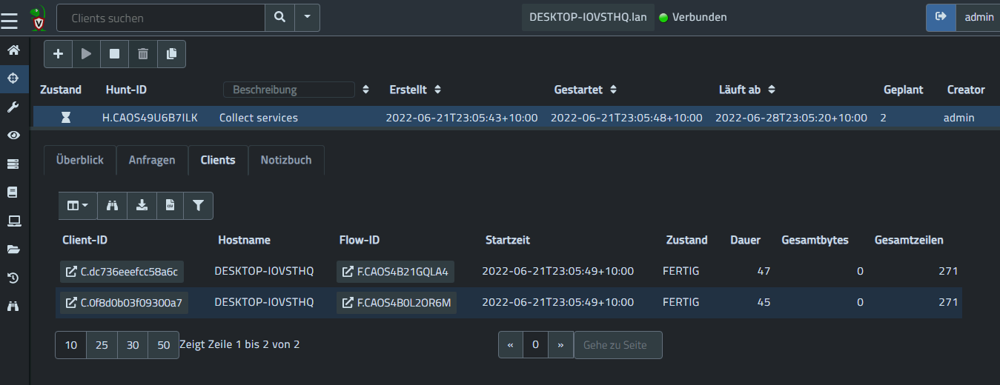
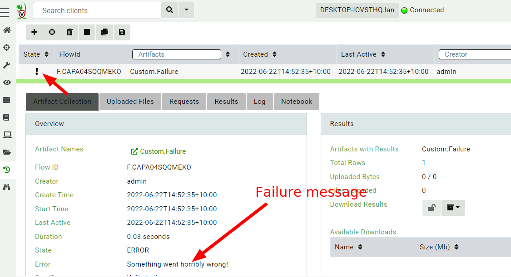
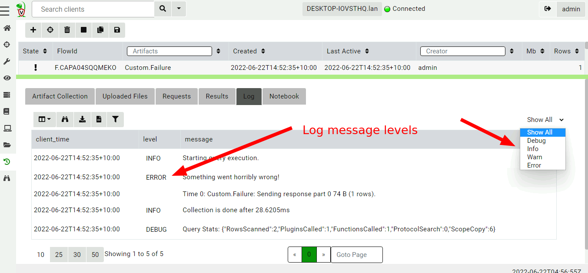
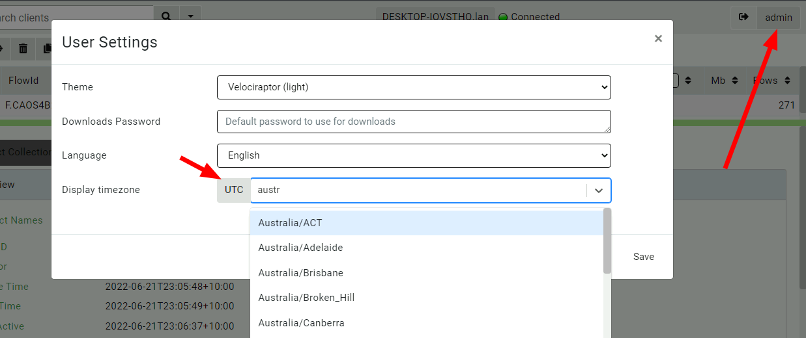
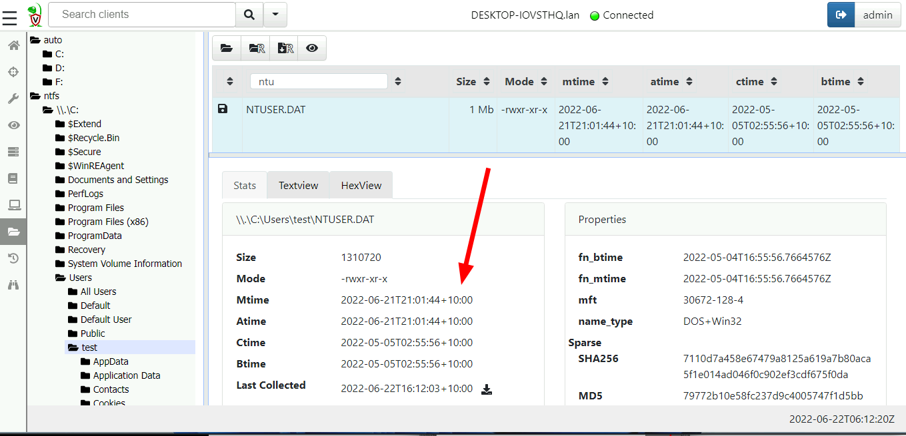

I am very excited to announce the latest Velociraptor release
0.6.5. This release has been in the making for a few months now and
has a lot of new features.

In this post I will discuss some of the interesting new features.

## Table transformations

Velociraptor collections or hunts are usually post processed or
filtered in `Notebooks`. This allows users to refine and post process
the data in complex ways. For example, to view only the Velociraptor
service from a hunt collecting all services
(`Windows.System.Services`), one would click on the Notebook tab and
modify the query by adding a `WHERE` statement.

In our experience this type of quickly filtering/sorting a table is
very common and sometimes we dont really need the full power of
VQL. In 0.6.5 we introduced `table transformations` - simple
filtering/sorting operations on every table in the GUI.

We can now select simple table transformations like filtering or
sorting. The GUI will automatically generate the required query.

## Multi-Lingual support

Velociraptor's community of DFIR professionals is global! We have
users from all over the world and although most users are fluent in
English, we wanted to acknowledge our truly international user base by
adding internationalization into the GUI. You can now select from a
number of popular languages (Don't see your language here? We would
love additional contributions!).

Here is a screenshot showing our German translations

## New interface themes

The 0.6.5 release expanded our previous offering of 3 themes into 7
themes with a selection of light and dark themes. We even have a retro
feel `ncurses` theme that looks like a familiar terminal...

## Error handling in VQL

Velociraptor is simply a VQL engine; Users write VQL artifacts and run
these queries on the endpoint.

Previously it was difficult to tell when VQL encountered an
error. Sometimes a missing file is expected, and other times it means
something went wrong. From Velociraptor's point of view, as long as
the VQL query ran successfully on the endpoint the collection was a
success. The VQL query can generate logs to provide more information
but the user had to actually look at the logs to determine if there
was a problem.

For example, in a hunt parsing a file on the endpoints, it was
difficult to tell which of the thousands of machines failed to parse a
file. Previously, Velociraptor marked the collection as successful if
the VQL query ran - even if it returned no rows because the file
failed to parse.

In 0.6.5 there is a mechanism for VQL authors to convey more nuanced
information to the user by way of error levels. The VQL `log()`
function was expanded to take a `level` parameter. When the level is
`ERROR` the collection will be marked as failed in the GUI.

## Custom Timezone support

Timestamps are a central part of most DFIR work. Although it is best
practice to always work in UTC times it is sometimes a real pain to
have to convert from UTC to local time in one's head! Since
Velociraptor always uses
[RFC3389](https://datatracker.ietf.org/doc/html/rfc3339) to represent
times unambiguously but for human consumption it is convenient to
represent these times in different local times.

You can now select a more convenient timezone in the GUI by clicking
your user preferences and setting the relevant timezone.

The preferred time will be shown in most times in the UI

## A new MUSL build target

On Linux Go binaries are mostly static but always link to `Glibc`
which is shipped with the Linux distribution. This means that
traditionally Velociraptor had problems running on very old Linux
machines (previous to Ubuntu 18.04). We used to build a more
compatible version on an old Centos VM but this was manual and did not
support the latest Go compiler.

In 0.6.5 we added a new build target using MUSL - a light weight Glibc
replacement. The produced binary is completely static and should run
on a much wider range of Linux versions. This is still considered
experimental but should improve the experience on older Linux
machines.

## Conclusions

If you like the new features, take [Velociraptor for a
spin](https://github.com/Velocidex/velociraptor)!  It is a available
on GitHub under an open source license. As always please file issues
on the bug tracker or ask questions on our mailing list
[velociraptor-discuss@googlegroups.com](mailto:velociraptor-discuss@googlegroups.com)
. You can also chat with us directly on discord
[https://www.velocidex.com/discord](https://www.velocidex.com/discord)
.
