Traditionally the digital forensic process consists of several distinct phases:

1. The *collection* or *acquisition* phase consists of collecting as much
   evidence as possible from the endpoint.
2. Once data is collected, the data is *parsed and analyzed* on a
   different system, to make inferences about the case.

Traditionally, the acquisition phases consists of a bit for bit copy
of the disk and memory. However in modern DFIR investigations, this is
just not practical due to the large volumes of data involved.

Modern DFIR investigations use a triaging approach, where selected
high value files are collected from the endpoint (For example
[Kape](https://www.kroll.com/en/insights/publications/cyber/kroll-artifact-parser-extractor-kape)
is a commonly used Triaging tool for collecting files).

Typically triage collections consist of collecting event log files,
the $MFT, the USN Journal, registry hives etc.

Once files are collected, they are typically parsed using various
parsers and single purpose tools. Traditionally using tools such as
`Plaso`, Eric Zimmerman's tools and various specialized scripts.

{}

In the following discussion we refer to the
`Windows.KapeFiles.Targets` artifact. This artifact is not related to
the commercial `Kape` product. The artifact is generated from the open
source [KapeFiles](https://github.com/EricZimmerman/KapeFiles) project
on github - an effort to document the path location of many bulk file
evidence sources.

{}

## The Velociraptor approach to triage

Velociraptor is a one stop shop for all DFIR needs. It already
includes all the common parsers (e.g. NTFS artifacts, EVTX, LNK,
prefetch parsers and many more) on the endpoint itself. All this
capability is made available via `VQL artifacts` - simple YAML files
containing VQL queries that can be used to perform the parsing
directly on the endpoint.

New Velociraptor users tend to bring the traditional DFIR approach to
a distributed setting. Newer users prefer to use the
`Windows.KapeFiles.Targets` artifact to collect those same files that
are traditionally collected for triage using Velociraptor. Files such
as event logs, $MFT, prefetch etc are collected from the endpoint to
the server (sometimes consisting of a few GB of data).

But now there is a common problem - how to post process these raw
files to extract relevant information?

New users simply export the raw files from Velociraptor and then
use the traditional single use tools on the raw files. However, can we
use Velociraptor itself to parse these raw files on the server?

This blog post is about this use case: How can we apply Velociraptor's
powerful parsing and analysis capabilities to the collected bulk data
from the `Windows.KapeFiles.Targets` artifact?

## Collecting bulk files with Windows.KapeFiles.Targets

In this example I will perform a `KapeFiles` collection on my
system. I have selected the `BasicCollection` as a reasonable trade
off between collecting too much data but providing important files
such as event logs, registry hives and the $MFT.

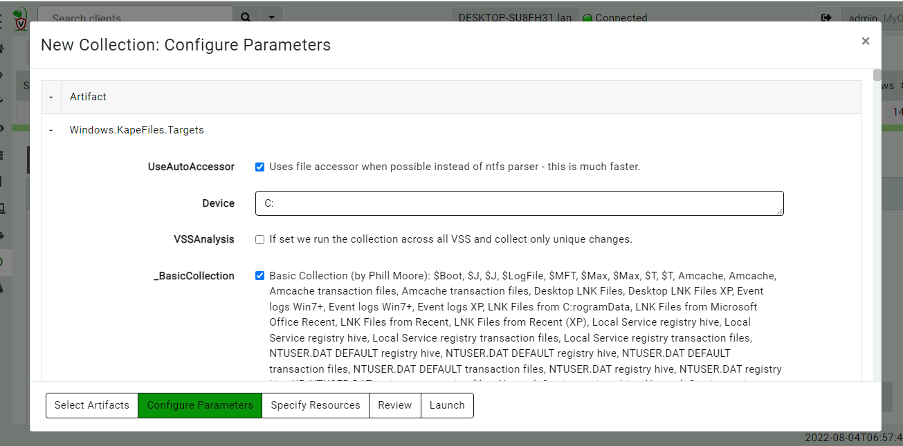

Once the collection is complete, the collection has transferred about
600mb of data in a couple of minutes.

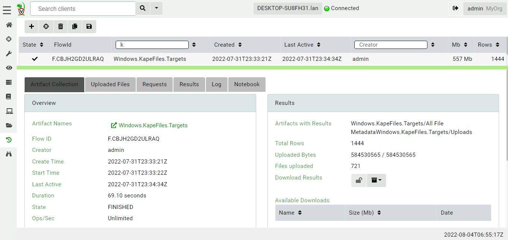

The `Windows.KapeFiles.Targets` artifact is purely a collection
artifact - it does not parse or analyze any files on the endpoint,
instead it simply collects the bulk data to the server. All the files
that were transferred are visible in the `Uploaded Files` tab.

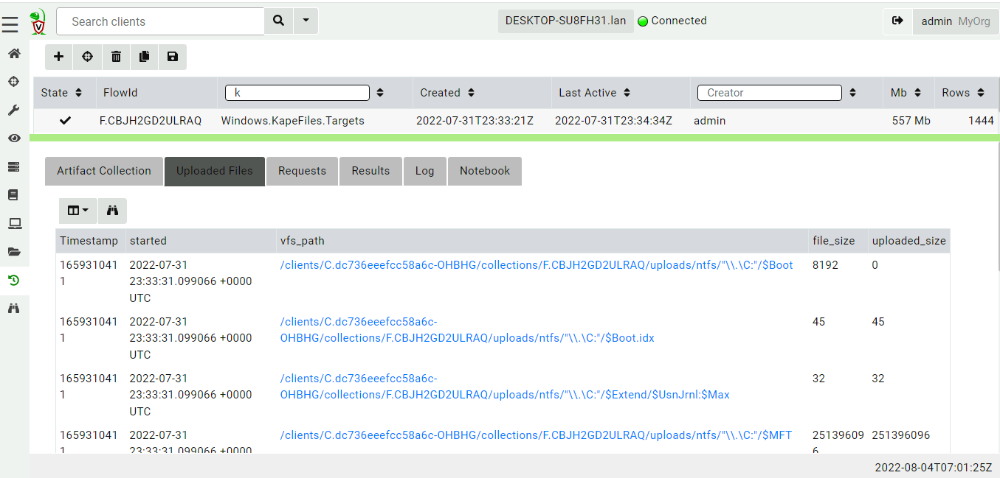

### Postprocessing downloaded files

Our first example is to parse the prefetch files with the
`Windows.Timeline.Prefetch` artifact.

Since Velociraptor's data store is just a directory on disk it is easy
to just read the files. We can simply provide the artifact with the
relevant path on disk to search for prefetch files and parse them.

I will click on the `Notebook` Tab to start a new notebook and enter
the following VQL in a cell (My test system uses `F:/tmp/3/` as the
filestore).

```vql
LET FilePath = "F:/tmp/3/orgs/OHBHG/clients/C.dc736eeefcc58a6c-OHBHG/collections/F.CBJH2GD2ULRAQ/uploads"

SELECT * FROM Artifact.Windows.Timeline.Prefetch(prefetchGlobs=FilePath+"/**/*.pf")
```

Here the path on disk where the collection results are stored contain
the `ClientID` and `FlowID` (In this case there is also an Org
ID). Generally this path pattern will work for all collections.

The VQL then simply calls the artifact `Windows.Timeline.Prefetch`
with the relevant glob allowing it to search for prefetch files on the
server.

{}

Notebooks contain cells which help the user to evaluate VQL queries
**on the server**. Remember that notebook queries always run on the
server and not on the original client. This post-processing query will
parse the prefetch files on the server itself.

{}

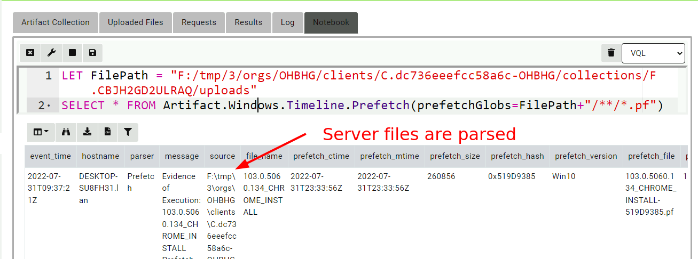

There are a number of disadvantages with this approach:

1. Since the files are parsed on the server, the results will contain
   the full path to the server files (including the client id, flow id
   and org id).
2. For this to work well we need to really understand how the artifact
   works - some artifacts accept a list of globs that allow them to
   find certain files in non standard locations. These parameters will
   be named differently in different artifacts and might not even
   provide that level of customization.
3. Some artifacts perform more complex operations, like enriching with
   WMI queries or other API calls. Because this query is running on
   the server it may mix server side information with the client side
   information causing confusing results.

The main difficulty is that artifacts are typically written with the
expectation that they will be running on the endpoint. Some artifacts
search for files in certain locations and may not provide the
customization to be able to run on the server.

### Remapping accessors

In recent versions of Velociraptor, a feature called `remapping` was
introduced. The original purpose of remapping was to allow
Velociraptor to be used on a dead disk image, but the feature had
proved to be more widely useful.

Velociraptor provides access to files using an `accessor`. An accessor
can be thought of as simply a driver that presents a filesystem to the
various plugins within VQL. For example, the `registry` accessor
presents the registry as a filesystem, so we can apply `glob()` to
search the registry, `yara()` to scan registry values etc.

Remapping is simply a mechanism where we can substitute one accessor
for another. Let's apply a remapping so we can run the
`Windows.Timeline.Prefetch` artifact with default parameters.

```vql
LET _ <= remap(clear=TRUE, config=regex_transform(source='''
    remappings:
      - type: mount
        from:
          accessor: fs
          prefix: "/clients/ClientId/collections/FlowId/uploads/auto/"
        on:
          accessor: auto
          prefix: ""
          path_type: windows
''', map=dict(FlowId=FlowId, ClientId=ClientId)))

SELECT * FROM Artifact.Windows.Timeline.Prefetch()
```

The above VQL builds a remapping configuration by substituting the
`ClientId` and `FlowId` into a template (this relies on the fact that
Flow Notebooks are pre-populated with `ClientId` and `FlowId`
variables).

The remapping configuration performs a `mount` operation from the file
store accessor rooted at the collection's upload directory onto the root
of the `auto` accessor. In other words, whenever subsequent VQL
attempts to open a file using the `auto` accessor, Velociraptor will
remap that to the file store accessor rooted at the collection's top
level. Because the `Windows.KapeFiles.Targets` artifact preserves the
filesystem structure of collected files, the artifact should be able to
find the files on the server in the same location they are found on
the endpoint.

This allows us to just call the artifact directly without worrying
about customizing it specifically. This approach is conceptually
similar to building a virtual environment that emulates the endpoint
but using files found on the server.

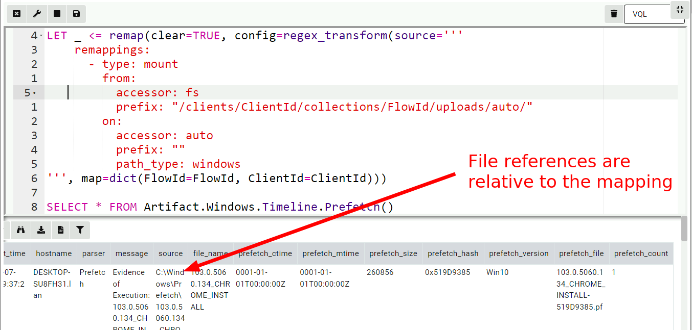

### Remapping the NTFS accessor

Let's now try to parse the $MFT with the `Windows.NTFS.MFT` artifact.

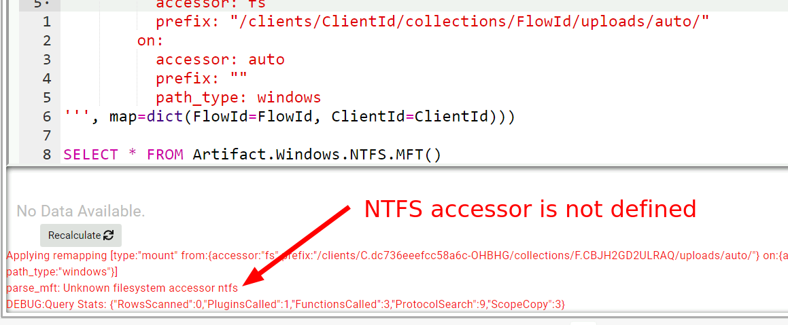

This does not work because the server does not have the `ntfs`
accessor! The `Windows.NTFS.MFT` artifact will try to open the $MFT
from the default path `C:\$MFT` using the `ntfs` accessor because this
is how we normally access the $MFT file on the endpoint. But on the
server we want to open the collected `$MFT` file using the
filestore. We will have to add another mapping for that!

```vql
LET _ <= remap(clear=TRUE, config=regex_transform(source='''
    remappings:
      - type: mount
        from:
          accessor: fs
          prefix: "/clients/ClientId/collections/FlowId/uploads/ntfs/"
        on:
          accessor: ntfs
          prefix: ""
          path_type: ntfs

''', map=dict(FlowId=FlowId, ClientId=ClientId)))

SELECT * FROM Artifact.Windows.NTFS.MFT()
```

This maps the `ntfs` branch of the collection upload to the `ntfs`
accessor. Now when the VQL opens files with the `ntfs` accessor it
will actually be fetched from the server's filestore.

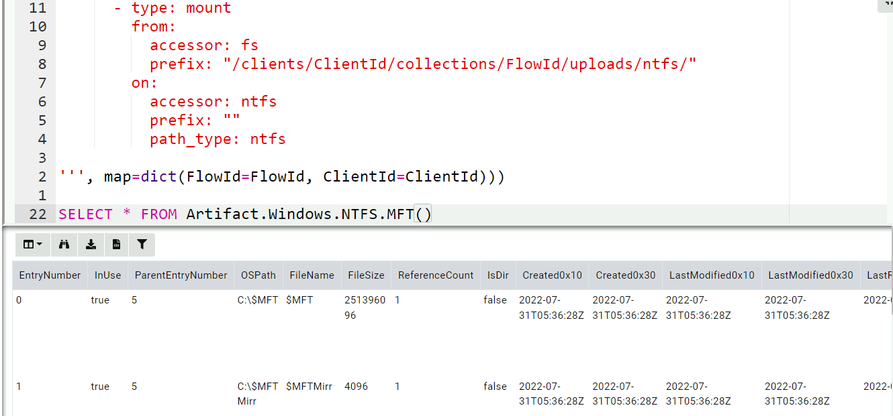

### Registry mapping

For our last example, we wish to see the list of installed programs on
the system by collecting the `Windows.Sys.Programs` artifact. That
artifact simply enumerates the keys under
`HKEY_LOCAL_MACHINE\SOFTWARE\Microsoft\Windows\CurrentVersion\Uninstall`. To
make this work we need to mount a virtual SOFTWARE registry hive in
such a way that when the artifact accesses that key, the internal raw
registry parser will be used to retrieve those values.

```vql

LET _ <= remap(clear=TRUE, config=regex_transform(source='''
    remappings:
        - type: mount
          from:
            accessor: raw_reg
            prefix: |-
              {
                "Path": "/",
                "DelegateAccessor": "fs",
                "DelegatePath": "/clients/ClientId/collections/FlowId/uploads/auto/C:/Windows/System32/config/SOFTWARE"
              }
            path_type: registry
          "on":
            accessor: registry
            prefix: HKEY_LOCAL_MACHINE\Software
            path_type: registry
''', map=dict(FlowId=FlowId, ClientId=ClientId)))

SELECT * FROM Artifact.Windows.Sys.Programs()
```

The above directive instructs Velociraptor to use the `raw_reg`
accessor to parse the file on the server, and mounts it under the
`HKEY_LOCAL_MACHINE\Software` key in the registry accessor.

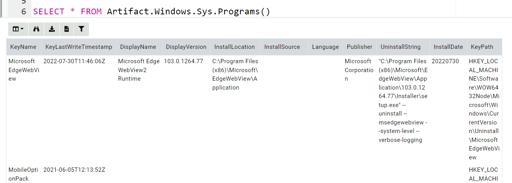

A similar approach can be used to mount each user hive under
`/HKEY_USERS/`

### Automating the remapping

The technique shown above can be extended to support multiple
artifacts but it is tedious to write by hand. Luckily there is an
artifact on the `Artifact Exchange` called
`Windows.KapeFiles.Remapping` to automate the remapping construction:

1. Remap standard registry hives e.g. `HKEY_LOCAL_MACHINE/Software`
2. Remap user hives on `HKEY_USERS/<Username>`
3. Mount ntfs and auto accessors
4. Disable plugins which can not work on files (e.g. `pslist`, `wmi` etc)

The result is easy to use. In the below I unpack the Scheduled Tasks:

```vql
LET _ <=
 SELECT * FROM Artifact.Windows.KapeFiles.Remapping(ClientId=ClientId, FlowId=FlowId)

 SELECT * FROM Artifact.Windows.System.TaskScheduler()
```

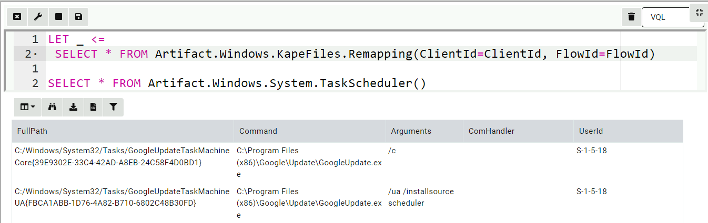

I can seamlessly use the EVTX hunter artifact


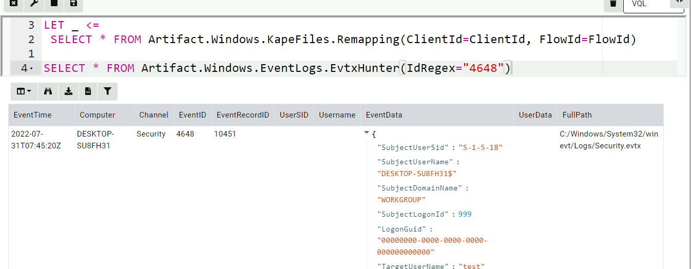


### Conclusions

In the previous section we saw how it is possible to post process
collected files on the server by reusing the standard Velociraptor
artifacts (that were written assuming they are running on the
endpoint).

Is that a good idea though?

Generally we do not recommend to use this methodology. Although it is
commonly done in other tools, collecting bulk files from the endpoint
and then parsing them offline is not an ideal method for a number of
reasons:

* It does not scale - typically a `Windows.KapeFiles.Targets` collects
  several Gigabytes of data. While this is acceptable for a small
  number of hosts, it is impractical to collect that much data from
  several thousand endpoints. Therefore effective hunting requires
  parsing the files directly on the endpoint.

* Bulk files from the endpoint are a limited source of data - there is
  a lot more information that reflects the endpoint's state. From WMI
  queries, process memory captures, ARP caches etc.

* It is always difficult to guess exactly which files will be
  required. In a `Windows.KapeFiles.Targets` collection, we need to
  select the appropriate targets to collect. Collecting too much is
  impractical and collecting too little might miss some important
  information.

  For example consider the following artifact `Exchange.HashRunKeys` -
  an artifact that displays programs launched from `Run` keys together
  with their hashes. Because it is impossible to know prior to
  collection which binaries are launched from the `Run` keys, usually
  the triage capture does not acquires these binaries. When we parse
  the registry hives on the server, we are missing the actual hashes:

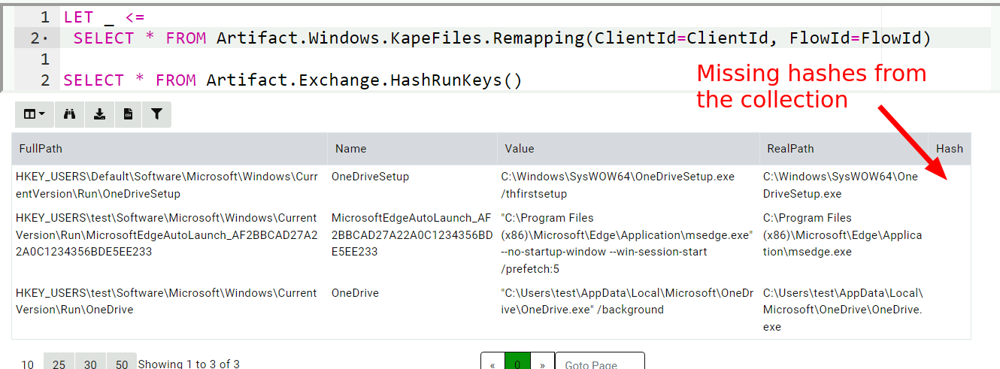

However collecting the artifact on the endpoint works much better.

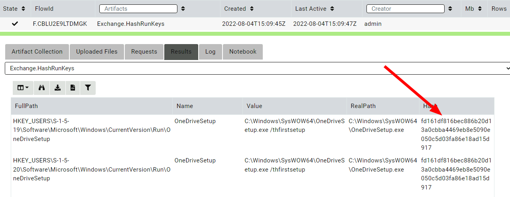

* Parsing certain artifacts on the server is impossible to do. For
  example, the above EVTX hunter enriches the SID in the event by
  calling the `lookupSID()` VQL function (that calls the Windows
  API). Clearly this can not work on the server. Similarly [resolving
  the event messages]({}) is also
  problematic when parsing the event logs offline.

Rather than collecting bulk data using `Windows.KapeFiles.Targets`,
Velociraptor users should collect other, more capable artifacts, that
parse information directly on the endpoint (even if it is **in
addition** to `Windows.KapeFiles.Targets`). As the investigation
progresses, more artifacts can be collected as needed. We treat the
endpoint as the ultimate source of truth and simply query it
repeatedly.

The traditional collect, transfer, analyze workflow was born from an
era when forensic tools were less capable and could not run directly
on the endpoint. Investigators had a one shot window for acquiring as
much data as possible, hoping they don't need to go back and fetch
more.

With the emergence of powerful, and always connected, DFIR tools like
Velociraptor, we can bring the analysis capabilities directly to the
endpoint. Because analysis is so fast now, one can quickly go back to
the endpoint and get further information iteratively.

If you like the remapping feature, take [Velociraptor for a
spin](https://github.com/Velocidex/velociraptor)!  It is a available
on GitHub under an open source license. As always please file issues
on the bug tracker or ask questions on our mailing list
[velociraptor-discuss@googlegroups.com](mailto:velociraptor-discuss@googlegroups.com)
. You can also chat with us directly on discord
[https://www.velocidex.com/discord](https://www.velocidex.com/discord)
.
