I am very excited to announce the latest Velociraptor release 0.6.6 is
now out. This release has been in the making for a few months now and
has a lot of new features and bug fixes.

In this post I will discuss some of the interesting new features.

## Multi-Tenant mode

The largest improvement in the 0.6.6 release by far is the
introduction of organizational division within Velociraptor.
Velociraptor is now a fully multi-tenanted application. Each
organization is like a completely different Velociraptor installation,
with unique hunts, notebooks and clients:

1. Organizations can be created and deleted easily with no overheads.
2. Users can seamlessly switch between organizations using the GUI.
3. Operations like hunting and post processing can occur across organizations.

When looking at the latest Velociraptor GUI you might notice the
organizations selector in the `User Setting` page.

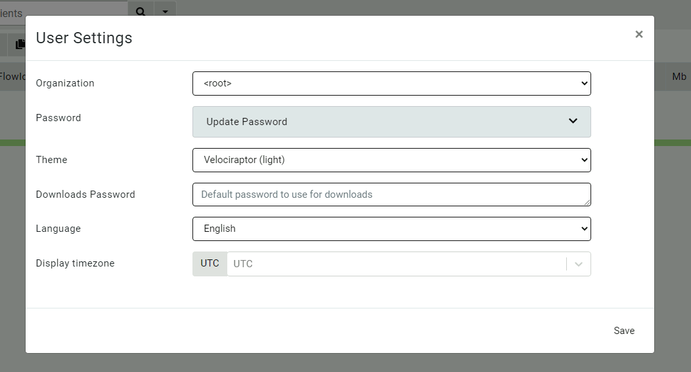

This allows the user to switch between the different organizations
they belong in.

### Multi-Tenanted example

Let's go through a quick example of how to create a new organization
and use them in practice.

{}

Multi-Tenancy is simply a layer of abstraction in the GUI separating
Velociraptor objects (such as clients, hunts, notebooks etc) into
different organizational units.

You **do not** need to do anything specific to prepare for a
multi-tenant deployment. Every Velociraptor deployment can create a
new organization at any time without affecting the current install
base at all.

By default all Velociraptor installs (including upgraded ones) have a
**root** organization which contains their current clients, hunts,
notebooks etc (You can see this in the screenshot above). If you
choose to not use the multi-tenant feature, your Velociraptor install
will continue working with the root organization without change.

{}

Suppose a new customer is on-boarded but they do not have a large
enough install base to warrant a new cloud deployment (with the
associated infrastructure costs). I want to create a new organization
for this customer in the current Velociraptor deployment.

### Creating a new Organization

To create a new organization I simply run the `Server.Orgs.NewOrg`
server artifact from the `Server Artifacts` screen.

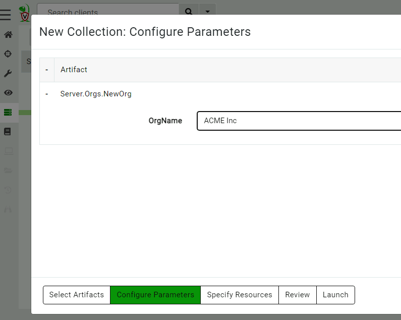

All I need to do is simply give the organization a name.

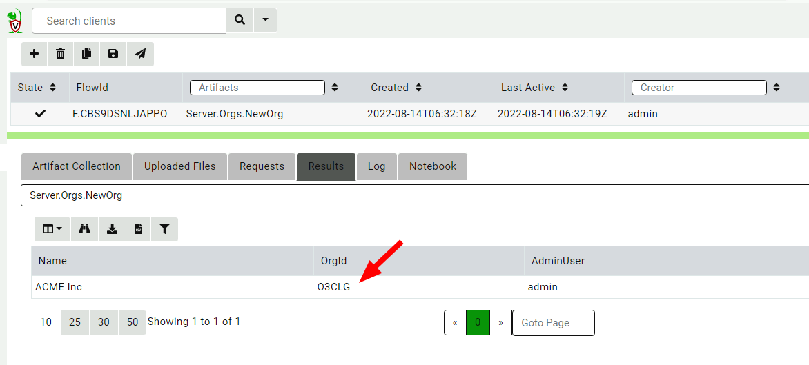

Velociraptor uses the OrgId internally to refer to the organization
but the organization name is used in the GUI to select the different
organizations. The new organization is created with the current user
being the new administrator of this org.

### Deploying clients to the new organization.

Since all Velociraptor agents connect to the same server, there has to
be a way for the server to identify which organization each client
belongs in. This is determined by the unique `nonce` inside the
client's configuration file. Therefore each organization has a unique
client configuration that should be deployed to that organization.

I will list all the organizations on the server using the
`Server.Orgs.ListOrgs` artifact. Note that I am checking the
`AlsoDownloadConfigFiles` parameter to receive the relevant
configuration files.

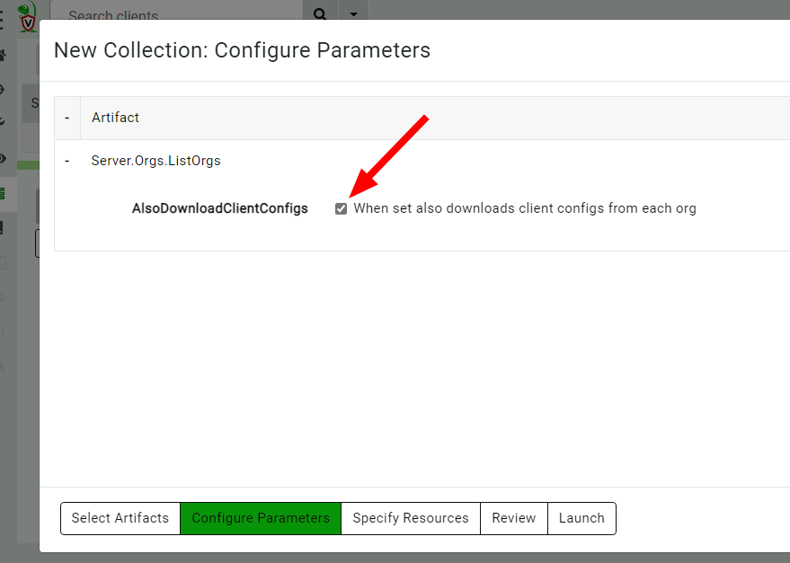

The artifact also uploads the configuration files.

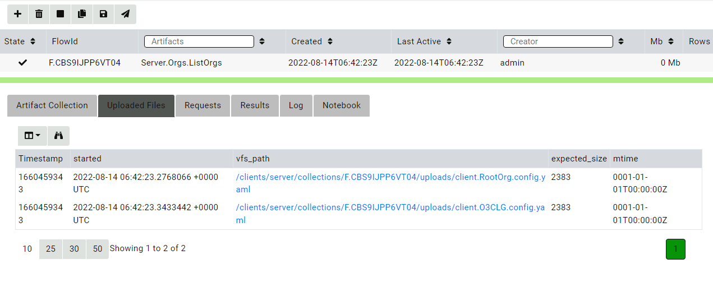

Now I go through the usual deployment process with these configuration
files and prepare MSI, RPM or Deb packages as normal.

### Switching between organizations.

I can now switch between organizations using the organization selector.

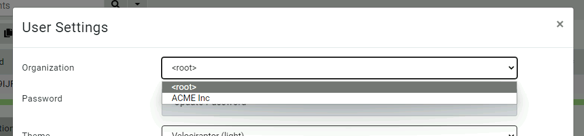

Now the interface is inside the new organization

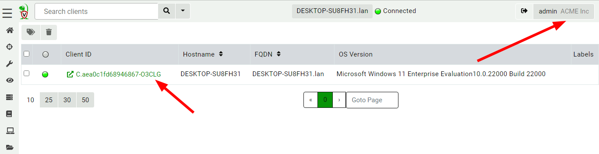

Note the organization name is shown in the user tile, and client id's
have the org id appended to them to remind us that the client exists
within the org.

> The new organization is functionally equivalent to a brand new
> deployed server! It has a clean data store with new hunts, clients,
> notebooks etc. Any server artifacts will run on this organization
> only and server monitoring queries will also only apply to this
> organization.

### Adding other users to the new organization

By default, the user which created the organization is given the
administrator role within that organization. Users can be assigned
arbitrary roles **within the organization**, so for example a user may
be an administrator in one organization but a reader in another
organization.

You can add new users or change the user's roles using the
`Server.Utils.AddUser` artifact. When using basic authentication, this
artifact will create a user with a random password. The password will
then be stored in the server's metadata where it can be shared with
the user. (We normally recommend Velociraptor to be used with SSO such
as OAuth2 or SAML and not to use passwords to manage access).

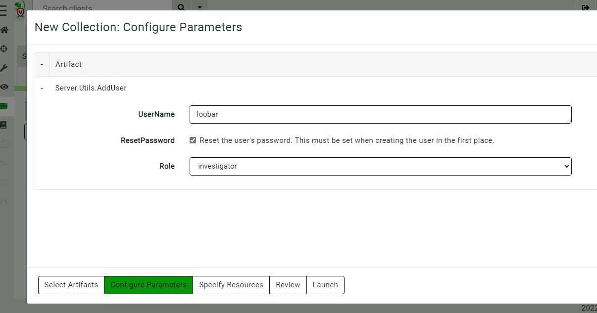

View the user's password in the server metadata screen. (You can remove
this entry when done with it or ask the user to change their password).

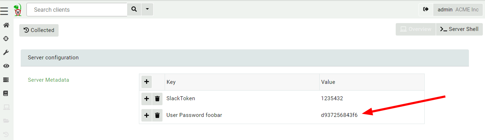

You can view all users in all orgs by collecting the
`Server.Utils.ListUsers` artifact within the root org context.

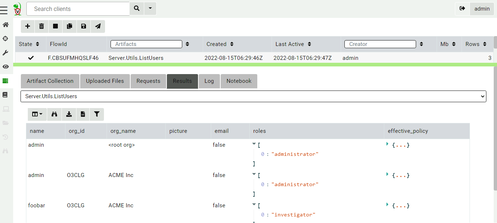

{}

Although Velociraptor respects the assigned roles of users within an
organizations, at this stage this should not be considered as an
adequate security control. This is because there are obvious
escalation paths between roles on the same server. For example,
currently an `administrator` role by design has the ability to write
arbitrary files on the server and run arbitrary commands (primarily
this functionality allows for post processing flows with external
tools).

This is currently also the case in different organizations, so an
organization administrator can easily add themselves to another
organization or indeed to the root organization, change their own
roles etc.

Velociraptor is not designed to contain untrusted users to their own
organization unit at this stage, instead allowing administrators
flexibility and power.

{}

## GUI Improvements

The 0.6.6 release introduces a number of other GUI improvements

### Updating user's passwords

Usually Velociraptor is deployed in production using SSO such as
Google's OAuth2 and in this case user's manage their password using
the provider's own infrastructure.

However it is sometimes convenient to deploy Velociraptor in `Basic`
authentication mode (for example for on-premises or air gaped
deployment). Velociraptor now offers the ability for users to change
their own passwords within the GUI.

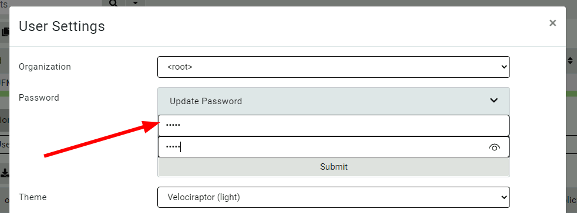

### Allow notebook GUI to set notebooks to public.

Previously notebooks could be shared with specific other users but
this proved unwieldy for larger installs with many users. In this
release Velociraptor offers a notebook to be `public` - this means the
notebook will be shared with all users within the org.

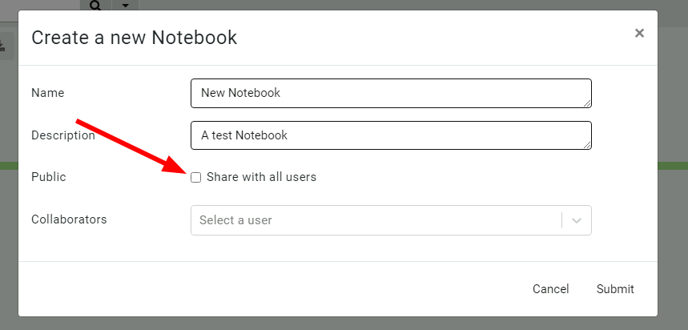

### More improvements to the process tracker

The experimental process tracker is described in more details
[here]({}), but you
can already begin using it by enabling the
`Windows.Events.TrackProcessesBasic` client event artifact and using
artifacts just as `Generic.System.Pstree`, `Windows.System.Pslist` and
many others.

### Context Menu

A new context menu is now available to allow sending any table cell
data to an external service.

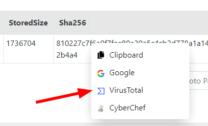

This allows for quick lookups using `VirusTotal` or a quick
`CyberChef` analysis. You can also add your own send to items in the
configuration files.

## Conclusions

If you like the new features, take [Velociraptor for a
spin](https://github.com/Velocidex/velociraptor)!  It is a available
on GitHub under an open source license. As always please file issues
on the bug tracker or ask questions on our mailing list
[velociraptor-discuss@googlegroups.com](mailto:velociraptor-discuss@googlegroups.com)
. You can also chat with us directly on discord
[https://www.velocidex.com/discord](https://www.velocidex.com/discord)
.
