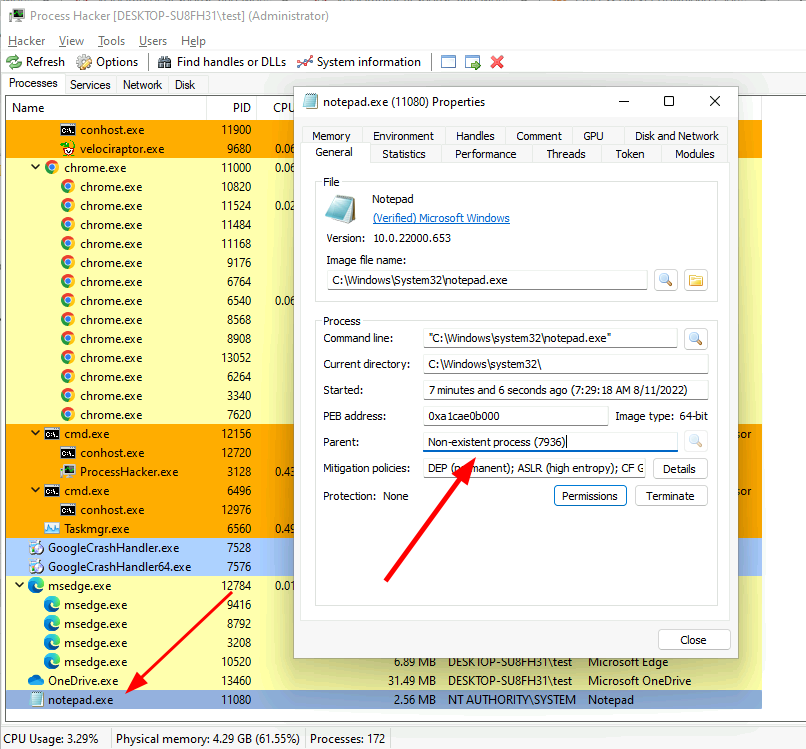
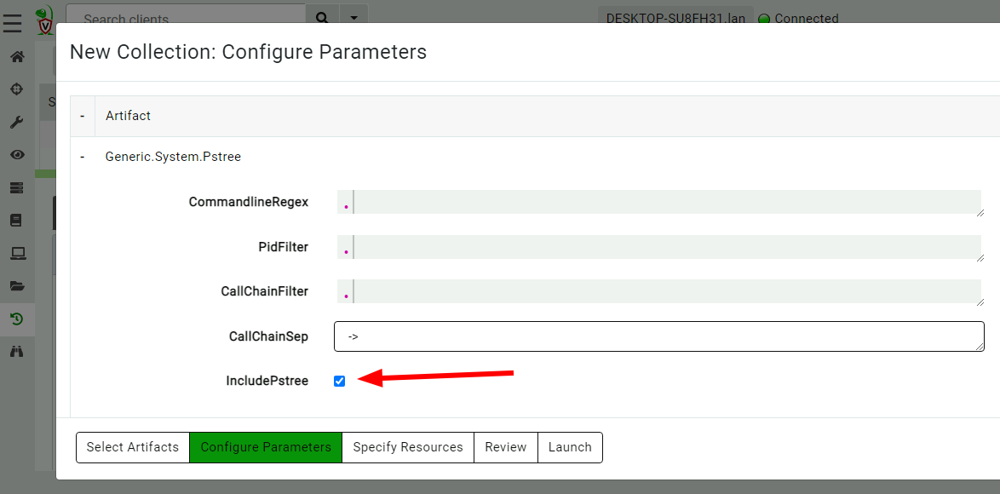
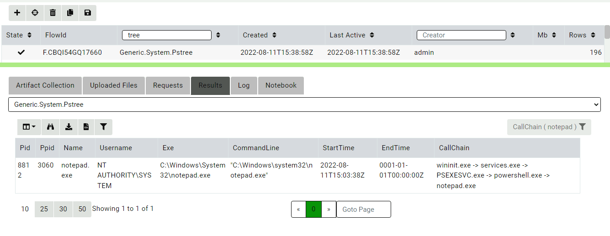
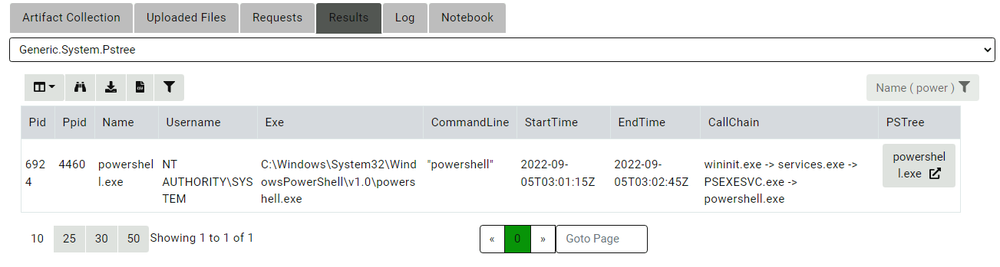
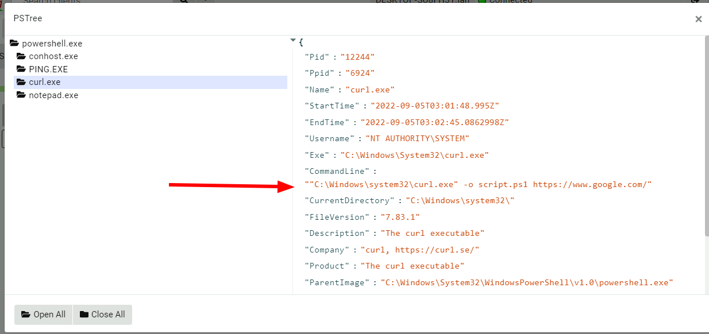
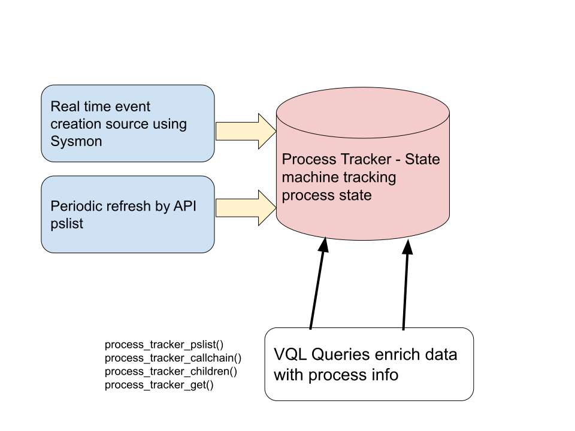
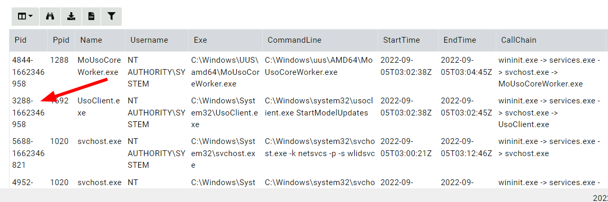
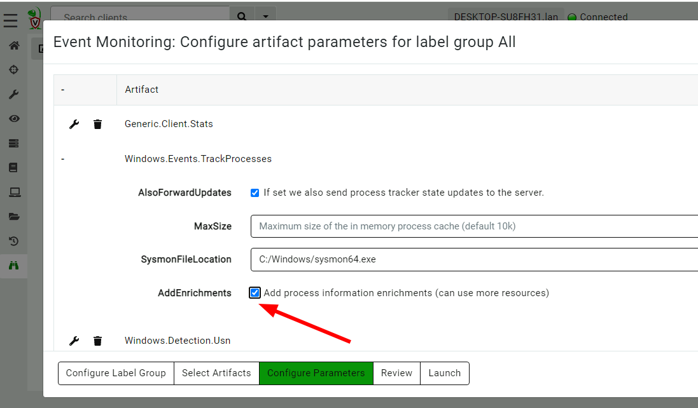

One of the advantages of running Velociraptor on the endpoint
constantly is the ability to monitor the endpoint using [client
monitoring queries]({}). Gaining
visibility to volatile information is critical to reconstructing past
activity and responding to new threats.

Commonly, attackers subvert the endpoint by creating new
processes. For example, an attacker might execute malicious office
macros as their initial compromise, but then follow it by launching
PowerShell or C# code - or commonly Living Off The Land binaries
(`LOLBins`).

We can use information about processes to identify suspicious
processes which may represent malicious activity. In the next example
I will explore a typical case and how it can be investigated using
Velociraptor.


## A Typical intrusion

A common lateral movement methodology is using `PsExec.exe` to create
a system level service (usually remotely). I will run the following commands to emulate typical attacker activities:

```
psexec.exe /s powershell
ping.exe www.google.com
curl.exe -o script.ps1 https://www.google.com/
notepad.exe
```

First I create a system level shell with `PsExec.exe`, then I perform
some reconnaissance on the network. Then I download a tool from a
remote system. Finally I run my malicious process (in this case I use
`notepad.exe` but in real life this will be some backdoor like `Cobalt
Strike`).

## Responding to this system.

For this example, suppose I was able to identify the malicious process
(`notepad.exe`) using other means (for example the
`Windows.Detection.Yara.Process` artifact by scanning process memory).

Now I need to get more context about this process:

1. Where did it come from?
2. Who started it and when?
3. What other activity was done around the time the process was started?

To answer the first question we need to see which process was the
parent of the malicious process (and construct the full call chain).

For this example I will use [Process
Hacker](https://processhacker.sourceforge.io/) - a very popular GUI
for inspecting processes.



Normally Process Hacker displays processes in a tree form - we can see
which process spawned each process. But in this case, there is no
parent shown for `notepad.exe`. Closer inspection shows that the
parent process has actually exited, so Process Hacker has no further
information about it.

This limitation of process inspection is central to live triage - the
API can not provide any information about processes that have already
exited. Therefore, parent/child relationships are broken.

## Using Velociraptor to gather process context

Now, I will use Velociraptor's `Generic.System.Pstree` artifact to
reconstruct the process call chain of all processes on the system. I
will enable the collection of the process tree visualization.



The artifact collects process call trace information from all
processes by following their parent/child relationships. I now filter
the table to just show the `notepad.exe` process, and see that the
process call tree looks very suspicious!



Velociraptor's `Generic.System.Pstree` artifact clearly shows the full
call chain - the process was started through a `PSEXESVC.exe` service
and powershell. This additional context shines light on the initial
intrusion pathway.

## Viewing sibling processes

Launching `notepad.exe` is the final stage of a more complete attack
chain. Let's inspect the parent process in our `PsTree` collection
(`powershell.exe`) to learn what other sibling processes (to our
suspicious `notepad.exe`) were launched as part of the original attack
chain.



Clicking the `Process Tree` button brings out the new Process Tree
visualization - rendering all the children of the powershell and their
respective children.



As can be clearly seen from this visualization, Velociraptor reports
seeing the `ping.exe` process first, then the `curl.exe` process and
finally the `notepad.exe` process. You might also notice that
`curl.exe` as shown in the visualization has already exited by the
time the process tree was collected!

## How can Velociraptor show the complete process call chain?

The process call chain is very useful for us to gather some important
context but how does Velociraptor know about processes that have
already exited? After all the API will not reveal this information
which is why `Process Hacker` can not construct the full call chain?

One of the most exciting additions to Velociraptor in recent releases
was the addition of the `process tracker`. The Process tracker is an
internal tool that keeps track of processes and their children
continuously. By tracking historical process activity on the end point
we can answer questions like `Which process launched this Process ID?`
quickly, even if the original parent has already exited - we do not
need to rely on the API to gather this information.

The diagram below illustrates how the process tracker works



The tracker accepts process information from two potential sources:

1. An event query to feed it real time process start/end events.
2. A VQL query that runs periodically to refresh the complete state of running processes.

These are implemented by way of

1. The `Windows.Events.TrackProcesses` artifact uses ETW to watch for
   the Sysmon Process start events (ID 1) for real time information,
   as well as periodically running a complete `pslist()` to
   synchronize its internal state.

2. If you do not want to run `Sysmon`, you can choose to collect the
   `Windows.Events.TrackProcessesBasic` artifact which only refreshes
   the tracker with a periodic `pslist()` API call.

3. If you do not collect any specialized artifacts to track processes,
   the tracker will fall back to a regular pslist() based dummy
   implementation. This will give the same results as before (i.e. it
   is unable to see previously exited processes) but all process
   tracker VQL commands work as usual.

This means that as an artifact writer you can always use the process
tracker as a complete substitution to the traditional `pslist()`
plugin! Depending on how the administrator chooses to do the actual
tracking, your artifact may gain access to more details.

While it is preferable to populate the process start events with live
Sysmon events, it is not strictly necessary. Sysmon feed with provide
a more accurate real time feed of process start events. While the
alternative `pslist()` style tracking method is very low resource, it
may miss short lived processes.

## Accessing the tracker from VQL

The tracker is available for use from VQL using the following VQL
plugins:

* `process_tracker_pslist()` This plugin is a drop in replacement for
  the `pslist()` plugin. If the tracker is enabled it will also
  contain exited process information.

* `process_tracker_callchain()` provides the full call chain for a
  given process ID as an array of process entries.

* `process_tracker_get()` Looks up a single Process ID in the tracker
  to return its entry if exists.

* `process_tracker_tree()` Provides the full process tree rooted at
  the specified process ID so it can be visualized in the GUI.

## Comparing the process tracker to EDR

Collecting process call chains is very central to detection
engineering and therefore is an integral feature of many EDR
solutions.

Most EDR solutions work by relaying process start events to a central
location such as a SIEM and then using database queries to reconstruct
the process call chain from historical data. This also allows viewing
historical process information.

Velociraptor's design philosophy is endpoint-centric - rather than
forward all the data to a large backend and query across process start
events from **ALL** endpoints, Velociraptor's process tracker limits
the analysis to the process on the endpoint itself. This naturally
limits the total number of process we need to track and makes tracking
much easier because we do not need to query across the entire data set
for all clients.

## Process Tracker challenges

The following describes some of the issues in implementation of the
process tracker we have found (so far).

### Process ID reuse

While in theory process IDs uniquely identify a process, in reality
(at least on Windows) process ID's are reused aggressively. Accounting
for this is not trivial - For example, if a new process is discovered
with a parent ID of 5, we can not just search for a process with ID 5
as it's parent. Since this ID could have been reused and belong to a
completely new process.

Velociraptor's tracker keeps track of reused process ID's by using the
combination of process ID and start time to uniquely identify the
process. If the tracker detects a process has exited, it renames the
old process in the form of `pid-starttime` while creating a new
process entry in the usual form of `pid`.



{}

Other tools use a unique identifier such as a `GUID` to uniquely
identify a process. For example, `Sysmon` derives a GUID based on
process ID, start time, machine id etc to derive a globally unique
identifier to a process.

While a GUID solves the issue of uniquely identifying a process within
a single tool it is not a useful device for Velociraptor's queries,
which typically enrich data from external sources.

For example, if we used `GUID` to uniquely identify processes in the
tracker, a VQL query is unable to enrich the DNS ETW source with
process call chains. The ETW subsystem only provides a Process ID as
an indicator of the process that made the DNS query. There is no way
for Velociraptor to go from a process ID to a unique `GUID` directly
(precisely because a `PID` by itself is missing critical data that
makes it a unique identifier).

Therefore Velociraptor's tracker retains the process ID in the tracker
as the ultimate key by which we can query for a process. This way we
can always convert a PID to a proper call chain without being confused
by PID reuse. When the tracker detects the ID no longer represents the
process uniquely (i.e. the PID has been reused) the tracker can update
the ID and all references to it automatically, so a search for the
same PID will fetch the new process not the old one.

{}


## What is stored in the process tracker.

The Velociraptor Process Tracker is simply a database that stores
information about each process. The process entry in the tracker can
contain any arbitrary data as populated from the process information
queries. For example, when using Sysmon as the process start source,
we can populate the tracker with quite a lot of additional information
such as executable hashes, original executable name etc.

We can choose to add additional enrichment to store in the tracker by
enabling the `AddEnrichments` parameter when configuring the
`Windows.Events.TrackProcesses` artifact. These may increase the
overall load on the endpoint (due to the additional work in
calculating hashes etc) but will provide better quality data in a
response.



## Conclusions

The Process Tracker is a very exciting feature and can help resolve
incidents quickly by providing invaluable context. However it is only
useful when Velociraptor is constantly running on the endpoint. If you
usually use Velociraptor's offline collector to just collect a point
in time snapshot the process tracker will not be able to provide
information about exited processes.

If you like the new process tracker feature, take [Velociraptor for a
spin](https://github.com/Velocidex/velociraptor)!  It is a available
on GitHub under an open source license. As always please file issues
on the bug tracker or ask questions on our mailing list
[velociraptor-discuss@googlegroups.com](mailto:velociraptor-discuss@googlegroups.com)
. You can also chat with us directly on discord
[https://www.velocidex.com/discord](https://www.velocidex.com/discord)
.
