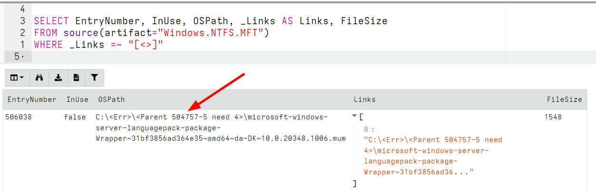

I am very excited to announce the latest Velociraptor release 0.6.7 is
now out. This release has been in the making for a few months now and
has a lot of new features and bug fixes.

In this post I will discuss some of the interesting new features.

## NTFS Parser changes

In this release the NTFS parser was improved significantly. The main
areas of developments were around better support for NTFS compressed
and sparse files and better path reconstruction.

In NTFS there is a Master File Table (MFT) containing a record for
each file on the filesystem. The MFT entry describes a file by
attaching several attributes to the file. Some of these attributes are
`$FILE_NAME` attributes representing the file names of the file.

In NTFS a file may have multiple names. Normally, files have a long
file name and a short filename. Each `$FILE_NAME` record also contains
a reference to the parent MFT entry of its directory.

When Velociraptor parses the MFT it attempts to reconstruct the full
path of each entry by traversing the parent MFT entry, recovering its
name etc. Previously, Velociraptor used one of the `$FILE_NAME`
records (usually the long file name) to determine the parent MFT
entry. However, this is not strictly correct as each `$FILE_NAME`
record can **a different parent directory**. This surprising property
of NTFS is called **hard links**.

You can play with this property using the `fsutil` program. The
following adds a hard link to the program at
`C:/users/test/downloads/X.txt` into a different directory.

```
C:> fsutil hardlink create c:\Users\Administrator\Y.txt c:\Users\Administrator\downloads\X.txt
Hardlink created for c:\Users\Administrator\Y.txt <<===>> c:\Users\Administrator\downloads\X.txt
```

The same file in NTFS can exist in multiple directories at the same
time by use of hard links. The filesystem simply adds a new
`$FILE_NAME` entry to the MFT entry for the file pointing at another
parent directory MFT entry.

Therefore, when scanning the MFT, Velociraptor needs to report all
possible directories each MFT entry can exist in (There can be many
such directories, since each directory can have hard links itself
too).

**As a rule an MFT Entry can represent many files in different
directories!**


## Reassembling paths from MFT entries

When Velociraptor attempts to reassemble the path from an unallocated
MFT entry it might encounter an error where the parent MFT entry
indicated has already been used for some other file or directory.

In previous versions, Velociraptor simply reported these parents as
potential parts of the full path, since for unallocated entries the
path reconstruction is best effort. This lead to confusion among users
with often nonsensical paths reported for unallocated entries.

In the latest release, Velociraptor is more strict in reporting
parents of unallocated MFT entries, also ensuring that the MFT
sequence numbers match. If the parent's MFT entry sequence number does
not match, Velociraptor's path reconstruction indicates this as an
error path.




In the above example, the parent's MFT entry has a sequence number of
5, but we need a sequence number of 4 to match it. Therefore the
parent's MFT entry is rejected and instead we report the error as the
path.

## The offline collection and encryption

Velociraptor's offline collector is a pre-configured Velociraptor
binary which is designed to be a single shot acquisition tool. You can
build an Offline Collector by following the [documentation]({}). The Offline
Collector does not require access to the server, instead simply
collecting the specified artifacts into a Zip file (which can
subsequently be uploaded to the cloud, or simply shared with the DFIR
experts for further analysis).

Previously, Velociraptor only supported encrypting the Zip archive
using a password. This is problematic because the password had to be
embedded inside the collector configuration and so could be viewed by
anyone with access to the binary.

In the latest release, Velociraptor supports asymmetric encryption to
protect the acquisition Zip file. There are two asymmetric schemes:
`X509 encyption` and `PGP encyption`. Having asymmetric encryption
improves security greatly because only the public key needs to be
included in the collector configuration. Dumping the configuration
from the collection is not sufficient to be able to decrypt the
collected data - the corresponding private key is also required!

This is extremely important for forensic collections since these will
often contain sensitive and PII information.

Using this new feature is also extremely easy: One simply selects the
X509 encryption scheme during the configuration of the offline
collector in the GUI.


You can specify any X509 certificate here, but if you do not specify
any, Velociraptor will use the server's X509 certificate instead.

Velociraptor will generate a random password to encrypt the Zip file
with, and then encrypt this password using the X509 certificate.


Since the ZIP standard does not encrypt the file names, Velociraptor
embed a second zip called `data.zip` inside the container. The above
illustrated the encrypted data zip file and the metadata file that
describes the encrypted password.

Because the password used to encrypt the container is not known and
needs to be derived from the X509 private key, we must use
Velociraptor itself to decrypt the container (i.e. we can not use
e.g. `7zip`).


## Importing offline collections

Originally the offline collector feature was designed as a way to
collect the exact same VQL artifacts that Velociraptor allows in the
usual client-server model in situations where installing the
Velociraptor client was not possible. The same artifacts can be
collected into a zip file.

As Velociraptor's post processing capabilities improved (using
notebooks and server side VQL to enrich the analysis), people
naturally wanted to use Velociraptor to post process offline
collections too.

Previously Velociraptor did have the `Server.Utils.ImportCollection`
artifact to allow an offline collection to be imported into
Velociraptor but this did not work well because the offline collector
simply did not include enough information in the Zip file to
sufficiently emulate the GUI's collection views.

In the recent release, the offline collector was updated to add more
detailed information to the collection zip, allowing it to be easily
imported.


## Exporting and Importing collections

Velociraptor has previously had the ability to export collections and
hunts from the GUI directly, mainly so they can be processed by
external tools.

But there was no way to import those collections back into the GUI. We
just never imagined this would be a useful feature!

Recently Eric Capuano from ReconInfosec shared some data from an
exercise using Velociraptor and people wanted to import this into
their own Velociraptor installations so they can run notebook post
processing on the data themselves.


Our community has spoken though! This is a useful feature!

In the latest release exported files from the GUI use the same
container format at the offline collector and therefore can be
imported into a difference Velociraptor installation seamlessly.

## Handling of sparse files

When collecting files from the endpoint using the NTFS accessor we
quite often encounter sparse files. These are files with large
unallocated holes in them. The most extreme sparse file is the [USN
Journal]({}).


In the above example the USN journal size is reported to be 1.3Gb but
in reality only about 40mb is occupied on disk. When collecting this
file, Velociraptor only collects the real data and marks the file as
sparse. The Zip file will contains an index file which specifies how
to reassemble the file into its original form.

While Velociraptor stores the file internally in an efficient way,
when exporting the file for use by other tools, they might expect the
file to be properly padded out (so that file offsets are correct).

Velociraptor now allows the user the choice of exporting an individual
file in a padded form (with sparse regions padded). This can also be
applied to the entire Zip export in the GUI.

For very large sparse files, it makes no sense to pad so much data out
(Some USN journal files are in the TB region), so Velociraptor
implements a limit on padding of very sparse files.


## Parsing User Registry Hives

Many Velociraptor artifacts simply parse keys and values from the
registry to detect indicators. Velociraptor offers two methods of
accessing the registry:

1. Using the Windows APIs
2. Employing the built in raw registry parser to parse the hive files.

While the first method is very intuitive and easy to use, it is often
problematic. Using the APIs requires the user hive to be
mounted. Normally the user hive is only mounted when a user logs
in. Therefore querying registry keys in the user hive will only work
on users that are currently logged in at the time of the check and
miss other users (which are not currently logged in so their hive is
not mounted).

To illustrate this problem consider the
`Windows.Registry.Sysinternals.Eulacheck` artifact which checks the
keys in `HKEY_USERS\*\Software\Sysinternals\*` for the Sysinternals
EULA value.

In previous versions of Velociraptor, this artifact simply used the
windows API to check these keys/values and completely missed any users
that were not logged in.

While this issue is know, previously users had to employ complex VQL
to customize the query so it can search the raw `NTUSER.DAT` files in
each user registry. This is more difficult to maintain since it
requires two separate types of artifact for the same indicator.

With the advent of Velociraptor's `dead disk` capabilities it is
possible to run a VQL query in a "virtualized" context consisting of a
remapped environment. The end result is that the same VQL query can be
used to run on raw registry hives. It is now trivial to apply the same
generic registry artifact to a raw registry parse.


All that is required to add raw registry capabilities to any registry artifact is:

1. Import the `Windows.Registry.NTUser` artifact
2. Use the `MapRawRegistryHives` helper function from that artifact to set up the mappings automatically.
3. Call the original registry query using the `registry` accessor. In
   the background this will be remapped to the raw registry accessor
   automatically.


## Conclusions

There are many more new features and bug fixes in the latest release.

If you like the new features, take [Velociraptor for a
spin](https://github.com/Velocidex/velociraptor)!  It is a available
on GitHub under an open source license. As always please file issues
on the bug tracker or ask questions on our mailing list
[velociraptor-discuss@googlegroups.com](mailto:velociraptor-discuss@googlegroups.com)
. You can also chat with us directly on discord
[https://www.velocidex.com/discord](https://www.velocidex.com/discord)
.
