As an incident responder that is fighting an adversary, you typically
want to be alerted the moment they conduct hands-on-keyboard activity
on systems of the IT-infrastructure that you are investigating. This
blog post shows you two practical examples on how to achieve this with
Velociraptor.

While detection is not the most typical use-case of Velociraptor, it
can be used for that. And to me it has proven to be valuable during
engagements when the deployed Endpoint Detection and Response (EDR)
solution lacked certain detection capabilities, or when it was not
deployed.

## Example 1: Track commands

Adversaries often use commands to conduct their malicious
activity. Receiving an alert when these commands are launched is very
valuable as it allows you to respond quickly.

Let's say you observed that the adversary planted a backdoor on a
remote system using the following scheduled task command:

```
schtasks /Create /SC minute /mo 5 /TN WindowsUpdateCheck /TR C:/Perflog/m.exe" /ru system /s srv_dc01 /u adm_peter /p adminpw
```

Using Velociraptor in combination with the system monitoring tool
'Sysmon' you’re able to build detection. There is no need to manually
install Sysmon, if you follow the steps below it will do it for you.

1. Open the GUI of the Velociraptor server.
2. Select a random client.

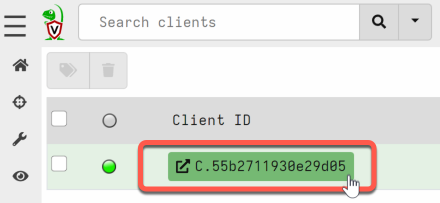

2.  Go the ‘Client Events’ menu and choose 'Update the client monitoring table'.

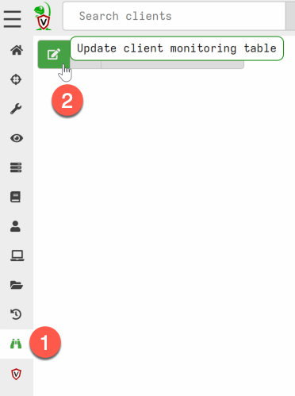

3. Select the label group, and go to the next window ‘Select
   Artifacts’

4. Select the artifact `Windows.Detection.ProcessCreation`. Optional:
   if you want to deploy a custom Sysmon config choose `SysmonConfig`
   and select it. By default, it selects this config:
   https://github.com/SwiftOnSecurity/sysmon-config

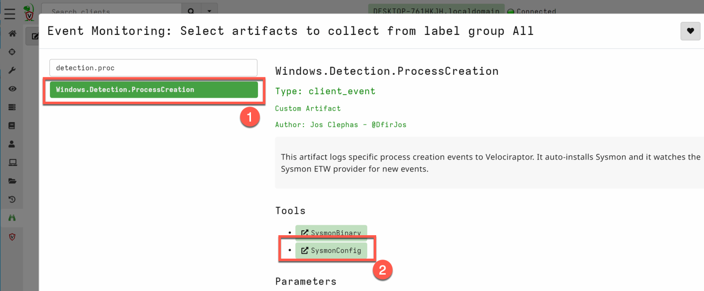

5.  Adjust the parameters. Below I provided an example of how to
    detect the scheduled task command.

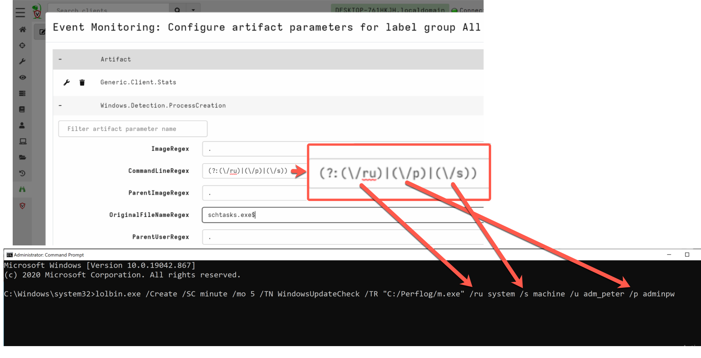

The regex I used matches specific parameters in the scheduled task
command.

```
(?:(\/ru)|(\/p)|(\/s))
```

And the advantage of starting the regex with `(?:` and combining it
with capture groups `()` with pipes `|` between them, is that the
order does not matter. Meaning that even if the adversary shifts some
parameters in the command, the detection still works.

Another way that I used to make it a bit harder for the adversary to
evade detection, is to filter on the PE Original FileName instead of
the Image name. This way detection still works even if the adversary
changes the filename of the binary (in the figure above you see that
`lolbin.exe` was renamed from `schtasks.exe`). Note that detecting on the
PE Original Filename will not work anymore if the adversary modified
the PE header and changed the original filename - which can be done
with a HEX editor, for example.

### Why Sysmon?

The artifact shown in this example installs `Sysmon`. The reason I
used Sysmon is that it logs process creation events without failing,
even when it is a short-lived process. Missed events result in
unreliable detection.

An alternative to Sysmon was consuming process-related events directly
from Event Tracing for Windows (ETW). ETW is a mechanism that
Microsoft built for troubleshooting and diagnostics, and it provides
an enormous amount of events generated by the OS. The process-related
events are generated by the ETW provider
`Microsoft-Windows-Kernel-Process` that has the guid
`{22fb2cd6-0e7b-422b-a0c7-2fad1fd0e716}`. My testing with this
provider resulted in a lot of missed events by Velociraptor (possibly
due to the high-volume). And also, short-lived processes could not be
enriched with commandline parameters. That is because these parameters
are not provided by ETW, and enriching with the process running in
memory sometimes fails as it is shutdown too early.

For example, running the following command that lists content of a
remote drive `dir \\10.96.20.20\c$` sometimes only logs `dir` because
enriching failed. And therefore your detection would not work if you
attempt to match on commandline. Which is something you would want in
this case, because matching on only `dir` would undoubtedly result in
too many false-positives.

Because I wanted reliable detection I chose Sysmon instead of directly
consuming the process events from the aforementioned ETW provider.


## Example 2: Track compromised accounts

The Windows Event Log is a great log source that enables you to track
adversary activity in real-time. Due to the Event Log tracker of
Velociraptor, you can easily monitor for new entries.

Let’s say the adversary uses the Windows accounts `adm_peter` and
`svc_iis` to move laterally through the IT-infrastructure, you can
monitor for any activity concerning these accounts using the artifact
`Windows.Events.Trackaccount`.

To configure this using the GUI of the Velociraptor server, go to:

1. Select a random client:


2. Go to ‘Client Events’ in the menu
3. Choose ‘Update client monitoring table’

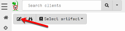

3.  Select the `Label group` and go to the next window.
4.  Select the artifact `Windows.Events.Trackaccount`.
5.  Configure the artifact parameters. In the example below it logs
    authentication events (Windows Event ID ‘4624’) concerning the
    accounts `adm_peter` and `svc_iis`. You are also able to specify
    the `LogonType` (3 = network logon, 10 = interactive logon, etc).

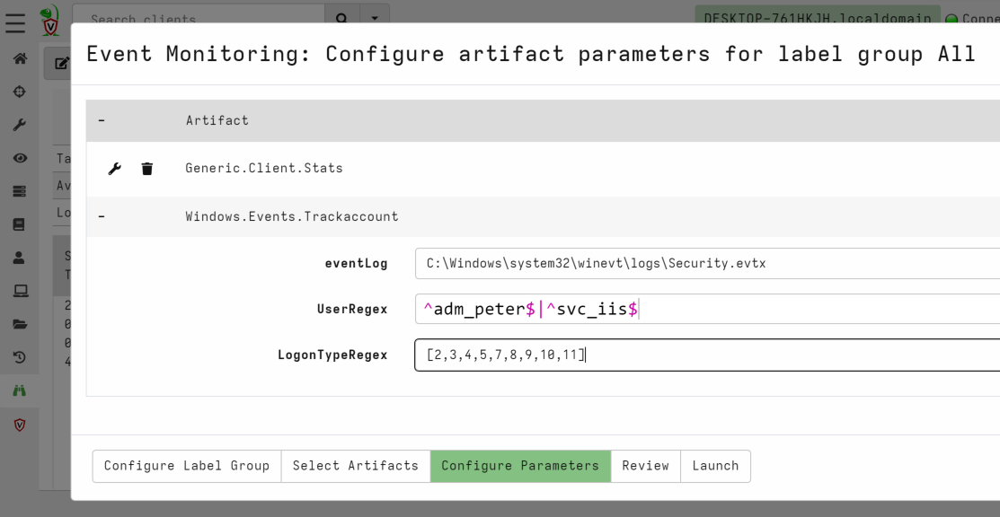

### Monitor vs contain

When reading the above example you might have thought: "why should I
monitor a compromised account when I can disable it?" There are valid
reasons why in some cases you first want to monitor for a while. For
example, when you disable only one account, and the adversary also
compromised other accounts, you did not stop or slow down the
adversary. And you likely only alerted them that you are after their
tail. Which is something you want to avoid, as the adversary might
change tactics which makes it harder for you to track hem.

Another reason why it sometimes makes sense to leave the account
active, is to monitor it with the goal in mind to learn about the
Tools, Tactics, and Procedures (TTP) of the adversary. This in turn
can be used to strengthen the organization their defenses to prevent
similar incidents from occurring again in the future.

There are also valid reasons why you would want to disable compromised
accounts immediately instead of monitoring for a while. For example,
when it actually slow down or stop the adversary, or when it is the
policy of the organization.

Even better containment tactics to stop the adversary, are listed
below. These are particularly helpful when the extend of the
compromise is not yet clear.

- Block or limit outbound network-communication. If done correctly
  this will prevent active command & control (C&C) channels.
- Block DNS requests to external servers as DNS can tunnel C&C
  traffic.
- Block or limit inbound network-communication. As the adversary could
  have placed web-shells on web servers, or compromised other potential
  entry points.

It is important to have a discussion of the above with the
client. They typically want to balance the potential risk of the
compromise against the operational impact. In the end they are the
ones who need to make that decision.

At some point in the investigation you definitely want to disable all
compromised accounts or reset passwords. The same applies to all other
remediation activities aimed at kicking the adversary out, such as
blocking malicious IP addresses, blackholing malicious domains,
quarantining compromised systems, resetting passwords, etc. The most
effective time to execute these activities is when there is a thorough
understanding of the extent of the compromise. This is referred to by
`Mandiant` as the Strike Zone.

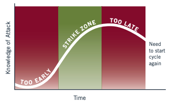

Striking too soon may result in re-doing the remediation
activities. Striking too late may result in the adversary achieving
their mission. Finding the sweet spot is important, and for me that is
when I don't find any new evidence and when I feel comfortable in
knowing we have enough measures in place to respond effectively when
the adversary comes back.

## Sending alerts

When you want to send an alert the moment a detection took place,
follow the steps below. This enables the server-side artifacts that
monitor for triggered alerts.

In the below example I used Teams to receive the alerts, but any other
communication platform that supports Webhooks would work.

1.  Go to Server Events and update the server monitoring table

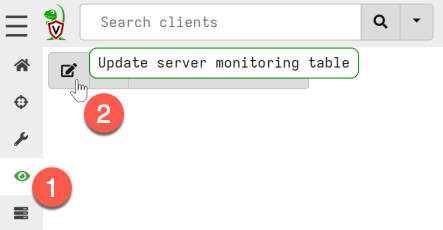

2.  Select the artifact ‘Server.Alerts.ProcessCreation’ and/or
    `Server.Alerts.Trackaccount` and go to the next window ‘Configure
    Parameters’.

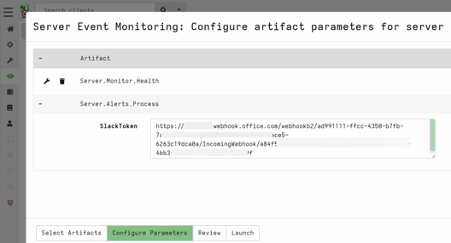

3.  Create a webhook and enter the URL as a parameter. They are easy
    to obtain, a quick procedure for Microsoft Teams can be found
    *[here](https://learn.microsoft.com/en-us/microsoftteams/platform/webhooks-and-connectors/how-to/add-incoming-webhook)*. Webhooks
    for other platforms can also be created, such as for Slack,
    Discord, and others.

4.  If all works well, you should receive an alert in your
    communication platform when an alert is triggered.

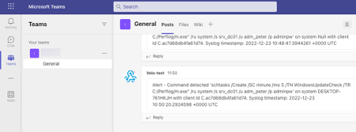


## Creating an overview of alerts

Besides sending alerts, it is also handy to create an overview in
Velociraptor with all alerts. With the Notebook capability you can
create this. One requirement is that the server-side artifacts needs
to be created by following the steps in the previous paragraph.

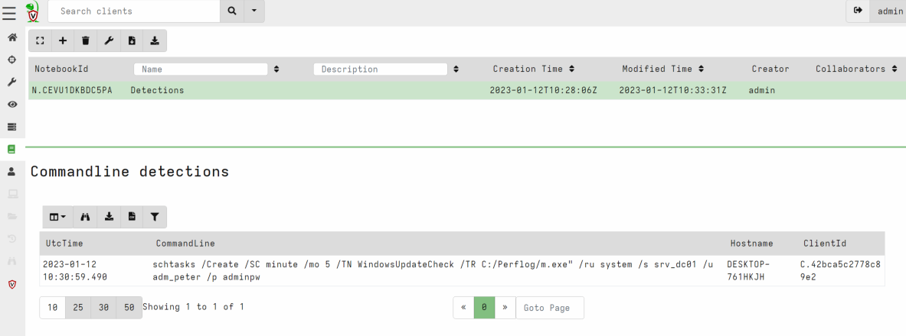

The VQL query below is what you can enter in a Notebook to create an
overview of the alerts.


```vql
SELECT EventData.UtcTime as UtcTime,
       EventData.CommandLine as CommandLine,
       Hostname, ClientId
FROM source(artifact='Server.Alerts.ProcessCreation')
```

If you want to list the alerts of the artifact
`Windows.Events.Trackaccount` you need to make some slight changes to
the VQL query, such as changing the artifact name and the selected
fields.

## Test. Test. Test.

Always test the detections you put in place. The way I typically test
with Velociraptor is by mimicking the adversary activity on a test
system that is connected to the Velociraptor server. For example, I
launch a command that the adversary used and I check to see if that
results in an alert. Another possibility is launching [remote shell
commands](https://docs.velociraptor.app/docs/gui/clients/#remote-shell-commands)
via Velociraptor.


## What more can be done?

The sky is the limit when it comes to detecting the adversary using
Velociraptor. And there are still opportunities for building
artifacts:

- Registry changes (for example when persistence of malware is
  created)
- Detect process injection
- Named pipes detection

Below is a list of artifacts that are already built:

-   File changes (`Windows.Detection.Usn`)
-   DNS request monitoring (for clients: `Windows.ETW.DNS`, and for
    servers: `Windows.ETW.DNSQueriesServer`)
-   Service creation (`Windows.Events.ServiceCreation`)
-   PsExec usage (`Windows.Detection.PsexecService`)
-   WMI process creation events (`Windows.ETW.WMIProcessCreate`)

If you have any other ideas for detection feel free to share!
