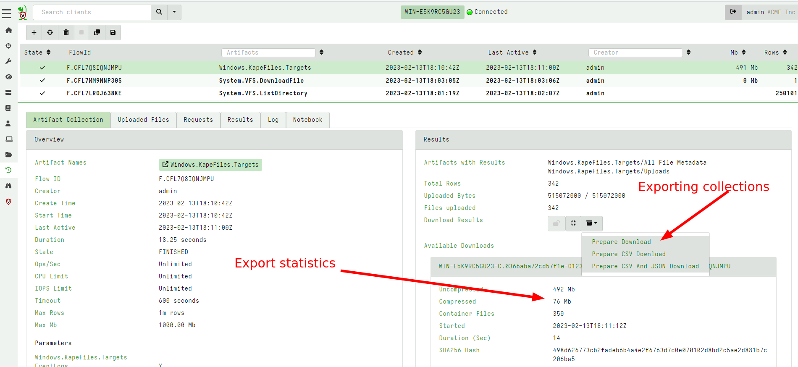
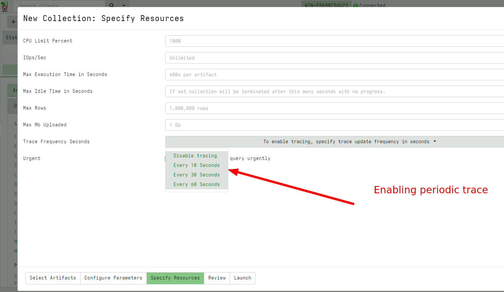
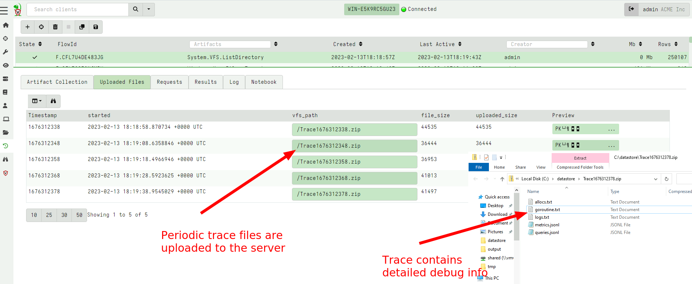
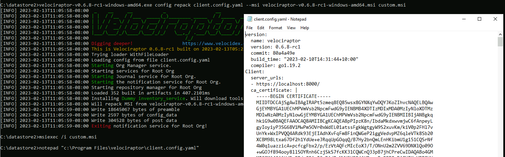

I am very excited to announce the latest Velociraptor release 0.6.8 is
in release candidate status. This release has been in the making for a
few months now and has a lot of new features and bug fixes.

In this post I will discuss some of the interesting new features.

## Performance improvements

A big theme in the 0.6.8 release was about performance improvement,
making Velociraptor faster, more efficient and more scalable (even
more so than it currently is!).

### New client-server communication protocol

When collecting artifacts from endpoints we need to maintain a
collection state (e.g. how many bytes were transferred?, how many rows?
was the collection successful? etc). Previously tracking the
collection was the task of the server, but this extra processing on
the server limited the total number of collections the server could
process.

In the 0.6.8 release a new communication protocol was added to offload
a lot of the collection tracking to the client itself. This lowers the
amount of work on the server and therefore allows more collections to
be processed by the server at the same time.

{}

To maintain support with older clients, the server continues to use
the older communication protocol with them - but will achieve the most
improvement in performance once the newer clients are deployed.

{}

### New Virtual File System GUI

The VFS feature in Velociraptor allows users interactively inspect
directories and files on the endpoint, in an familiar tree user
interface. The previous VFS view would store the entire directory
listing in a single table for each directory. For very large
directories like `C:\Windows` or `C:\Windows\System32` (which
typically have thousands of files) this would strain the browser
leading to unusable UI.

In the latest release, the VFS GUI uses the familiar paged table and
syncs this directory listing in a more efficient way. This improves
performance significantly: for example, it is now possible and
reasonable to perform a recursive directory sync on `C:\Windows`, on
my system syncs over 250k files in less than 90 seconds.


Since the VFS is now using the familiar paging table UI, it is also
possible to filter, sort on any column using the same familiar UI.

### Faster export functionality

Velociraptor hunts and collections can be exported to a ZIP file for
easy consumption in other tools. The 0.6.8 release improved the export
code to make it much faster. Additionally the GUI was improved to show
how many files were exported into the zip, and other statistics.




### Tracing capability on client collections

We often get questions about what happened to a collection that seems
to be hung? It is difficult to know why a collection seems to be
unresponsive or stopped - it could mean the client was killed for some
reason, (e.g. due to excessive memory use or a timeout).

Previously the only way to gather client side information was to
collect a `Generic.Client.Profile` collection. This required running
it at just the right time and did not guarantee that we would get
helpful insight of what the query and the client binary were doing
during the operation in question.

In the latest release it is possible to specify a trace on any
collection to automatically collect client side state as the
collection is progressing.






## VQL improvement - disk based materialize operator

The VQL `LET ... <= ` operator is called the [materializing LET
operator]({})
because it expands the following query into a memory array which can
be accessed cheaply multiple times.

While this is useful for small queries, it has proved dangerous in
some cases, because users inadvertently attempted to materialize a
very large query (e.g. a large `glob()` operation) dramatically
increasing memory use. For example, the following query could cause
problems in earlier versions.

```vql
LET X <= SELECT * FROM glob(globs=specs.Glob, accessor=Accessor)
```

In the latest release the VQL engine was improved to support a temp
file based materialized operator. If the materialized query exceeds a
reasonable level (by default 1000 rows), the engine will automatically
switch away from memory based storage into file backed
storage. Although file based storage is slower, memory usage is more
controlled.

Ideally the VQL is rewritten to avoid this type of operation, but
sometimes it is unavoidable, and in this case, file based materialize
operations are essential to maintain stability and acceptable memory
consumption.

## New MSI deployment option

On Windows the recommended way to install Velociraptor is via an MSI
package. The MSI package allows the software to be properly installed
and uninstalled and it is also compatible with standard Windows
software management procedures.

Previously however, building the MSI requires using the WIX toolkit -
a Windows only MSI builder which is difficult to run on other
platforms. Operationally building with WIX complicates deployment
procedures and requires using a complex release platform.

In the 0.6.8 release, a new method for `repacking` the official MSI
package is now recommended. This can be done on any operating system
and does not require WIX installed. Simply embed the client
configuration file in the officially distributed MSI packages using
the following command:

```
velociraptor-v0.6.8-rc1-linux-amd64 config repack --msi velociraptor-v0.6.8-rc1-windows-amd64.msi client.config.yaml output.msi
```



## Conclusions

There are many more new features and bug fixes in the latest
release. Currently the release is in testing for the next few weeks,
so please test widely and provide feedback by opening GitHub issues.

If you like the new features, take [Velociraptor for a
spin](https://github.com/Velocidex/velociraptor)!  It is a available
on GitHub under an open source license. As always please file issues
on the bug tracker or ask questions on our mailing list
[velociraptor-discuss@googlegroups.com](mailto:velociraptor-discuss@googlegroups.com)
. You can also chat with us directly on discord
[https://www.velocidex.com/discord](https://www.velocidex.com/discord)
.
