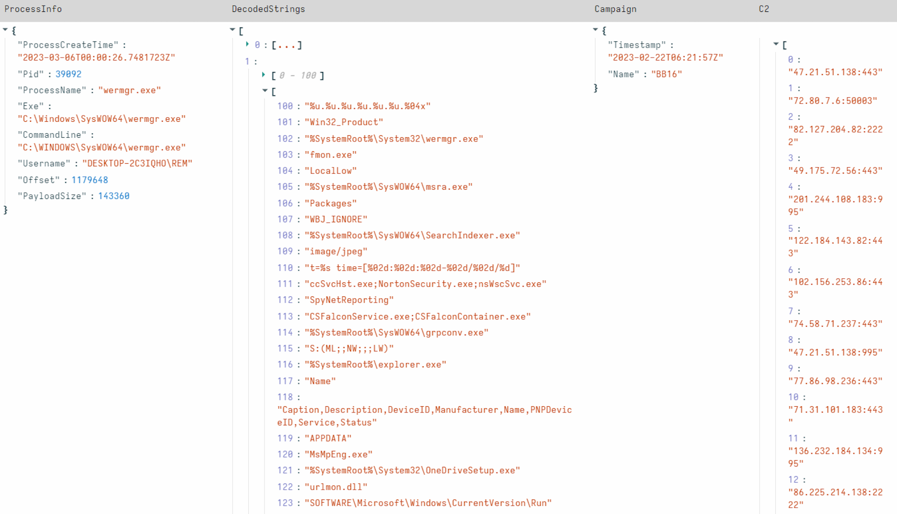

This is a technical post covering practical methodology to extract
configuration data from recent Qakbot samples. In this blog, I will
provide some background on Qakbot, then walk through decode themes in
an easy to visualize manner. I will then share a Velociraptor artifact
to detect and automate the decode process at scale.

Qakbot or QBot, is a modular malware first observed in 2007 that has
been historically known as a banking Trojan. Qbot is used to steal
credentials, financial, or other endpoint data, and in recent years,
regularly a loader for other malware leading to hands on keyboard
ransomware.

Typical delivery includes malicious emails as a zipped attachment, LNK,
Javascript, Documents, or an embedded executable. The example shown in
this post was delivered by an email with an attached pdf file:

Qakbot has some notable defense evasion capabilities including:

1. Checking for Windows Defender sandbox and terminating on discovery.
2. Checking for the presence of running anti-virus or analysis tools,
then modifying its later stage behavior for evasion.
3. Dynamic corruption of payload on startup and rewrite on system shutdown.

Due to the commodity nature of delivery, capabilities and end game,
it is worth extracting configuration from observed samples to scope
impact from a given campaign. Hunting enterprise wide and finding a
previously missed machine or discovering an ineffective control can be
the difference in preventing a domain wide ransomware event, or a
similar really bad day.

### Configuration

Qakbot has an RC4 encoded configuration, located inside two resources
of the unpacked payload binary. The decryption process has not changed
significantly in recent times, but for some minor key changes. It uses
a SHA1 of a hard coded key that can typically be extracted as an
encoded string in the .data section of the payload binary. This key
often remains static across campaigns, which can speed up analysis with
the maintainance of a recent key list.

Current samples undergo two rounds of RC4 decryption with validation
built in. The validation bytes dropped from the data for the second
round.

After the first round:
- The first 20 bytes in hex is for validation and is compared with the
SHA1 of the remaining decoded data
- Bytes `[20:40]` is the key used for the second round of decoding
- The Data to decode is byte `[40:]` onwards
- The same validation process occurs for the second round decoded data
    - `Verification = data[:20]`
    - `DecodedData = data[20:]`

Campaign information is located inside the smaller resource where,
after this decoding and verification process, data is clear text.

The larger resource stores Command and Control configuration. This is
typically stored in `netaddress format` with varying separators. A
common technique for finding the correct method is searching for common
ports and separator patterns in the decoded data.

### Encoded strings

Qakbot stores blobs of xor encoded strings inside the .data section of
its payload binary. The current methodology is to extract blobs of key
and data from the referenced key offset which similarly is reused
across samples.

Current samples start at offset 0x50, with an xor key, followed by a
separator of 0x0000 before encoded data. In recent samples I have
observed more than one string blob and these have occurred in the same
format after the separator.

Next steps are splitting on separators, decode expected blob pairs and
drop any non printable. Results are fairly obvious when decoding is
successful as Qakbot produces clean strings. I typically have seen two
well defined groups with strings aligning to Qakbot capabilities.

### Payload

Qakbot samples are typically packed and need execution or manual
unpacking to retrieve the payload for analysis. Its very difficult to
obtain this payload remotely at scale, in practice the easiest way is
to execute the sample in a VM or sandbox that enables extracting the
payload with correct PE offsets.

When executing locally Qakbot typically injects its payload into a
Windows process, and can be detected with yara targeting the process
for an unbacked section with `PAGE_EXECUTE_READWRITE` protections.

Below is an example of running PE-Sieve / Hollows Hunter tool
from Hasherezade. This helpful tool enables detection of several types
of process injection, and the dumping of injected sections with
appropriately aligned headers. In this case, the injected process is
`wermgr.exe` but it's worth to note, depending on variant and process
footprint, your injected process may vary.

### Doing it at scale

Now I have explained the decode process, time to enable both detection
and decode automation in Velociraptor.

I have recently released
[Windows.Carving.Qakbot](https://docs.velociraptor.app/exchange/artifacts/pages/qakbot/)
which leverages a PE dump capability in Velociraptor 0.6.8 to enable
live memory analysis. The goal of the artifact was to automate my
decoding workflow for a generic Qakbot parser and save time for a
common analysis. I also wanted an easy to update parser to add
additional keys or decode nuances when changes are discovered.

This artifact uses Yara to detect an injected Qakbot payload, then
attempts to parse the payload configuration and strings. Some of the
features in the artifact cover changes observed in the past in the
decryption process to allow a simplified extraction workflow:

- Automatic PE extraction and offset alignment for memory detections.
- `StringOffset` - the offset of the string xor key and encoded strings
is reused regularly.
- PE resource type: the RC4 encoded configuration is typically inside
2 resources, I’ve observed `BITMAP` and `RCDATA`
- Unescaped key string: this field is typically reused over samples.
- Type of encoding: single or double, double being the more recent.
- Hidden `TargetBytes` parameter to enable piping payload in for
analysis.
- Worker threads: for bulk analysis / research use cases.

### Research

The Qakbot parser can also be leveraged for research and run bulk
analysis. One caveat is the content requires payload files that have
been dumped with offsets intact. This typically requires some post
collection filtering or PE offset realignment but enables Velociraptor
notebook to manipulate post processed data.

Some techniques I have used to bulk collect samples:
- Sandbox with PE dumping features: api based collection
- Virustotal search: `crowdsourced_yara_rule:0083a00b09|win_qakbot_auto`
AND `tag:pedll` AND NOT `tag:corrupt`
(note: this will collect some broken
payloads)

Some findings from a small data set ~60 samples:
- Named campaigns are typically short and not longer than a few
samples over a few days.
- IP addresses are regularly reused and shared across campaigns
- Most prevalent campaigns are `BB` and  `obama` prefixed
- Minor campaigns observed: `azd`, `tok` and `rds` with only one or
two observed payload samples each.

Strings analysis can also provide insights to sample behavior over
time to assist analysis. A great example is the adding to process name
list for anti-analysis checks.

### Conclusion

During this post I have explained the Qakbot decoding process and
introduced an exciting new feature in Velociraptor. PE dumping is a
useful capability and enables advanced capability at enterprise scale,
not even available in expensive paid tools. For widespread threats
like Qakbot, this kind of content can significantly improve response
for the blue team, or even provide insights into threats when analyzed
in bulk. In the coming months the Velociraptor team will be publishing
a series of similar blog posts, offering a sneak peek at some of the
types of memory analysis enabled by Velociraptor and incorporated into
our training courses.

I also would like to thank some of Rapid7’s great analysts - `Jakob Denlinger`
and `James Dunne` for bouncing some ideas when writing this
post.

### References

1. [Malpedia, Qakbot](https://malpedia.caad.fkie.fraunhofer.de/details/win.qakbot)
2. [Elastic, QBOT Malware Analysis](https://www.elastic.co/security-labs/qbot-malware-analysis)
3. [Hasherezade, Hollows Hunter](https://github.com/hasherezade/hollows_hunter)
4. [Windows.Carving.Qakbot](https://docs.velociraptor.app/exchange/artifacts/pages/qakbot/)
