I am very excited to announce the latest Velociraptor release 0.6.9 is
now in release candidate status. Please test widely. This release has
been in the making for a few months now and has a lot of new features
and bug fixes.

In this post I will discuss some of the interesting new features.

## GUI improvements

The GUI was updated in this release to improve user workflow and accessibility.

### Table filtering and sorting

Previously, table filtering and sorting required a separate dialog. In
this release the filtering controls were moved to the header of each
column making it more natural to use.

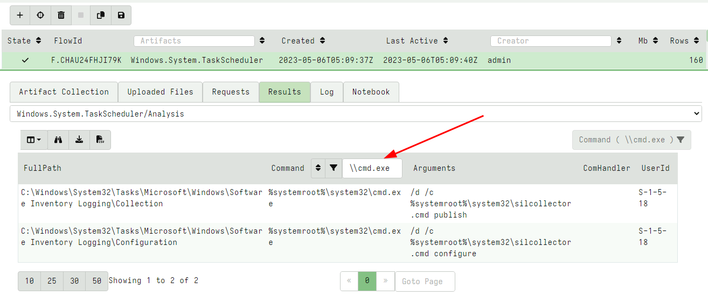

### VFS GUI improvements

The VFS UI allows the user to collect files from the endpoint in a
familiar tree based user interface. In previous versions it was only
possible to schedule a single download at a time. This proved
problematic when the client was offline or transferring a large file
because the user had no way to kick off the next download until the
first file was fully fetched.

In this release the GUI was revamped to support multiple file
downloads at the same time. Additionally it is now possible to
schedule a file download by right clicking the download column in the
file table and selecting "Download from client".

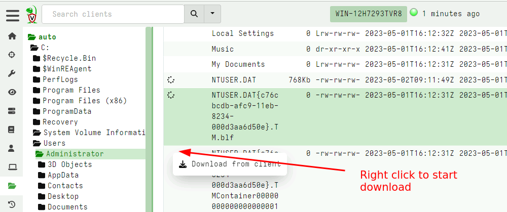

### Hex viewer and file previewer GUI

In release 0.6.9 a new hex viewer was introduced. This viewer makes it
possible to quickly triage uploaded files from the GUI itself,
implementing some common features:

1. The file can be viewed as a hex dump or a strings style output.
2. The viewer can go to an arbitrary offset within the file, or page
   forward or backwards.
3. The viewer can search forward or backwards in the file for a
   `Regular Expression`, `String`, or a `Hex String`.

The hex viewer previewer is available for artifacts that define a
column of type `preview_uploads` including the `File Upload` table
within the flow GUI.

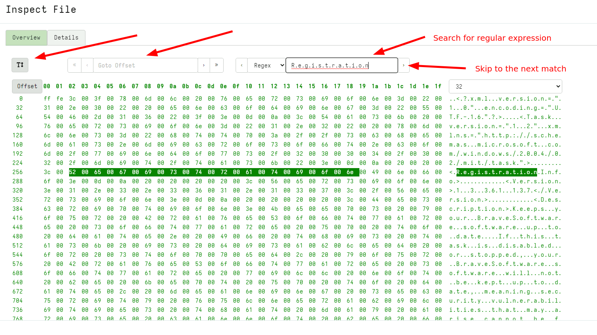

### Artifact pack import GUI improvements

Velociraptor allows uploading an `artifact pack` - a simple Zip file
containing artifact definitions. For example, the artifact exchange is
simply a zip file with artifact definitions.

Previously artifact packs could only be upload in their entirety and
always had an "Exchange" prefix prepended. However in this release the
UI was revamped to allow only some artifacts to be imported from the
pack and customize the prefix.

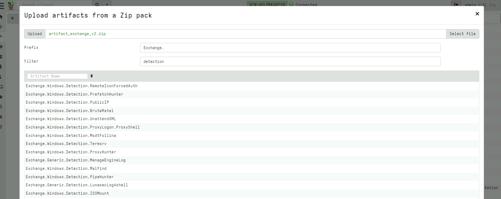


## Direct SMB support

Windows file sharing is implemented over the SMB protocol. Within the
OS, accessing remote file shares happens transparently, for example by
mapping the remote share to a drive using `net use` command or
accessing a file name starting with a UNC path
(e.g. `\\ServerName\Share\File.exe`)

While Velociraptor can technically also access UNC shares by using the
usual file APIs and providing a UNC path, in reality this does not
work because Velociraptor is running as the local `System` user which
normally does not have network credentials so can not map remote
shares.

This limitation is problematic because sometimes we need to access
remote shares (e.g. to verify hashes, perform yara scans etc). Until
this release the only workaround for this limitation was to install
the Velociraptor user as a domain user account with credentials.

As of the 0.6.9 release SMB is supported directly within the
Velociraptor binary as an accessor. This means that all plugins that
normally operate on files can also operate on a remote SMB share
transparently. Velociraptor does not rely on the OS to provide
credentials to the remote share, instead credentials can be passed
directly to the `smb` accessor to access the relevant `smb` server.

The new accessor can be used in any VQL that needs to use a file, but
to make it easier there is a new artifact called the
`Windows.Search.SMBFileFinder` artifact that allows for flexible file
searches on an SMB share.

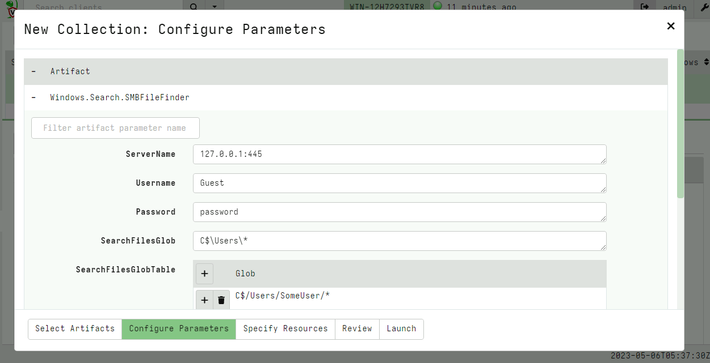

### Using SMB for distributing tools

Velociraptor can manage third party tools within its collected
artifacts by instructing the endpoint to download the tool from an
external server or the velociraptor server itself.

It is sometimes convenient to download external tools from an external
server (e.g. a cloud bucket) due to bandwidth considerations.

Previously this server could only be a HTTP server, but in many
deployments it is actually simpler to download external tools from an
SMB share.

In this release Velociraptor accepts an SMB URL as the serve URL
parameter within the tool configuration screen.

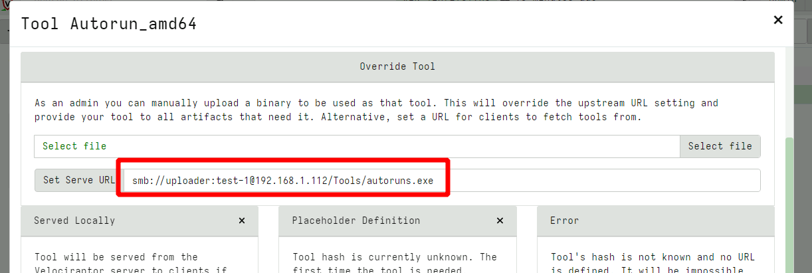

You can configure the remote share with read only permissions (read
[these instructions]({}) for more details
on configuring SMB).

## The offline collector

The offline collector is a popular mode of running Velociraptor, where
the artifacts to collect are pre-programmed into the collector which
stores the results in a zip file. The offline collector can be
pre-configured to encrypt and upload the collection automatically to
a remote server without user interaction, making it ideal for using
remote agents or people to manually run the collector without needing
further training.

In this release the Velociraptor offline collector added two more
upload targets. It is now possible to upload to an SMB server and to
Azure Blob Storage.

### SMB server uploads

Because the offline collector is typically used to collect large
volumes of data, it is beneficial to upload the data to a networked
server close to the collected machine. This avoids cloud network costs
and bandwidth limitations and works very well in air gaped networks.

You can now simply create a new share on any machine, by adding a
local Windows user with password credentials, exporting a directory as
a share and adjusting the upload user's permissions to only be able to
write on the share and not read from it. It is now safe to embed these
credentials in the offline collector - which can only upload data but
not read or delete other data.

See the full instructions of how to [configure the offline collector for SMB upload]({}).

### Azure Blob storage service.

Velociraptor can also upload collections to an Amazon S3 or Google
Cloud Storage bucket. However until now, Velociraptor did not support
the Azure offering. Many users requested direct support for Azure blob
storage, which is now in 0.6.9.

See this for all [The details about how to configure Azure for safe
uploads]({}), but
similar to the other methods, credentials embedded in the offline
collector can only be used to upload data and not read or delete data
in the storage account.

## Debugging VQL queries

One of the points of feedback we received from our annual user survey
was that although VQL is an extremely powerful language, users
struggled with debugging and understanding how the query
proceeds. Unlike a more traditional programming language
(e.g. Python), there is no debugger where users can pause execution
and inspect variables, or add print statements to see what data is
passed between parts of the query.

We took this feedback on board and in release 0.6.9 the `EXPLAIN`
keyword was introduced. The `EXPLAIN` keyword can be added before any
SELECT in the VQL statement to place that SELECT statement into
tracing mode.

As a recap the general syntax of the VQL statement is:

```vql
SELECT vql_fun(X=1, Y=2), Foo, Bar
FROM plugin(A=1, B=2)
WHERE X = 1
```

When a query is in tracing mode:

1. All rows emitted from the plugin are logged with their types
2. All parameters into any function are also logged
3. When a row is filtered because it did not pass the `WHERE` clause this is also logged

This additional tracing information can be used to understand how data
flows throughout the query.

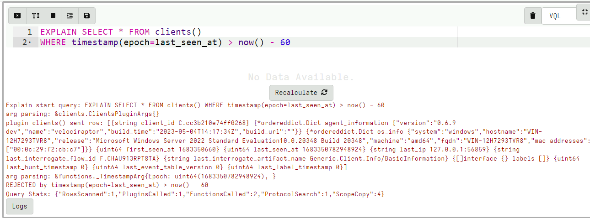

You can use the `EXPLAIN` statement in a notebook or within an
artifact as collected from the endpoint (although be aware that it can
lead to extremely verbose logging).

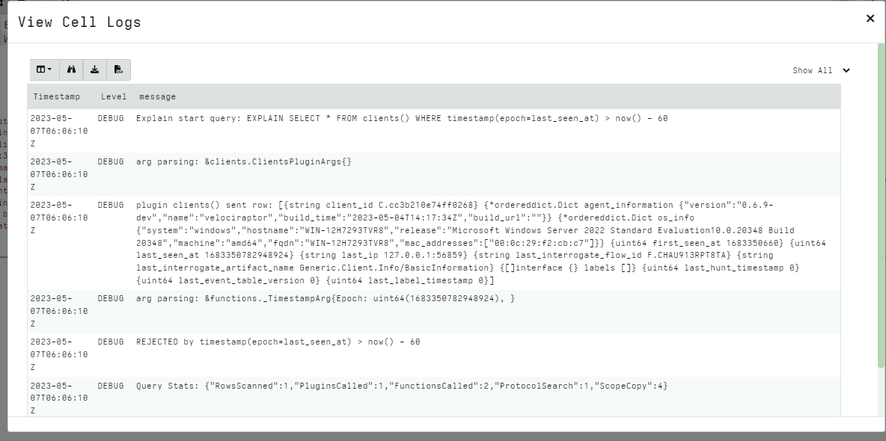

For example in the above query we can see:
1. The `clients()` plugin generates a row.
2. The `timestamp()` function received the `last_seen_at` value
3. The `WHERE` condition rejected the row because the `last_seen_at` time was more than 60 seconds ago.

## Locking down the server

Another concern raised in our survey was the perceived risk of having
Velociraptor permanently installed. Due to its high privilege and
efficient scaling there is a risk that a Velociraptor administrator
account compromise can be escalated to compromise the entire domain.

While this risk is not higher than any other domain wide
administration tool, in some deployment scenarios, Velociraptor does
not need this level of access normally. While in an incident response
situation, it is necessary to promote Velociraptor's level of access
easily.

In the 0.6.9 release, Velociraptor has introduced `lock down
mode`. When a server is locked down certain permissions are removed
(even from administrators). The lockdown is set in the config file,
helping to mitigate the risk of a Velociraptor server admin account
compromise.

After initial deployment and configuration, the administrator can set
the server in lockdown by adding the following configuration
directive to the `server.config.yaml` and restarting the server:

```yaml
lockdown: true
```

After the server is restarted the following permissions will be denied:

 - `ARTIFACT_WRITER`
 - `SERVER_ARTIFACT_WRITER`
 - `COLLECT_CLIENT`
 - `COLLECT_SERVER`
 - `EXECVE`
 - `SERVER_ADMIN`
 - `FILESYSTEM_WRITE`
 - `FILESYSTEM_READ`
 - `MACHINE_STATE`

Therefore it will still be possible to read existing collections, and
continue collecting client monitoring data but not edit artifacts or
start new hunts or collections.

During an active IR the server may be taken out of lockdown by
removing the directive from the configuration file and restarting the
service. Usually the configuration file is only writable by root and
the Velociraptor server process is running as a low privilege account
which can not write to the config file. This combination makes it
difficult for a compromised Velociraptor administrator account to
remove the lockdown and use Velociraptor as a lateral movement
vehicle.

## Audit events

Velociraptor maintains a number of log files over its operation,
normally stored in the `<filestore>/logs` directory. While the logs
are rotated and separated into different levels, the most important
log type is the `audit` log which records auditable events. Within
Velociraptor `auditable events` are security critical events such as:

- Starting a new collections from a client
- Creating a new hunt
- Modifying an artifact
- Updating the client monitoring configuration

Previous versions of Velociraptor simply wrote those events to the
logging directory but this can be deleted if the server becomes
compromised.

In 0.6.9 there are two ways to forward auditable events off the server

1. Using [remote syslog services]({})
2. Uploading to external log management systems e.g. Opensearch/Elastic using the [Elastic.Events.Upload]({}) artifact.

Additionally,  auditable events are now emitted as part of the
`Server.Audit.Logs` artifact so they can be viewed or searched in the
GUI by any user.

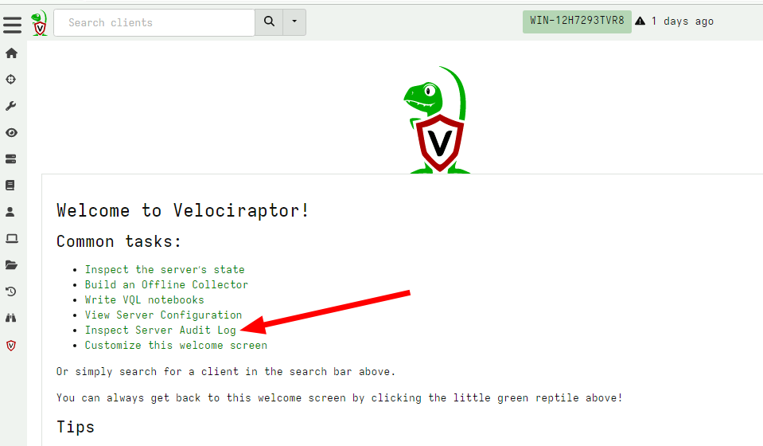

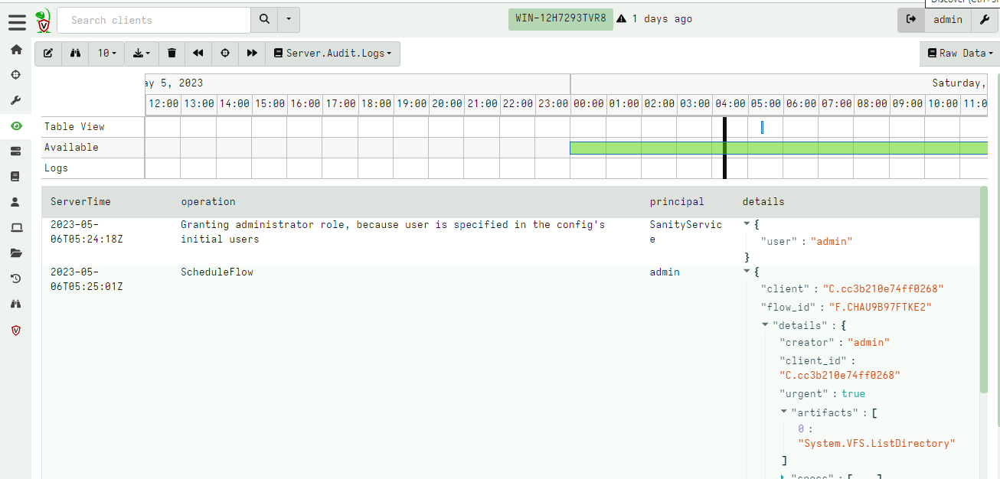

Because audit events are available now as part of the server
monitoring artifact, it is possible for users to develop custom VQL
server monitoring artifacts to forward or respond to auditable events
just like any other event on the client or the server. This makes it
possible to forward events to e.g. Slack or Discord, as demonstrated
by the `Elastic.Events.Upload` artifact above.

## Tool definitions can now specify an expected hash

Velociraptor supports pushing tools to external endpoints. A
Velociraptor artifact can define an external tool, allowing the server
to automatically fetch the tool and upload it the endpoint.

Previously the artifact could only specify the URL where the tool
should be downloaded from. However in this release it is also possible
to declare the expected hash of the tool. This prevents potential
substitution attacks effectively by pinning the third-party binary
hash.

While sometimes the upstream file may legitimately change (e.g. due to
a patch), Velociraptor will not automatically accept the new file when
the hash does not match the expected hash.

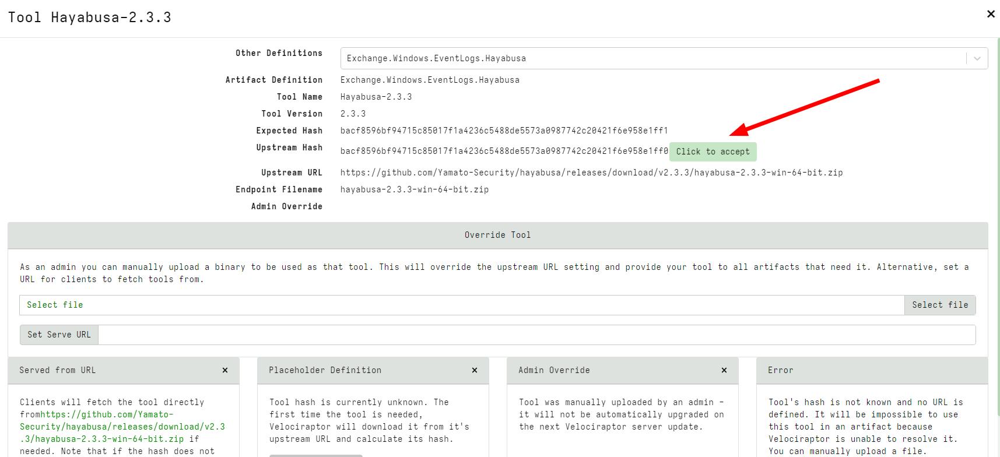

In the above I modified the expected hash to be slightly different
from the real tool hash. Velociraptor refuses to import the binary but
provides a button allowing the user to accept this new hash
instead. This should only be done if the administrator is convinced
the tool hash was legitimately updated.

## Conclusions

There are many more new features and bug fixes in the latest
release. Currently the release is in testing for the next few weeks,
so please test widely and provide feedback by opening GitHub issues.

If you like the new features, take [Velociraptor for a
spin](https://github.com/Velocidex/velociraptor)!  It is a available
on GitHub under an open source license. As always please file issues
on the bug tracker or ask questions on our mailing list
[velociraptor-discuss@googlegroups.com](mailto:velociraptor-discuss@googlegroups.com)
. You can also chat with us directly on discord
[https://www.velocidex.com/discord](https://www.velocidex.com/discord)
.

If you want to master Velociraptor, consider joining us at the full
Velociraptor training course held this year at the Blackhat
Conference and delivered by the Velociraptor developers themselves.

Details here:
https://docs.velociraptor.app/announcements/2023-trainings/
